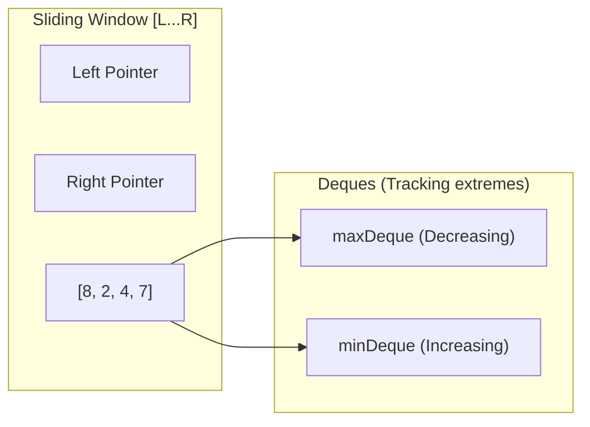

# Longest Continuous Subarray With Absolute Diff Less Than or Equal to Limit

[LeetCode 1438](https://leetcode.com/problems/longest-continuous-subarray-with-absolute-diff-less-than-or-equal-to-limit/)

---

## Problem

Given an array of integers `nums` and an integer `limit`, return the size of the longest **non-empty** subarray such that the absolute difference between any two elements of this subarray is less than or equal to `limit`.

---

## Analysis of Existing Solution

### Strategy: Binary Search + TreeMap Sliding Window
The current implementation uses binary search to find the maximum possible subarray size. For each size `mid`, it performs a sliding window check using a `TreeMap` to track the current window's elements.

-   **Complexity**:
    -   Binary Search: $O(\log N)$ steps.
    -   `check()` method: $O(N \log N)$ (each map operation is $\log N$).
    -   **Total Time**: $O(N \log^2 N)$.

---

## Optimized Strategy: Monotonic Deques

### Key Insight
A subarray satisfies the condition if `max(window) - min(window) <= limit`.
We use two monotonic deques to track the min and max in $O(1)$ amortized time.

### Visualizing the Deques
Example: `nums = [8, 2, 4, 7], limit = 4`

```text
1. Right = 0 (val: 8)
   maxDeque: [8]
   minDeque: [8]
   Window [8], diff 0 <= 4. MaxLen: 1

2. Right = 1 (val: 2)
   maxDeque: [8, 2]
   minDeque: [2] (8 removed because 2 < 8)
   Window [8, 2], diff 6 > 4. 
   -> SHRINK LEFT: remove 8 from maxDeque. Left = 1.
   Window [2], diff 0 <= 4. MaxLen: 1

3. Right = 2 (val: 4)
   maxDeque: [4] (2 removed because 4 > 2)
   minDeque: [2, 4]
   Window [2, 4], diff 2 <= 4. MaxLen: 2

4. Right = 3 (val: 7)
   maxDeque: [7] (4 removed because 7 > 4)
   minDeque: [2, 4, 7]
   Window [2, 4, 7], diff 5 > 4.
   -> SHRINK LEFT: remove 2 from minDeque. Left = 2.
   Window [4, 7], diff 3 <= 4. MaxLen: 2
```

---

### Sliding Window Mechanics



---

## Complexity

| Approach | Time Complexity | Space Complexity | Note |
| :--- | :--- | :--- | :--- |
| **Binary Search + TreeMap** | $O(N \log^2 N)$ | $O(N)$ | Correct but slow for large $N$. |
| **Sliding Window + TreeMap** | $O(N \log N)$ | $O(N)$ | Better, but `TreeMap` is heavy. |
| **Sliding Window + Deques** | $O(N)$ | $O(N)$ | **Optimal** performance. |
