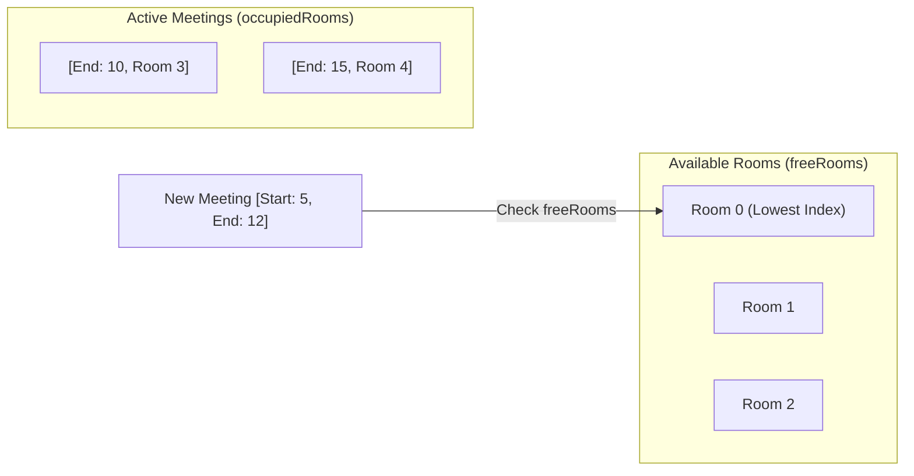

# Meeting Rooms III

[LeetCode 2402](https://leetcode.com/problems/meeting-rooms-iii/)

---

## Problem

You are given an integer `n` (number of rooms) and a 2D array `meetings` where `meetings[i] = [start, end]`.
- All `start` times are unique.
- When a meeting begins, it is assigned to the **lowest-indexed available room**.
- If no rooms are available, the meeting is delayed until the earliest room becomes free.
- The duration of the meeting remains the same.

Return the index of the room that held the most meetings. If multiple rooms have the same count, return the lowest-indexed room.

---

## Strategy: Two Min-Heaps

### Key Insight
We need to efficiently track two things:
1.  **Which rooms are currently free?** (Always pick the lowest index).
2.  **When will occupied rooms become free?** (Always pick the earliest end time).

### Heaps
-   **`freeRooms` (PriorityQueue<Integer>):** Stores indices of available rooms. Sorted by **index**.
-   **`occupiedRooms` (PriorityQueue<long[]>):** Stores `[endTime, roomIndex]` of meetings in progress. Sorted by **endTime**, then **roomIndex**.

### Two Heaps Visualization



---

### Delayed Meeting Scenario

**What happens when all rooms are busy?**

```text
Time Line: -------------------------------------->
[Room 0] |===== M1 [Ends at 10] =====|
[Room 1] |===== M2 [Ends at 15] =====|

New Meeting M3 starts at 5, duration 10.
- All rooms busy at t=5.
- Earliest room is [Room 0] at t=10.
- Delay M3: New start = 10, New end = 10 + 10 = 20.

[Room 0] |===== M1 =====| . . . |===== M3 [Ends at 20] =====|
                                 ^ delayed
```

---

## Complexity
-   **Time:** $O(M \log M + M \log N)$ where $M$ is the number of meetings and $N$ is the number of rooms.
-   **Space:** $O(N)$ to store room information and counts.

---

## Common Pitfall: End Time Overflow
Since meeting durations can be large ($10^5$) and `end` times can also be large, the delayed `endTime` could exceed $2^{31}-1$. Use `long` for end times.
