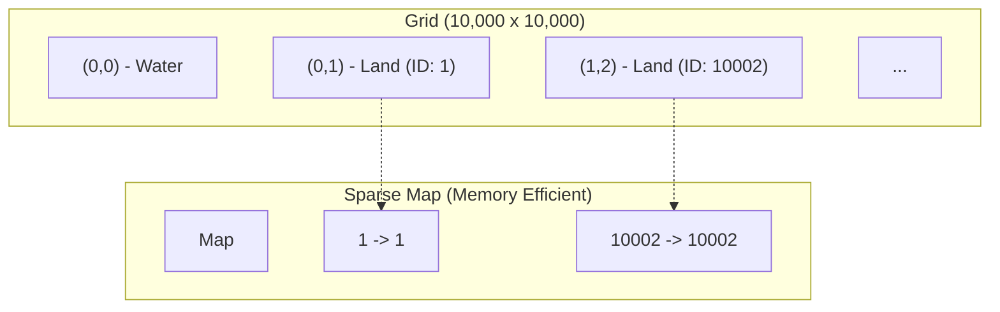

# Number of Islands II

[LeetCode 305](https://leetcode.com/problems/number-of-islands-ii/)

---

## Problem

You are given an empty 2D binary grid of size `m x n`. All cells are initially water (0). You are given an array `positions` where `positions[i] = [ri, ci]` indicates that at the `i`-th step, you should turn the cell `(ri, ci)` into land (1).

**Objective:** Return an array of integers representing the count of islands after each operation.

---

## Strategy: Sparse Union-Find

### Why Dense Arrays Fail
For a grid where `m, n = 10,000`, a standard `int[m][n]` or `int[m*n]` approach requires:
- `parent[]`: 400 MB
- `rank[]`: 400 MB
- `grid[][]`: 400 MB
- **Total:** ~1.2 GB, exceeding common 256MB/512MB limits.

### Sparse Storage
Since only land cells (max $L = 10,000$) matter, we use a `Map<Long, Long> parent` to store only the active cells.

1.  **Coordinate Encoding:** Convert `(r, c)` to a unique ID using `(long) r * n + c`.
2.  **Activation:** Add a cell to the map only when it becomes land.
3.  **Union-Find:**
    - **Path Compression:** Use an iterative two-pass approach to ensure stack safety.
    - **Union by Rank:** Keeps tree height $O(\log L)$.
4.  **Count Tracking:** Increment count when adding new land; decrement when merging two previously disconnected islands.

---

## Performance Optimizations

### 1. Iterative `find`
Recursive `find` is simple but can hit `StackOverflowError` if the tree becomes deep (though unlikely with rank/path compression). The iterative version is more robust.
```java
public long find(long id) {
    long root = id;
    while (parent.get(root) != root) root = parent.get(root);
    // Path compression
    while (id != root) {
        long next = parent.get(id);
        parent.put(id, root);
        id = next;
    }
    return root;
}
```

### 2. Duplicate Check
The problem may give the same coordinate multiple times. We must check `uf.exists(id)` to avoid double-counting or re-initializing existing land.

---

## Alternative: Coordinate Compression
If the grid is truly massive (e.g., $10^9 \times 10^9$) but operations are few, `HashMap` is perfect. If performance is a bottleneck, one could:
1.  Collect all unique points from `positions`.
2.  Map each point to an index $0 \dots K-1$.
3.  Use `int[]` arrays for Union-Find.
This is faster than `HashMap` due to lack of boxing and better cache locality.

### Sparse Storage Visualization
Instead of a dense 2D grid, we only store "active" land cells in a Map.



---

### Union-Find Operations

**1. Union by Rank (Keep Tree Shallow)**
When merging two islands, the "shorter" tree always hangs under the "taller" one.
```text
   Root A (Rank 2)          Root B (Rank 1)
      /   \                    |
     C     D         +         E          ==>      Root A (Rank 2)
                                                  /   |   \
                                                 C    D    Root B
                                                            |
                                                            E
```

**2. Path Compression (Flattening)**
Every time we `find(X)`, we point `X` and all its ancestors directly to the root.
```text
Before find(E):             After find(E):
      Root                        Root
       |                         / | \
       A                        A  C  E
       |
       C
       |
       E
```

---

## Complexity

| Aspect | Complexity | Notes |
| :--- | :--- | :--- |
| **Time** | $O(L \cdot \alpha(L))$ | $L$ is # of positions, $\alpha$ is inverse Ackermann. |
| **Space** | $O(L)$ | Only stores land cells, independent of grid size $M \times N$. |
