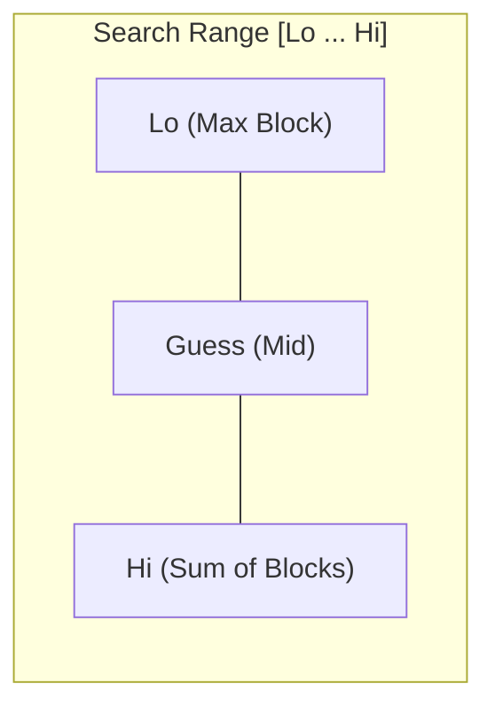
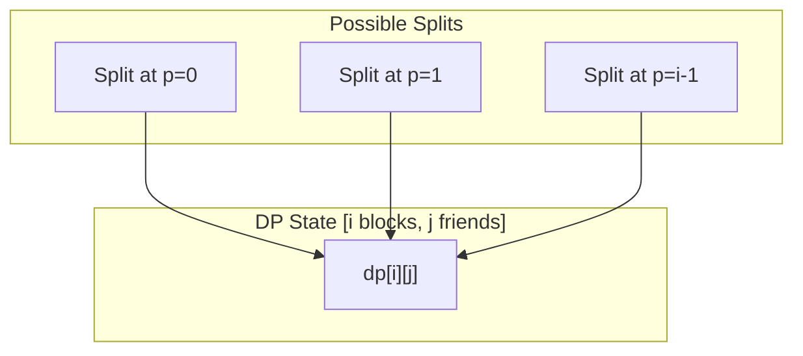

# Split Array Largest Sum (Explained for a 5-Year-Old)

[LeetCode 410](https://leetcode.com/problems/split-array-largest-sum/)

---

## 🎒 The Problem: The Heavy Backpacks

Imagine you have a long row of **heavy toy blocks**, each with a number on it. You have **$k$ friends** to help you carry them. 

**The Golden Rules:**
1.  **Don't Break the Line:** You must give your friends blocks that are next to each other. No skipping!
2.  **Be Kind:** We want to make sure the friend who gets the **heaviest load** isn't carrying too much. We want to make that "heaviest load" as **light as possible**.

---

## 💡 The Intuition: "Guess the Weight Limit"

We don't know the best answer yet, so we play a game of **Higher or Lower** (Binary Search).

### 1. The Search Space



-   **Min Possible Answer**: `max(nums)` (Someone *must* carry the biggest block).
-   **Max Possible Answer**: `sum(nums)` (One person carries everything).

---

## 📦 The Game: "Can we do it?" (The Check)

We pick a "Guess" (a Weight Limit) and try to pack the bags.

**Example:** `[7, 2, 5, 10, 8]` with `2` friends. Guess: **15**.

```text
[7][2][5] | [10][8]
Bag 1: 14 | Bag 2: 18 (OOPS! Over 15!)

Friend 1: [7, 2, 5] -> Sum 14 (Can't add 10)
Friend 2: [10]      -> Sum 10 (Can't add 8)
Friend 3: [8]       -> Sum 8

Wait! We needed 3 friends, but only have 2. 
GUESS 15 IS TOO SMALL!
```

---

## 🏗️ The Alternative: Building Blocks (Dynamic Programming)

### 🛠️ Optimal Substructure (The Math Behind the LEGOs)

To find the best way to split $i$ blocks into $j$ piles, we look at all the possible "last cuts" we could make.

**The Recurrence Relation:**
$$dp[i][j] = \min_{p=0}^{i-1} \left( \max(dp[p][j-1], \sum_{x=p}^{i-1} nums[x]) \right)$$



---

## ⚖️ The Great Trade-Off: Binary Search vs. DP

| Feature | Binary Search on Answer | Dynamic Programming |
| :--- | :--- | :--- |
| **Complexity** | $O(N \log(\text{Sum}))$ | $O(k \cdot N^2)$ |
| **Space** | $O(1)$ | $O(N \cdot k)$ |
| **Requirement** | **Monotonicity** | **Optimal Substructure** |
| **Flexibility** | Rigid | High |

### 1. The Monotonicity Rule (Binary Search)
Binary Search only works because this problem is **monotonic**: 
-   If we *can* fit everything into $k$ bags with a weight limit of 20, we can do it with 21.
-   **No Monotonicity = No Binary Search.**

### 2. The Flexibility Rule (DP)
DP is slower but **smarter** for complex variations. Imagine if the problem changed:
-   *"The cost is the SQUARE of the sum of each bag ($sum^2$)."*
-   **Binary Search fails**, but in **DP**, we just change the formula slightly, and it still works!
