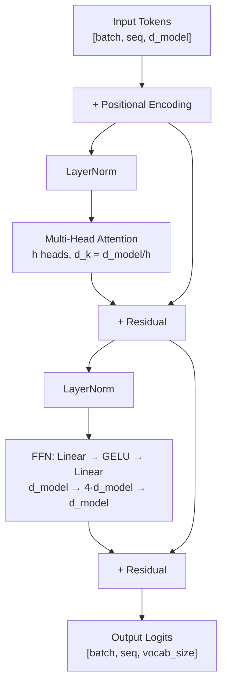
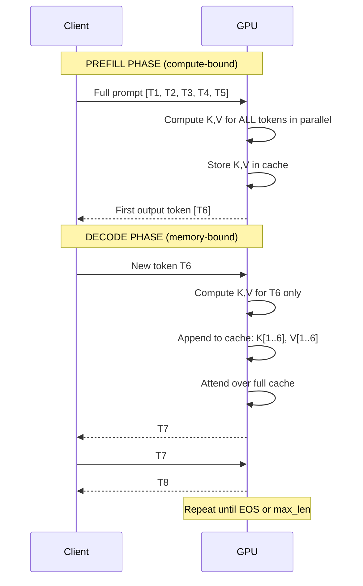
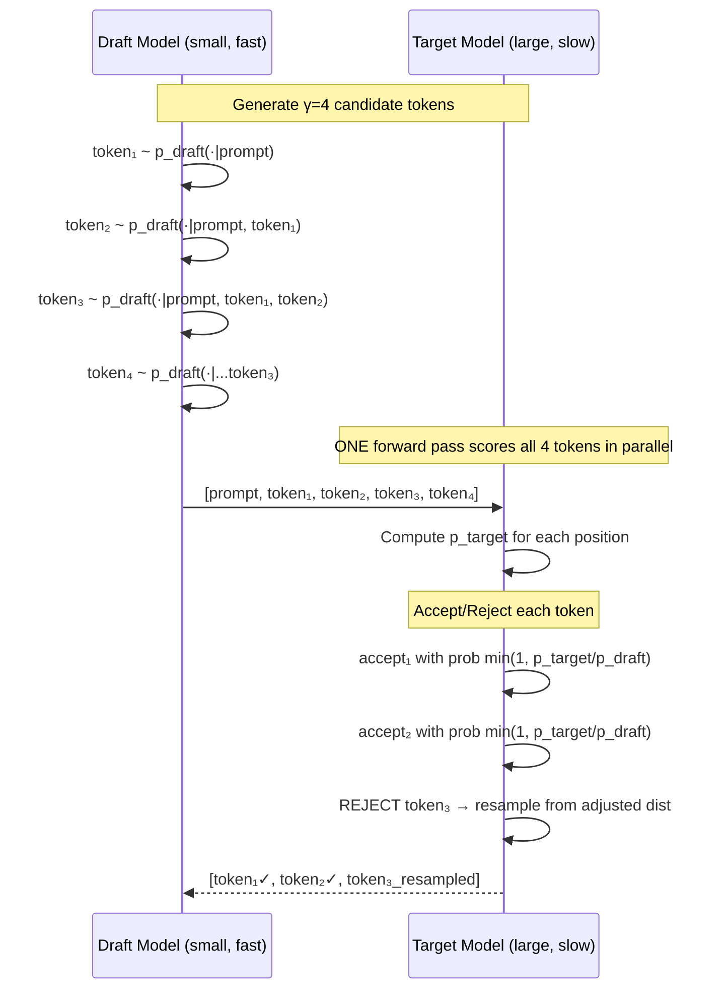
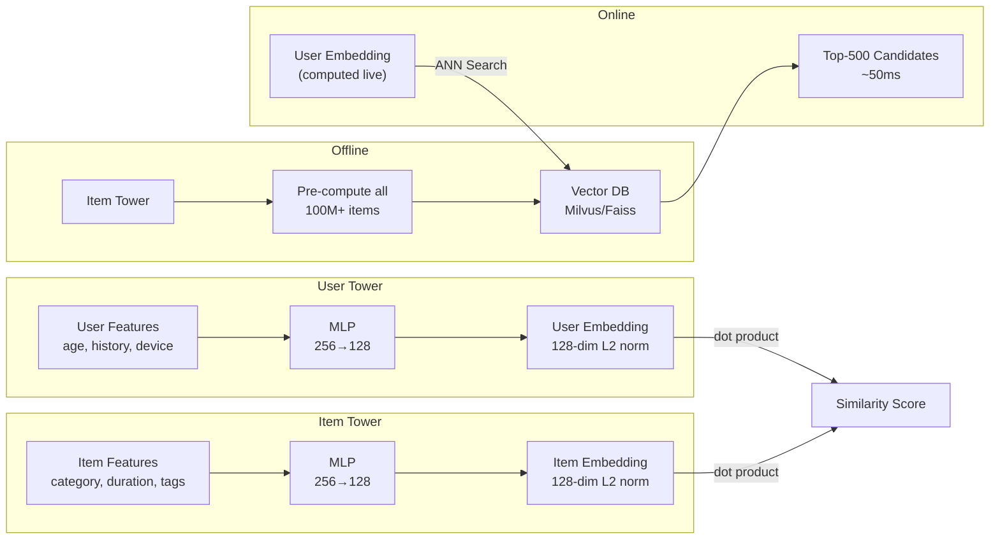
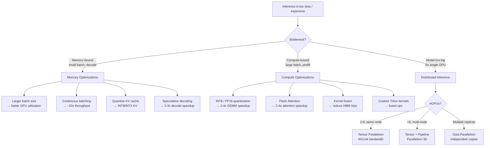

# MLE Inference Interview Notes
ByteDance · April 21, 2026

---

## 1. GPU Memory Hierarchy

```
┌─────────────────────────────────────────────────────────────┐
│                        GPU (A100)                           │
│                                                             │
│  ┌─────────┐  ┌─────────┐  ┌─────────┐  ┌─────────┐       │
│  │  SM 0   │  │  SM 1   │  │  SM 2   │  │  SM N   │       │
│  │         │  │         │  │         │  │   ...   │       │
│  │ ┌─────┐ │  │ ┌─────┐ │  │ ┌─────┐ │  │ ┌─────┐ │       │
│  │ │Regs │ │  │ │Regs │ │  │ │Regs │ │  │ │Regs │ │       │
│  │ │255/t│ │  │ │255/t│ │  │ │255/t│ │  │ │255/t│ │       │
│  │ │<1 cy│ │  │ │<1 cy│ │  │ │<1 cy│ │  │ │<1 cy│ │       │
│  │ └─────┘ │  │ └─────┘ │  │ └─────┘ │  │ └─────┘ │       │
│  │ ┌─────┐ │  │ ┌─────┐ │  │ ┌─────┐ │  │ ┌─────┐ │       │
│  │ │SRAM │ │  │ │SRAM │ │  │ │SRAM │ │  │ │SRAM │ │       │
│  │ │164KB│ │  │ │164KB│ │  │ │164KB│ │  │ │164KB│ │       │
│  │ │4 cy │ │  │ │4 cy │ │  │ │4 cy │ │  │ │4 cy │ │       │
│  │ └─────┘ │  │ └─────┘ │  │ └─────┘ │  │ └─────┘ │       │
│  └─────────┘  └─────────┘  └─────────┘  └─────────┘       │
│                                                             │
│  ┌──────────────────────────────────────────────────────┐  │
│  │              L2 Cache  (40–80 MB · ~200 cycles)      │  │
│  └──────────────────────────────────────────────────────┘  │
│                                                             │
│  ┌──────────────────────────────────────────────────────┐  │
│  │         HBM  (80 GB · 2 TB/s · ~600 cycles)          │  │
│  └──────────────────────────────────────────────────────┘  │
└─────────────────────────────────────────────────────────────┘

Rule: minimize HBM round trips → kernel fusion, tiling, Flash Attention
```

---

## 2. Roofline Model

```
    TFLOPS
      │
 312  │                              ╔═══════════════════════
      │                          ╔══╝  COMPUTE-BOUND
      │                      ╔══╝     (large matmuls)
      │                  ╔══╝
      │              ╔══╝
      │          ╔══╝ ← Ridge point = 156 FLOPs/byte
      │      ╔══╝
      │  ╔══╝  MEMORY-BOUND
      │══╝    (elementwise, softmax, small batches)
      └────────────────────────────────────────────── FLOPs/byte
      0        50       100      156       200

A100: Peak = 312 TFLOPS FP16,  BW = 2 TB/s
Ridge point = 312e12 / 2000e9 = 156 FLOPs/byte

Operation              Intensity     Bound
─────────────────────────────────────────
MatMul (n=4096, FP16)  ~1365         COMPUTE
LayerNorm              ~2            MEMORY
Softmax                ~3            MEMORY
Decode (bs=1)          ~1            MEMORY ← the problem!
Prefill (seq=2048)     ~600          COMPUTE
```

---

## 3. Transformer Architecture



---

## 4. Scaled Dot-Product Attention

```
            Q         K         V
            │         │         │
      ┌─────▼─────────▼─────────▼─────┐
      │   (batch, heads, seq, d_k)    │
      └──────────────────────────────-┘
                    │
           Q @ Kᵀ / √d_k
                    │
              ┌─────▼─────┐
              │  Scores   │  (batch, heads, seq_q, seq_k)
              └─────┬─────┘
                    │  + causal mask (upper-tri = -∞)
              ┌─────▼─────┐
              │  Softmax  │
              └─────┬─────┘
                    │ Attention Weights
              ┌─────▼─────┐
              │  @ V      │
              └─────┬─────┘
                    │
                 Output  (batch, heads, seq, d_v)


Complexity:
  Time:  O(n² · d)   ← quadratic in sequence length!
  Space: O(n²)       ← attention matrix
  Flash Attention:   O(n) space, same output, 2-4x faster
```

---

## 5. Causal Mask (Autoregressive)

```
Sequence: [A, B, C, D]

Attention matrix (1 = can attend, 0 = masked):

        A    B    C    D
   A  [ 1    0    0    0 ]   A can only see A
   B  [ 1    1    0    0 ]   B can see A, B
   C  [ 1    1    1    0 ]   C can see A, B, C
   D  [ 1    1    1    1 ]   D can see all

Upper triangle → -∞ before softmax → 0 weight after softmax
```

---

## 6. KV Cache: Prefill vs Decode



```
KV Cache memory per token:
  = 2 layers × num_layers × num_heads × d_head × bytes

LLaMA-70B (80L, 64H, 128d, FP16):
  = 2 × 80 × 64 × 128 × 2 = 2,621,440 bytes ≈ 2.6 MB/token

At 4096 context: 2.6 MB × 4096 = ~10.7 GB (just the cache!)
```

---

## 7. PagedAttention (vLLM)

```
PROBLEM — Naive KV Cache:

Request A (max 2048): ████████████████████░░░░░░░░░░░░  (pre-allocated, 50% wasted)
Request B (max 2048): ████████████░░░░░░░░░░░░░░░░░░░░  (40% wasted)
Request C (max 2048): ██████████████████████████░░░░░░  (20% wasted)

SOLUTION — PagedAttention (block size = 16 tokens):

Physical KV Blocks:  [ B0 ][ B1 ][ B2 ][ B3 ][ B4 ][ B5 ][ B6 ][ B7 ]

Request A Block Table:  0 → B0,  1 → B3,  2 → B5
Request B Block Table:  0 → B1,  1 → B4
Request C Block Table:  0 → B2,  1 → B6,  2 → B7

Benefits:
  ✓ Allocate blocks on demand — no pre-allocation waste
  ✓ Free blocks immediately when request ends
  ✓ Copy-on-Write: share blocks for same prompt prefix
  ✓ ~23x throughput improvement over static batching
```

---

## 8. Flash Attention — Tiling

```
Standard Attention:                 Flash Attention:
                                    
Q ──────────────────────► S        Load Q tile into SRAM
K ──────────────────────► S        Load K tile into SRAM
                          │        Compute partial scores (stay in SRAM)
                  n×n matrix        Update running (max, sum) online
                  written to HBM    Load V tile, accumulate output
                          │        Never write n×n to HBM!
                          ▼        
V ──────────────────────► O        

HBM reads:  O(n²·d)         HBM reads:  O(n·d)  (5-20x fewer!)
Memory:     O(n²)           Memory:     O(n)
```

```
Online Softmax update (key insight):
  Given running max m and sum l, new block scores S_new:
  
  m_new = max(m_old, max(S_new))
  l_new = exp(m_old - m_new) · l_old + sum(exp(S_new - m_new))
  O_new = (exp(m_old - m_new) · l_old · O_old + exp(S_new-m_new) · V) / l_new
  
  This is mathematically identical to full softmax — exact, not approximate.
```

---

## 9. Quantization

```
FP32 → INT8 (absmax symmetric):

FP32:  │────────────────┼────────────────│
       -max_val         0            +max_val

INT8:  │────────────────┼────────────────│
       -127             0              +127

scale = max_val / 127
x_q   = round(x / scale)
x_rec = x_q × scale

Memory:  FP32 → INT8 = 4x reduction
Speedup: INT8 GEMM = 2-4x over FP32 on Tensor Cores


Comparison:

Method   Bits  Memory   Quality   Speed   Notes
───────────────────────────────────────────────
FP32      32   100%     Baseline  1x      Training
FP16      16    50%     ~Same     2x      Standard serving
BF16      16    50%     ~Same     2x      Better range than FP16
INT8       8    25%     -0.5%     4x      LLM.int8(), SmoothQuant
INT4       4   12.5%    -1-3%     8x      GPTQ, AWQ, requires calib
INT4 KV    4   12.5%    -0.5%     —       KV cache only, very effective
```

---

## 10. Speculative Decoding



```
Expected speedup:
  α = per-token acceptance rate
  γ = draft tokens per step

  E[tokens per target call] = (1 - α^(γ+1)) / (1 - α)

  α=0.5, γ=4 → E=1.94 tokens    (speedup ~1.4x)
  α=0.7, γ=4 → E=2.77 tokens    (speedup ~2.0x)
  α=0.9, γ=4 → E=4.10 tokens    (speedup ~2.9x)

Why lossless?
  Accepted tokens follow min(p_t, p_d) ∝ p_t after renormalization.
  Rejected tokens resampled from max(0, p_t - p_d) / Z = p_t.
  Combined marginal = p_target exactly. (Leviathan et al. 2023)
```

---

## 11. Tensor Parallelism (Megatron-LM)

```
FFN: d_model → 4·d_model → d_model  (split across 4 GPUs)

         GPU 0     GPU 1     GPU 2     GPU 3
         ─────     ─────     ─────     ─────
X ──────►W1₀  │   W1₁  │   W1₂  │   W1₃       Column Parallel
         │    │   │    │   │    │   │            (no AllReduce)
         ▼    │   ▼    │   ▼    │   ▼
        Y₀   │  Y₁   │  Y₂   │  Y₃
         │    │   │    │   │    │   │
        GELU  │  GELU  │  GELU  │  GELU
         │    │   │    │   │    │   │
         ▼    │   ▼    │   ▼    │   ▼
    W2₀@Y₀  │ W2₁@Y₁│ W2₂@Y₂│ W2₃@Y₃   Row Parallel
         └────┴────────┴────────┘
                    AllReduce (sum)          ← 1 AllReduce per FFN
                        │
                        ▼
                    Output Z

Communication cost: 2 AllReduce per transformer layer
                    (1 for attention, 1 for FFN)
```

---

## 12. Pipeline Parallelism

```
4 GPUs, 4 microbatches (mb):

Time →
GPU 0 │ mb0F │ mb1F │ mb2F │ mb3F │      │      │ mb0B │ mb1B │ mb2B │ mb3B │
GPU 1 │      │ mb0F │ mb1F │ mb2F │ mb3F │      │      │ mb0B │ mb1B │ mb2B │
GPU 2 │      │      │ mb0F │ mb1F │ mb2F │ mb3F │      │      │ mb0B │ mb1B │
GPU 3 │      │      │      │ mb0F │ mb1F │ mb2F │ mb3F │      │      │ mb0B │
       └──────────────────────────────────────────────────────────────────────►

       ◄────────── bubble ─────────►   ◄──────── bubble ────────►
       (p-1 = 3 idle steps at start)   (p-1 = 3 idle steps at end)

Bubble ratio = (p-1) / (m + p - 1) = 3 / (4 + 3) = 43%  ← bad!

With m=16 microbatches: bubble = 3/18 = 17%   ← acceptable
With m=32 microbatches: bubble = 3/34 = 8.8%  ← good

1F1B scheduling (Megatron): interleave forward/backward → bubble = 1/m
```

---

## 13. Continuous Batching

```
STATIC BATCHING:

Batch 1:  Req A ████████████████████  (20 tokens)
          Req B ████                  ( 4 tokens, padded to 20 → waste!)
          Req C ███████████████       (15 tokens, padded → waste!)
          Req D ██████████████████    (18 tokens, padded → waste!)
          ▲─────────────────────────▲
                  GPU idles while waiting for Req A to finish


CONTINUOUS BATCHING (iteration-level scheduling):

Step:   1   2   3   4   5   6   7   8   9   10  11  12
Slot 0: A   A   A   A   A   A   A   A   A   A   E   E   ← A done at step 10, E starts
Slot 1: B   B   B   B   F   F   F   F   F   F   F   F   ← B done at step 4, F starts
Slot 2: C   C   C   C   C   C   C   G   G   G   G   G   ← C done at step 7, G starts
Slot 3: D   D   D   D   D   D   D   D   D   H   H   H   ← D done at step 9, H starts

GPU always running at max batch size → ~23x higher throughput (Orca paper)
```

---

## 14. Two-Tower Retrieval (TikTok)



---

## 15. Full TikTok Recommendation Pipeline

```
User Opens App
      │
      ▼
┌─────────────────────────────────────────────────────────────┐
│  Feature Fetch  (~10ms)                                     │
│  ┌───────────┐  ┌───────────────┐  ┌──────────────────────┐│
│  │  Redis    │  │  Kafka/Flink  │  │  Request Context     ││
│  │  Batch    │  │  Near-RT      │  │  (device, time, loc) ││
│  │  Features │  │  Features     │  │  Computed inline     ││
│  └───────────┘  └───────────────┘  └──────────────────────┘│
└─────────────────────────────────────────────────────────────┘
      │
      ▼
┌─────────────────────────────────────────────────────────────┐
│  Retrieval / Recall  (~70ms)                                │
│  ┌─────────────┐  ┌──────────────┐  ┌────────────────────┐ │
│  │ Two-Tower   │  │ Collab Filter│  │ Follow/Trending    │ │
│  │ ANN Search  │  │ Item-CF      │  │ Rule-based         │ │
│  │ top-500     │  │ top-200      │  │ top-100            │ │
│  └─────────────┘  └──────────────┘  └────────────────────┘ │
│                    Merge + Deduplicate (~800 candidates)    │
└─────────────────────────────────────────────────────────────┘
      │
      ▼
┌─────────────────────────────────────────────────────────────┐
│  Pre-Ranking  (~20ms)                                       │
│  Lightweight model, scores all 800 → top-200               │
└─────────────────────────────────────────────────────────────┘
      │
      ▼
┌─────────────────────────────────────────────────────────────┐
│  Ranking  (~50ms)                                           │
│  DLRM / DIN with full feature crosses                      │
│  Predicts: pCTR, pLike, pShare, pFollow, pFinish           │
│  Multi-task loss → blended score → top-50                  │
└─────────────────────────────────────────────────────────────┘
      │
      ▼
┌─────────────────────────────────────────────────────────────┐
│  Post-Processing  (~10ms)                                   │
│  Diversity enforcement, dedup, business rules, ads mix     │
└─────────────────────────────────────────────────────────────┘
      │
      ▼
   50 Videos Served   Total: <200ms
```

---

## 16. DLRM Architecture

```
Dense Features                Sparse Features
(13 floats)                   (categorical IDs)
     │                              │
     ▼                         ┌───┴──────────────────────┐
 Bottom MLP                    │    Embedding Tables       │
 13 → 64 → 32                  │  UserID  │VideoID│Tags... │
     │                         │  1B rows │100M   │500K    │
     │ (32-dim)                 │  64-dim  │64-dim │64-dim  │
     └──────────────────────────┴──────────────────────────┘
                │                          │
                └──────────┬───────────────┘
                           │
                    ┌──────▼──────┐
                    │ Interaction │  pairwise dot products
                    │   Layer     │  n×(n-1)/2 features
                    └──────┬──────┘
                           │
                     concat with dense emb
                           │
                    ┌──────▼──────┐
                    │   Top MLP   │
                    │ → 256 → 128 │
                    │ → 64 → 1   │
                    └──────┬──────┘
                           │
                       sigmoid
                           │
                      pCTR  (0-1)
```

---

## 17. Triton Kernel Mental Model

```
CUDA Thread Hierarchy:

Grid (launches kernel)
  └── Blocks (share shared mem, __syncthreads)
        └── Warps (32 threads, execute in lockstep SIMT)
              └── Threads (individual execution units)

Triton abstracts this:
  - program_id = which tile/block this instance handles
  - tl.arange(0, BLOCK_SIZE) = the vector of thread indices
  - tl.load / tl.store = vectorized HBM access with masking
  - No manual shared memory management!


Softmax Kernel (fused, one HBM read + one write):

 @triton.jit
 def softmax_kernel(input_ptr, output_ptr, n_cols, BLOCK_SIZE):
     row = tl.program_id(0)                    # one program per row
     offsets = tl.arange(0, BLOCK_SIZE)
     x = tl.load(input_ptr + row * n_cols + offsets, mask=offsets < n_cols)
     # All computation in SRAM (registers):
     x_max = tl.max(x, axis=0)
     x = tl.exp(x - x_max)
     x = x / tl.sum(x, axis=0)
     tl.store(output_ptr + row * n_cols + offsets, x, mask=offsets < n_cols)


Unfused (PyTorch, 3 kernels):   Read → Write → Read → Write → Read → Write
Fused (Triton, 1 kernel):       Read ─────────────────────────────────► Write
                                       all math in SRAM
```

---

## 18. Tiled Matrix Multiply (CUDA GEMM)

```
Naive GEMM: C[i,j] = sum_k A[i,k] * B[k,j]

For every (i,j): loads row i of A and col j of B from HBM repeatedly
→ Total HBM reads: O(n³)  (same data loaded n times!)

Tiled GEMM (TILE=32):

A (M×K):                    B (K×N):

┌────┬────┬────┐             ┌──┬──┬──┐
│ A₀₀│ A₀₁│ A₀₂│             │B₀₀B₁₀B₂₀│
├────┼────┼────┤             ├──┼──┼──┤
│ A₁₀│ A₁₁│ A₁₂│             │B₀₁B₁₁B₂₁│
└────┴────┴────┘             └──┴──┴──┘

For each output tile C[i,j]:
  for k_tile in range(K/TILE):
      Load A[i, k_tile] → shared mem    ← one HBM read per tile
      Load B[k_tile, j] → shared mem    ← one HBM read per tile
      __syncthreads()
      compute partial C[i,j] from SRAM  ← fast, no HBM
      __syncthreads()

Total HBM reads: O(n³/TILE)  → TILE=32 = 32x fewer HBM reads!
Arithmetic intensity: O(TILE) → compute-bound for large TILE
```

---

## 19. Beam Search vs Sampling

```
Vocabulary logits (simplified, vocab=5):
  Token:   A     B     C     D     E
  Logit:  [2.1,  0.5,  1.8,  0.2,  0.4]
  Prob:   [0.47, 0.06, 0.35, 0.04, 0.07]

GREEDY (beam=1):    always pick argmax → A  (deterministic, often repetitive)

BEAM SEARCH (beam=3):
  Step 1: keep top-3 → {A:0.47, C:0.35, E:0.07}
  Step 2: expand each, score = prev_score + log(p_new)
           keep global top-3 sequences
  → Finds higher-probability sequences than greedy
  → Still deterministic, less repetitive than greedy

TOP-K SAMPLING (k=3):
  → Sample from {A, B, C} only (zero out rest)
  → Random, diverse outputs

TOP-P / NUCLEUS (p=0.9):
  Sorted: A(0.47) + C(0.35) = 0.82 < 0.9
          A(0.47) + C(0.35) + E(0.07) = 0.89 < 0.9
          A(0.47) + C(0.35) + E(0.07) + B(0.06) = 0.95 ≥ 0.9
  → Sample from {A, C, E, B}
  → Adapts vocab size to distribution sharpness (better than top-k)

TEMPERATURE:
  Low  (T=0.1): sharper → more deterministic (prefer high-prob tokens)
  High (T=2.0): flatter  → more random (explores low-prob tokens)
```

---

## 20. Key Numbers Cheat Sheet

```
┌─────────────────────────────────────────────────────────┐
│                   HARDWARE                              │
├──────────────────────────────────┬──────────────────────┤
│ A100 FP16 Tensor Core            │ 312 TFLOPS           │
│ A100 HBM bandwidth               │ 2 TB/s               │
│ A100 HBM capacity                │ 80 GB                │
│ A100 NVLink (intra-node)         │ 600 GB/s             │
│ InfiniBand 400G (inter-node)     │ 50 GB/s              │
│ PCIe 4.0                         │ 32 GB/s              │
│ A100 → A100 NVLink latency       │ ~1 μs                │
├──────────────────────────────────┼──────────────────────┤
│                   MODELS                                │
├──────────────────────────────────┼──────────────────────┤
│ LLaMA-7B  FP16                   │ ~14 GB               │
│ LLaMA-7B  INT8                   │ ~7 GB                │
│ LLaMA-7B  INT4                   │ ~3.5 GB              │
│ LLaMA-70B FP16                   │ ~140 GB              │
│ LLaMA-70B INT8                   │ ~70 GB               │
│ KV cache (70B, 1 tok, FP16)      │ ~2.6 MB              │
│ KV cache (7B,  1 tok, FP16)      │ ~0.25 MB             │
├──────────────────────────────────┼──────────────────────┤
│                   TECHNIQUES                            │
├──────────────────────────────────┼──────────────────────┤
│ Continuous batching speedup      │ ~23x vs static       │
│ Flash Attention speedup          │ 2–4x                 │
│ Speculative decoding speedup     │ 2–3x                 │
│ INT8 GEMM speedup vs FP32        │ 2–4x                 │
│ Spec decode acceptance (α=0.8)   │ E=3.36 tok/call      │
└──────────────────────────────────┴──────────────────────┘
```

---

## 21. Decision Tree: Which Optimization to Use?



---

## 22. Interview Answer Templates

**Q: Walk me through a full LLM inference request.**
```
1. Request arrives → Gateway validates, rate-limits (token bucket)
2. Scheduler admits request → KV cache pages allocated (PagedAttention)
3. PREFILL: prompt tokens processed in parallel → K,V stored in cache
4. DECODE loop:
     a. Continuous batch scheduler adds/removes requests each step
     b. (Optional) Draft model generates γ tokens speculatively
     c. Target model forward pass: computes Q for new tokens,
        attends over full KV cache, generates logit distribution
     d. Sample next token (nucleus/greedy)
     e. Append K,V to cache, send token to client (streaming)
5. EOS token or max_len → free KV cache pages, remove from batch
```

**Q: How would you reduce LLM serving cost by 2x?**
```
Option A — Quantization (easiest, ~2x):
  FP16 → INT8 weights: 2x memory, 2-4x GEMM speedup, <0.5% quality loss
  Use SmoothQuant or GPTQ; keep activations in FP16.

Option B — Continuous batching (if not already):
  Static → continuous: up to 23x throughput, same latency budget.

Option C — Speculative decoding (if latency-bound):
  Deploy 7B draft + 70B target: 2-3x decode speedup, same quality.

Option D — KV cache quantization:
  INT8 KV cache: 2x more tokens in flight → 2x higher batch size.

Best combo: INT8 + continuous batching + speculative decode = 5-8x total.
```
