# MLE Inference Interview Notes
ByteDance · April 21, 2026

---

## YouTube Study References

### LLM Inference & KV Cache
- [LLM inference optimization: Architecture, KV cache and Flash Attention](https://www.youtube.com/watch?v=jk2FsJxZFo8) — best single overview video
- [KV Cache Crash Course](https://www.youtube.com/watch?v=SLYUBsZE72E) — focused deep dive
- [Efficient LLM Inference — vLLM, KV Cache, Flash Decoding](https://www.youtube.com/watch?v=yVXtLTcdO1Q) — University of Waterloo lecture
- [How to make LLMs fast: KV Caching, Speculative Decoding](https://www.youtube.com/watch?v=PncVSWbxdWU)
- [Optimize LLM inference with vLLM](https://www.youtube.com/watch?v=lxjWiVuK5cA)

### Speculative Decoding
- [Speculative Decoding: 3× Faster LLM Inference with Zero Quality Loss](https://www.youtube.com/watch?v=Qh9cIEelCj4)
- [Faster LLMs: Accelerate Inference with Speculative Decoding](https://www.youtube.com/watch?v=VkWlLSTdHs8)

### GPU Kernels & Triton ← PRIMARY FOCUS
- [Triton GPU Kernels 101 — full playlist (start here)](https://www.youtube.com/watch?v=TUQAyCNxFe4) ⭐
- [Flash Attention derived from first principles with Triton](https://www.youtube.com/watch?v=zy8ChVd_oTM) ⭐
- [Flash Attention fwd pass — Triton Kernels 101 Lesson 9](https://www.youtube.com/watch?v=6ap2QVWKFH0) ⭐
- [Flash Attention bwd pass — Triton Kernels 101 Lesson 10](https://www.youtube.com/watch?v=cygYBmB5ow8)
- [Fused Softmax — Triton Kernels 101 Lesson 5](https://www.youtube.com/watch?v=ftknUZDQCPc)
- [Practitioners Guide to Triton (Lecture 14)](https://www.youtube.com/watch?v=DdTsX6DQk24)
- [GPU Programming with Triton Kernels — DevConf.US 2025](https://www.youtube.com/watch?v=sv4soasZK7U)
- [Torch to Triton LLM Tutorial](https://www.youtube.com/watch?v=ZfjV_GTJLPI)
- [GPU Memory Coalescing Explained — Warp-Level Optimization](https://www.youtube.com/watch?v=zdzg0m279zA)
- [Memory Coalescing, Bank Conflicts, Data Staging](https://www.youtube.com/watch?v=4bYLFhMtAqw)
- [Warp Scheduling and Divergence (Lecture 16)](https://www.youtube.com/watch?v=WClew-fqVkM)
- [Getting Started with CUDA — NVIDIA GTC 2025](https://www.youtube.com/watch?v=GmNkYayuaA4)

### Quantization
- [LLM Quantization Explained: GPTQ, AWQ, QLoRA, GGUF and More](https://www.youtube.com/watch?v=WmvZwR4rKJg) — most comprehensive
- [LLM Fine-Tuning: Quantization Explained Part 1](https://www.youtube.com/watch?v=sLEuVm9ZdxQ) — PTQ, QAT, theory
- [LLM Fine-Tuning: Quantization Explained Part 2](https://www.youtube.com/watch?v=_3FctggJ9r4) — GPTQ, AWQ, GGUF, llama.cpp
- [Which Quantization Method is Right for You? GPTQ vs GGUF vs AWQ](https://www.youtube.com/watch?v=mNE_d-C82lI)

### Recommendation Systems
- [Design TikTok's Recommendation System — ML System Design](https://www.youtube.com/watch?v=Gscelu22FWI) — most relevant to ByteDance
- [Build TikTok's Personalized Real-Time Recommendation System](https://www.youtube.com/watch?v=skZ1HcF7AsM)
- [Building Scalable Retrieval with Two-Tower Models](https://www.youtube.com/watch?v=o-pZk5R0TZg)
- [Using DLRM — Building Recommender Systems with PyTorch](https://www.youtube.com/watch?v=r9J3UZmddC4)

---

## 1. GPU Memory Hierarchy

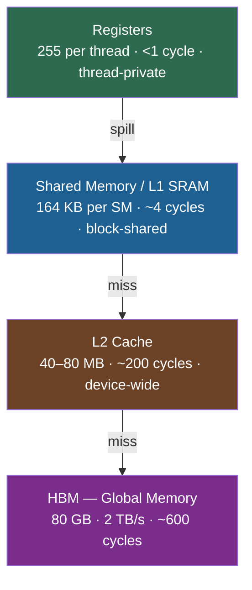

> **Rule:** every unnecessary HBM read/write kills performance. Kernel fusion and tiling keep data in SRAM.

---

## 2. Roofline Model — A100

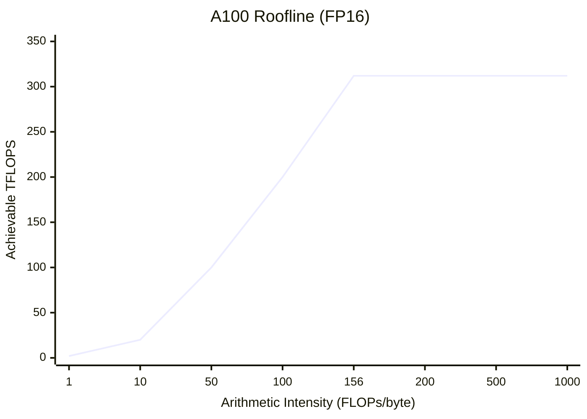

| Operation | Intensity | Bound |
|-----------|-----------|-------|
| MatMul n=4096 FP16 | ~1365 FLOPs/byte | **Compute** |
| Prefill seq=2048 | ~600 FLOPs/byte | **Compute** |
| Softmax | ~3 FLOPs/byte | **Memory** |
| LayerNorm | ~2 FLOPs/byte | **Memory** |
| Decode bs=1 | ~1 FLOPs/byte | **Memory** ← the bottleneck |

> Ridge point = 312 TFLOPS ÷ 2 TB/s = **156 FLOPs/byte**

---

## 3. Transformer Layer

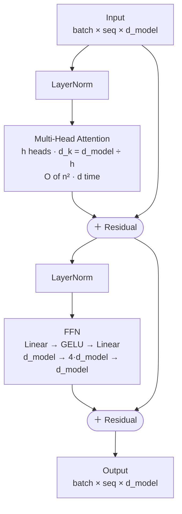

---

## 4. Scaled Dot-Product Attention Flow

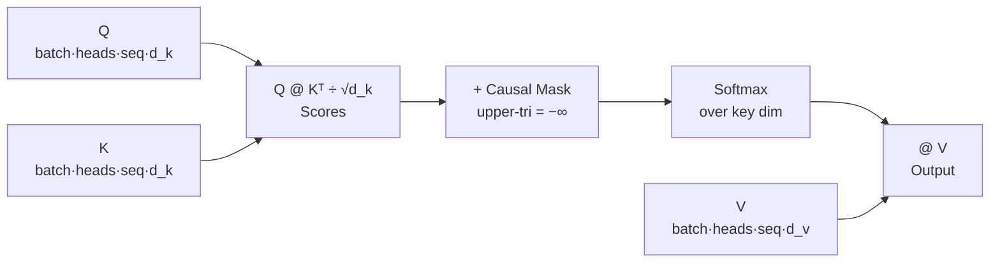

---

## 5. Causal Mask Pattern

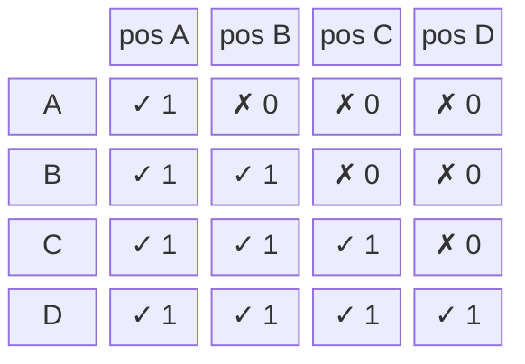

> ✗ positions → score set to −∞ → exp(−∞) = 0 after softmax. Future tokens are invisible.

---

## 6. KV Cache — Prefill vs Decode

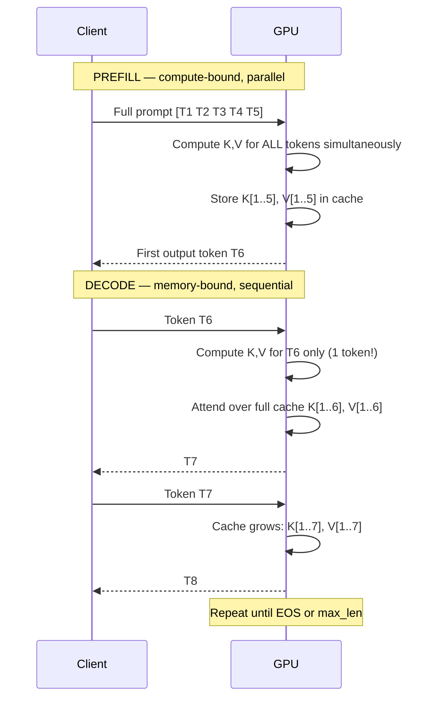

**Memory cost per token:**
`2 × num_layers × num_heads × d_head × bytes_per_element`

| Model | Per Token (FP16) | 4096 ctx total |
|-------|-----------------|----------------|
| LLaMA-7B | ~0.25 MB | ~1 GB |
| LLaMA-70B | ~2.6 MB | ~10.7 GB |

---

## 7. PagedAttention — Block Manager

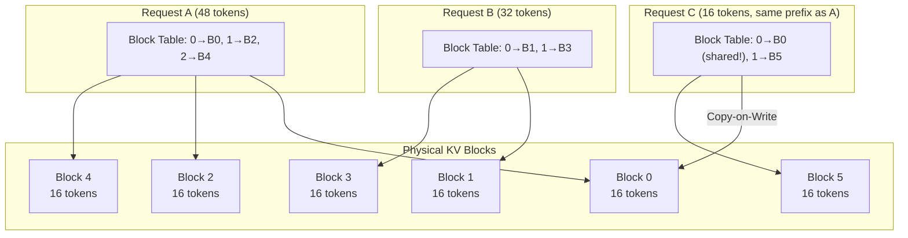

> Blocks allocated on demand, freed immediately on completion. Near-zero fragmentation.

---

## 8. Flash Attention vs Standard Attention

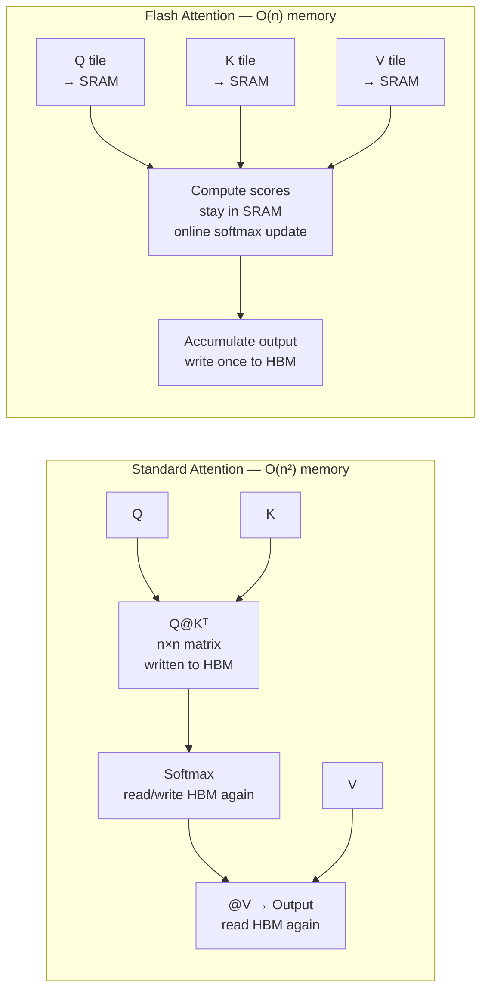

**Online softmax update** (key math — never stores n×n):
```
m_new = max(m_old, max(S_block))
l_new = exp(m_old − m_new) · l_old + Σ exp(S_block − m_new)
O_new = (exp(m_old − m_new) · O_old + exp(S_block − m_new) @ V_block) / l_new
```
Result is **mathematically identical** to standard attention — exact, not approximate.

---

## 9. Quantization Methods

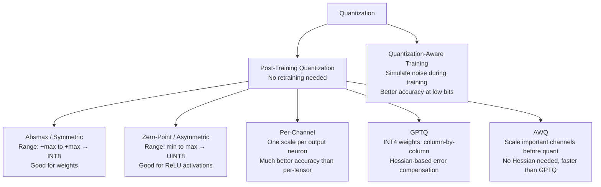

| Method | Bits | Memory | Quality loss | Speed |
|--------|------|--------|-------------|-------|
| FP16 | 16 | 50% | ~0% | 2× |
| INT8 | 8 | 25% | <0.5% | 4× |
| INT4 (GPTQ/AWQ) | 4 | 12.5% | 1–3% | 8× |
| INT4 KV cache | 4 | KV only | <0.5% | — |

---

## 10. Speculative Decoding

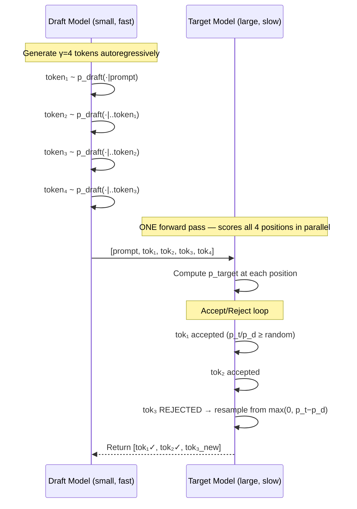

**Expected speedup:**
| Acceptance α | E[tokens/call] | Speedup (draft 10× cheaper) |
|-------------|---------------|----------------------------|
| 0.5 | 1.94 | ~1.4× |
| 0.7 | 2.77 | ~2.0× |
| 0.9 | 4.10 | ~2.9× |

> **Why lossless?** Combined marginal = min(p_t, p_d)/Z + max(0, p_t−p_d)/Z = p_target exactly.

---

## 11. Tensor Parallelism (Megatron-LM)

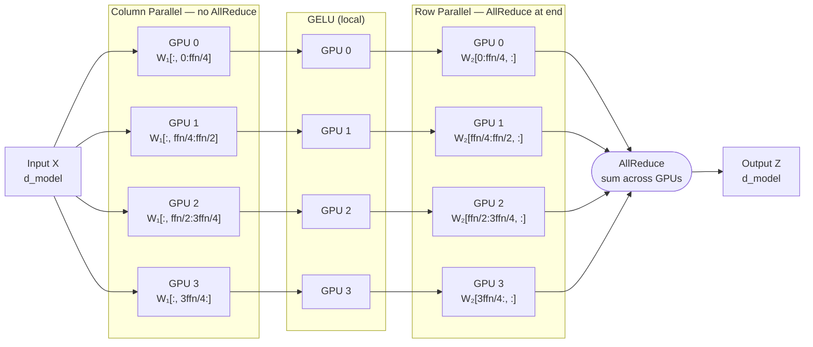

> Only **1 AllReduce per FFN layer**. Communication happens over NVLink (600 GB/s intra-node).

---

## 12. Pipeline Parallelism & Bubble

```mermaid
gantt
    title Pipeline Parallelism — 4 GPUs, 4 Microbatches (F=Forward, B=Backward)
    dateFormat  X
    axisFormat %s

    section GPU 0
    mb0 F :0, 1
    mb1 F :1, 2
    mb2 F :2, 3
    mb3 F :3, 4
    Bubble :crit, 4, 7
    mb0 B :7, 8
    mb1 B :8, 9
    mb2 B :9, 10
    mb3 B :10, 11

    section GPU 1
    Bubble :crit, 0, 1
    mb0 F :1, 2
    mb1 F :2, 3
    mb2 F :3, 4
    mb3 F :4, 5
    Bubble :crit, 5, 7
    mb0 B :7, 8
    mb1 B :8, 9
    mb2 B :9, 10

    section GPU 2
    Bubble :crit, 0, 2
    mb0 F :2, 3
    mb1 F :3, 4
    mb2 F :4, 5
    mb3 F :5, 6
    Bubble :crit, 6, 7
    mb0 B :7, 8
    mb1 B :8, 9

    section GPU 3
    Bubble :crit, 0, 3
    mb0 F :3, 4
    mb1 F :4, 5
    mb2 F :5, 6
    mb3 F :6, 7
    mb0 B :7, 8
```

**Bubble ratio** = (p − 1) / (m + p − 1)

| Microbatches (m) | Bubble (p=4) |
|-----------------|-------------|
| 1 | 75% |
| 4 | 43% |
| 16 | 17% |
| 32 | 9% |

---

## 13. Continuous vs Static Batching

```mermaid
gantt
    title Static Batching — GPU idles waiting for longest request
    dateFormat X
    axisFormat %s

    section Batch 1
    Req A (20 tok) :0, 20
    Req B (padded to 20) :0, 20
    Req C (padded to 20) :0, 20
    Req D (padded to 20) :0, 20

    section Batch 2 (waits for batch 1)
    Req E :20, 40
    Req F :20, 40
    Req G :20, 40
    Req H :20, 40
```

```mermaid
gantt
    title Continuous Batching — slots filled immediately on completion
    dateFormat X
    axisFormat %s

    section Slot 0
    Req A (20 tok) :0, 20
    Req E (starts immediately) :20, 30

    section Slot 1
    Req B (4 tok) :0, 4
    Req F (starts immediately) :4, 16

    section Slot 2
    Req C (7 tok) :0, 7
    Req G (starts immediately) :7, 20

    section Slot 3
    Req D (9 tok) :0, 9
    Req H (starts immediately) :9, 25
```

> Continuous batching = ~23× throughput improvement over static (Orca paper, 2022).

---

## 14. Two-Tower Retrieval — TikTok

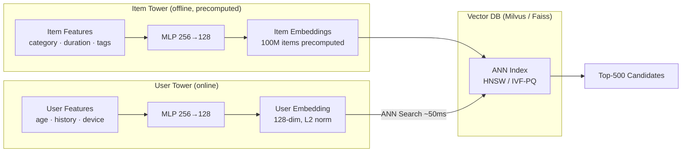

---

## 15. Full TikTok Recommendation Pipeline

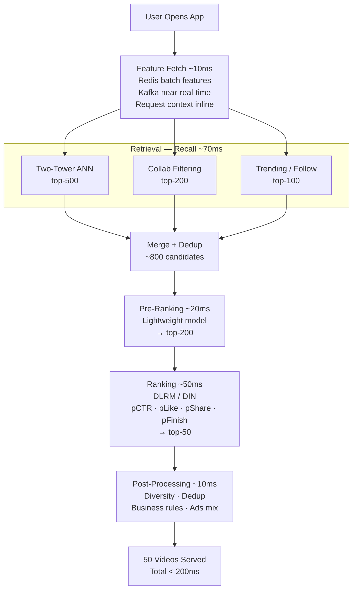

---

## 16. DLRM Architecture

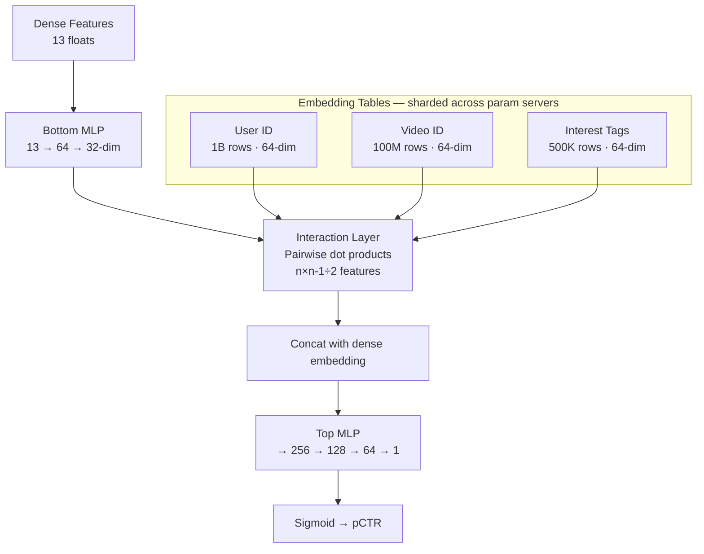

---

## 17. Triton Kernel Thread Model

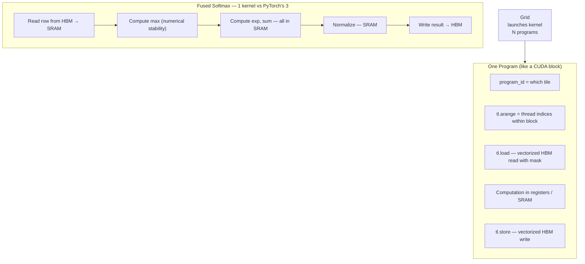

> **No manual shared memory management.** Triton auto-tiles and schedules warps. Write tiled kernels in Python with near-CUDA performance.

---

## 18. Tiled GEMM vs Naïve GEMM

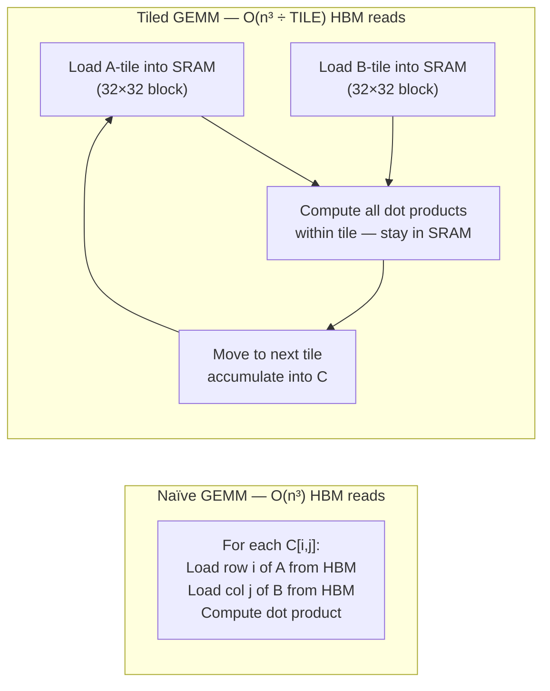

> TILE=32 → 32× fewer HBM reads. Arithmetic intensity scales with TILE → compute-bound for large tiles.

---

## 19. Sampling Strategies

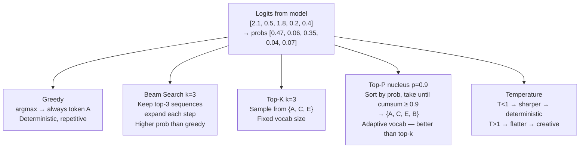

---

## 20. Which Optimization to Apply

```mermaid
flowchart TD
    START["Inference too slow / expensive"]
    START --> Q1{"What's the bottleneck?"}

    Q1 -->|Memory-bound\nsmall batch, decode phase| MEM
    Q1 -->|Compute-bound\nlarge batch, prefill phase| COMP
    Q1 -->|Model too large\nfor single GPU| DIST

    subgraph MEM ["Memory Optimizations"]
        M1["Larger batch size"]
        M2["Continuous batching → ~23×"]
        M3["INT8 / INT4 KV cache → 2–4× more tokens"]
        M4["Speculative decoding → 2–3× decode"]
    end

    subgraph COMP ["Compute Optimizations"]
        C1["INT8 weights → 2–4× GEMM"]
        C2["Flash Attention → 2–4× attention"]
        C3["Kernel fusion → fewer HBM trips"]
        C4["Custom Triton kernels"]
    end

    subgraph DIST ["Distributed Inference"]
        D1{"How many GPUs?"}
        D1 -->|2–8 same node NVLink| D2["Tensor Parallelism"]
        D1 -->|Multi-node| D3["Tensor + Pipeline\n3D Parallelism"]
        D1 -->|Multiple replicas| D4["Data Parallelism"]
    end
```

---

## 21. Key Numbers Cheat Sheet

| Category | Metric | Value |
|----------|--------|-------|
| **A100** | FP16 Tensor Core peak | 312 TFLOPS |
| **A100** | HBM bandwidth | 2 TB/s |
| **A100** | HBM capacity | 80 GB |
| **A100** | NVLink (intra-node) | 600 GB/s |
| **Network** | InfiniBand 400G | 50 GB/s |
| **Network** | PCIe 4.0 | 32 GB/s |
| **Models** | LLaMA-7B INT8 | ~7 GB |
| **Models** | LLaMA-70B INT8 | ~70 GB |
| **KV Cache** | 70B model, 1 token FP16 | ~2.6 MB |
| **KV Cache** | 7B model, 1 token FP16 | ~0.25 MB |
| **Speedups** | Continuous batching vs static | ~23× |
| **Speedups** | Flash Attention | 2–4× |
| **Speedups** | Speculative decoding (α=0.8) | ~2.5× |
| **Speedups** | INT8 GEMM vs FP32 | 2–4× |

---

## 22. Interview Answer Templates

**Q: Walk me through a full LLM inference request.**

```mermaid
flowchart TD
    A["Request arrives\nGateway: auth, rate-limit token bucket"] -->
    B["Scheduler admits request\nPagedAttention allocates KV blocks"] -->
    C["PREFILL: prompt processed in parallel\nK,V stored in cache"] -->
    D["DECODE loop\nContinuous batch scheduler adds/removes each step"] -->
    E["Optional: draft model generates γ tokens\nTarget model verifies in one forward pass"] -->
    F["Sample next token\nnucleus / greedy"] -->
    G["Append K,V to cache\nStream token to client"] -->
    H{"EOS or max_len?"}
    H -->|No| D
    H -->|Yes| I["Free KV cache blocks\nRemove from batch"]
```

**Q: How do you cut serving cost 2×?**

```mermaid
flowchart LR
    OPT["2× Cost Reduction"]
    OPT --> A["INT8 weights\nSmoothQuant or GPTQ\n&lt;0.5% quality loss\n→ 2× memory, 2–4× GEMM"]
    OPT --> B["Continuous batching\nif not already deployed\n→ up to 23× throughput"]
    OPT --> C["Speculative decoding\n7B draft + 70B target\n→ 2–3× decode speedup"]
    OPT --> D["INT8 KV cache\n→ 2× more tokens in flight"]
    A & B & C & D --> E["Combined: 5–8× total\npick based on latency vs throughput priority"]
```

---

---

# GPU KERNELS DEEP DIVE ← Primary Interview Focus

---

## G1. CUDA Thread Hierarchy

```mermaid
flowchart TD
    GRID["Grid\nAll thread blocks for one kernel launch"]

    subgraph SM0 ["Streaming Multiprocessor (SM)"]
        BLK0["Block 0\nUp to 1024 threads\nShared SRAM 164 KB"]
        BLK1["Block 1"]
        BLK2["Block 2"]
    end

    subgraph BLK0_detail ["Block internals"]
        W0["Warp 0\n32 threads — lockstep SIMT"]
        W1["Warp 1\n32 threads"]
        WN["Warp N..."]
        W0 --> T0["Thread 0\nRegisters ~255"]
        W0 --> T1["Thread 1"]
        W0 --> TN["... Thread 31"]
    end

    GRID --> SM0
    SM0 --> BLK0_detail
```

| Resource | A100 limit | Effect when exceeded |
|----------|-----------|---------------------|
| Threads/block | 1024 | Kernel launch fails |
| Registers/thread | 255 | Register spilling to local mem |
| Shared mem/block | 164 KB | Fewer blocks per SM → low occupancy |
| Blocks/SM | 32 | Hard cap |
| Warps/SM | 64 (2048 threads) | Occupancy ceiling |

---

## G2. Warp Execution & Divergence

```mermaid
flowchart LR
    subgraph NoDivergence ["No Divergence — all 32 threads same path"]
        ND1["Thread 0..31\nx = data * 2.0"]
        ND2["All finish same cycle"]
        ND1 --> ND2
    end

    subgraph Divergence ["Divergence — if/else splits warp"]
        D1["Threads 0..15: branch A\nx = data * 2.0"]
        D2["Threads 16..31: branch B\nx = data + 1.0"]
        D3["Warp serializes:\nFirst executes A (16 active, 16 masked)\nThen executes B (16 active, 16 masked)\n→ 2× slower"]
        D1 --> D3
        D2 --> D3
    end
```

**Fix:** use predicated execution — compute both branches, `select` with mask. No branching, no serialization.

---

## G3. Memory Coalescing

```mermaid
flowchart TD
    subgraph Coalesced ["✅ Coalesced — 1 HBM transaction"]
        C_T["Thread i reads A[i]\nAll 32 addresses contiguous\n128 bytes = 1 cache line"]
    end

    subgraph Strided ["❌ Strided — 32 HBM transactions"]
        S_T["Thread i reads A[i × 32]\nAddresses jump by 128 bytes each\n32 separate cache lines"]
    end

    subgraph Gathered ["❌ Random gather — worst case"]
        G_T["Thread i reads A[random[i]]\nUp to 32 separate cache lines\n32× bandwidth cost"]
    end

    HBM["HBM\n2 TB/s peak"]
    Coalesced -->|"1 tx = 128 bytes"| HBM
    Strided -->|"32 tx = 32×128 bytes"| HBM
    Gathered -->|"32 tx scattered"| HBM
```

**Common mistake:** accessing a matrix column-major when it's stored row-major.
**Fix:** transpose the matrix, or use shared memory to do a coalesced load then transpose in SRAM.

---

## G4. Shared Memory Bank Conflicts

```mermaid
flowchart LR
    subgraph Banks ["32 Shared Memory Banks (4 bytes each)"]
        B0["Bank 0"]
        B1["Bank 1"]
        B2["Bank 2"]
        BN["...Bank 31"]
    end

    subgraph Good ["✅ Stride-1: no conflict"]
        G0["Thread 0 → Bank 0"]
        G1["Thread 1 → Bank 1"]
        G2["Thread 2 → Bank 2"]
    end

    subgraph Bad ["❌ Stride-16: 2-way conflict"]
        BAD0["Thread 0 → Bank 0"]
        BAD16["Thread 16 → Bank 0\n→ serialized!"]
    end

    subgraph Broadcast ["✅ Broadcast: no conflict"]
        BR["All 32 threads → same address\n→ multicast, 1 transaction"]
    end

    Good --> Banks
    Bad --> Banks
    Broadcast --> Banks
```

**Element i → bank**: `(i × sizeof(element) / 4) % 32`

---

## G5. Occupancy & Latency Hiding

```mermaid
flowchart TD
    ISSUE["Thread issues HBM load\n~600 cycle latency"]

    subgraph HighOcc ["High Occupancy — many warps resident"]
        W1_HO["Warp 1: waiting for HBM"]
        W2_HO["Warp 2: EXECUTING ← SM switches here"]
        W3_HO["Warp 3: waiting"]
        W4_HO["Warp 4: NEXT"]
        W1_HO --> W2_HO --> W3_HO --> W4_HO
    end

    subgraph LowOcc ["Low Occupancy — few warps resident"]
        W1_LO["Warp 1: waiting for HBM"]
        STALL["SM STALLS — no other warp to run\n→ cycles wasted"]
        W1_LO --> STALL
    end

    ISSUE --> HighOcc
    ISSUE --> LowOcc
```

**Target:** ≥ 50% occupancy for memory-bound kernels. Compute-bound kernels can tolerate lower.

---

## G6. Kernel Fusion — Why It Matters

```mermaid
flowchart LR
    subgraph Unfused ["Unfused (3 separate kernels)"]
        U1["Kernel 1: x = x * 2\nRead HBM → Write HBM"]
        U2["Kernel 2: x = exp(x)\nRead HBM → Write HBM"]
        U3["Kernel 3: x = x / sum(x)\nRead HBM → Write HBM"]
        U1 --> U2 --> U3
    end

    subgraph Fused ["Fused (1 Triton kernel)"]
        F1["Read HBM once"]
        F2["x * 2 → SRAM"]
        F3["exp(x) → SRAM"]
        F4["/ sum → SRAM"]
        F5["Write HBM once"]
        F1 --> F2 --> F3 --> F4 --> F5
    end

    HBM2["HBM\n2 TB/s"]
    Unfused -->|"6 HBM transactions"| HBM2
    Fused -->|"2 HBM transactions\n3× fewer bytes"| HBM2
```

---

## G7. Tiled GEMM — Shared Memory Tiling

```mermaid
flowchart TD
    subgraph Output ["Output tile C[i,j] — BLOCK_M × BLOCK_N"]
        ACC["Accumulator in registers\nFP32 for stability"]
    end

    subgraph KTiles ["Iterate over K tiles"]
        KT1["k=0: Load A[i, 0:BLOCK_K] → SRAM\n     Load B[0:BLOCK_K, j] → SRAM\n     tl.dot(A_tile, B_tile) → acc"]
        KT2["k=1: Load next A, B tiles\n     acc += tl.dot(...)"]
        KTN["... repeat K/BLOCK_K times"]
        KT1 --> KT2 --> KTN --> ACC
    end

    ACC --> WRITE["Write C tile → HBM\nOnce per output tile"]

    note["BLOCK_K=64: arithmetic intensity = BLOCK_K/2 = 32 FLOPs/byte\nAt BLOCK_K=128: 64 FLOPs/byte → near ridge point\ntl.dot automatically uses Tensor Cores on FP16/BF16"]
```

---

## G8. Flash Attention Tiling Algorithm

```mermaid
flowchart TD
    INIT["For each Q block Qi:\nInitialize m_i = -inf, l_i = 0, O_i = 0"]

    subgraph KVLoop ["Loop over K,V blocks (j = 0..N/BLOCK_N)"]
        LOAD["Load Kj, Vj → SRAM"]
        SCORE["S = Qi @ Kj.T × scale\n(BLOCK_N × BLOCK_N, stays in SRAM)"]
        MMAX["m_new = max(m_i, rowmax(S))"]
        EXP["P = exp(S - m_new)\nnumerically stable"]
        LSUM["l_new = exp(m_i - m_new) × l_i + rowsum(P)"]
        UPDATE["O_i = (exp(m_i-m_new) × O_i + P @ Vj)"]
        STATE["m_i, l_i = m_new, l_new"]
        LOAD --> SCORE --> MMAX --> EXP --> LSUM --> UPDATE --> STATE --> LOAD
    end

    FINAL["O_i = O_i / l_i\nWrite to HBM — once!"]

    INIT --> KVLoop --> FINAL
```

**Why no n×n matrix in HBM:** S is computed tile-by-tile inside SRAM and discarded after each iteration. Only O (output) and running stats (m, l) are kept.

---

## G9. Triton Programming Model

```mermaid
flowchart LR
    subgraph Triton ["Triton Kernel Structure"]
        PID["program_id(axis)\n= which tile this instance handles\n(like blockIdx in CUDA)"]
        ARANGE["tl.arange(0, BLOCK_SIZE)\n= element indices for this tile\n(like threadIdx, vectorized)"]
        MASK["mask = offsets < N\nprevents OOB access\nno explicit if/else needed"]
        LOAD["tl.load(ptr + offsets, mask=mask)\nvectorized coalesced HBM read"]
        COMPUTE["Arithmetic on vectors\nauto-vectorized, uses Tensor Cores\nfor tl.dot on fp16/bf16"]
        STORE["tl.store(ptr + offsets, val, mask)\nvectorized coalesced HBM write"]
        PID --> ARANGE --> MASK --> LOAD --> COMPUTE --> STORE
    end
```

**Key Triton ops:**

| Op | What it does |
|----|-------------|
| `tl.load(ptr, mask)` | Vectorized HBM read |
| `tl.store(ptr, val, mask)` | Vectorized HBM write |
| `tl.dot(a, b)` | Tiled matmul → Tensor Cores |
| `tl.max(x, axis)` | Reduction |
| `tl.sum(x, axis)` | Reduction |
| `tl.exp(x)` | Elementwise |
| `tl.program_id(0)` | Which tile |
| `tl.constexpr` | Compile-time constant (tile sizes) |

---

## G10. Kernels You Should Know How to Write

```mermaid
flowchart TD
    KERNELS["Triton Kernels to Master"]

    KERNELS --> SM["Fused Softmax\none HBM read, online stable softmax\nsee 11_gpu_kernels_deep.py"]
    KERNELS --> LN["Fused LayerNorm\nmean+var in one pass\nsee 11_gpu_kernels_deep.py"]
    KERNELS --> GE["Fused GELU\ntanh approximation\nsee 11_gpu_kernels_deep.py"]
    KERNELS --> MM["Tiled GEMM\nSRAM tiling, Tensor Cores via tl.dot\nsee 11_gpu_kernels_deep.py"]
    KERNELS --> FA["Flash Attention Fwd\nonline softmax, O(N) memory\nsee 11_gpu_kernels_deep.py"]
    KERNELS --> RMS["RMSNorm\nsimplified LayerNorm, used in LLaMA\nno mean subtraction"]
    KERNELS --> ROT["RoPE (Rotary Embeddings)\nelementwise rotation on Q,K\nfuse with attention QK proj"]
```

---

## G11. GPU Profiling Workflow

```mermaid
flowchart TD
    SLOW["Kernel is slow / GPU underutilized"]

    SLOW --> NSYS["nsys profile python script.py\nTimeline: see kernel launches,\nmemory copies, sync points"]

    NSYS --> NCU["ncu --set full python script.py\nPer-kernel deep metrics"]

    subgraph Metrics ["Key ncu Metrics"]
        M1["sm__throughput → SM busy %"]
        M2["dram__bytes → HBM traffic"]
        M3["l1tex__t_bytes → L1 traffic"]
        M4["sm__sass_tensor_core_instns → Tensor Core use"]
        M5["Roofline: FLOPs / dram__bytes → memory vs compute bound"]
    end

    NCU --> Metrics

    Metrics --> FIX["Fix based on bottleneck"]

    subgraph Fixes ["Common Fixes"]
        F1["Memory-bound:\nFuse kernels, reduce HBM traffic"]
        F2["Low occupancy:\nReduce register/shared mem pressure\nIncrease BLOCK_SIZE"]
        F3["Bank conflicts:\nPad shared memory arrays"]
        F4["Warp divergence:\nReplace branches with predication"]
        F5["No Tensor Cores:\nUse fp16/bf16, align tiles to 16"]
    end

    FIX --> Fixes
```
