# ByteDance ML Inference — Interview Reference

---

## 1. Recommendation System (TikTok-scale)

### Multi-Stage Pipeline

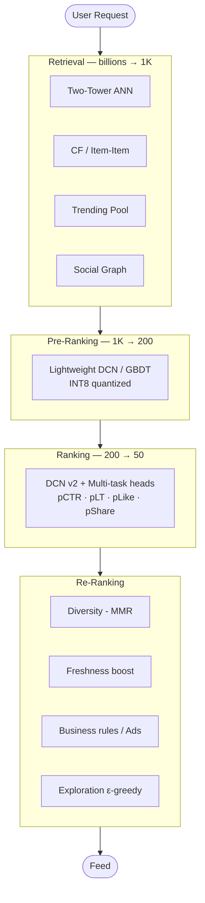

---

### Two-Tower Retrieval Model

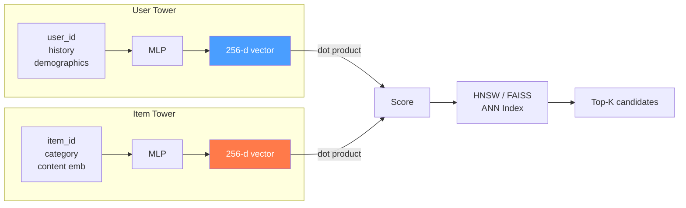

**Training:** In-batch negatives + hard negatives, contrastive loss.  
**Online:** Encode user real-time → ANN lookup <10ms.  
**Offline:** Re-embed all items every few hours, rebuild index.

---

### DCN v2 (Ranking Model Architecture)

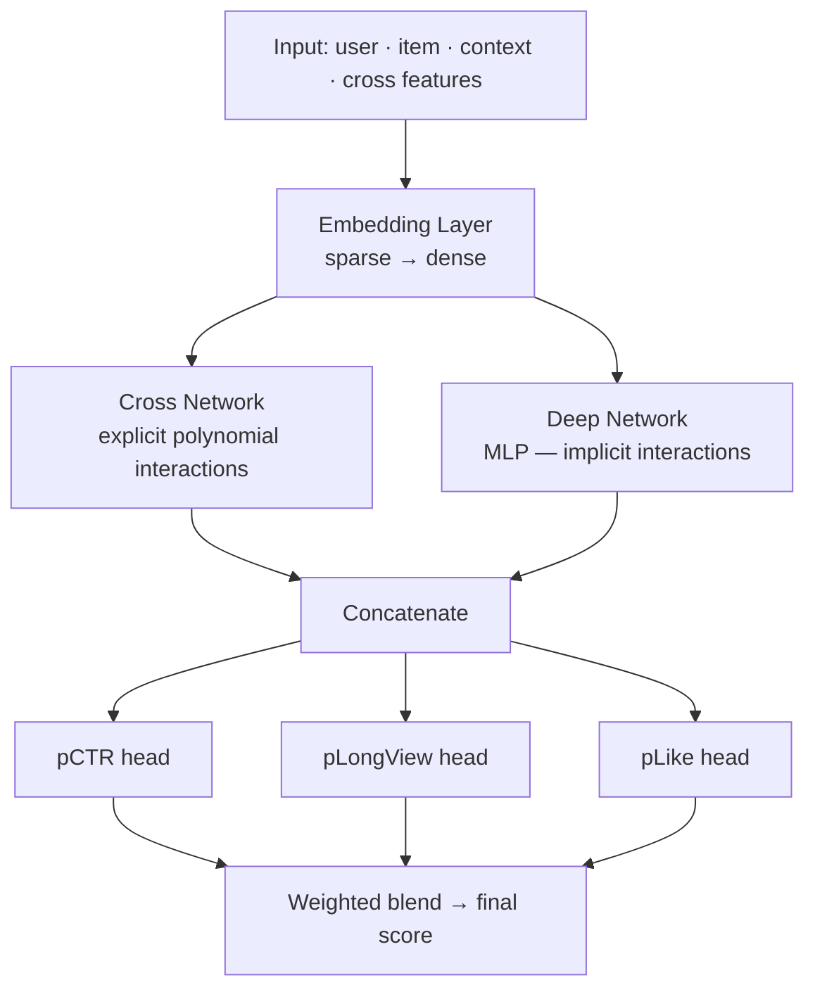

---

### Feature Store Architecture

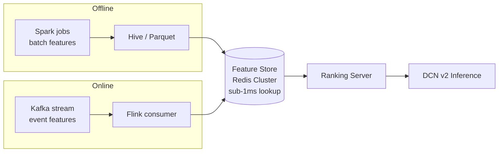

---

### Key Latency Targets

| Stage | Latency | Candidates In/Out |
|-------|---------|-------------------|
| Retrieval | <10ms | 100B → 1K |
| Pre-rank | <5ms | 1K → 200 |
| Rank | <30ms | 200 → 50 |
| Re-rank | <5ms | 50 → feed |
| **Total P99** | **<100ms** | |

---

---

## 2. LLM Inference System Design

### Prefill vs Decode Phases

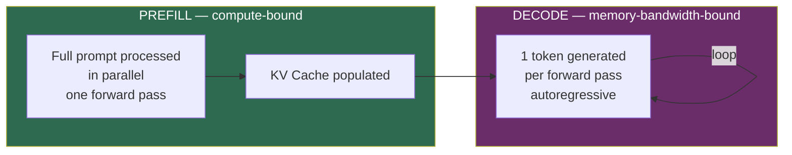

---

### KV Cache & PagedAttention

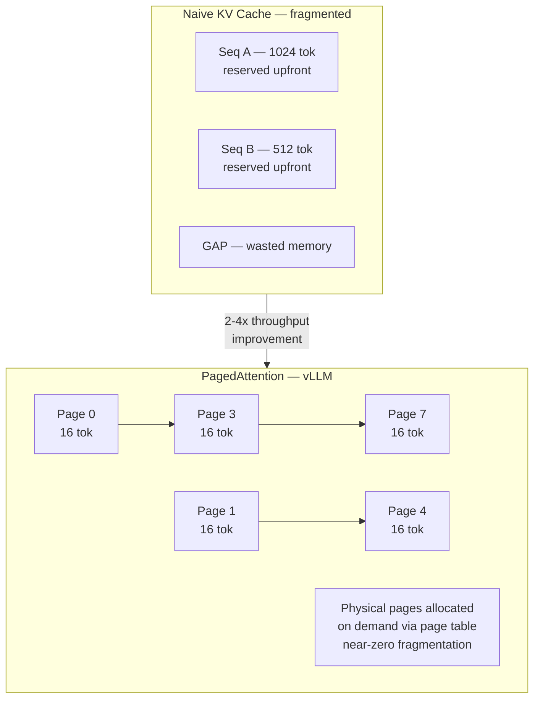

**Memory formula:**  
`KV size = 2 × layers × seq_len × hidden_dim × bytes/element`  
LLaMA-70B, 4K ctx, FP16 ≈ **~35 GB per request** without paging.

---

### Continuous Batching

```mermaid
gantt
    title Static vs Continuous Batching
    dateFormat X
    axisFormat %s

    section Static Batch
    Seq A (long)   : 0, 10
    Seq B (short)  : 0, 4
    Seq C (medium) : 0, 7
    GPU idle (B,C done) : crit, 4, 10

    section Continuous Batch
    Seq A          : 0, 10
    Seq B          : 0, 4
    Seq D joins    : 4, 8
    Seq C          : 0, 7
    Seq E joins    : 7, 10
```

New requests slot in the moment a sequence finishes — GPU stays fully utilized.

---

### Speculative Decoding

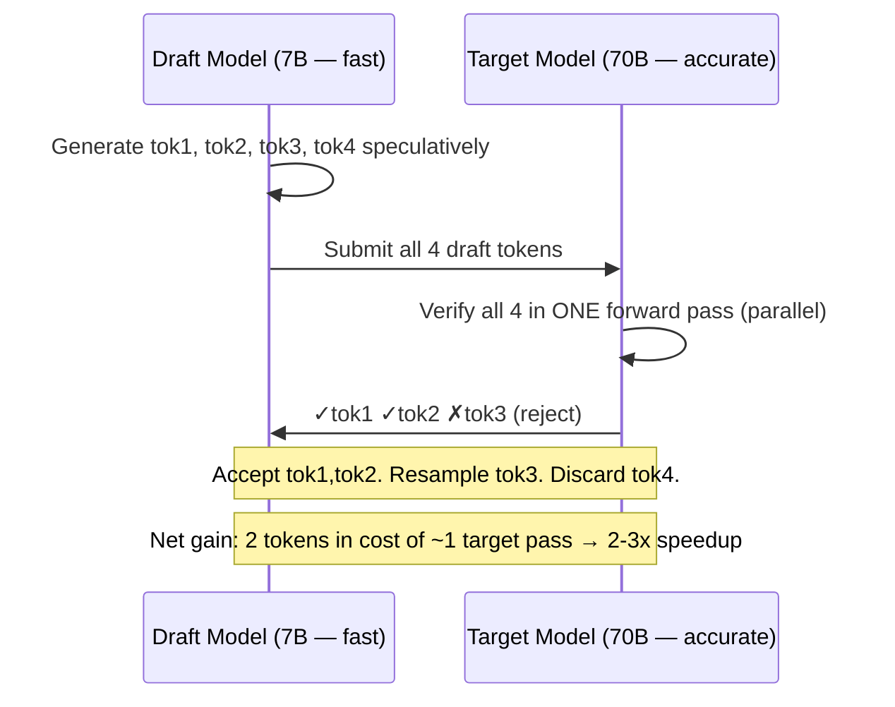

---

### Quantization Tradeoffs

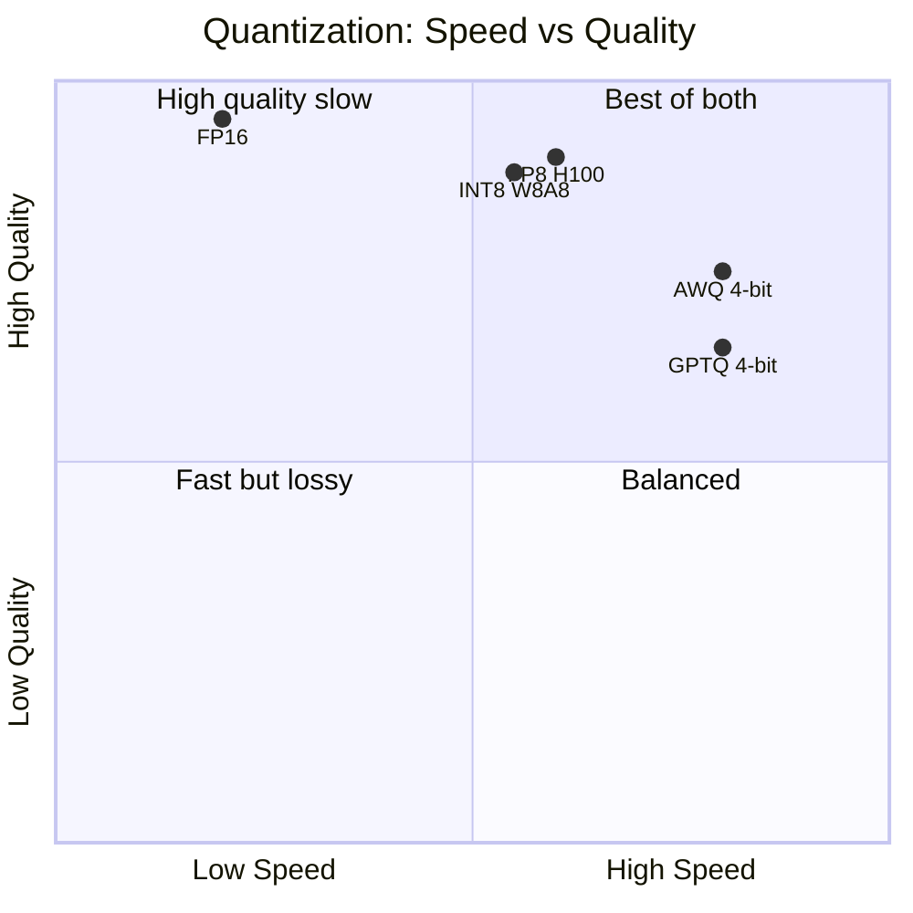

---

### Tensor vs Pipeline Parallelism

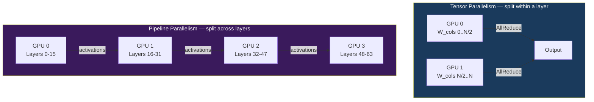

- **TP:** reduces per-request latency, needs fast NVLink intra-node  
- **PP:** scales to very large models, micro-batching hides bubble overhead

---

### PD Disaggregation (ByteDance scale)

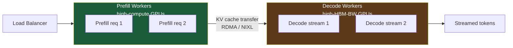

Scale each phase independently based on workload mix.

---

### Full LLM Serving Stack

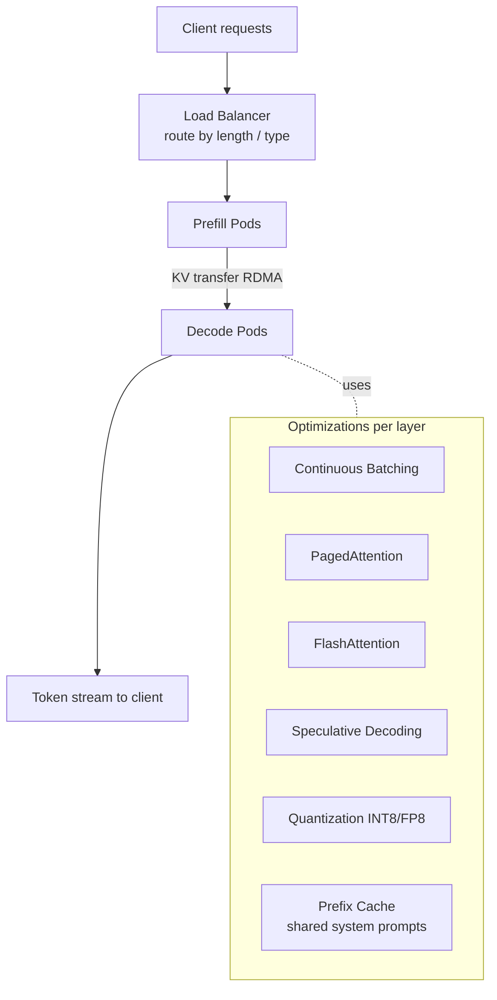

---

### Key LLM Serving Metrics

| Metric | Definition | Target |
|--------|------------|--------|
| TTFT | Time to first token (prefill) | <500ms |
| TPOT | Time per output token | <50ms |
| Throughput | Tokens/sec system-wide | maximize |
| MFU | Model FLOP Utilization | >50% good |
| KV Cache hit rate | Prefix cache reuse | >60% in prod |

---

## ByteDance-Specific Angles

- Ranking uses **MMOE** (Multi-gate Mixture of Experts) for multi-task learning
- **Volcano Engine** = their internal cloud running custom inference infra
- **Prefix caching**: same system prompt across millions of DouBao requests → huge KV reuse
- **Disaggregated KV store** for long-context and multi-turn conversations
- GBDT/XGBoost still runs in pre-ranking — not everything is deep learning
- Isotonic regression used for **calibration** of pCTR → actual probability
