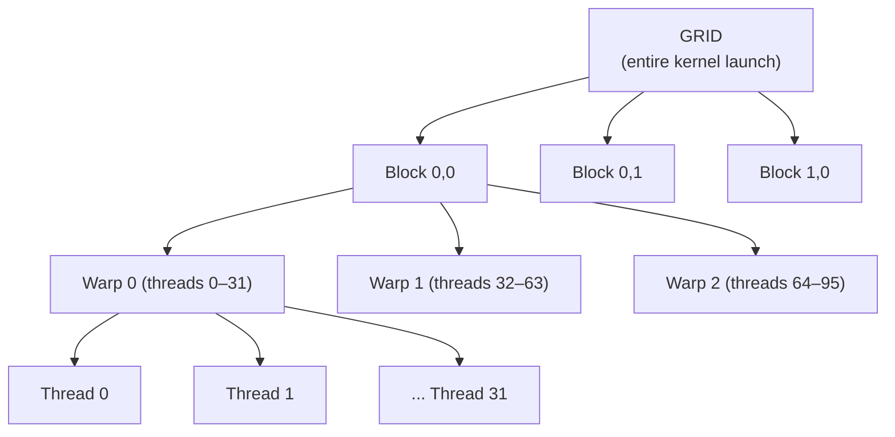
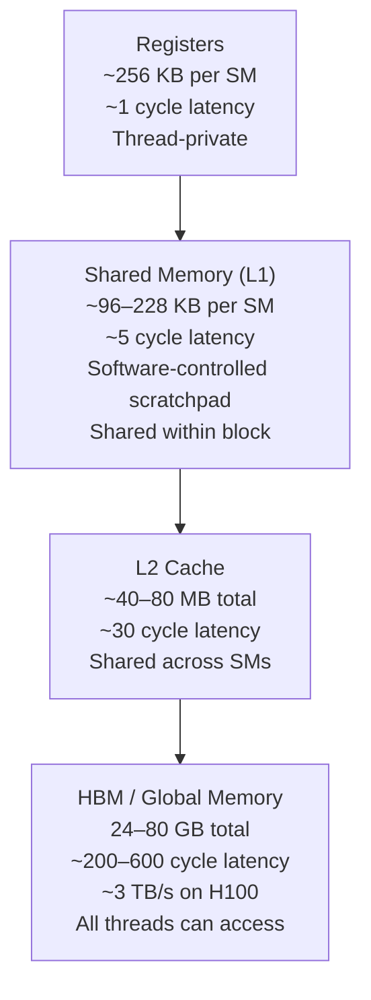
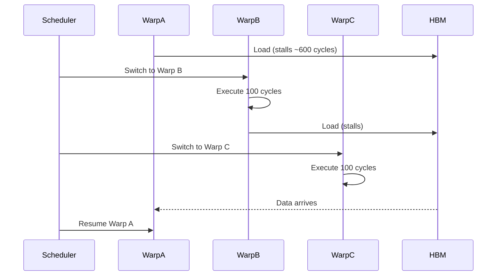
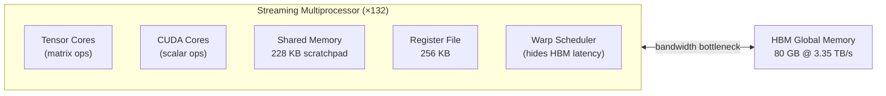

# B1 — GPU Architecture

**Track:** B — GPU Programming  
**Status:** In Progress  
**Prerequisites:** None  
**Next:** [B2 — CUDA Basics](b02_cuda_basics.ipynb)

---

## 1. Why GPUs?

A CPU has ~16–128 cores, each optimized for **low-latency sequential work** (branch prediction, out-of-order execution, large caches). A GPU has **thousands of simpler cores** optimized for **high-throughput parallel work**.

Matrix multiplication — the heart of every neural network — is embarrassingly parallel: every output element `C[i][j] = sum(A[i,:] * B[:,j])` is independent. That's why ML runs on GPUs.

---

## 2. The Thread Hierarchy



| Unit | Size | Key fact |
|---|---|---|
| **Thread** | 1 | Executes one instruction |
| **Warp** | 32 threads | The **atomic scheduling unit** — all 32 execute the same instruction simultaneously (SIMT) |
| **Block** | N warps | Shares **Shared Memory** and **L1 cache** |
| **Grid** | M blocks | Entire kernel — blocks distributed across SMs |

**Critical:** Warps execute in lockstep. If threads in a warp take different branches (`if/else`), both branches execute sequentially with unused threads masked — this is **warp divergence** and kills performance.

---

## 3. The Memory Hierarchy



**The golden rule:** Minimize HBM reads/writes. Everything in ML inference (FlashAttention, quantization, fused kernels) is fundamentally about keeping data in fast SRAM and reducing memory bandwidth bottlenecks.

---

## 4. The Streaming Multiprocessor (SM)

An SM is the fundamental compute unit. On an H100:
- **132 SMs** total
- Each SM contains: CUDA cores, Tensor Cores, register file, shared memory
- A block is assigned to one SM for its entire lifetime
- One SM can run **multiple blocks concurrently** (limited by registers + shared mem)

**Occupancy** = fraction of max warps that are active on an SM. High occupancy lets the GPU hide memory latency by switching to another warp while the first waits for HBM data.

---

## 5. Warp Scheduling & Latency Hiding

This is the key insight that makes GPUs efficient despite slow HBM:



The GPU hides latency by having enough warps in-flight to fill stall gaps. This is why high parallelism matters — not just for raw compute, but for latency hiding.

---

## 6. H100 Key Numbers

Commit these to memory — they're your benchmark reference:

| Spec | Value |
|---|---|
| SMs | 132 |
| CUDA cores | 16,896 |
| Tensor Cores | 528 (4th gen) |
| HBM3 bandwidth | 3.35 TB/s |
| HBM capacity | 80 GB |
| Shared memory per SM | 228 KB |
| FP16 Tensor Core TFLOPS | ~989 |
| FP8 Tensor Core TFLOPS | ~1,979 |
| NVLink bandwidth | 900 GB/s |

---

## 7. Compute-Bound vs Memory-Bound

**Arithmetic Intensity** = FLOPS / Bytes loaded from HBM

- **Compute-bound**: high arithmetic intensity — GPU compute is the bottleneck (Tensor Cores are busy)
- **Memory-bound**: low arithmetic intensity — HBM bandwidth is the bottleneck

Most attention operations are **memory-bound** → hence FlashAttention exists (it tiles computation to stay in SRAM).

```
H100 Ridge Point = FP16 TFLOPS / HBM Bandwidth
                 = 989 TFLOPS / 3.35 TB/s
                 ≈ 295 FLOP/byte

If your kernel < 295 FLOP/byte → memory-bound
If your kernel > 295 FLOP/byte → compute-bound
```

---

## 8. Summary Mental Model



---

## Q&A

### Questions

**Q1.** A warp has 32 threads. If an `if/else` splits them 16/16, how many instruction cycles does the diverged code take compared to a no-divergence warp?

> **Your answer:** _

**Q2.** You launch a kernel with blocks of 256 threads on an SM that supports max 2048 threads. How many blocks can run concurrently per SM (ignoring register/shared mem limits)?

> **Your answer:** _

**Q3.** Why does higher occupancy help even when you're compute-bound?

> **Your answer:** _

**Q4.** You have a kernel that reads 1 GB from HBM and does 1 TFLOP of compute. Is it memory-bound or compute-bound on an H100?

> **Your answer:** _  
> **Hint:** Arithmetic intensity = 1 TFLOP / 1 GB = 1000 FLOP/byte. Compare to the ridge point (295 FLOP/byte).

---

### Answers

*(filled in after student attempts)*

---

## References

- [GPU Architecture Basics — Triton 101 Lesson 2](https://www.youtube.com/watch?v=JD5V8qInVOs)
- [Getting Started with CUDA for Python Programmers](https://www.youtube.com/watch?v=nOxKexn3iBo)
- [CUDA Programming Course — High-Performance Computing with GPUs](https://www.youtube.com/watch?v=86FAWCzIe_4)
- [Warp Scheduling and Divergence (Lecture 16)](https://www.youtube.com/watch?v=WClew-fqVkM)
- [Memory Coalescing, Bank Conflicts, Data Staging](https://www.youtube.com/watch?v=4bYLFhMtAqw)
- [H100 Tensor Core GPU Architecture Whitepaper](https://resources.nvidia.com/en-us-tensor-core)
