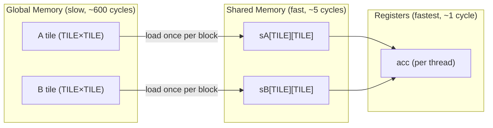

# B2 — CUDA Basics

**Track:** B — GPU Programming
**Status:** Done
**Prerequisites:** [B1 — GPU Architecture](b01_gpu_architecture.md)
**Next:** [B3 — Triton Basics](b03_triton_basics.md)

---

## 1. The CUDA Programming Model

CUDA exposes **three levels** to the programmer:

```
Grid → Blocks → Threads
```

Warps exist between blocks and threads but are a **hardware implementation detail** — invisible to your indexing logic. The GPU automatically groups every 32 consecutive threads into a warp for execution. You never address warps in code.

---

## 2. Global Thread Index (1D)

Every thread gets two numbers from CUDA:
- `blockIdx.x` — which block am I in?
- `threadIdx.x` — which thread am I within my block?

`threadIdx.x` **resets to 0 in every block**, so it alone is not unique. To get a unique index across the entire grid:

```cuda
int i = blockIdx.x * blockDim.x + threadIdx.x;
```

`blockIdx.x * blockDim.x` shifts you to the start of your block's range. `+ threadIdx.x` picks your exact position within that range.

**Concrete example** — N=8, 4 threads/block:

```
Block 0, Thread 0:  0*4 + 0 = 0  → element 0
Block 0, Thread 1:  0*4 + 1 = 1  → element 1
Block 0, Thread 2:  0*4 + 2 = 2  → element 2
Block 0, Thread 3:  0*4 + 3 = 3  → element 3
Block 1, Thread 0:  1*4 + 0 = 4  → element 4
Block 1, Thread 1:  1*4 + 1 = 5  → element 5
Block 1, Thread 2:  1*4 + 2 = 6  → element 6
Block 1, Thread 3:  1*4 + 3 = 7  → element 7
```

---

## 3. Why Memory is Always 1D

Hardware memory is a flat sequence of addresses — RAM, HBM, everything. There is no "row 1" in hardware, only address 3. The idea of a 2D matrix is a convention you impose.

**Row-major layout** (C/C++/CUDA convention) stores matrices row by row:

```
Matrix:          Flat memory:
[a00  a01  a02]  →  [a00, a01, a02, a10, a11, a12, a20, a21, a22]
[a10  a11  a12]       0    1    2    3    4    5    6    7    8
[a20  a21  a22]
```

To access element `[row][col]` in a matrix with `N` columns:
```
address = row * N + col
```

High-level languages like numpy hide this behind `A[i, j]` syntax. CUDA makes you write the formula explicitly — more verbose, nothing hidden.

---

## 4. 1D vs 2D Grid — Your Choice

The GPU has no hardwired 1D or 2D concept. You define the block shape at launch time and CUDA unpacks `threadIdx.x/y/z` accordingly. It is purely a programmer convenience — match grid dimensions to data dimensions for readable index math.

| Data | Natural indexing | Grid you use |
|---|---|---|
| Vector (N) | one index `i` | 1D grid |
| Matrix (M×N) | two indices `row, col` | 2D grid |
| Volume (D×H×W) | three indices | 3D grid |

A 2D block of `(16, 16)` is still 256 threads — same as a 1D block of `(256)`. The difference is just how thread IDs are decomposed.

**Analogy:** 256 people in a room. You can number them 0–255 (1D) or seat them in a 16×16 grid and address them by (row, col) (2D). Same people, same room, different addressing scheme.

---

## 5. Vector Addition — Solved

**Problem:** `C[i] = A[i] + B[i]` for all i in parallel.

```cuda
#include <cuda_runtime.h>

__global__ void vector_add(const float* A, const float* B, float* C, int N) {
    int bx = blockIdx.x;
    int tx = threadIdx.x;
    int nx = bx * blockDim.x + tx;
    if (nx < N) C[nx] = A[nx] + B[nx];
}

extern "C" void solve(const float* A, const float* B, float* C, int N) {
    int threadsPerBlock = 256;
    int blocksPerGrid = (N + threadsPerBlock - 1) / threadsPerBlock;
    vector_add<<<blocksPerGrid, threadsPerBlock>>>(A, B, C, N);
    cudaDeviceSynchronize();
}
```

**Key points:**
- `threadsPerBlock = 256` — good default, multiple of 32 (warp size)
- Guard `if (nx < N)` — last block may have more threads than remaining elements
- `N` is the array length, passed in by the platform; the guard handles any value

---

## 6. Naive Matrix Multiplication — Solved

**Problem:** C = A @ B, where A is (M×K), B is (K×N), C is (M×N).

Each thread owns one output cell `C[row, col]` and computes its full dot product.

```cuda
__global__ void matrix_multiplication_kernel(
    const float* A, const float* B, float* C, int M, int N, int K) {

    int row = blockIdx.y * blockDim.y + threadIdx.y;
    int col = blockIdx.x * blockDim.x + threadIdx.x;

    if (row < M && col < K) {
        float acc = 0.0f;
        for (int i = 0; i < N; i++)
            acc += A[row * N + i] * B[i * K + col];
        C[row * K + col] = acc;
    }
}

extern "C" void solve(const float* A, const float* B, float* C, int M, int N, int K) {
    dim3 threadsPerBlock(16, 16);
    dim3 blocksPerGrid((K + threadsPerBlock.x - 1) / threadsPerBlock.x,
                       (M + threadsPerBlock.y - 1) / threadsPerBlock.y);
    matrix_multiplication_kernel<<<blocksPerGrid, threadsPerBlock>>>(A, B, C, M, N, K);
    cudaDeviceSynchronize();
}
```

**Flat index formulas:**
- `A[row][i]`   → `A[row * N + i]`   (A has N columns)
- `B[i][col]`   → `B[i * K + col]`   (B has K columns)
- `C[row][col]` → `C[row * K + col]` (C has K columns)

**Mental model:**
```
One thread = one output cell C[row][col]
Thread's job = walk A's row and B's column, accumulate dot product, write result
```

---

## 7. Common Bug — Comma Operator

```cuda
// WRONG — C++ comma operator, A[row, i] silently becomes A[i]
acc += A[row, i] * B[i, col];

// CORRECT — explicit flat index
acc += A[row * N + i] * B[i * K + col];
```

`A[row, i]` is valid C++ syntax but does not index a 2D matrix. The comma operator evaluates both expressions and returns the last one, so it reads `A[i]` — wrong element, no compiler error.

---

## 8. Tiled Matrix Multiply — Using Shared Memory

**The problem with naive matmul:** Every thread reads K elements from global memory (HBM, ~600 cycle latency) for every output cell. Arithmetic intensity ≈ 1 FLOP/byte — terrible.

**Key insight:** Threads in the same block read overlapping data from A and B. Load a tile into fast Shared Memory once, reuse it TILE_SIZE times.



```cuda
#define TILE_SIZE 16

__global__ void matmul_tiled(const float* A, const float* B, float* C, int M, int N, int K) {
    __shared__ float sA[TILE_SIZE][TILE_SIZE];
    __shared__ float sB[TILE_SIZE][TILE_SIZE];

    int tx = threadIdx.x, ty = threadIdx.y;
    int row = blockIdx.y * TILE_SIZE + ty;
    int col = blockIdx.x * TILE_SIZE + tx;

    float acc = 0.0f;

    for (int t = 0; t < (N + TILE_SIZE - 1) / TILE_SIZE; t++) {
        // Collaboratively load tile from A and B into shared memory
        int a_col = t * TILE_SIZE + tx;
        int b_row = t * TILE_SIZE + ty;

        sA[ty][tx] = (row < M && a_col < N) ? A[row * N + a_col] : 0.0f;
        sB[ty][tx] = (b_row < N && col < K) ? B[b_row * K + col] : 0.0f;

        __syncthreads();  // all threads must finish loading before any thread computes

        for (int k = 0; k < TILE_SIZE; k++)
            acc += sA[ty][k] * sB[k][tx];

        __syncthreads();  // all threads must finish computing before next tile load
    }

    if (row < M && col < K)
        C[row * K + col] = acc;
}
```

**Why two `__syncthreads()` calls?**
1. After load — prevents any thread from computing before all threads finish loading their tile element
2. After compute — prevents any thread from overwriting `sA/sB` with the next tile before all threads finish reading the current tile

**Arithmetic intensity improves:** Each HBM element is loaded once but used TILE_SIZE=16 times from Shared Memory. Intensity goes from ~1 to ~16 FLOP/byte.

---

## 9. Memory Coalescing

For global memory reads to be fast, threads in the same warp must access **consecutive addresses** — this is called coalesced access.

```
Coalesced (fast):
  Thread 0 → A[0], Thread 1 → A[1], ..., Thread 31 → A[31]
  → ONE memory transaction ✓

Strided (slow):
  Thread 0 → A[0], Thread 1 → A[32], ..., Thread 31 → A[992]
  → 32 separate transactions — 32× slower ✗
```

---

## 10. Occupancy

**Occupancy** = fraction of max warps active on an SM simultaneously. More active warps = more latency hiding = better throughput.

Limited by:
1. **Registers** — more registers per thread → fewer threads fit → lower occupancy
2. **Shared Memory** — larger tiles → fewer concurrent blocks fit on SM
3. **Block size** — must be a multiple of 32; 256–1024 threads/block is the usual sweet spot

---

## Summary

| Concept | Key Point |
|---|---|
| Global thread index | `i = blockIdx.x * blockDim.x + threadIdx.x` |
| Guard clause | Required when N isn't divisible by blockDim |
| Memory is always 1D | Hardware is flat; `[row][col]` → `row*num_cols + col` |
| 1D vs 2D grid | Your choice — match to data shape for readable math |
| Shared memory | Software scratchpad, ~5 cycle latency vs ~600 for HBM |
| Tiling | Load TILE×TILE into SMEM, reuse TILE times |
| `__syncthreads()` | Block barrier — between load and compute, and between compute and next load |
| Coalescing | Consecutive threads should access consecutive addresses |
| Occupancy | More active warps hides latency; limited by registers + SMEM |
| Comma operator bug | `A[row, i]` is NOT 2D indexing in C++ — use `A[row * cols + i]` |
