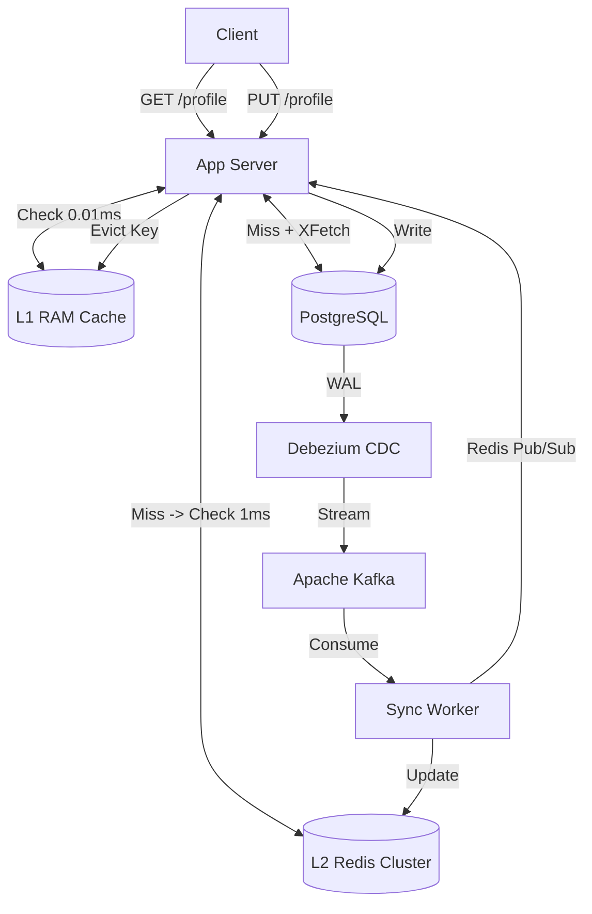

# Principal Engineer Interview: Caching System Design

*Interviewer (Principal Engineer):* "Let's talk caching. Our Postgres database is hitting its read limits serving User Profiles. Let's implement a cache to protect the database and speed up the API. Start simple."

---

## Level 1: The MVP (The Cache-Aside Hack)

**Candidate:**
"I'll implement the standard **Cache-Aside** (Lazy Loading) pattern using **Redis**.
1. **Read Path:** When a request for `/users/123` comes in, the app checks Redis. If it's a 'Miss', it queries Postgres, writes the result to Redis with a 60-minute TTL, and returns it to the user.
2. **Write Path:** When the user updates their profile, the app updates Postgres. If successful, the app explicitly deletes the key in Redis (`DEL user:123`). The next read will pull the fresh data."

**Interviewer (Math & Concurrency Check):**
"Let's look at the failure modes. 
First, **Dual-Write Bugs**. Your app updates Postgres successfully. Before it can execute the Redis `DEL` command, the app crashes or the network partitions. The cache is now stale. For the next 60 minutes, the user sees old data.
Second, **The Thundering Herd (Cache Stampede)**. Imagine the profile belongs to a massive celebrity. 10,000 users are hitting that profile every second. The 60-minute TTL expires. At that exact millisecond, 10,000 threads hit Redis, get a 'Miss', and all 10,000 threads instantly query Postgres simultaneously. What happens to your database?"

**Candidate:**
"Postgres will instantly max out its connection pool and crash under the sudden spike of 10,000 concurrent queries for the exact same data."

---

## Level 2: The Scale-Up (Jitter and Coalescing)

**Interviewer:** "Right. Your DB crashed. How do you prevent Cache Stampedes?"

**Candidate:**
"I need to protect the database from concurrent misses.
1. **Jitter:** To prevent thousands of keys from expiring at the exact same time, I add 'Jitter' (randomness) to the TTL. Instead of exactly 60 minutes, it's 60 minutes ± 5 minutes.
2. **Request Coalescing (Single-Flight):** When the celebrity profile expires, the first thread to miss the cache acquires a **Redis Distributed Lock** (Mutex). It goes to Postgres. The other 9,999 threads see the lock is held, so they sleep for 50ms and check Redis again. Once the first thread populates the cache and releases the lock, the other threads read the fresh data. Only 1 query hit Postgres."

**Interviewer (Architecture Check):**
"Good. Request coalescing saves the database. But let's zoom out. You have 1,000 microservice pods talking to a centralized Redis cluster. 
The celebrity tweets something controversial. You now have **1 Million QPS** hitting that *single* Redis key. Because of how Redis cluster hashes keys, that specific profile lives on exactly *one* Redis node. That node hits 100% CPU and dies. 
How do you survive a 1 Million QPS Hot Key?"

---

## Level 3: State of the Art (Principal / Uber Scale)

**Interviewer:** "Centralized caching fails against extreme Hot Keys. Application-driven invalidation creates dual-write bugs. Walk me through the SOTA design."

**Candidate:**
"To handle extreme scale and guarantee consistency, we must rethink both the caching topology and the invalidation mechanism.

1. **Multi-Level (L1 + L2) Topology:** To solve the 1M QPS Hot Key, we cannot rely on the network. We implement an **L1 In-Memory Cache** (Caffeine/Guava in Java) directly on the application servers. The **L2 Cache** is the centralized Redis cluster. 
When the celebrity tweets, the first request hits L2, loads it into the app server's L1 RAM. The next 999,000 requests are served directly from local memory (`0.01ms` latency, zero network hops). The Redis node barely sees a fraction of the traffic.

2. **CDC (Change Data Capture) Invalidation:** We completely remove cache invalidation logic from the application code to fix the dual-write bugs. The app *only* writes to Postgres. We deploy **Debezium**, which tails the Postgres WAL (Write-Ahead Log). When the row changes, Debezium publishes an event to **Kafka**. A background worker consumes this and updates Redis (L2). 
To keep the L1 caches synchronized, the worker broadcasts an invalidation message via **Redis Pub/Sub**. All 1,000 microservice pods listen to this channel and instantly wipe the stale data from their local RAM.

3. **Probabilistic Early Expiration (XFetch):** Instead of distributed locking (which is slow and prone to deadlocks), we use math. The system calculates a probability of expiration that increases as the TTL approaches 0. One lucky background thread will 'think' the key expired early and fetch fresh data from Postgres *before* the key actually dies, ensuring the cache is always warm and no users ever suffer a latency spike."

**Interviewer:** "Excellent. L1 caching obliterates the network bottleneck for Hot Keys, CDC guarantees absolute data consistency, and XFetch elegantly prevents stampedes."

---

### SOTA Architecture Diagram

---

## Tradeoff Summary

| Decision | Chosen | Rejected | Why |
|----------|--------|----------|-----|
| Cache pattern | Cache-Aside → L1 + L2 + CDC | Write-Through with app-level invalidation | App-level invalidation creates dual-write bugs. CDC reads WAL at disk level — no app code can bypass it. |
| Hot Key solution | L1 in-process cache (Caffeine) | Redis key sharding / local proxy | Redis still gets one request per L1 miss. L1 absorbs 99.9% of hits locally. One network call per L1 population, then zero. |
| Stampede protection | XFetch probabilistic early expiration | Distributed lock (mutex) | Lock: one thread blocks Postgres, 9999 sleep. Lock failure/deadlock = outage. XFetch: stateless math, no coordination needed, background preload before TTL. |
| Invalidation | Debezium CDC → Kafka → Redis Pub/Sub | App `DEL key` after DB write | App-level: crashes between write and DEL = stale cache. CDC: triggered by WAL change, cannot be bypassed by any code path. |

---

## Redis vs Memcached — When to Use Each

### Feature Comparison

| Feature | Redis | Memcached |
|---------|-------|-----------|
| Data structures | String, Hash, List, Set, SortedSet, Stream, Geo, BitMap, HyperLogLog | String (byte array) only |
| Max value size | 512MB | 1MB |
| Persistence | RDB snapshots + AOF append log | None — pure cache, RAM only |
| Replication | Built-in (replica + Sentinel + Cluster) | None built-in (client-side sharding) |
| Pub/Sub | Yes (SUBSCRIBE/PUBLISH) | No |
| Lua scripting | Yes (atomic multi-command scripts) | No |
| Transactions | Yes (MULTI/EXEC, watch) | No |
| Threading model | Single-threaded command execution (I/O threads separate since 6.0) | Multi-threaded |
| Throughput (single node) | ~100K ops/sec (single command thread) | ~500K ops/sec (multi-thread, GET/SET only) |
| Memory efficiency | Lower (metadata per key + encoding overhead) | Higher (simple slab allocator, less overhead) |
| Cluster scaling | Redis Cluster (16384 hash slots, automatic resharding) | Client-side consistent hashing only |
| Operational complexity | Medium (Sentinel or Cluster mode) | Low (homogeneous, stateless nodes) |

### When to use Memcached

**Use Memcached when ALL of these are true:**
1. Your cached values are simple strings or blobs (HTML fragments, serialized objects, API responses)
2. You need maximum raw GET/SET throughput at the lowest cost
3. You do NOT need: persistence, pub/sub, sorted sets, geo, Lua scripts, or transactions
4. Your objects are < 1MB each
5. Cache-only use case — if it disappears, you just repopulate from the source

**Concrete Memcached use cases:**
- **HTML fragment caching**: Cache rendered partial HTML for the top of a news feed. Simple string, evict-and-regenerate on miss. Throughput matters; data structures don't.
- **API response caching at the edge**: A CDN node caches `GET /products/123` responses. The value is a serialized JSON blob. No need for sorted sets.
- **Session token lookup**: `session_token → user_id` mapping. Pure string-to-string. High read throughput, simple value. Memcached's multi-threaded architecture handles 500K lookups/sec per node.
- **Database query result cache**: Cache `SELECT * FROM products WHERE category='phones'` result as a blob. Simple cache-aside pattern, no data structure operations needed.

**The core Memcached advantage: multi-threading.**
Memcached uses multiple threads for request processing. At 32 CPU cores, Memcached can use all 32 for GET/SET handling. Redis uses one thread (+ I/O threads since 6.0 for network, but one thread for command execution). If you're doing billions of simple GET/SET operations and hitting Redis CPU limits before memory limits, Memcached's multi-threading gets more throughput per dollar.

### When to use Redis

**Use Redis when you need ANY of these:**
- Data structures beyond strings (sorted sets for leaderboards, geo for location, sets for unique visitors)
- Persistence (can't afford to lose the data if the node restarts)
- Pub/Sub for real-time messaging between services
- Lua scripts for atomic compound operations (budget enforcement, rate limiting)
- WATCH-based transactions (optimistic locking)
- Streams (Kafka-lite for lightweight event streaming)
- Objects > 1MB

**Concrete Redis use cases (each requiring a feature Memcached lacks):**

| Use case | Redis feature used | Why Memcached can't |
|----------|-------------------|---------------------|
| Leaderboard (top 100 drivers by earnings) | `ZADD`/`ZRANGE` SortedSet | No sorted set |
| Nearby driver search | `GEOADD`/`GEORADIUS` | No geo index |
| Atomic budget enforcement | Lua script (INCR + compare) | No Lua |
| Unique visitor count (HyperLogLog) | `PFADD`/`PFCOUNT` | No HyperLogLog |
| Rate limiting (sliding window) | `ZADD` + `ZREMRANGEBYSCORE` | No sorted set |
| Cache invalidation broadcast | `PUBLISH`/`SUBSCRIBE` | No Pub/Sub |
| Distributed lock | `SET key val NX PX 5000` | Available but SETNX is not atomic with TTL in Memcached |
| Session store that survives restart | AOF persistence | No persistence |

### For Uber specifically

Every Uber service uses Redis, not Memcached:
- **Location service**: `GEOADD`/`GEORADIUS` — impossible in Memcached
- **Budget counters**: Lua atomic increment — impossible in Memcached
- **Rate limiting (API Gateway)**: sliding window via SortedSet — impossible in Memcached
- **Campaign invalidation**: Pub/Sub broadcast — impossible in Memcached
- **L1 cache invalidation**: Pub/Sub — impossible in Memcached

The only theoretical place Memcached would win at Uber is pure HTML/API response caching on the CDN edge, and CDNs have their own purpose-built caching (Varnish, Nginx). For everything behind the CDN, Redis's data structures are too valuable to give up.

### Dragonfly: the third option

Dragonfly is a Redis-compatible server (same protocol, same commands) designed for modern multi-core servers:
- Processes commands on multiple threads via a "shared-nothing" architecture
- Claims 25x higher throughput than Redis on the same hardware
- When to consider: you've hit single Redis node CPU limits and don't want to shard

Dragonfly is very new (2022). For learning, use Redis. For production at extreme scale (>5M ops/sec single node), benchmark Dragonfly.

