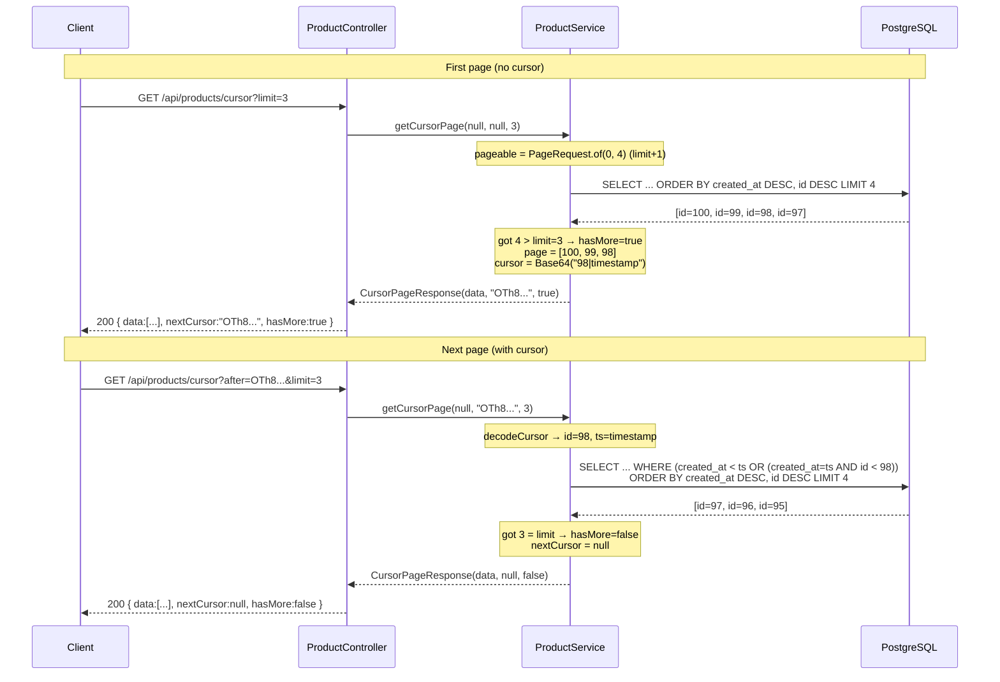
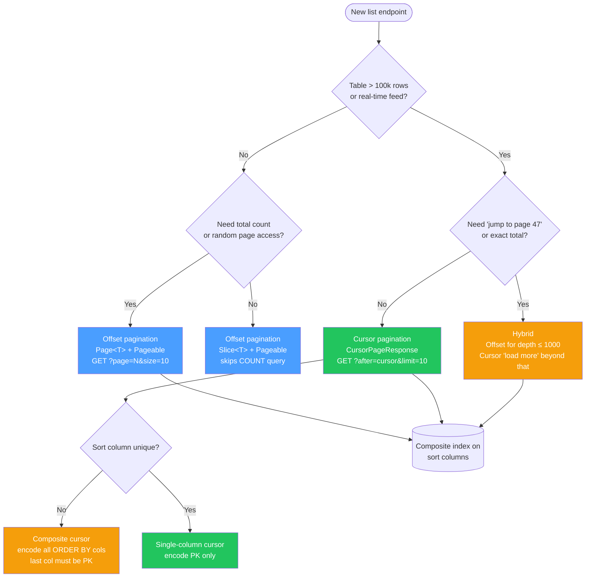

# System Design: Pagination

*Reference implementation: [`apps/pagination-demo/`](../../apps/pagination-demo/)*

---

## The Problem

Any API endpoint that returns a list faces the same fundamental question: **how do you return a subset of rows from a large table efficiently, correctly, and stably?**

The naïve answer — return everything — fails immediately in production:

```
GET /api/products  →  127,000 rows, 40 MB JSON, 8 seconds
```

Pagination solves this by returning a "page" at a time. There are two fundamentally different strategies with very different performance and correctness characteristics.

```
                        ┌──────────────────────────────────────────────────────┐
                        │                  Pagination Strategies                │
                        └──────────────────────────────────────────────────────┘

  OFFSET PAGINATION                          CURSOR PAGINATION
  ─────────────────                          ─────────────────
  Client sends: page=5, size=10              Client sends: after=<cursor>, limit=10

  ┌────────┐   GET ?page=5&size=10  ┌─────┐  ┌────────┐  GET ?after=abc&limit=10  ┌─────┐
  │ Client │ ─────────────────────► │ API │  │ Client │ ──────────────────────────► │ API │
  └────────┘                        └──┬──┘  └────────┘                            └──┬──┘
                                       │                                               │
                              LIMIT 10 │                             WHERE (ts,id) <   │
                             OFFSET 50 │                             (cursor.ts,       │
                                       │                              cursor.id)       │
                                       ▼                                               ▼
                                   ┌───────┐                                       ┌───────┐
                                   │  DB   │                                       │  DB   │
                                   │ scans │                                       │ seeks │
                                   │ rows  │                                       │ to    │
                                   │ 1–60, │                                       │ exact │
                                   │ keeps │                                       │ pos.  │
                                   │ 51–60 │                                       └───────┘
                                   └───────┘
                                  O(N) scan                                      O(log N) seek
```

---

## Level 1: The MVP — Offset Pagination

**Candidate:**  
"I'll use `LIMIT` and `OFFSET`. The client sends a page number and page size; the server computes the offset."

```sql
-- Page 0, size 10
SELECT * FROM products ORDER BY created_at DESC, id DESC LIMIT 10 OFFSET 0;

-- Page 2, size 10
SELECT * FROM products ORDER BY created_at DESC, id DESC LIMIT 10 OFFSET 20;
```

How `OFFSET` physically works — Postgres must scan and discard every row before the offset:

```
  products index (created_at DESC, id DESC)       LIMIT 10 OFFSET 20

  ┌──────────────────────┬─────┐
  │ created_at           │  id │
  ├──────────────────────┼─────┤
  │ 2025-04-13 12:00:00  │ 100 │  ← scanned, discarded  ┐
  │ 2025-04-13 11:55:00  │  99 │  ← scanned, discarded  │
  │ 2025-04-13 11:50:00  │  98 │  ← scanned, discarded  │ OFFSET 20
  │          ...          │ ... │  ← scanned, discarded  │ (waste)
  │ 2025-04-12 08:30:00  │  81 │  ← scanned, discarded  ┘
  ├──────────────────────┼─────┤
  │ 2025-04-12 08:00:00  │  80 │  ← returned  ┐
  │ 2025-04-12 07:55:00  │  79 │  ← returned  │ LIMIT 10
  │          ...          │ ... │  ← returned  │ (actual result)
  │ 2025-04-12 05:00:00  │  71 │  ← returned  ┘
  └──────────────────────┴─────┘

  At OFFSET 50,000 → 50,010 rows touched, 10 returned. O(N).
```

Spring Data `Pageable` does this automatically. The repository needs zero custom SQL:

```java
// ProductRepository.java
Page<Product> findAll(Pageable pageable);
Page<Product> findByCategory(String category, Pageable pageable);
```

The service constructs the `Pageable` from request params:

```java
// ProductService.java
Pageable pageable = PageRequest.of(page, size, Sort.by(sortBy).descending());
Page<Product> result = repo.findAll(pageable);

return new PageResponse<>(
    result.getContent(),
    result.getTotalElements(),   // COUNT(*) — Spring runs this automatically
    result.getTotalPages(),
    result.getNumber(),
    result.hasNext(),
    result.hasPrevious()
);
```

The controller wires it to query params:

```java
// ProductController.java
// GET /api/products?category=Electronics&page=2&size=10&sortBy=price&sortDir=asc
@GetMapping
public ResponseEntity<PageResponse<Product>> list(
        @RequestParam(required = false) String category,
        @RequestParam(defaultValue = "0") int page,
        @RequestParam(defaultValue = "10") int size,
        @RequestParam(defaultValue = "createdAt") String sortBy,
        @RequestParam(defaultValue = "desc") String sortDir) {
    size = Math.min(size, 100); // guard against huge pages
    return ResponseEntity.ok(service.getPage(category, page, size, sortBy, sortDir));
}
```

Response:
```json
{
  "data": [...],
  "totalElements": 1000,
  "totalPages": 100,
  "currentPage": 2,
  "pageSize": 10,
  "hasNext": true,
  "hasPrev": true
}
```

**When to use:** Admin dashboards, small catalogs (<10k rows), anywhere you need "jump to page 47."

---

**Interviewer:** "Good start. What happens at `OFFSET 50000`?"

**Candidate:**  
"It degrades. `OFFSET N` tells Postgres: *scan and discard the first N rows*, then return the next `LIMIT` rows. The database cannot skip those rows — the index must be traversed, and the rows must be fetched, just to be thrown away.

At page 5,000 with size 10:
```sql
SELECT * FROM products ORDER BY created_at DESC LIMIT 10 OFFSET 50000;
-- Postgres scans 50,010 rows, returns 10
```

Time complexity is **O(N)** where N is the offset. On a table with 10M rows:
- Page 1:    ~0.5ms
- Page 100:  ~5ms
- Page 5000: ~500ms
- Page 50000: ~5s → timeout

**Also broken for real-time data:** If a new product is inserted while the user is paginating:

```
User reads page 1 (rows 1–10). A new row is inserted at the top.
User reads page 2 → OFFSET 10 → rows 11–20, but the new insert
pushed everything down by 1. Row 10 now appears on page 2 again.
User sees a duplicate. Row 11 from page 1 is now at position 12 → skipped.
```

Offset pagination is unstable under concurrent writes.

```
  BEFORE INSERT                              AFTER INSERT (id=101 added at top)

  Pos  id   name                            Pos  id   name
  ───  ───  ──────────────────              ───  ───  ──────────────────
   1   100  Widget #100   ← page 1 ✓         1   101  Widget #101  ← new row
   2    99  Widget #99    ← page 1 ✓         2   100  Widget #100
   3    98  Widget #98    ← page 1 ✓         3    99  Widget #99
  ──────────────────────── page boundary    ────────────────────────
   4    97  Widget #97    ← page 2           4    98  Widget #98   ← id=98 was page 1!
   5    96  Widget #96    ← page 2           5    97  Widget #97       user sees it AGAIN
   6    95  Widget #95    ← page 2           6    96  Widget #96
                                                  95 is now at pos 7  ← SKIPPED entirely

  Client reads page 1, then page 2.
  id=98 appears on both pages (duplicate).
  id=97 is shifted off page 2 (skipped).
```"

---

## Level 2: The Scale-Up — Cursor (Keyset) Pagination

**Interviewer:** "How do you fix O(N) offset at scale?"

**Candidate:**  
"Cursor pagination, also called **keyset pagination** or the **seek method**. Instead of saying *skip N rows*, we say *give me rows strictly after this position*.

The 'position' is the last row the client saw, encoded as an opaque cursor token."

### How it works

```
Client fetches first page (no cursor):
  SELECT * FROM products ORDER BY created_at DESC, id DESC LIMIT 10;
  → returns rows [r1 ... r10], last row has (created_at='2025-04-10T12:00:00Z', id=95)

Server encodes the cursor: Base64("95|1744286400000") → "OTV8MTc0NDI4NjQwMDAwMA"
Client stores this cursor and sends it on the next request.

Client fetches page 2 (with cursor):
  WHERE (created_at < '2025-04-10T12:00:00Z'
         OR (created_at = '2025-04-10T12:00:00Z' AND id < 95))
  ORDER BY created_at DESC, id DESC
  LIMIT 10;
```

The `WHERE` clause uses the composite index directly. Postgres does an **index seek** to the cursor position and reads the next 10 entries. **O(log N)**, regardless of depth.

```
  Index: idx_products_created_at_id  (created_at DESC, id DESC)

  ┌──────────────────────┬─────┐
  │ 2025-04-13 12:00:00  │ 100 │  page 1
  │ 2025-04-13 11:55:00  │  99 │  page 1
  │ 2025-04-13 11:50:00  │  98 │  page 1  ← last row on page 1
  ├──────────────────────┼─────┤          │
  │ cursor = Base64(     │     │          │  encode: "98|1744286400000"
  │   "98|1744286400000" │     │          │  → "OTh8MTc0NDI4NjQwMDAwMA"
  │ )                    │     │          │
  ├──────────────────────┼─────┤  ◄───────┘  index seek jumps here directly
  │ 2025-04-12 09:00:00  │  97 │  page 2  ┐
  │ 2025-04-12 08:30:00  │  96 │  page 2  │  LIMIT 10: read forward
  │ 2025-04-12 08:00:00  │  95 │  page 2  │  from cursor position
  │          ...          │ ... │  page 2  │  O(log N) seek + O(1) scan
  │ 2025-04-12 05:00:00  │  89 │  page 2  ┘
  ├──────────────────────┼─────┤
  │ 2025-04-12 04:00:00  │  88 │  page 3
  │          ...          │ ... │  ...
  └──────────────────────┴─────┘

  No matter how deep the page, the seek always costs O(log N).
  OFFSET 50,000 vs cursor at depth 5,000 → same cost.
```

### Request / Response Flow



### Implementation

The composite index on `Product` makes this O(log N):

```java
// Product.java
@Table(
    name = "products",
    indexes = {
        @Index(name = "idx_products_created_at_id", columnList = "created_at DESC, id DESC"),
    }
)
```

Two repository queries — first page (no prior position) and continuation:

```java
// ProductRepository.java

// First page — no cursor, just ORDER BY + LIMIT via Pageable
@Query("""
    SELECT p FROM Product p
    WHERE (:category IS NULL OR p.category = :category)
    ORDER BY p.createdAt DESC, p.id DESC
    """)
List<Product> findFirstPage(@Param("category") String category, Pageable pageable);

// Continuation — seek past last seen (createdAt, id)
@Query("""
    SELECT p FROM Product p
    WHERE (:category IS NULL OR p.category = :category)
      AND (p.createdAt < :cursorCreatedAt
           OR (p.createdAt = :cursorCreatedAt AND p.id < :cursorId))
    ORDER BY p.createdAt DESC, p.id DESC
    """)
List<Product> findAfterCursor(
    @Param("category") String category,
    @Param("cursorCreatedAt") Instant cursorCreatedAt,
    @Param("cursorId") Long cursorId,
    Pageable pageable   // carries only LIMIT — sort is in the query
);
```

The service encodes/decodes the cursor and uses a `+1` trick to detect `hasMore` without a `COUNT(*)`:

```java
// ProductService.java
public CursorPageResponse<Product> getCursorPage(String category, String after, int limit) {
    // Fetch (limit + 1) — if we get limit+1 back, there are more pages.
    Pageable pageable = PageRequest.of(0, limit + 1);

    List<Product> results = (after == null)
        ? repo.findFirstPage(category, pageable)
        : repo.findAfterCursor(category, cursorCreatedAt, cursorId, pageable);

    boolean hasMore = results.size() > limit;
    List<Product> page = hasMore ? results.subList(0, limit) : results;
    String nextCursor = hasMore ? encodeCursor(page.get(page.size() - 1)) : null;

    return new CursorPageResponse<>(page, nextCursor, hasMore);
}

// Cursor = Base64URL(id "|" createdAtEpochMs) — opaque to the client
private String encodeCursor(Product last) {
    String raw = last.getId() + "|" + last.getCreatedAt().toEpochMilli();
    return Base64.getUrlEncoder().withoutPadding().encodeToString(raw.getBytes());
}
```

Response:
```json
{
  "data": [...],
  "nextCursor": "OTV8MTc0NDI4NjQwMDAwMA",
  "hasMore": true
}
```

Next request:
```
GET /api/products/cursor?after=OTV8MTc0NDI4NjQwMDAwMA&limit=10
```

### Why the cursor must be composite `(createdAt, id)`

Using only `id` as the cursor works if IDs are monotonic (auto-increment). But if you sort by `price` or `name` — non-unique columns — a single-column cursor is ambiguous: two products can have `price = 9.99`. The tie-break column (`id`) is required to uniquely identify a position.

**Rule:** The cursor must encode all columns in the `ORDER BY` clause. The last column must be unique (typically the primary key).

---

**Interviewer:** "Deep pagination is solved. What about `totalElements`?"

**Candidate:**  
"`COUNT(*)` is expensive on large tables because it must touch every row (or scan a full index). Spring's `Page<T>` runs a second query automatically:

```sql
SELECT COUNT(*) FROM products WHERE category = 'Electronics';
-- On 10M rows: 200ms–2s depending on table bloat
```

With cursor pagination, we drop the count entirely. The response only says `hasMore: true/false`. Infinite scroll UIs (Twitter, Instagram, TikTok) work exactly this way — there is no page 47.

If the product requires a total count with cursor pagination (e.g., "Showing results for Electronics"), three options:

1. **Approximate count:** `pg_class.reltuples` — updated by VACUUM, accurate within ~5%. Instant.
   ```sql
   SELECT reltuples::BIGINT FROM pg_class WHERE relname = 'products';
   ```

2. **Cached count:** Maintain a Redis counter. Increment on insert, decrement on delete via triggers or application logic. Eventual consistency.

3. **Hybrid:** Show exact count only on the first page (cheap at 0 offset). On subsequent pages, show 'Load more' (cursor) without a count."

---

## Level 3: Production Hardening

**Interviewer:** "You're at Uber scale. The product catalog has 50M rows. Walk through the failure modes."

### Failure 1: Deep Pagination Attack

An attacker or misbehaving client loops through all pages:
```
GET /api/products?page=0&size=100   → 100 rows, OFFSET 0
GET /api/products?page=1&size=100   → OFFSET 100
...
GET /api/products?page=499999       → OFFSET 49,999,900 → full table scan
```

**Fix 1:** Hard cap on offset:
```java
// Reject page numbers beyond a safe depth
if (page * size > 10_000) throw new ResponseStatusException(HttpStatus.BAD_REQUEST,
    "Use cursor pagination for deep traversal. Max offset is 10,000.");
```

**Fix 2:** Migrate all high-traffic list endpoints to cursor pagination. Offset pagination is only for low-volume admin views where random page access is genuinely needed.

### Failure 2: Sort Column Not Indexed

```sql
-- Disaster: no index on (price, id)
SELECT * FROM products WHERE (price < 9.99 OR (price = 9.99 AND id < 50))
ORDER BY price ASC, id ASC LIMIT 10;
-- → Sequential scan on 50M rows
```

**Rule:** Every column in `ORDER BY` must be part of a composite index, in the same column order and sort direction.

```sql
-- Correct index for ORDER BY price ASC, id ASC:
CREATE INDEX idx_products_price_id ON products (price ASC, id ASC);

-- The seek condition then uses the index:
WHERE (price > :lastPrice OR (price = :lastPrice AND id > :lastId))
ORDER BY price ASC, id ASC
LIMIT 10;
```

### Failure 3: Cursor Tampering

If the cursor carries semantic meaning the client can read and modify — e.g., plain `?after_id=50&after_ts=1234567890` — malicious clients can:
- Skip rows: `after_id=999999`
- Enumerate deleted records
- Bypass per-user filters

**Fix:** Encode the cursor as an opaque token (Base64 or HMAC-signed):

```java
// ProductService.java — URL-safe Base64, no padding
private String encodeCursor(Product last) {
    String raw = last.getId() + "|" + last.getCreatedAt().toEpochMilli();
    return Base64.getUrlEncoder().withoutPadding().encodeToString(raw.getBytes());
}
```

For high-security APIs, HMAC-sign the cursor so the server can verify it wasn't tampered:
```java
// HMAC-SHA256(secretKey, "id|epochMs") → sign and verify on decode
```

### Failure 4: Deleted Rows Mid-Pagination

Row `id=95` is in the cursor (`OTV8...`). Before the next request, a background job deletes `id=95`.

```sql
-- The seek condition is still valid — it returns all rows WHERE id < 95
-- The deleted row is simply absent. No error, no gap.
```

Cursor pagination **gracefully handles deletes**: the cursor is a boundary, not a pointer to a specific row. No special handling needed.

Offset pagination **does not**: deleting row at position 8 causes position 9 to shift to 8 → the client sees row 9 again on the next page, or misses it entirely.

### Failure 5: Bidirectional Navigation

Cursor pagination is forward-only by default. To support "back" navigation:

**Option A:** Client caches all cursors it has seen.
```
cursors = [null, "cursor_page2", "cursor_page3", "cursor_page4"]
Back from page 4 → re-request with cursor_page3
```

**Option B:** Reverse cursor — encode a `before` cursor using the first item on the current page:
```sql
-- Forward: WHERE (created_at, id) < (cursor.createdAt, cursor.id) ORDER BY DESC
-- Backward: WHERE (created_at, id) > (cursor.createdAt, cursor.id) ORDER BY ASC
--           then reverse the result list in application code
```

**Option C:** Use offset pagination for small datasets where navigation matters more than performance.

---

## Comparison Table

| Property | Offset / Page | Cursor / Keyset |
|----------|--------------|-----------------|
| Deep page performance | O(N) — degrades | O(log N) — constant |
| Stability under writes | Unstable (skip/duplicate rows) | Stable |
| Random page access | Yes (`?page=47`) | No (forward-only) |
| Total count | Yes (via `COUNT(*)`) | Expensive — usually omitted |
| Sort flexibility | Any column | Columns must be indexed |
| Client complexity | Simple (page numbers) | Slightly higher (cursor state) |
| Use case | Admin UIs, small lists | Feeds, infinite scroll, large tables |

---

## Performance at Depth

```
  Latency vs page depth  (10M row table, page size = 10)

  5000ms ┤
         │
  4000ms ┤                                                      ╔══╗
         │                                                      ║  ║  Offset O(N)
  3000ms ┤                                                 ╔════╝  ║
         │                                                 ║       ║
  2000ms ┤                                           ╔═════╝       ║
         │                                      ╔════╝             ║
  1000ms ┤                              ╔════════╝                 ║
         │         ╔════════════════════╝                          ║
   500ms ┤═════════╝                                               ║
         │░░░░░░░░░░░░░░░░░░░░░░░░░░░░░░░░░░░░░░░░░░░░░░░░░░░░░░░░  Cursor O(log N)
     0ms ┼────────┬────────────────┬──────────────────┬───────────┤
        pg 1    pg 100           pg 1000           pg 5000     pg 50000

  Offset page 5000  → ~500ms   (50,010 rows scanned)
  Cursor page 5000  → ~0.2ms   (index seek, 10 rows read)
  Ratio: ~2500x
```

## Query Execution Plan

The difference is visible with `EXPLAIN ANALYZE`:

```sql
-- Offset: bad
EXPLAIN ANALYZE
SELECT * FROM products ORDER BY created_at DESC, id DESC LIMIT 10 OFFSET 50000;
-- Index Scan on idx_products_created_at_id  (rows=50010, discarded=50000)
-- Actual time: 312ms

-- Cursor: good
EXPLAIN ANALYZE
SELECT * FROM products
WHERE (created_at < '2025-03-01' OR (created_at = '2025-03-01' AND id < 40000))
ORDER BY created_at DESC, id DESC LIMIT 10;
-- Index Scan on idx_products_created_at_id  (rows=10)
-- Actual time: 0.18ms
```

**1700x faster** at depth 5000.

---

## API Design Reference

```
# Offset pagination
GET /api/products?page=0&size=10&sortBy=createdAt&sortDir=desc
GET /api/products?category=Electronics&page=2&size=10

# Cursor pagination
GET /api/products/cursor?limit=10
GET /api/products/cursor?after=<cursor>&limit=10
GET /api/products/cursor?category=Electronics&after=<cursor>&limit=10

# Single item
GET /api/products/{id}

# Create
POST /api/products  {"name":"Widget","category":"Electronics","price":9.99}
```

### Cursor response contract
```json
{
  "data": [
    { "id": 95, "name": "Wireless Headphones #1", "category": "Electronics",
      "price": 199.99, "createdAt": "2025-04-10T12:00:00Z" }
  ],
  "nextCursor": "OTV8MTc0NDI4NjQwMDAwMA",
  "hasMore": true
}
```

Pass `nextCursor` as `?after=` on the next request. When `hasMore` is `false`, `nextCursor` is `null`.

---

## Real-World Usage

| Company | Endpoint | Strategy |
|---------|----------|----------|
| Twitter / X | Home timeline | Cursor (`max_id`, `since_id`) |
| Facebook Graph API | Feed, friends list | Cursor (`before`, `after`) |
| GitHub REST API | Issues, commits | Cursor (Link header: `rel="next"`) |
| Stripe API | Charges, events | Cursor (`starting_after`, `ending_before`) |
| Google APIs | Any list endpoint | Page token (opaque cursor) |
| Elasticsearch | Search results | `search_after` (keyset) |
| Postgres `EXPLAIN` | — | Keyset is the seek method |

Stripe's API is a canonical example: [stripe.com/docs/api/pagination](https://stripe.com/docs/api/pagination)

---

## Summary Decision Tree

