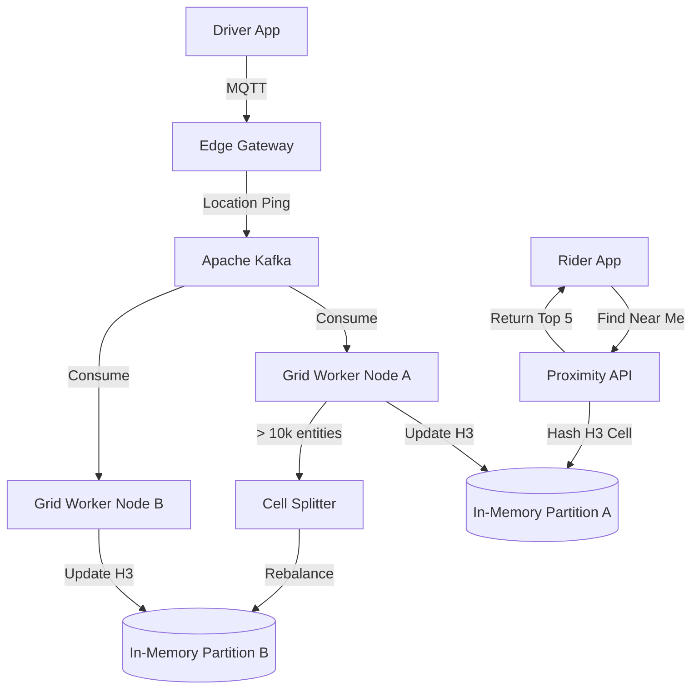

# Principal Engineer Interview: Proximity Service System Design

*Interviewer (Principal Engineer):* "We are building a feature: 'Find Drivers Near Me'. Given a user's latitude and longitude, return the 5 closest drivers. Let's start with a basic database."

---

## Level 1: The MVP (The SQL Hack)

**Candidate:**
"I'll use a standard relational database like MySQL.
1. **Schema:** A `Drivers` table with `id`, `latitude`, and `longitude` columns.
2. **Query:** When a user searches, I'll pass their coordinates. I'll write a SQL query that uses the Pythagorean theorem (or Haversine formula) to calculate the distance between the user and every driver, sort by the result, and `LIMIT 5`."

**Interviewer (Math Check):**
"Let's look at the math. We have **500,000 online drivers**. 
Your query requires a **Full Table Scan**. It has to run a complex trigonometric math function on 500,000 rows, sort them, and pick 5. 
If we have **1,000 users searching per second**, your database is executing 500 million trigonometric calculations every second. Your CPU will literally catch fire. How do we index geospatial data?"

**Candidate:**
"Math on every row is O(N). I need to reduce the search space to O(1) or O(log N) by using a Spatial Index."

---

## Level 2: The Scale-Up (Standard Spatial Indexing)

**Interviewer:** "Correct. Walk me through spatial indexing."

**Candidate:**
"We move to **Redis GEO** or Postgres with **PostGIS**.
1. **Indexing (Geohash):** Under the hood, these use Geohashes or Quad-Trees. They divide the map of the world into a grid of squares. A driver's coordinate is converted into a string prefix (e.g., `9q8yy`). 
2. **Query:** When a user searches, we calculate their Geohash square. We query the DB for all drivers who share that exact string prefix. Now we only run the math on the 50 drivers in that square, not 500,000.
3. **Updates:** Drivers ping their location via HTTP `POST`, and we update their Geohash in Redis using `GEOADD`."

**Interviewer (Edge Cases & Sharding Check):**
"Geohashes have severe edge cases. If a user is standing on the exact border of a square, the closest driver might be 10 feet away, but in a completely different Geohash prefix. You are forced to query the target square *plus its 8 neighbors*.
Furthermore, let's talk about **Write Contention**. Drivers update their location every 5 seconds. If you have 50,000 drivers in Manhattan, and you shard Redis by Geohash, the Manhattan Redis shard will hit 100% CPU utilization while the New Jersey shard sits idle. How do you solve the edge cases and the write bottlenecks?"

---

## Level 3: State of the Art (Principal / Uber Scale)

**Interviewer:** "Standard Geohash squares are mathematically clunky, and HTTP location updates will DDoS your own servers. Let's design the SOTA architecture."

**Candidate:**
"To achieve Uber-level scale, we redesign the grid math, the ingestion layer, and the storage layer.

1. **The Grid Math (H3 Hexagons):** We abandon Geohash squares and use Uber's open-source **H3** index. H3 tiles the earth in Hexagons. The mathematical beauty of a hexagon is that the distance from its center to all 6 adjacent hexagons is perfectly identical. This eliminates the jagged diagonal edge-cases of squares. Radius searches become simple ring traversals.
2. **Ingestion & Shock Absorbers:** HTTP `POST` requires heavy TCP handshakes. We move drivers to persistent **MQTT** connections. The edge gateways drop these location pings directly into **Apache Kafka**. Kafka acts as a shock absorber. If 50,000 Manhattan drivers ping at once, Kafka simply buffers the messages.
3. **Custom In-Memory Grids:** We don't use Redis GEO. We deploy custom in-memory partitions (using tools like **Apache Ignite** or specialized Go services). Background workers consume from Kafka and update the H3 cells in memory.
4. **Dynamic Cell Splitting (Manhattan Problem):** To solve the hot-shard write contention, we implement dynamic splitting. If an H3 Hexagon (e.g., Times Square) detects more than 10,000 entities, the system automatically promotes it to a higher resolution (breaking it into 7 smaller child hexagons). It then re-balances those 7 smaller hexagons across entirely different server shards, instantly diffusing the localized CPU spike."

**Interviewer:** "Outstanding. You moved from O(N) table scans to O(1) H3 lookups, buffered the write storm with Kafka, and dynamically mitigated geographic hot-spots."

---

### SOTA Architecture Diagram

