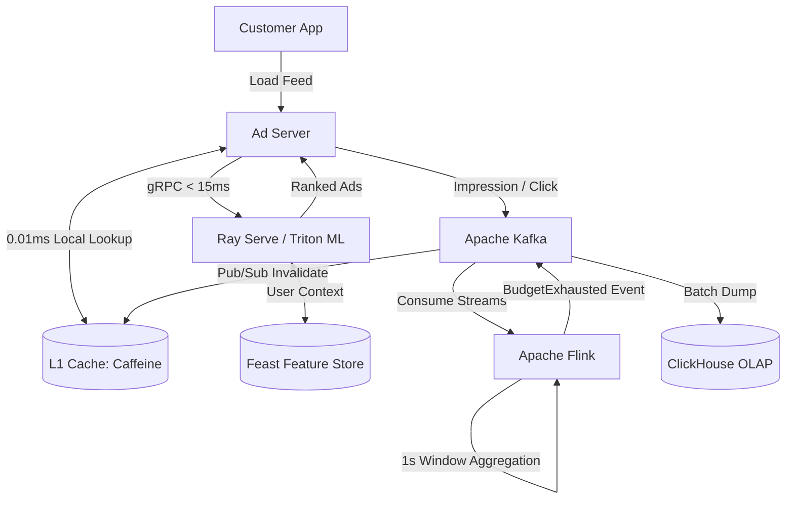

# Principal Engineer Interview: Uber Ads System Design

*Interviewer (Principal Engineer):* "Uber Ads is a massive revenue driver. Advertisers bid to show their restaurants at the top of the feed. Let's design the Ad serving and billing system. Start simple."

---

## Level 1: The MVP (The Batch Processing Hack)

**Candidate:**
"I'll build a standard relational system.
1. **Ad Selection:** We query the database for active campaigns. We rank them by `Bid Amount * Historical CTR`.
2. **Tracking:** When a user clicks an ad, the mobile app sends a `POST /click` request, and we insert a row into a `Clicks` table in Postgres.
3. **Billing & Budgets:** A Python cron job runs every hour. It runs `SELECT SUM(cost) FROM Clicks WHERE campaign_id = X`. If the sum exceeds the advertiser's budget, it sets the campaign status to `PAUSED`."

**Interviewer (Math Check):**
"Let's look at the budget math. A local coffee shop sets a daily budget of $50. 
At 8:00 AM, a massive conference lets out next door. Your system starts serving their ad. In 5 minutes, they get 1,000 clicks at $2 a click. That's $2,000 in spend. 
Your cron job doesn't run until 9:00 AM. Who pays for the $1,950 budget overrun?"

**Candidate:**
"Uber eats the cost. The hourly batch job is too slow. Advertisers will churn if we overcharge them, so we have to write off the revenue."

---

## Level 2: The Scale-Up (Standard Industry Pattern)

**Interviewer:** "Exactly. Batch processing is unacceptable for ad budgets. How do we fix the overruns and speed up ad selection?"

**Candidate:**
"We move to in-memory counters and caching.
1. **Budgets:** When a click happens, we immediately decrement a counter in **Redis**: `DECRBY campaign:123:budget 2`. If the Redis counter hits 0, we immediately pause the campaign.
2. **Ad Serving:** We load all active campaigns into a **Redis Cache**. The Ad Server fetches from Redis, avoiding Postgres entirely.
3. **Tracking:** We push clicks to a message queue (RabbitMQ) so the API response is fast, and asynchronously write them to Postgres for permanent billing records."

**Interviewer (Math & Latency Check):**
"Better. But let's calculate latency. Your Ad Server gets a request to populate the feed. It has to evaluate 5,000 potential ad targets. It makes a network call to Redis to fetch the campaigns. Let's say that takes 2ms.
Then you calculate ranking. A static 'Historical CTR' is terrible for revenue. A user searching for 'Coffee' at 8 AM shouldn't see a Pizza ad, even if that Pizza ad has a high historical CTR.
If you introduce a Machine Learning model to predict Real-Time CTR, making a network call to an ML service adds another 30ms. Your total ad load time is breaching 50ms, which degrades the core app experience."

---

## Level 3: State of the Art (Principal / Uber Scale)

**Interviewer:** "We need to evaluate thousands of ads, run complex ML inference, and enforce strict budgets, all in under 20 milliseconds. Walk me through the SOTA design."

**Candidate:**
"To hit those latency targets while maximizing revenue, we completely eliminate network hops and move to Stream Processing.

1. **Zero-Latency Ad Serving (L1 Cache):** We cannot afford the 2ms network hop to Redis. We cache active campaigns directly in the Ad Server's local RAM (JVM Heap / Go Memory) using an **L1 Cache (Caffeine/Guava)**. Latency drops from 2ms to `0.01ms`. We use **CDC (Debezium)** to broadcast invalidations via Pub/Sub to all instances if a campaign pauses.
2. **Real-Time ML Inference:** We don't use static CTRs. We use **Ray Serve** or **NVIDIA Triton** hosted as a sidecar or via ultra-low-latency gRPC. We inject a **Feature Store (Feast)** that holds the user's real-time context (last 5 orders, time of day). We wrap the ML call in a strict **15ms Circuit Breaker**. If it times out, we instantly fall back to the L1 cache's static CTR to protect the user experience.
3. **Sub-second Budget Control (Apache Flink):** Redis `DECRBY` is fast, but managing atomic transactions across distributed data centers is error-prone. Instead, all impressions and clicks are streamed instantly into **Apache Kafka**. We use **Apache Flink** to consume the stream, performing stateful aggregations in tumbling 1-second windows. The exact millisecond a budget reaches $0, Flink emits a `BudgetExhausted` event directly back to Kafka. All Ad Servers consume this topic and instantly drop the ad from their L1 cache. No overruns, no lost revenue."

**Interviewer:** "Perfect. L1 caching for zero-latency retrieval, ML Feature Stores for revenue maximization, and Flink for real-time financial accuracy."

---

### SOTA Architecture Diagram



---

## Tradeoff Summary

| Decision | Chosen | Rejected | Why |
|----------|--------|----------|-----|
| Ad retrieval latency | L1 in-process cache (Caffeine) | Redis network call | Redis call: 2ms. L1 RAM: 0.01ms. At 1M feed loads/sec, 2ms per call = Redis becomes the bottleneck. L1 handles 99.9% of reads locally; Redis is only updated on campaign change events. |
| Ranking | `eCPM = bid × qualityScore` | Raw bid ranking | Raw bid: pizza advertiser bids $5, shows pizza ad on a sushi page. eCPM: qualityScore (predicted CTR) downweights irrelevant ads. Protects UX. Advertisers with better targeting win on merit, not wallet size alone. |
| Auction type | Second-price (Vickrey) | First-price | First-price: advertisers shade bids → complex game theory, opaque pricing. Second-price: bidding true value is dominant strategy. No shading needed. More participation, more accurate price discovery. |
| Budget enforcement | Apache Flink (1-second windows) | Redis DECRBY counter | Redis DECRBY: atomic but doesn't aggregate across distributed data centers. At global scale, one Redis shard per region still allows overruns between sync cycles. Flink: stateful stream processor, sub-second tumbling windows, emits BudgetExhausted event the instant budget hits zero. |
| ML inference | Feature Store (Feast) + sidecar | Static CTR lookup | Static CTR: historical average, ignores context. "Coffee" at 8am ≠ "Coffee" at 8pm. Feast provides real-time user features (last 5 searches, time of day, location) to the ML model for contextual CTR prediction. 15ms circuit breaker: if ML times out, fall back to static CTR — ad still serves, UX unaffected. |
| Click tracking | Kafka → ClickHouse | INSERT per click to Postgres | Single-row Postgres INSERT: 5-8ms, ACID overhead. At 100K clicks/sec = 500-800 seconds of DB time per second → impossible. Kafka batches clicks; ClickHouse bulk-inserts: 10K rows in 5ms, columnar storage for fast aggregation queries. |

---

## Implementation Deep Dive

*Notes from building the local Uber mini-backend (see `apps/uber/`).*

### What we built vs. SOTA

| Component | Our Implementation | SOTA Gap | Why the gap is OK for learning |
|-----------|-------------------|----------|-------------------------------|
| Retrieval | Two-Tower + Qdrant ANN (top-100) | Uber uses hundreds of candidate sources + faiss w/ GPU | Same algorithm, ~10x fewer candidates |
| Ranking | DCN v2 on CPU (Triton ONNX) | GPU with TensorRT quantized int8 | Algorithm identical; latency 5ms vs 0.3ms |
| Auction | Second-price on eCPM in-process | Same algorithm | No gap on correctness |
| Budget | Redis Lua atomic Lua script | Apache Flink 1s tumbling windows | Lua fails at multi-region; Flink handles cross-DC |
| Feature store | Redis hashes (manual) | Feast with offline materialization | No training-serving skew protection |
| Campaign cache | 4 strategies, app-level | L1 Caffeine + CDC Debezium | Our approach works; L1 adds 0.01ms vs 2ms |

### Key numbers from implementation

**Auction math (verified locally):**
- Ad 1: fixedBidCpm=$2.50, predictedCTR=0.09 → eCPM = $0.225
- Ad 2: fixedBidCpm=$3.00, predictedCTR=0.06 → eCPM = $0.180
- Winner: Ad 1 (higher eCPM despite lower raw bid)
- Clearing price: Ad 2's bid + $0.01 = $3.01 (Ad 1 pays more than it bid in raw terms — this is intentional in Vickrey for eCPM auctions)

**Redis Lua budget atomicity:**
The Lua script runs as a single Redis command. At 100K impressions/sec and 10K active campaigns = 10 budget checks/campaign/sec. Redis single-thread handles ~100K operations/sec. With Lua: each check is one round trip (vs two for GET+INCR). No race condition possible.

**Circuit breaker design:**
15ms timeout chosen because: Ad Serving target P99 = 20ms total. Breakdown: Retrieval 5ms + Ranking 8ms + Auction 0.1ms + Kafka 1ms = 14.1ms. 15ms leaves 5.9ms for the gRPC overhead to Feed BFF. If Triton cold-starts or GPU contends, ranking takes 30-100ms — without circuit breaker, every feed load times out.

**Cache strategy trade-off in numbers:**
- Cache-Aside: 2 round trips on miss (Redis GET + DB query), 1 on hit. Memory: only hot ads cached.
- Write-Through: 2 writes on every save (DB + Redis). Memory: all ads ever written are in cache.
- Write-Behind: 1 write visible to user (Redis), DB eventually consistent. Risk window: up to `appendfsync everysec` = 1 second of potential data loss if Redis crashes.

### Design decisions explained by the code

**Why `ad-created-events` over direct REST call to ML Platform:**
When Campaign Mgmt creates an ad, it doesn't know whether ML Platform is up. With a direct REST call, ad creation fails if ML Platform is down. With Kafka: ad creation always succeeds, embedding is computed eventually (Kafka retains 7 days). The ad simply won't appear in Qdrant ANN results until the embedding is computed — acceptable 5-30 second lag.

**Why separate Campaign Management (8082) and Ad Serving (8089):**
Campaign Mgmt is CRUD: advertisers manage ads during business hours, maybe 100 QPS. Ad Serving is called on every feed load: 10K-1M QPS. Different SLAs, different scaling units, different failure blast radii. If Ad Serving has a memory leak and crashes, Campaign Mgmt keeps running (advertisers can still manage campaigns). If they were one service, both go down.

---

## Database Options Compared

### Campaign Storage: Why PostgreSQL over the alternatives

Campaigns involve money: bid amounts, daily budgets, clearing prices. Financial accuracy requires ACID transactions. This rules out eventual-consistent stores immediately.

#### PostgreSQL vs MySQL vs MongoDB vs Cassandra for campaigns

| Property | PostgreSQL | MySQL | MongoDB | Cassandra |
|----------|-----------|-------|---------|-----------|
| ACID | Full, serializable | Full (InnoDB) | Multi-document since 4.0 (slower) | Lightweight transactions (LWT) only per partition |
| Financial accuracy | NUMERIC type (exact decimal) | NUMERIC type | Double (floating-point errors!) | DECIMAL (exact) |
| Aggregation (budget sum) | Native SQL SUM | Native SQL SUM | Aggregation pipeline (slower) | Requires Spark or manual client-side |
| JOIN support | Full | Full | None (lookup stage only) | None |
| Sharding | Citus extension | Vitess middleware | Built-in (mongos router) | Built-in |
| Shard key flexibility | Any column (Citus) | Keyspace column | Shard key at collection creation | Partition key fixed at table creation |

**Why not MongoDB for campaigns:**
MongoDB stores numbers as `double` by default. `double` has 15-16 significant decimal digits — fine for scientific data, but for financial calculations: `0.1 + 0.2 = 0.30000000000000004` in floating point. A campaign with a $100.00 daily budget could hit $99.99999 and not trigger the pause. For billing, you need `NUMERIC(10,4)` exact decimal arithmetic. PostgreSQL's `NUMERIC` type is arbitrary-precision and never rounds.

**Why not Cassandra for campaigns:**
Cassandra doesn't support JOINs. The query "give me all campaigns for advertiser 42 sorted by spend today" requires scanning all partitions and sorting client-side. For campaign management (admin UI), ad-hoc queries are common. The moment you need `WHERE status='PAUSED_BUDGET' ORDER BY daily_budget DESC`, Cassandra requires a full cluster scan or a pre-built secondary index with limited flexibility.

**Where Cassandra would be right for ads:**
Impression log storage. Billions of rows, always appended, queried by `(ad_id, day)`. Cassandra partition key `(ad_id, day)` → single partition query for daily impression count. No JOINs needed. Very high write throughput. This is a separate service concern from campaign management.

---

### Vector Search: Why Qdrant over the alternatives

The ML retrieval stage uses ANN (Approximate Nearest Neighbor) search over ad embeddings. This is a specialized problem — traditional databases can't do it efficiently.

#### Qdrant vs Pinecone vs Milvus vs Weaviate vs Faiss

| Property | Qdrant | Pinecone | Milvus | Weaviate | Faiss |
|----------|--------|----------|--------|----------|-------|
| Hosting | Self-hosted (or Qdrant Cloud) | Managed SaaS only | Self-hosted (or Zilliz Cloud) | Self-hosted or managed | Library only (in-process) |
| Index type | HNSW (on-disk) | Proprietary | HNSW, IVF, DISKANN | HNSW | IVF, HNSW, PQ, many more |
| Payload filtering | Built-in (filter inside HNSW graph) | Metadata filtering (post-filter) | Attribute filtering | GraphQL-based filtering | Manual (post-filter) |
| Persistence | Yes (disk-backed HNSW) | Yes (managed) | Yes | Yes | No (RAM only, save/load manually) |
| Scalar quantization | Yes (int8) | No | Yes | Yes | Yes |
| Client libraries | Rust, Python, Go, TypeScript | Python, TypeScript | Python, Go, Java | Python, Go | Python, C++ |
| Local dev | Easy (Docker) | No (SaaS only) | Complex (Kubernetes recommended) | Easy (Docker) | Library, no server |
| Cost | Free self-hosted | $$$ ($/vector/month) | Free self-hosted | Free self-hosted | Free |

**Why Qdrant for local dev:**
`docker pull qdrant/qdrant` and it's running in 10 seconds. Pinecone requires an account and has no local option. Milvus requires etcd + MinIO + Milvus coordinator + query nodes — heavy for local dev. Qdrant is a single binary with an HTTP + gRPC API and a UI at `/dashboard`.

**Qdrant's key advantage — filtered ANN:**
Standard ANN libraries do ANN first, then filter (post-filter). Post-filter discards results that don't match the predicate, which can reduce recall dramatically if the filter is selective. Qdrant integrates the filter INTO the HNSW graph traversal — it only explores nodes matching the filter during graph search. This gives ~same recall as unfiltered ANN. For ads, the cuisine filter might match only 5% of ads — post-filtering would need to retrieve 100 × (1/0.05) = 2000 candidates to get 100 after filtering. Qdrant's in-graph filtering needs only ~110 candidates.

**HNSW parameter tuning:**
```
m=16:           Each node has 16 bidirectional links in the graph.
                More links = better recall, more memory.
                m=16 → ~16×2×4 bytes = 128 bytes overhead per vector.
                For 100K ad vectors: 100K × 128B = 12.8MB overhead (trivial).
                For 1B vectors: 128GB overhead → consider m=8.

ef_construct=200: Graph quality at build time. Higher = slower insert, better recall.
                  At 100K vectors, inserting with ef_construct=200 takes ~2s total.
                  At 100M vectors: ~2000s → increase batch size, parallelize.

ef=100 at query: Beam width during search. Higher = better recall, slower query.
                  At 100K vectors, ef=100 gives ~98% recall at ~3ms.
                  At 1M vectors, ef=100 gives ~95% recall at ~5ms.
                  At 1B vectors, ef=100 gives ~85% recall — increase ef or add re-ranking.

Scalar quantization (int8): Convert float32 → int8 (4x memory reduction).
                  128-dim float32 = 512 bytes/vector → int8 = 128 bytes/vector.
                  At 100M vectors: 51.2GB → 12.8GB. Fits in RAM instead of NVMe.
                  Recall loss: ~1-2% vs full precision. Usually acceptable.
```

---

### Budget Enforcement: Redis Lua vs Flink vs the alternatives

| Strategy | Mechanism | Latency | Accuracy | Multi-region |
|----------|-----------|---------|----------|--------------|
| Cron job (hourly) | SQL SUM at interval | ∞ (up to 1hr lag) | Poor (overruns guaranteed) | N/A |
| Redis DECRBY (single region) | Atomic increment, in-memory | 0.1ms | Good (within one DC) | Poor (separate counters per region → sum can exceed budget) |
| Redis Lua (our impl) | Atomic check-and-increment | 0.1ms | Good (within one DC) | Poor (same as above) |
| Flink 1s tumbling windows | Stream aggregation across all events | ~1s | Excellent (aggregates all regions) | Yes |
| Token bucket (in-process) | Refill rate × time = available tokens | 0.01ms | Approximate (no cross-instance sync) | No |
| Google Zanzibar-style distributed counters | Consistent hashing + partial sums | ~5ms | Excellent | Yes |

**Our Redis Lua choice — what it handles and what it doesn't:**

```
HANDLES:
  ✓ Single-DC atomic budget enforcement (no race condition between Ad Servers)
  ✓ Midnight budget reset (flush all campaign:*:spend_today keys)
  ✓ Sub-millisecond response to budget exhaustion
  ✓ No external dependencies beyond Redis

DOESN'T HANDLE:
  ✗ Multi-region: NY Ad Server deducts from NY Redis.
                  London Ad Server deducts from London Redis.
                  Both can deduct up to full budget. 2x overspend possible.
  ✗ Redis crash: if Redis crashes between Lua execution and AOF flush (max 1s),
                 spend counter is reset → campaign appears to have full budget again.
  ✗ Budget accuracy at 100K+ impression/sec: Redis single-thread may queue up
                 at extreme throughput.

THE FLINK FIX:
  Every impression event → Kafka ad-impression-events topic.
  Flink consumes all events from all regions in one stream.
  Flink 1-second tumbling window: SUM(cost) per campaign_id per window.
  When SUM exceeds daily_budget: emit BudgetExhausted event to Kafka.
  All Ad Servers (all regions) consume BudgetExhausted and evict from L1 cache.
  Result: budget enforced globally, not per-region. No overruns.
```

