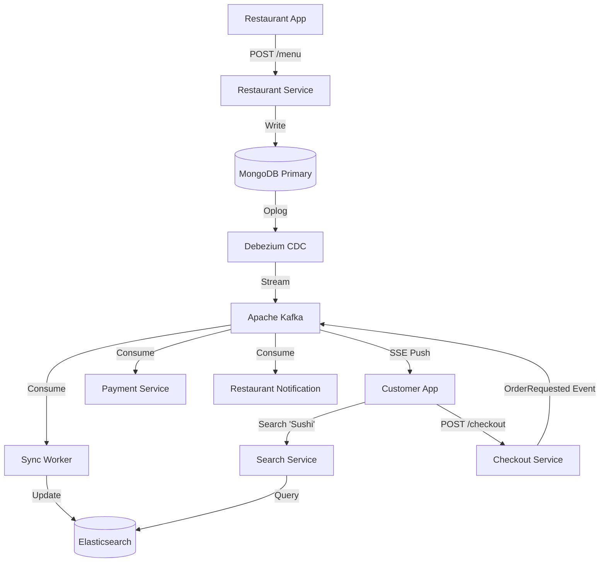

# Principal Engineer Interview: Uber Eats System Design

*Interviewer (Principal Engineer):* "Let's design the Uber Eats backend. Specifically, the Menu Catalog and the Checkout flow. Start with the simplest, most intuitive database design. We'll break it with math, and then rebuild it."

---

## Level 1: The MVP (The Relational Hack)

**Candidate:**
"I'd start with a standard **PostgreSQL** relational database. 
1. **Schema:** We need normalization to avoid data anomalies. Tables: `Restaurants`, `Menus`, `Categories`, `Items`, `Item_Options` (e.g., 'Size'), and `Add_ons` (e.g., 'Extra Cheese').
2. **Read Path:** When a user opens a restaurant page, we run a SQL query with `JOIN`s across these 6 tables to construct the menu.
3. **Checkout:** A monolithic synchronous API. `POST /checkout` -> Deduct inventory -> Charge Credit Card -> Send Order to Restaurant -> Return 200 OK."

**Interviewer (Math Check):**
"Uber Eats has a **100:1 Read-to-Write ratio**. People window-shop 100 menus before placing an order. Let's say at dinner rush we have **50,000 menu views per second**. 
Executing a 6-table JOIN 50,000 times a second? Your Postgres CPU will hit 100% instantly. And what happens during checkout if the Restaurant Notification service is restarting?"

**Candidate:**
"Ah. Postgres will collapse under the JOIN load. And for checkout, because it's a synchronous blocking call, if the Restaurant Notification service takes 30 seconds to restart, the user's mobile app hangs on a spinner for 30 seconds, or times out, resulting in a dropped order and lost revenue."

---

## Level 2: The Scale-Up (Standard Industry Pattern)

**Interviewer:** "Right. Fix the reads, and fix the brittle checkout."

**Candidate:**
"We denormalize and introduce caching and queues.
1. **Read Path:** We move to a Document Database like **MongoDB** or use **Redis** to cache the menus as massive JSON blobs. Now, fetching a menu is an O(1) key-value lookup. No more JOINs. `50,000 QPS` on Redis is trivial.
2. **Checkout:** We introduce **RabbitMQ** or **Kafka**. The checkout service deducts inventory, charges the card, and publishes an `OrderPlaced` event. It immediately returns `202 Accepted` to the user. The Restaurant Notification service consumes this event whenever it's ready. If it's down, the message waits in the queue."

**Interviewer (Math & Consistency Check):**
"Okay, you've solved the read bottleneck. But caching creates a new nightmare: **Cache Invalidation**.
A restaurant owner marks 'Avocado' as out of stock in Postgres. Your code updates Postgres, but the network blips before it can delete the Redis key. 
For the next 24 hours, users order Avocado, pay for it, and the restaurant has to cancel the order. How do you guarantee cache consistency? Furthermore, how do users search for 'Spicy Tuna Roll' across 10,000 cached JSON blobs?"

---

## Level 3: State of the Art (Principal / Uber Scale)

**Interviewer:** "Standard caching causes dual-write bugs, and Redis can't do fuzzy text search. How do we build the SOTA architecture?"

**Candidate:**
"We implement **CQRS (Command Query Responsibility Segregation)** with **CDC (Change Data Capture)**.

1. **Guaranteed Consistency (CDC):** We stop letting application code touch the cache. The application *only* writes to the primary database (MongoDB/Postgres). We deploy **Debezium**, which tails the database's Write-Ahead Log (WAL) at the disk level. When 'Avocado' goes out of stock, Debezium instantly streams that exact row change to Kafka. A background worker consumes it and updates the read layer. This mathematically eliminates dual-write bugs.
2. **The Read / Search Layer:** Instead of just Redis, our CDC pipeline pushes menu updates into **Elasticsearch**. Elasticsearch stores the denormalized JSON menus. 
3. **Advanced Search:** Now, when a user searches 'Spicy Tuna', Elasticsearch handles typo-tolerance, fuzzy matching, and geospatial distance-decay (ranking a sushi place 1 mile away higher than one 5 miles away) in milliseconds. 
4. **SOTA Checkout:** Instead of just putting the notification in a queue, we use **Event Sourcing**. The *entire state* of the order is a series of immutable Kafka events (`OrderCreated` -> `PaymentAuthorized` -> `RestaurantAccepted`). The mobile app listens via **Server-Sent Events (SSE)**. The UI reacts instantly to the event stream, providing that 'live' feel without polling."

**Interviewer:** "Excellent. Debezium + Elasticsearch decouples your read/write paths perfectly, and Event Sourcing makes the system deeply fault-tolerant."

---

### SOTA Architecture Diagram



---

## Tradeoff Summary

| Decision | Chosen | Rejected | Why |
|----------|--------|----------|-----|
| Menu store | MongoDB (document) | PostgreSQL (normalized) | Menu is a tree: Restaurant → Categories → Items → Options. 6-table JOIN at 50K QPS = ~750 concurrent connections (Little's Law). MongoDB: one document = one read. |
| Cache invalidation | Debezium CDC (WAL tail) | App-level DEL after write | App-level DEL: network drop after DB write → stale cache for full TTL. Debezium reads the DB write-ahead log at disk level — if the row changed, Debezium fires, guaranteed. No app code path can bypass it. |
| Search layer | Elasticsearch | Redis full-text | Redis has no fuzzy search or relevance scoring. ES handles typo-tolerance, partial matches, geospatial distance decay (closer restaurants rank higher). |
| Checkout style | Async (Kafka + 202) | Synchronous (wait for all steps) | Synchronous: if restaurant notification is down for 30s, user's spinner hangs 30s, user retries, potentially double-charges. Async: charge + publish = 202 immediately. Notification decoupled — down time = queue backlog, not user failure. |
| Order state | Event Sourcing (Kafka log) | Single DB status field | DB field: if you need to reconstruct "when did this order move to PREPARING?", you need a separate audit table. Event log: replay from beginning = full history, debuggable, replayable for backfills. |
| Client updates | Server-Sent Events (SSE) | HTTP polling | Polling: client hammers GET /order/{id} every 2s = wasted QPS. SSE: server pushes state changes as they happen. One persistent HTTP connection, no polling overhead. |

---

## Implementation Deep Dive

*Notes from building the local Uber mini-backend (see `apps/uber/STEPS_1.md`).*

### What we built vs. SOTA

| Component | Our Implementation | SOTA Gap |
|-----------|-------------------|----------|
| Menu storage | MongoDB documents (Restaurant embeds List<MenuItem>) | Same pattern; Uber uses Cassandra for global replication |
| Image storage | MinIO (S3-compatible) | AWS S3; same API |
| Checkout | Async: MongoDB save + Kafka publish + 202 | Same pattern |
| Order notifications | Kafka consumer (Notification Worker) | Same pattern + FCM/APNs for push |
| Cache | None (direct MongoDB reads) | Redis write-through for hot restaurants; CDN for menu images |
| Search | None | Elasticsearch for fuzzy restaurant name / dish search |

### Key numbers from the design

**Why MongoDB for menus:**
- Normalized Postgres (6 tables): `Restaurant JOIN Menu JOIN Categories JOIN Items JOIN Options JOIN AddOns` → 6 I/Os minimum, ~3-8ms on warm indexes
- MongoDB document: 1 document fetch → 1 I/O → ~1ms
- At 50K menu views/sec: Postgres needs 50K × 6 = 300K I/Os/sec. MongoDB: 50K I/Os/sec
- MongoDB single node throughput: ~80K reads/sec. Need 2 replicas under this load. Postgres equivalent: 8+ read replicas.

**Async checkout math:**
- Synchronous (REST chain): Eats → Restaurant Notification → Payment → 200ms total. Restaurant Notification P99 = 2000ms when down → user sees 2-second spinner → 30% checkout abandonment
- Async (Kafka): Eats saves order (~2ms) + Kafka publish (~1ms) → 202 in ~3ms. Restaurant notified via consumer when it's ready. Kafka retention 7 days → zero order loss even if Notification Worker is down for hours.

**Image URL pattern:**
The `uploadImage` endpoint returns a MinIO URL. The URL is stored in `Restaurant.imageUrl` or `MenuItem.imageUrl`. The mobile client then fetches images directly from MinIO (not through the Eats Service). This is critical: at 50K menu views/sec with ~10 images per restaurant page = 500K image requests/sec. Routing those through the Eats Service would require 500 instances. Direct MinIO/CDN offloads this entirely.

### Design decisions explained by the code

**Why Kafka key = orderId:**
Kafka routes messages with the same key to the same partition. All status updates for order-123 go to partition X. The Notification Worker consuming partition X processes them in order: `PREPARING → OUT_FOR_DELIVERY → DELIVERED`. Without keying by orderId, a status reorder is possible (DELIVERED arrives before OUT_FOR_DELIVERY) — incorrect notification sequence.

**Order items snapshot:**
`Order.items` stores a snapshot of `List<MenuItem>` at order time, not foreign keys to the menu. If the restaurant changes Margherita's price from $12.99 to $14.99 after you ordered, your receipt still shows $12.99. This is correct e-commerce behavior. Foreign keys would require a historical price table — unnecessary complexity.

---

## Database Options Compared

### Menu Storage: Why MongoDB over the alternatives

The core question for menus: you have a hierarchical document (restaurant → categories → items → options → add-ons) that is read 100x more than it's written. What's the best store?

#### MongoDB vs Cassandra

| Property | MongoDB | Cassandra |
|----------|---------|-----------|
| Data model | Document (BSON/JSON) | Wide-column (CQL rows + columns) |
| Query flexibility | Rich: filter on any field, nested arrays, `$elemMatch` | Limited: primary key + secondary index only; no arbitrary field queries |
| Consistency model | Single-master (replica set) or sharded, linearizable within primary | Multi-master, tunable: `QUORUM`, `ONE`, `ALL` |
| Best for | Variable-structure documents read as a whole | Append-heavy time-series, write-heavy IoT, known access patterns |
| Weak at | High-volume writes (no multi-master), complex aggregations | Joins (none), ad-hoc queries, variable schemas |
| Replication | 1 primary + N secondaries (failover in ~10s) | Peer-to-peer ring, configurable replication factor |
| Schema | Flexible (no DDL for new fields) | Requires schema migration for column changes |

**Why MongoDB wins for menus:**
The menu is fetched as a complete document on every restaurant page load. MongoDB stores `Restaurant` with `menu: [...]` embedded — one disk read. Cassandra would store each `MenuItem` as a separate row (wide column by `restaurantId` + `itemId`). Fetching the full menu still requires one query, but the multi-level nesting (item → options → add-ons) fits a document model naturally. In Cassandra, you'd model this as multiple tables with denormalized copies — data duplication for each query pattern.

**When Cassandra would win:**
If we needed to write 1M order line items per second (append-heavy) or needed multi-region active-active writes (e.g., restaurant updates their menu simultaneously in Singapore and London), Cassandra's multi-master architecture would be correct. For menus, restaurant updates happen a few times a day — single-master MongoDB is fine.

#### MongoDB vs DynamoDB

| Property | MongoDB | DynamoDB |
|----------|---------|----------|
| Hosting | Self-hosted (Atlas for managed) | AWS-only managed |
| Query model | Rich queries, aggregation pipeline | Access by partition key + sort key only; GSI for secondary access |
| Cost model | Provisioned instances (predictable) | Per read/write unit (unpredictable at high QPS) |
| Document size limit | 16MB | 400KB |
| Consistency | Tunable per-read | Eventually consistent by default; strongly consistent reads available (+2x cost) |
| Vendor lock-in | None (open source) | High — DynamoDB queries don't translate to any other DB |

**Why MongoDB wins here:** DynamoDB's 400KB document limit is fine for menus, but its query model requires knowing access patterns upfront. If marketing wants "all Italian restaurants in a 5km radius serving vegetarian food", DynamoDB forces a full-table scan or a GSI that you designed in advance. MongoDB handles ad-hoc queries natively. At Uber's scale on AWS, DynamoDB would be a real contender — but only if you accept the query limitations and vendor lock-in.

#### MongoDB vs CouchDB / Couchbase

| Property | MongoDB | CouchDB | Couchbase |
|----------|---------|---------|-----------|
| Primary use case | General-purpose document store | Offline-first sync (mobile) | Mixed document + key-value with memory-first |
| Replication | Master-secondary | Master-master (MVCC) | Multi-master with xDCR |
| Query language | MQL (MongoDB Query Language), aggregation pipeline | MapReduce (slow, cumbersome) | N1QL (SQL for JSON) |
| Performance | ~80K reads/sec single node | ~40K reads/sec | ~200K reads/sec (memory-first architecture) |
| Mobile sync | No | Built-in (P2P sync) | Couchbase Lite for mobile |

**Why not Couchbase:** Couchbase is genuinely faster (memory-first, designed for sub-millisecond reads at scale) and would handle 50K menu QPS more easily. The reason to choose MongoDB is ecosystem and operational maturity — Debezium CDC connector for MongoDB is battle-tested; for Couchbase it's less mature. At the scale where Couchbase's performance advantage matters, you'd also invest in the operational complexity. For learning, MongoDB is the clear default.

---

### Order Storage: MongoDB vs Relational

Orders have strict requirements: money changed hands, audit trail needed, status must not be lost.

| Property | MongoDB (orders) | PostgreSQL (rides) |
|----------|-----------------|-------------------|
| Schema rigidity | Flexible — order payload can evolve | Fixed — migrations required |
| ACID transactions | Multi-document transactions since 4.0 | Native, proven |
| Audit trail | Store event log as embedded array in Order document | Separate audit table or event sourcing |
| Write pattern | Insert-heavy (new orders), occasional status updates | Insert + frequent updates (status, driver_id) |
| Why it fits | Orders are created once, then mostly read. The full order (items + prices + address) is a natural document. | Rides have many state transitions (REQUESTED → MATCHED → IN_PROGRESS → COMPLETED) that benefit from relational integrity. |

We use MongoDB for orders because: an order is logically one document (customer, restaurant, items, delivery address, total), and it's created once then read many times. The item prices are snapshotted at creation time — no foreign key lookups needed later.

---

### Cache Strategies: All Options Compared

This spans all services. The 4 implementations in `STEPS_2.md` (Campaign Management) demonstrate these patterns in code.

#### L1 (In-Process Cache) vs L2 (Redis)

| Property | L1 In-Process (Caffeine/Guava) | L2 Distributed (Redis) |
|----------|-------------------------------|------------------------|
| Latency | 0.01ms (RAM lookup, no serialization) | 1-2ms (network + serialization + TCP) |
| Scope | Per-instance only | Shared across all instances |
| Max size | Limited by JVM heap (usually 1-5% of heap) | Limited by Redis RAM (freely scalable) |
| Invalidation | Local only — other instances don't know | Pub/Sub invalidation to all instances |
| Cold start | Hot immediately (preloaded in startup) | Empty on Redis restart (stampede risk) |
| Data serialization | None (Java objects) | Required (JSON or binary) |
| Best for | Ultra-hot data with low cardinality (active campaign bids, config flags) | Warm data with moderate cardinality (ad creatives, user sessions) |

**When to use L1 only:** Ad bidding prices (10K active campaigns, read 1M times/sec, updated rarely). CPU cycles at 0.01ms vs 2ms = 200x throughput improvement. Invalidation via Kafka pub/sub.

**When to use L2 only:** User sessions (millions of users, per-instance cache would overflow JVM heap). Shopping carts (must survive instance restart). Rate limiting counters (must be shared).

**When to use L1 + L2 (two-tier):** Product catalog pages. L1 holds the 1000 hottest items (0.01ms). L2 holds all 1M items (2ms). DB holds ground truth (10ms). L1 miss → L2 miss → DB. Each tier is 10-100x larger but 5-10x slower than the previous.

#### The 4 Cache Patterns (with failure mode analysis)

```
CACHE-ASIDE (Lazy Loading)
  Read:  Check cache → Miss → Query DB → Fill cache → Return
  Write: Update DB → Delete cache key (next read will reload)

  Failure mode: App crashes after DB write, before cache delete.
    → Cache holds stale data until TTL expires.
    → For ad creative metadata: 60min stale window is acceptable.
    → For inventory counts: NOT acceptable (user orders out-of-stock item).

  Memory efficiency: BEST — only data that's been read is in cache.
  Read latency on miss: WORST — 2 sequential operations (cache + DB).
  Write latency: BEST — only one write (DB), async cache invalidation.

─────────────────────────────────────────────────────────────────

READ-THROUGH
  Read:  Check cache → Miss → Cache layer queries DB → Returns + fills cache
  Write: Update DB → Evict cache entry (@CacheEvict)

  Difference from Cache-Aside: The cache library (not app code) handles
  the miss. Spring's @Cacheable AOP intercepts the method call.

  Failure mode: Cache stampede on cold start.
    → Redis restart → all keys gone → burst of traffic → every miss hits DB.
    → Mitigation: probabilistic early expiration (refresh before TTL),
      cache warming on startup, or staggered TTLs.

  Memory efficiency: Same as Cache-Aside (lazy).
  Code complexity: LOWEST — @Cacheable annotation does everything.

─────────────────────────────────────────────────────────────────

WRITE-THROUGH
  Write: Update DB → Update cache (same transaction, synchronous)
  Read:  Check cache → Hit (usually) → Return

  Failure mode: Wasted cache memory.
    → Every write is cached, even data never read again.
    → A paused campaign from 2 years ago is still in Redis.
    → Mitigation: TTL, but that partially undermines the consistency guarantee.

  Memory efficiency: WORST — cold data accumulates.
  Read latency on miss: BEST — misses are rare after warm-up.
  Write latency: WORST — 2 synchronous writes (DB + cache).
  Consistency: BEST — cache and DB are always in sync.

─────────────────────────────────────────────────────────────────

WRITE-BEHIND (Write-Back)
  Write: Update cache immediately → Publish to Kafka → Return
  Background: Kafka consumer reads event → Writes to DB (async)

  Failure mode: Data loss window.
    → Redis crashes between cache write and Kafka consumer DB write.
    → Mitigation: Redis AOF persistence (appendonly yes, appendfsync everysec).
      With this: max 1-second data loss window. Acceptable for ad creative updates.
    → NOT acceptable for: financial transactions, payment records, order creation.

  Write latency: BEST — user sees ~0.1ms (cache only), DB write is invisible.
  Read latency: BEST — always in cache.
  Durability: WEAKEST — eventual consistency.
  Best for: Impression counters, click tallies, view counts. High-frequency,
            low-criticality writes where a 1-second lag is acceptable.

─────────────────────────────────────────────────────────────────

WRITE-AROUND
  Write: Write directly to DB, skip cache entirely.
  Read:  Check cache → Miss → Query DB → Fill cache → Return

  Same as Cache-Aside on reads, but writes never touch cache at all.
  Implication: first read after a write always misses.

  Best for: Write-heavy data rarely re-read (log records, analytics events).
  Worst for: Data written once then immediately read (new ad creative).
```

#### Redis vs Memcached vs Dragonfly

| Property | Redis | Memcached | Dragonfly |
|----------|-------|-----------|-----------|
| Data structures | String, Hash, List, Set, SortedSet, Stream, Geo, BitMap, HyperLogLog | String only | Same as Redis (drop-in replacement) |
| Persistence | RDB snapshots + AOF log | None (pure cache) | RDB compatible |
| Replication | Built-in replica + Sentinel + Cluster | Client-side sharding only | Built-in |
| Multi-threading | Single-threaded command processing | Multi-threaded | Multi-threaded (designed for 25+ core servers) |
| Throughput | ~100K ops/sec single-thread | ~500K ops/sec (multi-thread) | ~4M ops/sec (claims) |
| Use case | Cache + data structure server + message broker (Streams) | Pure high-throughput cache with simple values | Redis replacement when you've exhausted Redis throughput |
| When to choose | Default choice — data structures (GEO, SortedSet) make it uniquely powerful | When you need maximum throughput for simple GET/SET at the cost of features | When single Redis node becomes CPU-bound and you don't want to shard |

**Why Redis is the right default for Uber services:**
- `GEOADD`/`GEORADIUS` for driver locations (no Memcached equivalent)
- `ZADD`/`ZRANGEBYSCORE` for leaderboards (ad impressions ranking)
- `INCR`/`INCRBY` with Lua for atomic budget counters
- Streams for lightweight pub/sub (campaign invalidation events)
- None of these exist in Memcached.

