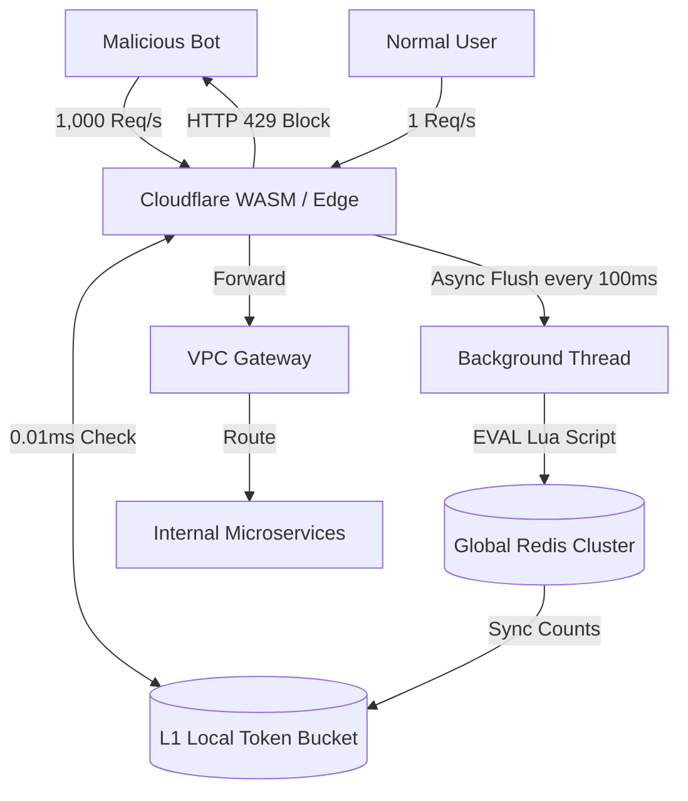

# Principal Engineer Interview: Distributed Rate Limiter

*Interviewer (Principal Engineer):* "Let's design a rate limiter to protect our APIs from scraping bots and DDoS attacks. Imagine an endpoint limited to 10 requests per minute per user. Let's start with the simplest approach."

---

## Level 1: The MVP (The Single Server Hack)

**Candidate:**
"I'll implement a middleware function directly in my application server (e.g., using Node.js or Spring Boot).
1. **Storage:** I'll use an in-memory hash map. The key is the `user_id`, and the value is a counter and a timestamp.
2. **Algorithm:** Fixed Window. When a request comes in, I check the map. If the timestamp is within the current minute, I increment the counter. If it exceeds 10, I return `HTTP 429 Too Many Requests`. If a new minute starts, I reset the counter."

**Interviewer (Math Check):**
"Okay. Your app is a hit. We scale from 1 server to **10 servers** behind a round-robin Load Balancer. 
A malicious user figures this out. They send 10 requests. The load balancer routes them to Server 1. They send another 10. Server 2 gets them. 
Your '10 per minute' limit actually allows the user to make **100 requests per minute** (10 servers * 10 limits). How do you fix the distributed state?"

**Candidate:**
"Ah, the state is isolated. I need to move the state out of the application memory and into a centralized datastore that all 10 servers can share."

---

## Level 2: The Scale-Up (Centralized Redis)

**Interviewer:** "Right. Walk me through the centralized approach."

**Candidate:**
"I will extract the rate limiting logic into an **API Gateway** (like Kong or Spring Cloud Gateway) sitting in front of the application servers.
1. **Storage:** I'll use a centralized **Redis Cluster**.
2. **Algorithm:** I'll still use Fixed Window, but implemented via Redis `INCR` and `EXPIRE`. The API Gateway makes a synchronous call to Redis for every incoming API request."

**Interviewer (Math & Concurrency Check):**
"Two problems here. First: **The Boundary Spike**. It's 11:59:59. A user sends 10 requests. Redis increments. At 12:00:01, the window resets. The user sends another 10 requests. They just made 20 requests in 2 seconds, potentially crashing the backend database.
Second: **Latency and Bottlenecks**. We have 100,000 QPS hitting the API Gateway. That means 100,000 synchronous network hops to Redis every second, adding 2-3ms to every single request, and requiring massive connection pools."

---

## Level 3: State of the Art (Principal / Uber Scale)

**Interviewer:** "Standard Redis rate limiting adds latency to the critical path and is vulnerable to boundary spikes. How do we build a SOTA zero-latency rate limiter?"

**Candidate:**
"We solve the algorithm, and then we solve the topology.

1. **The Algorithm (Token Bucket + Lua):** To fix the Boundary Spike, we abandon Fixed Windows and use the **Token Bucket** algorithm. We use **Redis Lua Scripts (`EVAL`)** to guarantee atomicity. The script reads the bucket, calculates how many tokens should have refilled based on the current millisecond, subtracts a token, and writes it back. This entirely smooths out traffic and eliminates concurrent race conditions.
2. **The Topology (Edge WASM):** To save infrastructure costs, we shouldn't even let malicious traffic reach our VPC. We push the rate limiting logic to the **Edge** using Cloudflare Workers or Envoy WebAssembly (WASM).
3. **Zero-Latency (Hybrid Soft-Limiting):** To eliminate the 2ms Redis network hop for legitimate traffic, we implement a **Local + Global Sync** architecture. 
   - The API Gateway (or Edge node) maintains an **L1 In-Memory Token Bucket**.
   - Incoming requests are instantly evaluated against local RAM (`0.01ms` latency).
   - Every 100ms, a background thread asynchronously flushes the local counts to the global Redis cluster to reconcile with the other nodes.
   - **Tradeoff:** This is 'Soft Limiting'. A highly coordinated distributed botnet might sneak 12 requests through before the 100ms global sync catches them. But for 99% of APIs, allowing 2 extra requests is vastly preferable to penalizing every legitimate user with 3ms of Redis latency."

**Interviewer:** "Brilliant. You pushed the compute to the Edge, smoothed the traffic with Token Bucket, and completely removed Redis from the synchronous critical path."

---

### SOTA Architecture Diagram

---

## Tradeoff Summary

| Decision | Chosen | Rejected | Why |
|----------|--------|----------|-----|
| Algorithm | Token Bucket | Fixed Window | Fixed Window: boundary spike allows 2× limit in 2× window seconds. Token Bucket: continuous refill, no window boundary. Burst allowance is intentional — a human opening the app triggers 5-10 parallel API calls. |
| Algorithm | Token Bucket | Sliding Window Log | Sliding Window: exact accuracy, but stores one timestamp per request in a sorted set. At 1M users × 60 req/min = 60M sorted set entries ≈ 6GB Redis. Token Bucket: 2 Redis keys per user ≈ 200 bytes total. |
| Atomicity | Redis Lua script (EVAL) | Multi-command pipeline | Pipeline: READ tokens → (race condition) → WRITE tokens. Two concurrent gateway instances both read "5 tokens", both allow, both write 4. Lua: entire read-calculate-write runs as one atomic Redis command. No interleaving possible. |
| Topology (SOTA) | Edge WASM + L1 hybrid | Centralized Redis only | Centralized Redis: every request pays 2ms network hop. At 100K QPS, 2ms × 100K = Redis becomes the bottleneck. Edge WASM: malicious traffic blocked before entering VPC (free). L1 hybrid: legitimate traffic checked at 0.01ms locally, synced to Redis every 100ms. Soft limit: may allow 2 extra requests per 100ms sync cycle — acceptable for 99% of APIs. |
| Failure mode | Fail open (allow on Redis down) | Fail closed (deny on Redis down) | Fail closed during Redis outage: ALL users get 429, app appears broken. Fail open: rate limiting temporarily disabled — some abuse risk, but users unaffected. Choose based on abuse risk vs availability requirements. |
