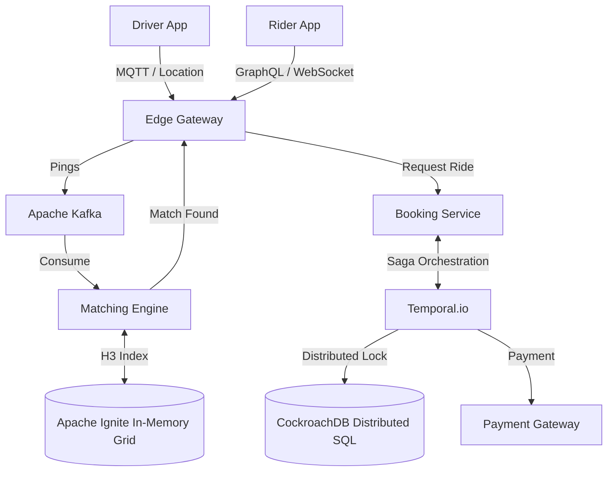

# Principal Engineer Interview: Uber Rides System Design

*Interviewer (Principal Engineer):* "Welcome. Today we're going to design the core of Uber Rides: Tracking driver locations and matching them to riders. I don't want to hear 'Kafka' and 'Microservices' right out of the gate. Let's start with how you'd build this in a weekend, do the math on why it breaks at scale, and gradually evolve it."

---

## Level 1: The MVP (The Weekend Hack)

**Candidate:** 
"For an MVP, I'd use a monolithic **PostgreSQL** database and a simple REST API. 
1. **Location Updates:** Drivers send their GPS coordinates via HTTP `POST /location` every 5 seconds. We update their row in the `Drivers` table.
2. **Matching:** Riders poll the server. We query the DB for `SELECT * FROM Drivers WHERE status='AVAILABLE' AND distance < X`.
3. **Booking:** We update the driver's status to `BOOKED`."

**Interviewer (Math Check):** 
"Okay, let's say we launch in one major city. We have **10,000 active drivers**.
Drivers ping every 5 seconds. That's `10,000 / 5 = 2,000 QPS` (Writes).
Riders are searching and polling. Let's say `1,000 QPS` (Reads).
What happens to your Postgres database?"

**Candidate:**
"At 2,000 write QPS, Postgres will start to suffer from row-level locking contention, especially if we are calculating geospatial math (Pythagorean theorem) on the fly for the 1,000 read QPS. The CPU will max out performing table scans for distance calculations. The DB will quickly fall over."

---

## Level 2: The Scale-Up (Standard Industry Pattern)

**Interviewer:** "Exactly. Your MVP melted down. How do we fix the location tracking and matching?"

**Candidate:**
"We pull the location data out of Postgres and move to an in-memory datastore like **Redis**.
1. **Location Tracking:** We use **Redis GEO** (`GEOADD`). It uses Geohashes under the hood. 
2. **Matching:** We use `GEORADIUS` to find nearby drivers in milliseconds.
3. **Communication:** Instead of riders HTTP polling every 5 seconds, we establish a **WebSocket** connection. When a driver is matched, we push the event down to the rider."

**Interviewer (Math & Concurrency Check):** 
"Much better. Now we are at global scale. **1 Million active drivers**. That's `200,000 QPS` of location updates globally. 
Furthermore, it's New Year's Eve. Two riders in Times Square request a ride at the exact same millisecond. They both hit your API, both query Redis, both see 'Driver A' is available. How do you prevent double-booking?"

**Candidate:**
"For the 200k QPS, a single Redis instance will die (Redis is single-threaded and taps out around ~100k ops/sec). We must **shard Redis geographically** (e.g., one cluster for NY, one for London). 
To prevent double-booking, we use **Optimistic Locking** (e.g., JPA `@Version` or Redis `WATCH`). The first transaction commits successfully. The second transaction fails with an exception, and we tell Rider 2 to retry."

---

## Level 3: State of the Art (Principal / Uber Scale)

**Interviewer:** 
"Sharding by geography creates 'Hot Shards'. Times Square on NYE will melt the NY shard while the Wyoming shard sits idle. And optimistic locking means throwing errors at users on NYE. Let's design the SOTA architecture."

**Candidate:**
"Understood. To handle global, spiky scale flawlessly, we move to the SOTA design:

1. **Ingestion & Buffering:** Drivers stream locations via **MQTT** (lightweight, handles cellular drops better than WebSockets). The Edge drops these pings directly into **Apache Kafka**. Kafka can absorb millions of QPS without breaking a sweat, acting as a shock absorber for the database.
2. **Geospatial Indexing (H3):** We drop Geohashes. They are squares, meaning diagonal distance calculations are flawed. We use Uber's **H3 (Hexagonal Grids)**. Every neighbor is equidistant.
3. **In-Memory Grids:** Background workers consume the Kafka stream and update a horizontally scalable, partitioned in-memory grid (like **Apache Ignite**). We shard by `driver_id` hash, not geography, to prevent hot shards.
4. **Saga Pattern & Distributed SQL:** To eliminate double-booking without throwing errors, we use **Temporal** to orchestrate a Saga. When Rider A and Rider B match the same driver, the lock is handled by a **Distributed SQL** database (like CockroachDB). If Rider B loses the lock, the Temporal workflow doesn't throw an error; it automatically catches the failure and silently queries the grid for the *next* best driver, ensuring Rider B gets a ride without ever seeing a failure screen."

**Interviewer:** "Spot on. You eliminated the DB bottleneck with Kafka, solved the hot shard problem, and drastically improved the user experience during high contention."

---

### SOTA Architecture Diagram



---

## Tradeoff Summary

| Decision | Chosen | Rejected | Why |
|----------|--------|----------|-----|
| Location store | Redis GEO | PostgreSQL/PostGIS | 200K writes/sec. Redis: 0.1ms/write in-memory. Postgres: 5ms/write + WAL I/O, needs 40+ nodes. Acceptable loss: locations reset in 5s on restart. |
| Location protocol | MQTT | HTTP POST | HTTP requires TCP handshake per request. MQTT is persistent connection — cheaper at 1M drivers. HTTP would DDoS your own gateway at scale. |
| Grid math | H3 Hexagons | Geohash squares | Hexagon: all 6 neighbors equidistant → uniform radius search. Square: diagonal neighbors are 41% farther than side neighbors → you must always query 9 squares instead of 7 hexagons. |
| Write ingestion | Kafka | Direct DB write | Kafka absorbs NYC-NYE spikes (50K pings/sec burst). Direct DB write blocks under spike; Kafka buffers and smooths. |
| Anti-double-booking | Temporal Saga + CockroachDB | Redis WATCH (optimistic locking) | Optimistic locking throws errors at users on contention. Temporal catches the lock failure and silently retries with the next driver — user never sees a failure screen. |
| DB sharding | Citus (DB-level) | Application-level sharding | App-level sharding requires custom routing logic in every query. Citus: connect to coordinator, write normal SQL, Citus routes transparently. Shard key: `user_id` for ride history locality. |
| In-memory grid | Apache Ignite | Redis Cluster | Redis Cluster shards by key hash — can't dynamically rebalance a single hot key. Ignite supports custom partitioning + dynamic cell splitting (Times Square → 7 sub-cells when > 10K entities). |

---

## Implementation Deep Dive

*Notes from building the local Uber mini-backend (see `apps/uber/STEPS_3.md` and `STEPS_5.md`).*

### What we built vs. SOTA

| Component | Our Implementation | SOTA Gap |
|-----------|-------------------|----------|
| Location ingestion | gRPC bidirectional stream → Redis GEOADD | Same protocol; Uber uses a proprietary location mesh |
| GEO index | Redis GEORADIUS | Same; Uber shards Redis by geohash cell |
| Ride storage | PostgreSQL + Citus (sharded by user_id) | Same sharding strategy |
| Driver matching | Nearest available via GEORADIUS | Uber uses ORTools/Hungarian algorithm for batched optimal matching |
| Live map push | WebSocket polling Redis GEORADIUS every 2s | Same; Uber uses 1s intervals with delta compression |
| Location service | Separate service (Port 8086) from Rides (8083) | Same architectural separation |

### Key numbers that drove the design

**Why separate Location Service from Rides:**
- Location updates: 1M drivers × 1 ping/5s = 200K writes/sec
- Ride bookings: ~10K/sec globally during peak
- Scale ratio: 20:1. They cannot share a service — location would starve rides of connections.
- Protocol difference: Location uses gRPC streaming (persistent HTTP/2 connection per driver). Rides uses REST (stateless). These can't coexist in one Spring Boot instance cleanly.
- Failure isolation: Location Service going down loses location data (recovers in 5s — next driver ping). Rides Service going down loses booking data (ACID, must not lose). Different durability requirements.

**Redis GEO vs PostgreSQL for location:**
- Postgres `UPDATE drivers SET lat=?, lng=? WHERE id=?` with PostGIS: 5-10ms per row (ACID locking, WAL write, index update)
- Redis GEOADD: 0.1ms per entry (in-memory, no WAL)
- At 200K writes/sec: Postgres needs 200K × 5ms = 1000 server-seconds/sec → ~1000 CPU cores just for location writes
- Redis: 200K × 0.1ms = 20 server-seconds/sec → 20 threads. 10x more efficient.

**GEORADIUS latency:**
- Redis GEORADIUS with 5km radius in a city: ~0.5ms
- WebSocket push every 2 seconds: 30 driver positions × 100 bytes JSON = 3KB per push per rider
- At 100K riders watching the map: 100K × 3KB = 300MB/s outbound from Location Service → need dedicated CDN/edge for WebSocket at scale

**Citus sharding by user_id:**
- All rides for user-X live on shard-Y: `SELECT * FROM rides WHERE user_id=X` → single shard query, no scatter
- Alternative: shard by driver_id. Then `SELECT * FROM rides WHERE user_id=X` would scatter to all shards.
- The most common query is ride history by user (customer support, in-app history). Shard key = user_id optimizes the common case.
- `drivers` is a reference table (replicated to all shards) because it's small (~1M rows) and needs to JOIN with rides on every booking.

### Design decisions explained by the code

**Why gRPC bidirectional stream for driver location:**
A driver sends a location update every 5 seconds. With REST: 1 HTTP connection open/close per update = 2 TCP handshakes + TLS handshake + HTTP/1.1 headers (~12KB) every 5 seconds per driver. With gRPC stream: 1 persistent HTTP/2 connection per driver, headers sent once, HPACK compressed subsequent frames (~50 bytes each). At 1M drivers: REST needs 200K connection establishments/sec; gRPC needs 0 (connections are persistent).

**WebSocket for rider map vs gRPC:**
Browsers and mobile apps have native WebSocket support. gRPC requires a grpc-web proxy for browsers. For rider-facing features (map), WebSocket is the right choice. For driver-to-service communication (location updates), gRPC is the right choice — drivers use a native SDK that can speak gRPC natively.

---

## Database Options Compared

### Ride Storage: Why PostgreSQL + Citus over the alternatives

Rides require ACID: a booking must atomically update the driver's status (BOOKED) and create the ride record. Money is involved (fare calculation). These constraints narrow the field significantly.

#### PostgreSQL vs MySQL vs TiDB vs CockroachDB vs Spanner

| Property | PostgreSQL + Citus | MySQL + Vitess | TiDB | CockroachDB | Google Spanner |
|----------|--------------------|----------------|------|-------------|----------------|
| ACID | Full | Full | Full (HTAP) | Full (serializable) | Full (external consistency) |
| Sharding | Citus extension (shard key in coordinator) | Vitess middleware layer (keyspace) | Built-in horizontal scaling | Built-in (range-based) | Built-in (globally distributed) |
| Compatibility | Standard SQL | MySQL SQL | MySQL protocol compatible | PostgreSQL compatible | Spanner SQL (subset) |
| Latency (local) | 1-5ms | 1-5ms | 2-10ms | 5-20ms (Raft consensus) | 5-100ms (multi-region TrueTime) |
| Multi-region writes | Via Citus replication (manual) | Via Vitess (complex) | Yes | Yes (primary region) | Yes (designed for it) |
| Operational complexity | Medium (Citus coordinator + workers) | High (Vitess topology + vtgate) | Low (single binary) | Low (single binary) | None (fully managed) |
| Vendor lock-in | None | None | None | None | High (GCP only) |
| Best for | Postgres teams who need sharding without rewriting | MySQL shops at Uber/YouTube scale | HTAP (mixed OLTP + analytics) | Global distributed ACID | Global writes where consistency > cost |

**Why Citus over Vitess:**
Vitess is a sharding middleware — it sits between your application and MySQL, routing queries. It requires you to run `vtgate`, `vttablet`, `etcd`, and `vtctld` as separate processes. Citus is a PostgreSQL extension — same binary, same `psql` client, same connection string. For a learning project (and honestly for most mid-size systems), Citus's simplicity wins. At Uber's actual scale, both are used in different parts of the stack.

**Why not CockroachDB for rides:**
CockroachDB's multi-region linearizable writes (via Raft consensus across 3+ nodes) add 5-20ms of write latency per transaction. At city scale (10K rides/sec), that's manageable. At Uber's NYC-NYE peak (50K bookings/sec), every millisecond of booking latency compounds. We use Citus on a single region and accept that cross-region ride booking goes through an API gateway that routes to the right region.

**Why not TiDB:**
TiDB supports HTAP (mixed OLTP and analytics in one system). Interesting, but it introduces complexity for a system where we already use Kafka → ClickHouse for analytics. Two analytics systems would be confusing.

#### Sharding key deep dive: user_id vs driver_id vs ride_id

```
OPTION A: Shard by user_id  ← we chose this
  Pros:
    - "Give me all rides for user X" → single shard query
    - Customer support (most common ops query) is fast
    - "My trips" screen in-app is fast
  Cons:
    - "Give me all rides for driver D today" → scatter to all shards
    - Operations dashboard (driver earnings) is slow without a secondary index

OPTION B: Shard by driver_id
  Pros:
    - Driver earnings query → single shard
    - Driver portal fast
  Cons:
    - Customer history → scatter-gather
    - User-facing queries slow

OPTION C: Shard by ride_id (random)
  Pros:
    - Perfectly even distribution (UUID hash)
  Cons:
    - EVERY query scatters to all shards
    - No locality for any access pattern
    - Only makes sense for write-only event logs

OPTION D: Dual-write (shard by user_id AND by driver_id)
  Pros:
    - Both user and driver queries are fast
  Cons:
    - Every ride write goes to 2 shards (synchronously)
    - Double the storage
    - Transactions across two shards require distributed commit
    - This is what Uber actually does for their billing system

Conclusion: Single shard key is always a compromise. Choose the shard key
that matches your highest-QPS, most latency-sensitive query pattern.
For user-facing apps: shard by user_id. For driver-ops: add a read replica
sharded by driver_id as an eventually consistent copy.
```

---

### Location Storage: Redis GEO vs the alternatives

Location is the highest-write-rate store in the system: 200K writes/sec, sub-second freshness required, ephemeral (losing 5 seconds of location is fine).

#### Redis GEO vs PostgreSQL/PostGIS vs Aerospike vs H3 + Cassandra

| Property | Redis GEO | PostgreSQL + PostGIS | Aerospike | H3 + Cassandra |
|----------|-----------|---------------------|-----------|----------------|
| Write throughput | ~100K ops/sec (single thread, scale via sharding) | ~5K-10K writes/sec (WAL, locking) | ~500K ops/sec (flash storage, multi-thread) | ~200K writes/sec (multi-master) |
| Radius search | `GEORADIUS` O(N+log(M)) where N=results | PostGIS ST_DWithin + index: ~5ms | Custom UDFs required | Pre-compute H3 cell, query by cell_id |
| Persistence | Optional (AOF/RDB) | Always (WAL) | Flash-backed (DRAM + SSD) | Always (Cassandra commitlog) |
| Data loss on crash | Up to 1s (AOF everysec) | None | None (flash-backed) | None |
| Operational complexity | Low | Low (same Postgres) | Medium | High (H3 grid management) |
| Cost | Low | Low | High | Medium |

**Why Redis GEO wins for us:**
Location data is ephemeral — if we lose 5 seconds of position, the next driver ping (every 5s) restores it. We don't need durability. We need sub-millisecond writes and sub-millisecond radius search. Redis delivers both. PostGIS requires full ACID overhead for data we're OK losing. Aerospike would work too and is what Uber actually uses for some location indexes (flash-backed = survives crashes, faster than Redis at scale).

**When PostGIS wins:**
If you need durable geospatial queries with complex polygon operations (geofencing, delivery zone boundaries, surge pricing zones), PostGIS is the right tool. These are low-write-rate, durable records — the opposite of driver pings.

**The H3 + Cassandra pattern (SOTA for Uber scale):**
Instead of storing (lat, lng) directly in Redis:
1. Convert driver position to H3 cell at resolution 8 (~460m edge length)
2. Store `driver_id` in a Cassandra partition keyed by `h3_cell_id`
3. On radius search: compute all H3 cells within radius → query each cell's partition

This gives: O(1) per-cell lookup (Cassandra partition key), horizontal scaling (each H3 cell is an independent Cassandra partition), geographic locality (Times Square's hot cell doesn't affect Brooklyn's cell). The downside: 460m hexagons mean you query the ring of surrounding cells too — ~7 cells for radius search vs Redis's single GEORADIUS command.

---

### The Double-Booking Problem: Locking Strategies Compared

Two riders request the same driver simultaneously. The system must:
1. Assign the driver to exactly one rider (no double-book)
2. Give the losing rider a new driver immediately (no error screens)
3. Handle this at 50K ride requests/second

| Strategy | Mechanism | Throughput | User experience | Data loss risk |
|----------|-----------|------------|-----------------|----------------|
| Pessimistic lock (DB `SELECT FOR UPDATE`) | DB row-level lock held during matching | Low (~500/sec, lock contention) | Good (no errors) | None |
| Optimistic lock (Redis WATCH / JPA @Version) | Read-modify-write with retry on conflict | Medium (~5K/sec) | Bad (StaleObjectException visible) | None |
| Redis SETNX (distributed lock) | `SET driver:{id}:lock 1 NX PX 5000` | High (~50K/sec) | Good | Lock key lost on Redis crash |
| Temporal Saga + CockroachDB | Workflow orchestrates lock + retry transparently | High (~50K/sec) | Best (retry is invisible) | None (CockroachDB ACID) |
| Partitioned matching (no lock needed) | Each matching pod owns a disjoint set of drivers | Highest | Best | None |

**Partitioned matching — how Uber actually avoids locking:**
Instead of one matching service competing for drivers, partition the driver space:
- Driver IDs 0-999999 → Matching Pod A
- Driver IDs 1000000-1999999 → Matching Pod B

Each pod owns its driver subset exclusively. No two pods ever try to assign the same driver. No lock needed — the partition IS the lock. This is the "actor model" pattern. Akka Cluster, Temporal, and AWS Step Functions can all implement it. The tradeoff: if Pod A dies, its drivers are temporarily unassignable until Pod A restarts or its drivers are redistributed.

