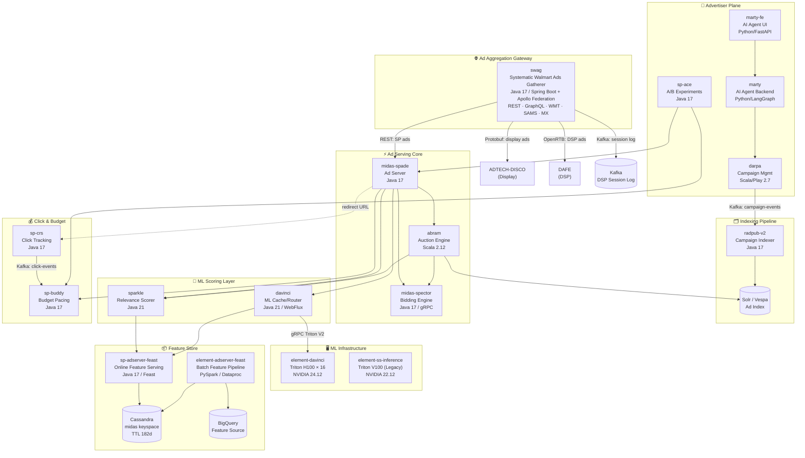
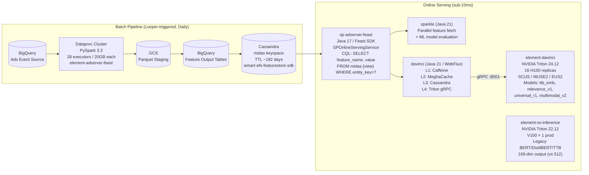
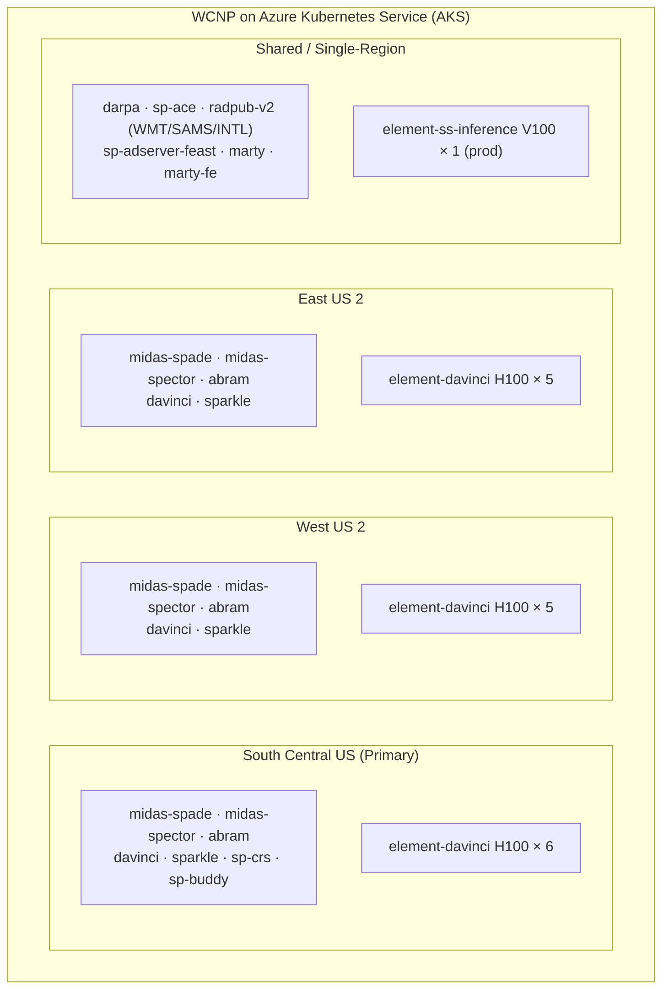

# Walmart Sponsored Products — Architecture Documentation Index

> **Scope:** 20 repos · 17 services + 3 infrastructure/ML layers · 5 deep-dive flows (TROAS, Ad Relevance, Feast, DaVinci, Darwin) · 1 team deep-dive (InSSPire)
> **Generated:** Wibey CLI — March 2026
> **Format:** Mermaid-compatible (Notion import ready)

---

## Document Index

| # | File | Title | Repos Covered |
|---|------|--------|---------------|
| 00 | [00-index.md](./00-index.md) | Master Index (this file) | all |
| 01 | [01-hld.md](./01-hld.md) | High-Level Design | all |
| 02 | [02-lld.md](./02-lld.md) | Low-Level Design | all |
| 03 | [03-marty-fe.md](./03-marty-fe.md) | AI Advertiser Agent (Frontend) | marty-fe |
| 04 | [04-marty.md](./04-marty.md) | AI Advertiser Agent (Backend) | marty |
| 05 | [05-darpa.md](./05-darpa.md) | Campaign Management Service | darpa |
| 06 | [06-sp-ace.md](./06-sp-ace.md) | A/B Experimentation Service | sp-ace |
| 07 | [07-sp-buddy.md](./07-sp-buddy.md) | Budget Service | sp-buddy |
| 08 | [08-sp-crs.md](./08-sp-crs.md) | Click Redirect Service | sp-crs |
| 09 | [09-radpub-v2.md](./09-radpub-v2.md) | Campaign Indexer / Publisher | radpub-v2 |
| 10 | [10-swag.md](./10-swag.md) | Ad Aggregation Gateway (SWAG) | swag |
| 11 | [11-midas-spade.md](./11-midas-spade.md) | Ad Server Orchestrator | midas-spade |
| 12 | [12-midas-spector.md](./12-midas-spector.md) | Sharded Bidding Engine | midas-spector |
| 13 | [13-abram.md](./13-abram.md) | Auction & Ad Matching | abram |
| 14 | [14-sparkle.md](./14-sparkle.md) | Relevance Scoring Service | sparkle |
| 15 | [15-davinci.md](./15-davinci.md) | ML Vector & Scoring Platform | davinci |
| 16 | [16-sp-adserver-feast.md](./16-sp-adserver-feast.md) | Online Feature Store (Feast) | sp-adserver-feast |
| 17 | [17-element-adserver-feast.md](./17-element-adserver-feast.md) | Batch Feature Engineering | element-adserver-feast |
| 18 | [18-element-davinci.md](./18-element-davinci.md) | Triton ML Inference (H100, Current) | element-davinci |
| 19 | [19-element-ss-inference.md](./19-element-ss-inference.md) | Triton ML Inference (V100, Legacy) | element-ss-inference |
| 20 | [20-e2e-scenarios.md](./20-e2e-scenarios.md) | End-to-End Scenarios | all |
| 21 | [21-troas-flow.md](./21-troas-flow.md) | TROAS E2E Flow | darpa, radpub-v2, swag, midas-spade, midas-spector, abram |
| 22 | [22-ad-relevance-flow.md](./22-ad-relevance-flow.md) | Ad Relevance Flow: Two-Tower BERT & DeBERTa | davinci, element-davinci, element-ss-inference, element-adserver-feast |
| 23 | [23-feast-design.md](./23-feast-design.md) | Feast Feature Store Design | sp-adserver-feast, element-adserver-feast |
| 24 | [24-davinci-deep-dive.md](./24-davinci-deep-dive.md) | DaVinci ML Platform Deep Dive | davinci, element-davinci |
| 25 | [25-darwin.md](./25-darwin.md) | Darwin: Ad Retrieval Service | darwin (ss-darwin-wmt) |
| 26 | [26-insspire-team.md](./26-insspire-team.md) | InSSPire Team: ML Inference Platform | sparkle, davinci, element-davinci, element-ss-inference, sp-adserver-feast |

---

## Platform Architecture Overview

---

## Service Summary

| Ch | Service | Repo | Language | Framework | Role | Key Storage | Kafka |
|----|---------|------|----------|-----------|------|-------------|-------|
| 03 | AI Agent Frontend | marty-fe | Python 3.11 | FastAPI + LangGraph 0.5 | Advertiser-facing AI agent clone | Azure SQL | — |
| 04 | AI Agent Backend | marty | Python 3.11 | FastAPI + LangGraph 0.5 | LLM agent, Argo/Walsa routing | Azure SQL | — |
| 05 | Campaign Mgmt | darpa | Scala 2.12 | Play 2.7 + Akka | Campaign CRUD, analytics, reporting | Oracle + Azure SQL | Producer |
| 06 | A/B Experimentation | sp-ace | Java 17 | Spring Boot 3.5.7 | Experiment lifecycle, bucket assignment | Azure SQL, EhCache | — |
| 07 | Budget Service | sp-buddy | Java 17 | Spring Boot 3.5.6 + Kafka Streams | Budget pacing, daily rollover | Azure SQL | Both |
| 08 | Click Redirect | sp-crs | Java 17 | Spring Boot 3.5.6 | Click dedup, redirect, SOX logging | Cassandra, Azure SQL | Producer |
| 09 | Campaign Indexer | radpub-v2 | Java 17 | Spring Boot 3.5.6 + Cloud Stream | Kafka → Solr/Vespa indexing | Cassandra, Solr, Vespa | Consumer |
| 10 | Ad Aggregation Gateway | swag | Java 17 | Spring Boot 3.5.0 + Apollo Federation 5.0 | Multi-tenant ad orchestration; REST + GraphQL fan-out to all ad engines | Cassandra, Memcached, Caffeine | Producer |
| 11 | Ad Server | midas-spade | Java 17 | Spring Boot 3.5.6 | Async ad serving orchestration | Cassandra, Azure SQL | Producer (log) |
| 12 | Bidding Engine | midas-spector | Java 17 | Spring Boot 2.6.6 + gRPC | Sharded bid computation | Azure SQL, Memcached | — |
| 13 | Auction Engine | abram | Scala 2.12 | Play 2.7 + Akka | TSP auction, ad matching | Azure SQL, Cassandra | Producer |
| 14 | Relevance Scorer | sparkle | Java 21 | Spring Boot 3.5.0 | ML relevance scoring | Cassandra, Feast | — |
| 15 | ML Cache/Router | davinci | Java 21 | Spring WebFlux | 4-level cache + Triton routing | Cassandra, MeghaCache | — |
| 16 | Online Feature Store | sp-adserver-feast | Java 17 + Python 3 | Spring Boot + Feast | Feast-backed Cassandra feature retrieval | Cassandra (midas ks) | — |
| 17 | Batch Feature Pipeline | element-adserver-feast | Python 3.11 | PySpark 3.3 + Feast | Batch feature engineering on Dataproc | BigQuery, GCS, Cassandra | — |
| 18 | ML Inference (Current) | element-davinci | Python 3 | Triton Server 24.12 | GPU inference on H100 (16 prod replicas) | Azure Blob (models) | — |
| 19 | ML Inference (Legacy) | element-ss-inference | Python 3 | Triton Server 22.12 | Legacy V100-based semantic search | Azure Blob (models) | — |

---

## ML Stack Deep-Dive

---

## Kafka Topic Map

| Topic | Producer | Consumer | Payload | Cluster |
|-------|----------|----------|---------|---------|
| campaign-events | darpa | radpub-v2 | Campaign CRUD protobuf | Standard |
| click-events | sp-crs | sp-buddy | ClickEvent protobuf | SOX (SCUS/WUSE2) |
| budget-events | sp-buddy | midas-spector | BudgetStatus | Standard |
| ad-serving-log-v1 | midas-spade | Analytics / downstream | AdServingRequest v1 | GCP Kafka |
| ad-serving-log-v2 | midas-spade | Analytics / downstream | AdServingRequest v2 | GCP Kafka |
| feature-log | abram | ML training pipelines | AdItemVariantScore | GCP Kafka |

---

## Key Storage Systems

| Store | Technology | Used By | Purpose |
|-------|-----------|---------|---------|
| Campaign DB | Azure SQL Server (JDBC 12.10.1) | darpa, sp-buddy, sp-ace, midas-spector | Transactional campaign data |
| Click Dedup Store | Cassandra 4.x | sp-crs | TTL-based deduplication (TTL 900s) |
| Feature Store | Cassandra 4.x (`midas` keyspace) | sp-adserver-feast → sparkle, davinci | ML features (TTL 182 days) |
| Ad Candidate Index | Solr + Vespa | radpub-v2 (write), abram (read) | Full-text ad candidate retrieval |
| Budget State | Azure SQL + Kafka Streams | sp-buddy | Real-time pacing, daily rollover |
| ML Cache | Cassandra + MeghaCache + Caffeine | davinci | 4-level cache (L1→L2→L3→L4) |
| Model Weights | Azure Blob Store (`ss-inference-models`) | element-davinci, element-ss-inference | Triton model repository |
| Feature Source | BigQuery | element-adserver-feast | Batch feature computation |
| Chat / Agent State | Azure SQL | marty, marty-fe | LLM session, chat history |
| Experiment State | Azure SQL + EhCache | sp-ace | Experiment lifecycle, buckets |

---

## Deployment Topology

---

## Configuration & Secrets

| System | Purpose | Used By |
|--------|---------|---------|
| CCM2 (Tunr / Strati AF) | Centralized config management | All Java / Scala services |
| Akeyless | Secrets vault (DB creds, API keys, Triton tokens) | All services |
| WCNP SR (sr.yaml) | Kubernetes deployment spec, rate limits, egress | All services |
| Concord | CI/CD pipeline orchestration | element-davinci, element-adserver-feast |
| Looper | Scheduled batch job triggers | element-adserver-feast |
| GTP Observability BOM | Metrics (Prometheus/Micrometer), tracing, logging | All services |

---

## Known Gaps & Assumptions

| # | Gap / Assumption | Status | Chapters |
|---|-----------------|--------|----------|
| 1 | darpa Oracle → Azure SQL migration complete? | Unknown | 05 |
| 2 | sp-buddy Kafka Streams full topology (sliding window details) | Assumed standard | 07 |
| 3 | midas-spector shard count in production | Assumed 4–8 | 12 |
| 4 | abram Darwin / AdGenie ML model source / training | Unknown | 13 |
| 5 | sparkle model training pipeline and cadence | Unknown | 14 |
| 6 | marty-fe planned divergence from marty (timeline) | No divergence yet | 03 |
| 7 | radpub-v2 full Vespa write-path (schema mapping) | Partially known | 09 |
| 8 | sp-crs multi-region Cassandra dedup consistency model | Assumed eventual | 08 |
| 9 | element-ss-inference retirement / migration date | Unknown — still deployed | 19 |
| 10 | element-davinci-automaton JMeter scenario coverage | Not documented | 18 |
| 11 | Cassandra cluster topology (nodes, RF, DC count) | Assumed 3-DC RF=3 | 15, 14, 16 |
| 12 | sp-buddy WAP-MX / WAP-CA feature parity with WMT | Assumed same | 07 |
| 13 | marty Argo vs Walsa agent routing decision criteria | Not fully documented | 04 |
| 14 | element-adserver-feast feature materialization frequency | Assumed daily via Looper | 17 |
| 15 | Multi-tenant feature repo (WMT vs WAP) schema differences | Partially known | 16 |
| 16 | swag tenant-routing logic for newer WMX Ads API path vs legacy midas-spade | Partially known | 10 |
| 17 | TROAS pCVR / pVPC Triton model training pipeline and retraining cadence | Unknown | 21 |
| 18 | TROAS Beta distribution α/β update mechanism (online learning vs batch) | Assumed batch | 21 |
| 19 | DeBERTa Java tokenizer CCM rollout status (deployed to prod?) | Unknown — design doc stage | 22, 24 |
| 20 | Feast Feature View full schema (all column names for SP production feature set) | Partially known | 23 |
| 21 | DaVinci offline cluster provisioning details (GPU count, Triton version) | Unknown | 24 |
| 22 | DaVinci model automation pipeline delivery status (WIP) | In progress | 24 |
| 23 | DeBERTa vs Cross Encoder A/B test results (CTR, CPMV delta) | Not documented | 22 |
| 24 | Darwin retrieval source weighting / blend ratio (Solr vs Vespa vs Polaris) | Partially known | 25 |
| 25 | Darwin `useDavinci` flag rollout percentage in production | Unknown | 25 |
| 26 | Pairwise ranking A/B outcome — revenue negative signal root cause | Under DS investigation | 26 |
| 27 | TTBv3 A/B neutral — ranker model revision timeline | In progress | 22, 26 |
| 28 | CVR model + CTR AdScore rollout date (multi-task model decision) | May 2026 target | 26 |
| 29 | InSSPire ML Automation Tool production delivery date | CARADS-41445 | 26 |

---

*Generated by Wibey CLI — `claude-sonnet-4-6-thinking` — March 2026*
