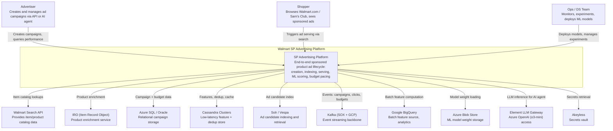
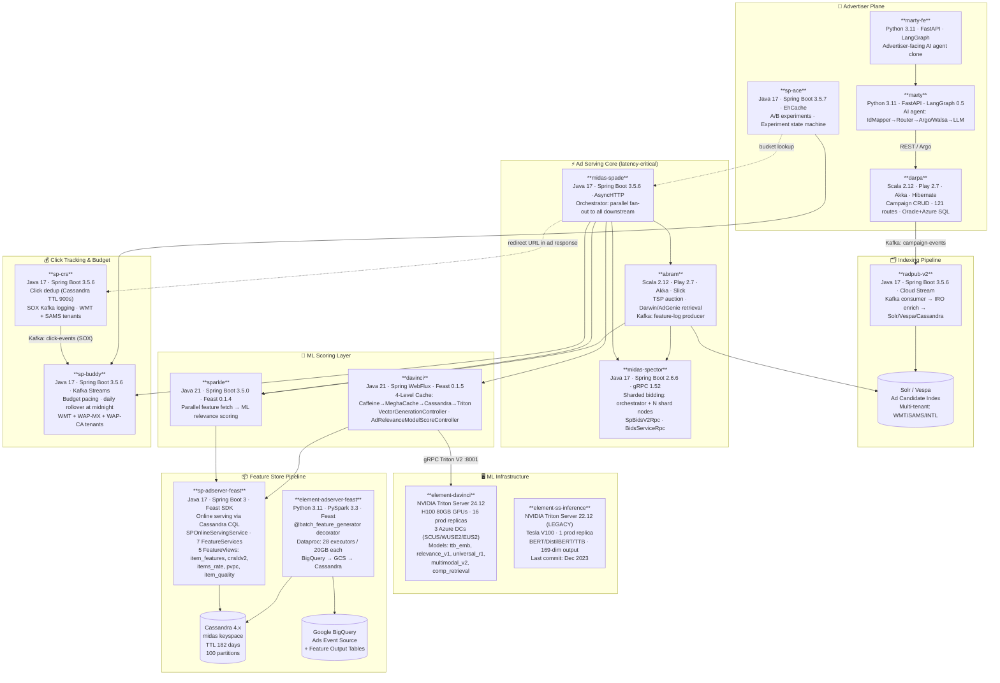
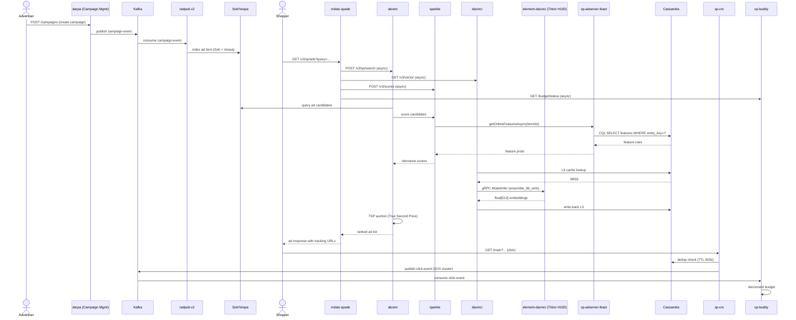
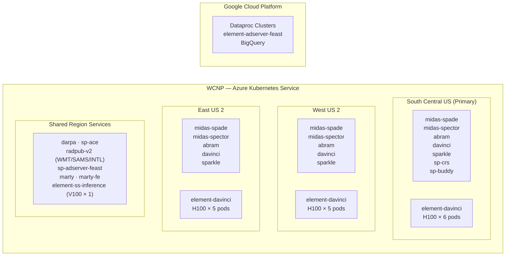

# High-Level Design — Sponsored Products Advertising Platform

## Executive Summary

This platform is a **full-stack Walmart Sponsored Products advertising system** enabling advertisers to create, manage, and optimize campaigns across Walmart.com, Sam's Club, and International properties. It spans 19 repos across 6 functional domains:

1. **Advertiser Tooling** — `darpa`, `sp-ace`, `marty`, `marty-fe`
2. **Ad Indexing** — `radpub-v2`
3. **Ad Serving Core** — `midas-spade`, `midas-spector`, `abram`
4. **ML Scoring** — `sparkle`, `davinci`
5. **ML Infrastructure** — `element-davinci`, `element-ss-inference`, `sp-adserver-feast`, `element-adserver-feast`
6. **Click & Budget** — `sp-crs`, `sp-buddy`

**Platform lifecycle (11 steps):**
1. Advertiser creates campaign (darpa / marty)
2. A/B experiment assigned (sp-ace → sp-buddy)
3. Campaign published to Kafka (darpa → campaign-events)
4. Ad indexed into Solr/Vespa (radpub-v2)
5. Shopper search triggers ad serving (midas-spade)
6. Bids computed (midas-spector, abram)
7. Candidates scored for relevance (sparkle, davinci)
8. ML inference on H100 GPUs (element-davinci via davinci)
9. Features fetched from Feast/Cassandra (sp-adserver-feast)
10. TSP auction selects winners (abram)
11. Shopper clicks → dedup → budget deducted (sp-crs → sp-buddy)

---

## C4 System Context Diagram

---

## Full Service Map

---

## Technology Matrix

| Service | Language | Framework | Port | Primary DB | Messaging | Key External |
|---------|----------|-----------|------|-----------|-----------|--------------|
| sp-ace | Java 17 | Spring Boot 3.5.7 | 8080 | Azure SQL | — | EhCache, Memcached |
| sp-crs | Java 17 | Spring Boot 3.5.6 | 8080 | Cassandra + Azure SQL | Kafka (SOX) producer | Hawkshaw (SOX) |
| sp-buddy | Java 17 | Spring Boot 3.5.6 | 8080 | Azure SQL | Kafka Streams (both) | sp-crs, sp-ace |
| darpa | Scala 2.12 | Play 2.7 + Akka | 9000 | Oracle + Azure SQL | Kafka producer | IRO, WPA, Azure Blob |
| radpub-v2 | Java 17 | Spring Boot 3.5.6 | 8080 | Cassandra + Solr | Kafka consumer | Vespa, IRO |
| midas-spade | Java 17 | Spring Boot 3.5.6 | 8080 | Cassandra + Azure SQL | Kafka producer (log) | abram, spector, sparkle, davinci |
| midas-spector | Java 17 | Spring Boot 2.6.6 | 8080/gRPC | Azure SQL + Memcached | — | abram (gRPC client) |
| davinci | Java 21 | Spring WebFlux | 8080 | Cassandra + MeghaCache | — | element-davinci (gRPC), sp-adserver-feast |
| sparkle | Java 21 | Spring Boot 3.5.0 | 8080 | Cassandra | — | sp-adserver-feast (Feast) |
| abram | Scala 2.12 | Play 2.7 + Akka | 9000 | Azure SQL + Cassandra | Kafka producer (GCP) | midas-spector (gRPC), sparkle, Solr |
| marty | Python 3.11 | FastAPI + LangGraph | 8000 | Azure SQL | — | LLM Gateway, darpa, MCP tools |
| marty-fe | Python 3.11 | FastAPI + LangGraph | 8000 | Azure SQL | — | LLM Gateway (same as marty) |
| sp-adserver-feast | Java 17 + Python 3 | Spring Boot + Feast SDK | 8080 | Cassandra (midas ks) | — | GCS (registry), Akeyless |
| element-adserver-feast | Python 3.11 | PySpark 3.3 + Feast | N/A (batch) | BigQuery + GCS | — | Dataproc, Looper, Concord |
| element-davinci | Python 3 | Triton Server 24.12 | 8000/8001/8002 | Azure Blob (models) | — | H100 GPU, Akeyless |
| element-ss-inference | Python 3 | Triton Server 22.12 | 8000/8001/8002 | Azure Blob (models) | — | V100 GPU (legacy) |

---

## Data Flow Overview

---

## Deployment Topology

---

## Config Management & Observability

| Concern | Solution | Details |
|---------|---------|---------|
| Config | CCM2 (Tunr / Strati AF BOM) | All Java/Scala; dynamic properties, per-env overrides |
| Secrets | Akeyless | DB creds, API keys, Triton auth tokens |
| Deployments | WCNP sr.yaml | Rate limits, replicas, egress routes, GPU requests |
| CI/CD | Concord (Walmart internal) | Element repos; Looper triggers batch jobs |
| Metrics | GTP Observability BOM (Micrometer + Prometheus) | All services; Grafana dashboards |
| Tracing | OpenTelemetry 1.49.0 | davinci, sparkle, element-davinci |
| API Docs | SpringDoc OpenAPI 2.3/2.6 | midas-spade, midas-spector, sparkle, davinci |
| Feature Registry | GCS (Feast registry path) | sp-adserver-feast; per-tenant prefix |

---

## Model Storage & Serving

| Artifact | Location | Loader | Notes |
|----------|---------|--------|-------|
| Triton models (H100) | `wasbs://ss-inference-models/.../prod_inference_models/` | Triton on startup | element-davinci; 7 model families |
| Triton models (V100) | `wasbs://ss-inference-models/.../triton_models_v1/` | Triton on startup | element-ss-inference; BERT/DistilBERT/TTB |
| Feast feature registry | `gs://...feast-registry/` | Feast SDK at startup | sp-adserver-feast; per-tenant GCS path |
| Batch feature output | BigQuery tables + GCS Parquet | PySpark job | element-adserver-feast; Looper triggered |

---

*Generated by Wibey CLI — `claude-sonnet-4-6-thinking` — March 2026*
