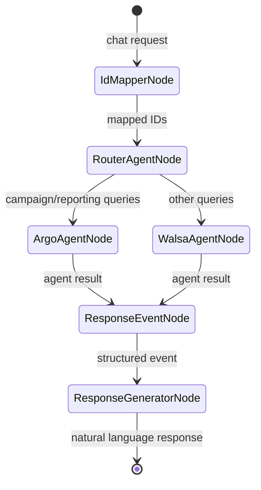
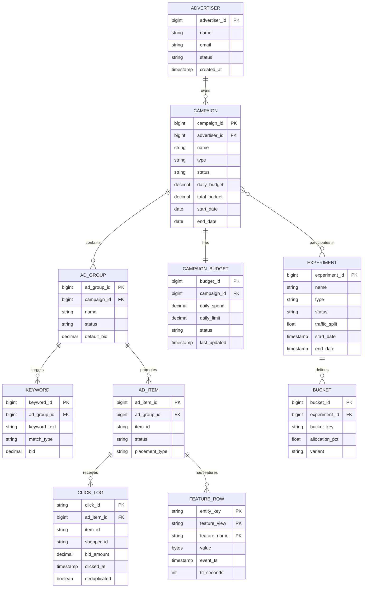
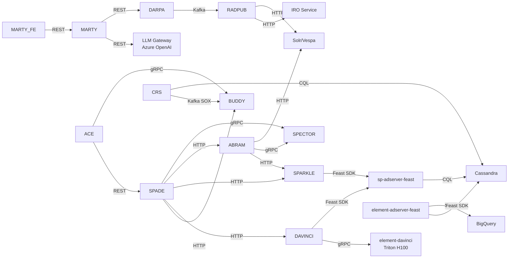

# Low-Level Design — Sponsored Products Advertising Platform

## Service Interaction Map

```mermaid
graph TD
    subgraph Advertiser["Advertiser Tooling"]
        MARTY_FE["marty-fe\nFastAPI :8000"]
        MARTY["marty\nFastAPI :8000\nLangGraph state machine"]
        DARPA["darpa\nPlay :9000\n121 REST routes"]
        ACE["sp-ace\nSpring :8080\n15 REST endpoints"]
    end

    subgraph Indexing["Indexing"]
        RADPUB["radpub-v2\nSpring Cloud Stream\nKafka consumer"]
    end

    subgraph Serving["Ad Serving Core"]
        SPADE["midas-spade\nSpring :8080\nAsync HTTP orchestrator"]
        SPECTOR["midas-spector\nSpring :8080\ngRPC server :9090\nOrchestrator + N shards"]
        ABRAM["abram\nPlay :9000\nTSP auction engine"]
    end

    subgraph ML["ML Scoring"]
        SPARKLE["sparkle\nSpring :8080\nML relevance scorer"]
        DAVINCI["davinci\nWebFlux :8080\n4-level cache chain"]
    end

    subgraph MLInfra["ML Infrastructure"]
        EL_DAV["element-davinci\nTriton :8000/:8001/:8002\nH100 × 16 prod"]
        EL_SS["element-ss-inference\nTriton :8000/:8001/:8002\nV100 × 1 prod (legacy)"]
    end

    subgraph Features["Feature Store"]
        FEAST_SVC["sp-adserver-feast\nSpring :8080\nFeast SDK"]
        FEAST_BATCH["element-adserver-feast\nPySpark batch\n(no REST)"]
    end

    subgraph ClickBudget["Click & Budget"]
        CRS["sp-crs\nSpring :8080\nClick dedup + redirect"]
        BUDDY["sp-buddy\nSpring :8080\nBudget pacing"]
    end

    subgraph Storage["Storage Systems"]
        AZURE_SQL[("Azure SQL\nCampaign/Budget/Exp DB")]
        CASSANDRA[("Cassandra 4.x\nmidas keyspace\n+ click dedup")]
        SOLR_VESPA[("Solr / Vespa\nAd Index")]
        MEGHA[("MeghaCache\nL2 vector cache")]
        BQ[("BigQuery\nFeature source")]
        GCS[("GCS\nFeast registry\n+ Parquet staging")]
        AZURE_BLOB[("Azure Blob\nModel weights")]
        ORACLE[("Oracle DB\ndarpa legacy")]
    end

    %% Advertiser flows
    MARTY_FE -->|"POST /chatmarty\nJSON"| MARTY
    MARTY -->|"REST bearer token\nLangGraph ArgoNode"| DARPA
    DARPA -->|"Kafka: campaign-events\nprotobuf"| RADPUB
    DARPA -->|"R/W JDBC"| AZURE_SQL
    DARPA -->|"R/W JDBC (legacy)"| ORACLE
    ACE -->|"R/W JPA"| AZURE_SQL
    ACE -->|"gRPC BuddyClient"| BUDDY
    ACE -->|"REST SpotlightClient"| SPADE

    %% Indexing
    RADPUB -->|"HTTP SolrClient"| SOLR_VESPA
    RADPUB -->|"REST IRO enrichment"| DARPA
    RADPUB -->|"CQL INSERT"| CASSANDRA

    %% Ad serving fan-out (all parallel async)
    SPADE -->|"gRPC SpBidsV2Rpc\nprotobuf"| SPECTOR
    SPADE -->|"HTTP /v3/sp/search\nJSON"| ABRAM
    SPADE -->|"HTTP /v3/scores\nprotobuf"| SPARKLE
    SPADE -->|"HTTP /v3/vector\nprotobuf"| DAVINCI
    SPADE -->|"HTTP /budget/status\nprotobuf"| BUDDY
    SPADE -->|"CQL R/W"| CASSANDRA

    %% Bidding
    SPECTOR -->|"R/W JDBC"| AZURE_SQL
    SPECTOR -->|"GET/SET"| MEGHA
    ABRAM -->|"HTTP SolrClient"| SOLR_VESPA
    ABRAM -->|"gRPC SpBidsV2Rpc"| SPECTOR
    ABRAM -->|"HTTP /v3/scores"| SPARKLE
    ABRAM -->|"R/W JDBC"| AZURE_SQL
    ABRAM -->|"CQL R/W"| CASSANDRA
    ABRAM -->|"Kafka: feature-log\nGCP brokers"| BQ

    %% Scoring
    SPARKLE -->|"getOnlineFeaturesAsync()\nFeast SDK"| FEAST_SVC
    SPARKLE -->|"CQL SELECT features"| CASSANDRA

    DAVINCI -->|"getOnlineFeaturesAsyncProto()\nFeast SDK"| FEAST_SVC
    DAVINCI -->|"CQL: L3 cache lookup/write"| CASSANDRA
    DAVINCI -->|"GET/SET: L2"| MEGHA
    DAVINCI -->|"gRPC ModelInfer\nTriton V2 proto"| EL_DAV

    %% Feature store
    FEAST_SVC -->|"CQL SELECT feature_name,value\nFROM midas.{view}\nWHERE entity_key=?"| CASSANDRA
    FEAST_SVC -->|"Read registry YAML"| GCS
    FEAST_BATCH -->|"spark.read.bigquery()"| BQ
    FEAST_BATCH -->|"spark.write.parquet()"| GCS
    FEAST_BATCH -->|"feast.materialize()\nwmart-efs-featurestore-sdk"| CASSANDRA

    %% Triton infra
    EL_DAV -->|"wasbs:// model load"| AZURE_BLOB
    EL_SS -->|"wasbs:// model load"| AZURE_BLOB

    %% Click/Budget
    CRS -->|"CQL dedup check TTL 900s"| CASSANDRA
    CRS -->|"Kafka: click-events SOX"| BUDDY
    CRS -->|"R/W JDBC"| AZURE_SQL
    BUDDY -->|"R/W JPA"| AZURE_SQL
    BUDDY -->|"Kafka Streams"| BUDDY
```



---

## API Contract Summary

### sp-ace — A/B Experimentation

| Method | Path | Description | Protocol | Auth |
|--------|------|-------------|----------|------|
| POST | /v1/adserving/experiments | Create experiment | REST/JSON | Bearer |
| GET | /v1/adserving/experiments/{id} | Get experiment | REST/JSON | Bearer |
| PUT | /v1/adserving/experiments/{id}/activate | Activate experiment | REST/JSON | Bearer |
| PUT | /v1/adserving/experiments/{id}/stop | Stop experiment | REST/JSON | Bearer |
| POST | /v1/budget/experiments | Create budget experiment | REST/JSON | Bearer |
| GET | /v1/budget/experiments/{id}/buckets | List buckets | REST/JSON | Bearer |
| POST | /v1/adserving/experiments/{id}/review | Submit for review | REST/JSON | Bearer |
| GET | /actuator/health | Health check | REST/JSON | None |

**Experiment State Machine:**
```
DRAFT → UNDER_REVIEW → APPROVED → RUNNING → PAUSED → COMPLETED
                                           ↓
                                         STOPPED
```

---

### sp-crs — Click Redirect Service

| Method | Path | Description | Protocol | Auth |
|--------|------|-------------|----------|------|
| GET | /track | Click tracking (primary) | REST | None (public) |
| GET | /sp/track | SP-specific click tracking | REST | None (public) |
| POST | /replay | Replay missed clicks | REST/JSON | Bearer |
| GET | /actuator/health | Health check | REST/JSON | None |
| GET | /actuator/prometheus | Metrics | REST | mTLS |

**Click Deduplication Flow:**
```
Shopper clicks → /track → Cassandra dedup (TTL 900s) →
  if NEW: Kafka click-event + redirect to product page
  if DUP: redirect to product page (no billing)
```

---

### sp-buddy — Budget Service

| Method | Path | Description | Protocol | Auth |
|--------|------|-------------|----------|------|
| GET | /v1/budgets/{campaignId} | Get budget status | REST/Protobuf | Bearer |
| PUT | /v1/budgets/{campaignId} | Update budget | REST/Protobuf | Bearer |
| GET | /v1/buckets/{experimentId} | Get budget buckets | REST/Protobuf | Bearer |
| POST | /v1/buckets/validate-splits | Validate split config | REST/JSON | Bearer |
| POST | /v1/spend-limits/{advertiserId} | Set spend limits | REST/Protobuf | Bearer |
| POST | /v1/replay/clicks | Trigger click replay | REST/JSON | Bearer |
| GET | /actuator/health | Health check | REST | None |

---

### darpa — Campaign Management

| Method | Path | Description | Protocol |
|--------|------|-------------|----------|
| POST | /api/v1/campaigns | Create campaign | REST/JSON |
| GET | /api/v1/campaigns/{id} | Get campaign | REST/JSON |
| PUT | /api/v1/campaigns/{id} | Update campaign | REST/JSON |
| DELETE | /api/v1/campaigns/{id} | Delete campaign | REST/JSON |
| POST | /api/v1/campaigns/{id}/adgroups | Create ad group | REST/JSON |
| POST | /api/v1/adgroups/{id}/keywords | Add keywords | REST/JSON |
| POST | /api/v1/adgroups/{id}/additems | Add ad items | REST/JSON |
| GET | /api/v1/campaigns/{id}/reports | Get performance report | REST/JSON |
| POST | /api/v1/media | Upload brand asset | REST/multipart |
| GET | /api/v1/snapshots/{id} | Get campaign snapshot | REST/JSON |
| POST | /api/v1/sba | Sponsored Brand Ads | REST/JSON |
| PUT | /api/v1/placement-multipliers | Set placement bids | REST/JSON |
| GET | /api/v1/alerts | Get daily budget alerts | REST/JSON |

---

### midas-spade — Ad Server Orchestrator

| Method | Path | Description | Protocol | Auth |
|--------|------|-------------|----------|------|
| POST | /v1/sp/getAds | SP ads v1 | REST/Protobuf | Bearer |
| POST | /v2/sp/getAds | SP ads v2 | REST/Protobuf | Bearer |
| POST | /v3/sp/getAds | SP ads v3 (current) | REST/Protobuf | Bearer |
| POST | /v1/sb/getAds | SB (Sponsored Brand) | REST/Protobuf | Bearer |
| POST | /v1/sv/getAds | SV (Sponsored Video) | REST/Protobuf | Bearer |
| POST | /v1/fs/getAds | FS (Featured Seller) | REST/Protobuf | Bearer |
| POST | /v1/2pa/getAds | 2PA (2nd Party Audience) | REST/Protobuf | Bearer |
| POST | /admin/cache/bulkEvict | Evict cache entries | REST/JSON | Internal |
| GET | /actuator/health | Health | REST/JSON | None |

---

### midas-spector — Bidding Engine

| Method / Service | Path / RPC | Description | Protocol |
|-----------------|-----------|-------------|----------|
| POST | /v8/sp/getAds | SP bid retrieval v8 | REST/Protobuf |
| POST | /v7/sp/getAds | SP bid retrieval v7 | REST/Protobuf |
| POST | /v1P13N/sp/getAds | Personalized bids | REST/Protobuf |
| gRPC | SpBidsV2Rpc/GetBids | Sharded bid computation | gRPC/Protobuf |
| gRPC | BidsServiceRpc/GetBids | Legacy bid service | gRPC/Protobuf |
| gRPC | HealthGrpc/Check | gRPC health check | gRPC |

**Shard Pattern:**
```
Orchestrator node → parallel gRPC to N shard nodes
Each shard: MySQL/Azure SQL → Memcached → bid logic
Orchestrator: merge results → budget filter → return
```

---

### davinci — ML Vector & Scoring Platform

| Method | Path | Description | Protocol |
|--------|------|-------------|----------|
| POST | /v3/vector | Generate item embeddings | REST/Protobuf |
| POST | /v3/vector/asJson | Embeddings as JSON | REST/JSON |
| POST | /v2/scores | Compute relevance scores | REST/Protobuf |
| POST | /v2/scores/asJson | Scores as JSON | REST/JSON |
| GET | /v2/models/{modelId}/feature-definitions | Feature defs | REST/JSON |
| POST | /admin/cache/evict | Evict cache entries | REST/JSON |
| GET | /actuator/health | Health check | REST/JSON |

**4-Level Cache Chain:**
```
Request → L1 Caffeine (in-process, μs)
        → MISS → L2 MeghaCache (distributed, <1ms)
        → MISS → L3 Cassandra (multi-region, ~2ms)
        → MISS → L4 Triton gRPC (H100, ~10ms)
                 → write-back L3, L2, L1
```

**Triton DC Routing (Production):**

| Region | Triton Endpoint | Pods |
|--------|----------------|------|
| South Central US | `ss-davinci-wmt-scus.walmart.com:8001` | 6 |
| West US 2 | `ss-davinci-wmt-wuse2.walmart.com:8001` | 5 |
| East US 2 | `ss-davinci-wmt-eus2.walmart.com:8001` | 5 |

---

### sparkle — Relevance Scoring Service

| Method | Path | Description | Protocol |
|--------|------|-------------|----------|
| POST | /v3/scores | Score ad candidates | REST/Protobuf |
| POST | /v3/scoresAsJson | Scores as JSON | REST/JSON |
| GET | /v2/models/{modelId}/feature-definitions | Feature definitions | REST/JSON |
| POST | /admin/cache/evict | Evict cache | REST/JSON |
| GET | /actuator/health | Health | REST/JSON |

---

### abram — Auction Engine

| Method | Path | Description | Protocol |
|--------|------|-------------|----------|
| POST | /v3/sp/search | SP ad search + TSP auction | REST/Protobuf |
| POST | /v3/sng/search | SNG ad search | REST/Protobuf |
| POST | /v3/sb/search | SB ad search | REST/Protobuf |
| POST | /v3/sv/search | SV ad search | REST/Protobuf |
| POST | /v3/sd/search | SD ad search | REST/Protobuf |
| POST | /v3/fs/search | FS ad search | REST/Protobuf |
| GET | /health | Health check | REST/JSON |

**TSP Auction Flow:**
```
1. Retrieve ad candidates from Solr (Darwin/AdGenie)
2. Enrich with bids from midas-spector (gRPC)
3. Score relevance via sparkle
4. Compute pCTR × relevance score (ML signals)
5. Run True Second Price (TSP) auction
6. Apply budget eligibility filter (sp-buddy)
7. Return ranked ad list + feature log → Kafka
```

---

### marty — AI Advertiser Agent

| Method | Path | Description | Protocol |
|--------|------|-------------|----------|
| POST | /chatmarty | Chat with AI agent | REST/JSON + SSE |
| GET | /ask_weather | Weather tool (MCP demo) | REST/JSON |
| GET | /ask_echo | Echo tool (MCP demo) | REST/JSON |
| GET | /health | Health check | REST/JSON |

**LangGraph Workflow:**


---

### sp-adserver-feast — Online Feature Store

| Java Method | Description | Protocol |
|-------------|-------------|----------|
| `getOnlineFeaturesAsync(String entityId, String featureService)` | Async feature retrieval | Java Feast SDK |
| `getOnlineFeaturesAsyncProto(String id, String service)` | Protobuf response | Java Feast SDK |
| `getOnlineFeaturesForTenantAsyncProto(String id, String service, String tenant)` | Multi-tenant retrieval | Java Feast SDK |
| `getServiceNamesForFeatures(List<String> featureNames)` | Feature → service mapping | Java internal |
| `getEntityNames(String featureService)` | Entity names for service | Java internal |

**Registered FeatureViews:**
- `item_features` — item-level ML signals
- `cnsldv2_features` — consolidated v2 features
- `items_rate_features` — CTR/CVR rate features
- `pvpc_features` — price/value/position/category features
- `item_quality_features` — item quality signals

**Registered FeatureServices (7):**
- `ad_relevance_model_features`
- `universal_r1_ensemble_model_relevance_v1`
- `complementary_compatibility_ensemble_model_v5`
- (+ 4 additional services)

**Cassandra CQL Pattern:**
```sql
SELECT feature_name, value, event_ts
FROM midas.{featureViewName}
WHERE entity_key = ?
  AND feature_name IN ?
```

---

### element-davinci — Triton Inference Server

| Endpoint | Port | Protocol | Description |
|----------|------|----------|-------------|
| `/v2/health/ready` | 8000 | HTTP | Server readiness |
| `/v2/models/{model}/infer` | 8000 | HTTP | Model inference |
| `ModelInfer` RPC | 8001 | gRPC | Model inference (primary) |
| `/metrics` | 8002 | HTTP | Prometheus metrics |

**Registered Models:**
| Model | Type | Output | Notes |
|-------|------|--------|-------|
| `ensemble_ttb_emb` | Ensemble | float[512] | Text → embedding, current |
| `ensemble_ttb_emb_v2_2` | Ensemble | float[512] | v2.2 variant |
| `ensemble_model_relevance_v1` | Ensemble | float[1] | Relevance score |
| `universal_r1_ensemble_model_relevance_v1` | Ensemble | float[1] | Universal R1 |
| `search_page_comp_retrieval` | Python backend | vector | Complement retrieval |
| `multimodal_v2_ensemble_model` | Ensemble | float[512] | CLIP multimodal |
| `item_middle_retrieval_tokenizer` | Python | tokens | Tokenizer stage |

---

## Entity-Relationship Data Model



---

## Dependency Graph



---

## Protocol Reference

| Caller | Callee | Protocol | Serialization | Auth |
|--------|--------|----------|---------------|------|
| marty-fe | marty | HTTPS REST | JSON | Bearer token |
| marty | darpa | HTTPS REST | JSON | Bearer (DARPA token) |
| marty | LLM Gateway | HTTPS REST | JSON | Akeyless API key |
| darpa | Kafka | Kafka producer | Protobuf | SPIFFE mTLS |
| radpub-v2 | Kafka | Kafka consumer | Protobuf | SPIFFE mTLS |
| radpub-v2 | Solr | HTTP | JSON | Basic auth |
| radpub-v2 | Vespa | HTTP | JSON | Bearer |
| midas-spade | midas-spector | gRPC | Protobuf (SpBidsV2Rpc) | mTLS |
| midas-spade | abram | HTTPS REST | Protobuf | Bearer |
| midas-spade | sparkle | HTTPS REST | Protobuf | Bearer |
| midas-spade | davinci | HTTPS REST | Protobuf | Bearer |
| midas-spade | sp-buddy | HTTPS REST | Protobuf | Bearer |
| abram | midas-spector | gRPC | Protobuf (SpBidsV2Rpc) | mTLS |
| abram | sparkle | HTTPS REST | Protobuf | Bearer |
| abram | Solr | HTTP | JSON | Basic auth |
| sparkle | sp-adserver-feast | Java Feast SDK | Protobuf | Cassandra credentials |
| davinci | sp-adserver-feast | Java Feast SDK | Protobuf | Cassandra credentials |
| davinci | element-davinci | gRPC Triton V2 | Protobuf | Bearer (tritonAuthToken) |
| sp-adserver-feast | Cassandra | CQL (native) | Binary | Username/Password (Akeyless) |
| sp-crs | Cassandra | CQL (native) | Binary | Username/Password |
| sp-crs | Kafka (SOX) | Kafka producer | Protobuf | SPIFFE workload identity |
| sp-buddy | Kafka | Kafka Streams | Protobuf | SPIFFE mTLS |

---

*Generated by Wibey CLI — `claude-sonnet-4-6-thinking` — March 2026*
