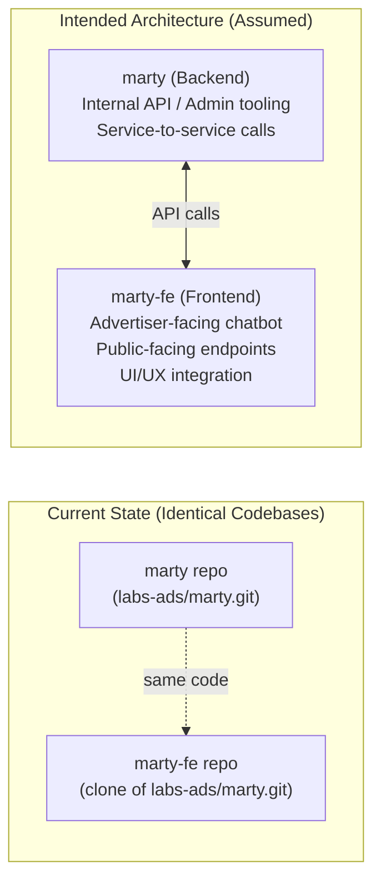
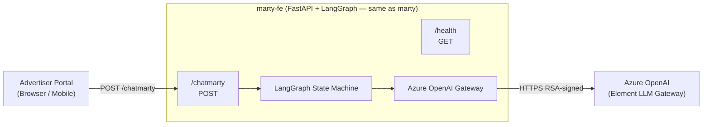
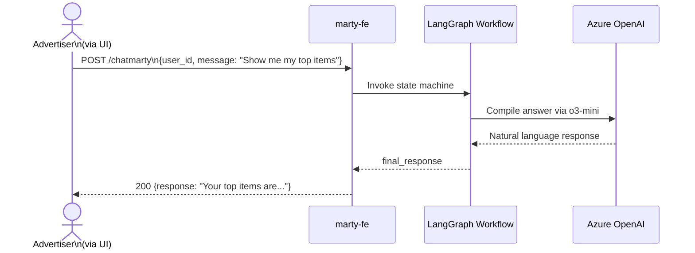

# Chapter 3 — marty-fe (AI Advertiser Agent — Frontend Interface)

## 1. Overview

**marty-fe** is the **frontend-facing variant** of the marty AI agent. As of the current codebase analysis, `marty-fe` is a duplicate clone of `marty` (shares identical git origin: `https://gecgithub01.walmart.com/labs-ads/marty.git` and commit history). This suggests it is intended to serve as the user-facing deployment of the AI agent layer, potentially with a distinct deployment configuration, feature flags, or routing rules for production front-end traffic vs. internal/API traffic.

**Important note:** All technical implementation details are identical to `marty` (Chapter 4). This chapter documents the intended differentiation and any deployment-specific notes.

---

## 2. Current State vs. Intended Architecture

---

## 3. Differentiation Factors (Assumed / Expected)

| Aspect | marty | marty-fe |
|--------|-------|----------|
| **Traffic source** | Internal / service-to-service | Advertiser-facing (UI) |
| **Auth** | Service Registry (server-to-server) | Service Registry (user-delegated) |
| **WCNP namespace** | `unified-ads` | `unified-ads` (TBD) |
| **Rate limits** | Internal SLA | Consumer-grade SLA |
| **Feature flags** | Full feature set | User-safe feature set |
| **MCP tools** | Full toolchain | Filtered tools |

---

## 4. Architecture (Shared with marty)

---

## 5. API / Interface

Identical to marty (see Chapter 4):
- `POST /chatmarty`
- `GET /ask_weather`
- `GET /health`

---

## 6. Data Flow (Identical to marty)

---

## 7. Notes

- **Code parity:** Until divergence occurs, marty-fe mirrors marty exactly
- **Future differentiation:** The FE variant is expected to handle UI-specific concerns (session management, persona customization, chat history persistence)
- **Recommendation:** Consider splitting `marty-fe` into its own dedicated repo once it diverges with FE-specific logic (React frontend, WebSocket support, or BFF pattern)

For all implementation details, refer to **Chapter 4 — marty**.
