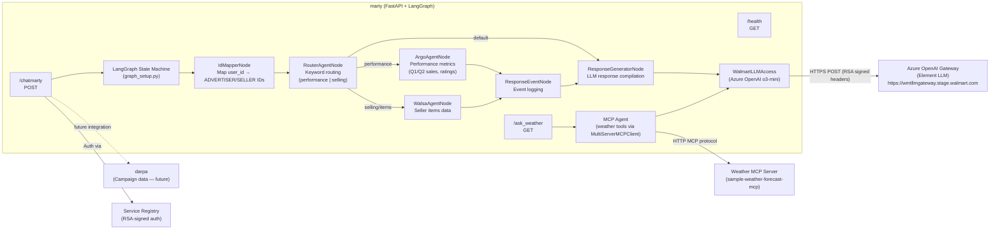
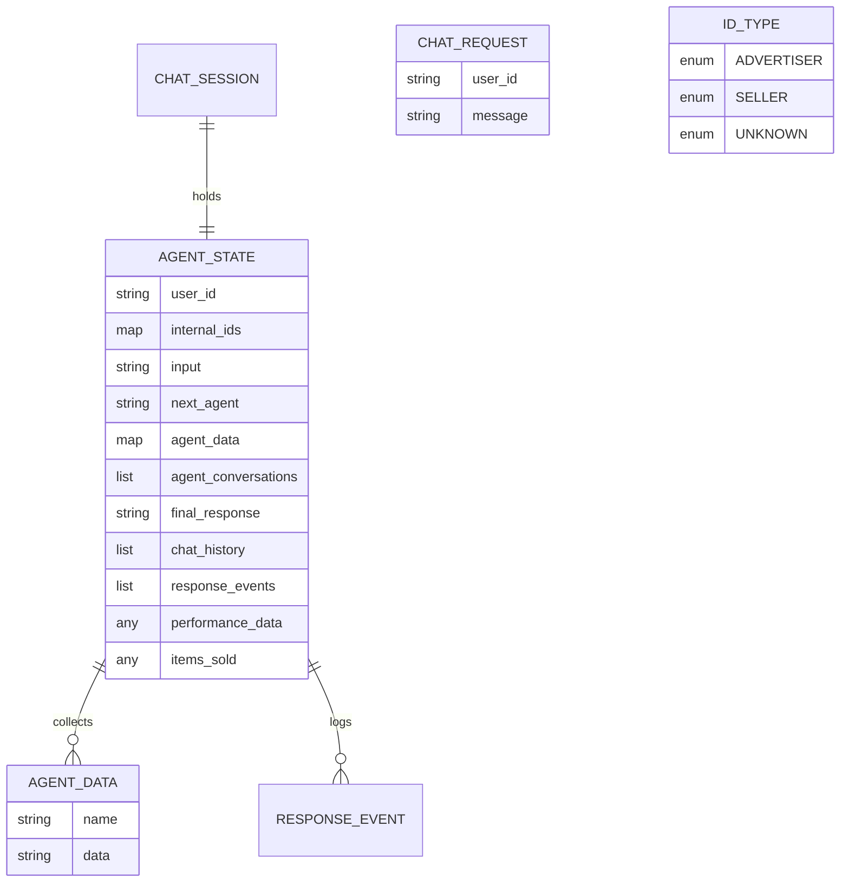
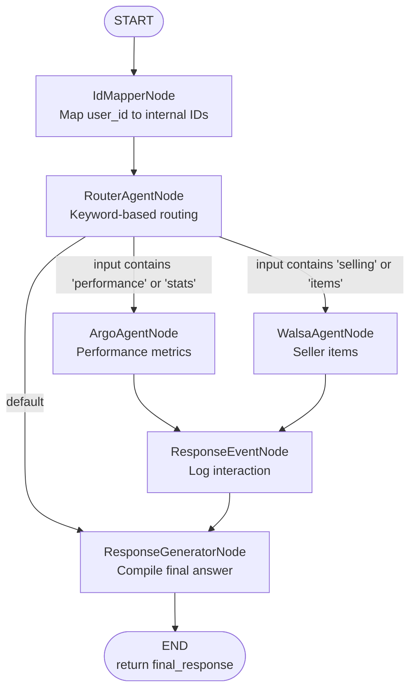
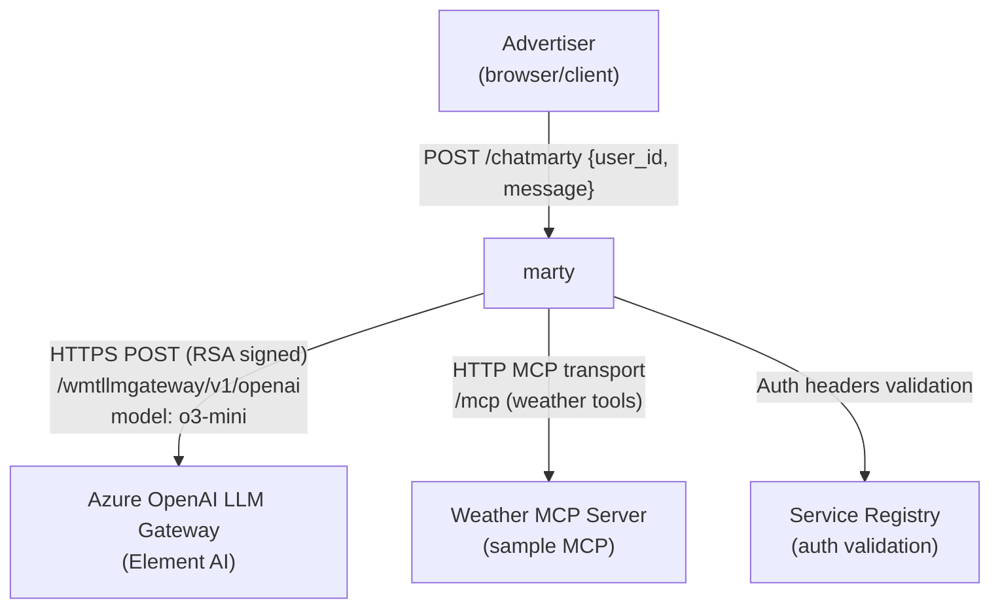
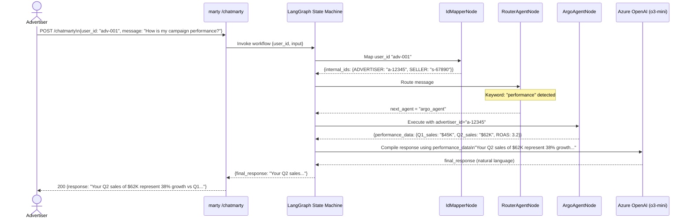

# Chapter 4 — marty (AI Advertiser Agent)

## 1. Overview

**marty** is an **AI-powered conversational agent** for Walmart advertisers. Built on LangGraph and Azure OpenAI (via Walmart's Element LLM Gateway), it allows advertisers to query their campaign performance, item sales data, and other insights using natural language. It uses a state machine workflow to route queries to specialized sub-agents (Argo for performance metrics, Walsa for seller/items data).

- **Domain:** AI Conversational Interface for Advertisers
- **Tech:** Python 3.11, FastAPI, LangGraph 0.5+, LangChain 0.3+, Azure OpenAI (o3-mini)
- **WCNP Namespace:** `unified-ads`
- **Port:** 8080
- **DNS:** `marty.dev.labs-ads.walmart.com`

---

## 2. Architecture Diagram

---

## 3. API / Interface

| Method | Path | Auth | Request | Response |
|--------|------|------|---------|----------|
| POST | `/chatmarty` | Service Registry | `{user_id: str, message: str}` | `{response: str}` |
| GET | `/ask_weather` | Service Registry | `?city=<city>` | `{weather_data}` |
| POST | `/ask_echo` | Service Registry | Any JSON body | Echo body |
| GET | `/health` | None (local) | — | `{status: "ok"}` |

**Service Registry Headers (prod):**
- `WM_CONSUMER.ID` — Consumer ID
- `WM_SVC.NAME: APM0009468-MARTY`
- `WM_SEC.AUTH_SIGNATURE` — RSA-PKCS1-SHA256 signed
- `WM_SEC.TIMESTAMP`

---

## 4. Data Model (In-Memory State)

---

## 5. LangGraph Workflow

---

## 6. Inter-Service Dependencies

---

## 7. Configuration

| Config Key | Description |
|-----------|-------------|
| `weather_mcp_url` | MCP server URL for weather tools |
| `/etc/secrets/dev/llmgateway-api-key` | API key for LLM Gateway |
| `SSL_CERT_FILE` | Walmart CA bundle path |
| `APM0009468-MARTY` | Service Registry application key |
| `runtime.context.appName` | `marty` |

**Akeyless secret path:** `/Prod/WCNP/homeoffice/GEC-LabsAccessWPA` → `dev/llmgateway-api-key`

---

## 8. Example Scenario — Advertiser Queries Performance

