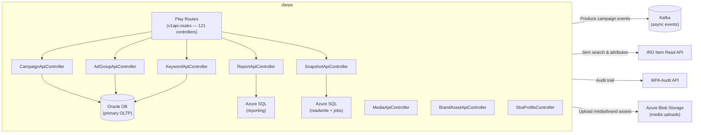
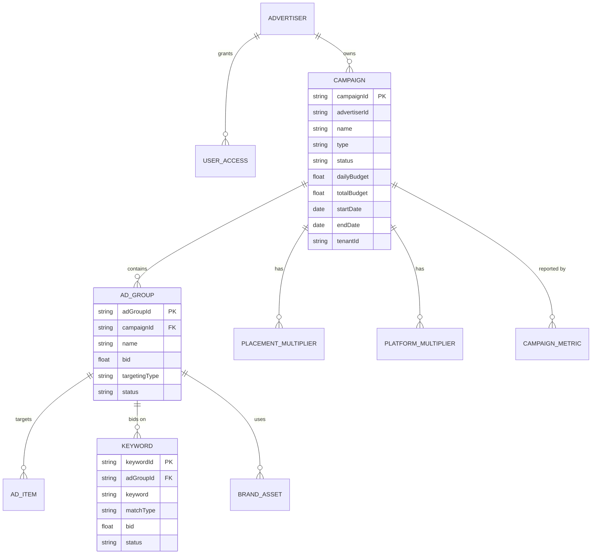
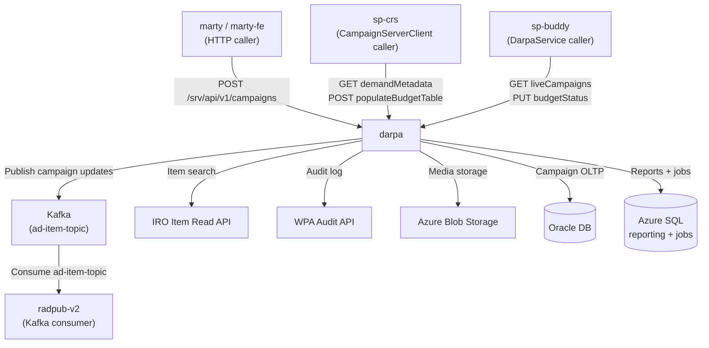
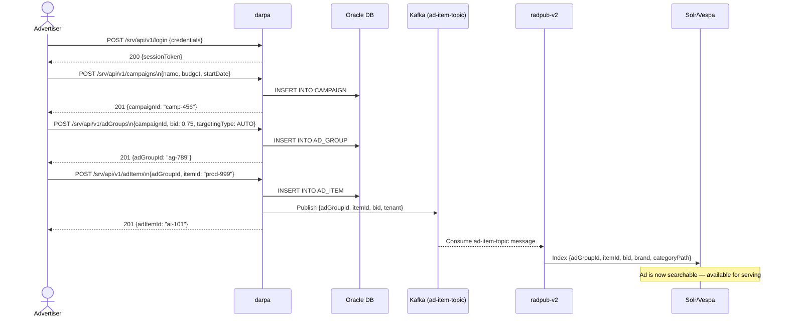

# Chapter 5 — darpa (Campaign Management Service)

## 1. Overview

**darpa** (Dashboard for Ads Revenue & Performance Analysis) is the primary campaign management API for Walmart Sponsored Products. Advertisers use it to create and manage campaigns, ad groups, keywords, bids, media, and brand assets. It also drives reporting, analytics, and async snapshot generation.

- **Domain:** Campaign Lifecycle Management & Reporting
- **Tech:** Java + Scala 2.12, Play Framework 2.2, Akka, Hibernate, SBT
- **WCNP Namespace:** `midas-darpa`
- **Port:** 8080

---

## 2. Architecture Diagram

---

## 3. API / Interface

| Method | Path | Description |
|--------|------|-------------|
| POST | `/srv/api/v1/login` | Advertiser authentication |
| POST | `/srv/api/v1/campaigns` | Create campaign |
| GET | `/srv/api/v1/campaigns` | List campaigns |
| PUT | `/srv/api/v1/campaigns` | Update campaign |
| PUT | `/srv/api/v1/campaigns/delete` | Delete campaign |
| POST | `/srv/api/v1/adGroups` | Create ad group |
| GET | `/srv/api/v1/adGroups` | List ad groups |
| POST | `/srv/api/v1/keywords` | Create keywords |
| GET | `/srv/api/v1/keywords` | List keywords |
| GET | `/srv/api/v1/keyword_suggestions` | Keyword suggestions |
| POST | `/srv/api/v1/adItems` | Create ad items |
| GET | `/srv/api/v1/adItems` | List ad items |
| GET | `/srv/api/v1/reports/by_day` | Daily performance report |
| GET | `/srv/api/v1/reports/by_adgroup` | Ad group report |
| GET | `/srv/api/v1/reports/by_item` | Item-level report |
| POST | `/srv/api/v1/snapshot/report` | Async report snapshot |
| GET | `/srv/api/v1/snapshot` | Get snapshot results |
| POST | `/srv/api/v1/media/upload` | Upload creative media |
| POST | `/srv/api/v1/brand_assets` | Create brand asset |
| POST | `/srv/api/v1/sba_profile` | Create Search Brand Amplifier profile |
| POST/GET/PUT | `/srv/api/v1/multipliers/placement` | Placement bid multipliers |

---

## 4. Data Model

---

## 5. Inter-Service Dependencies

---

## 6. Configuration

| Config Key | Description |
|-----------|-------------|
| `runOnEnv` | Runtime environment (dev, prod) |
| `apiEndPoint` | Self-referential API endpoint |
| `normalize-query-context.parallelism` | Query normalization threads (4) |
| `kafka-context` | Kafka dispatcher configuration |
| `azure-job-context` | Background job thread context |
| `bigquery-job-context` | BigQuery async jobs |
| `graphite.app.enableMetrics` | Enable Graphite metrics (false) |

---

## 7. Example Scenario — Advertiser Creates a Sponsored Product Campaign

