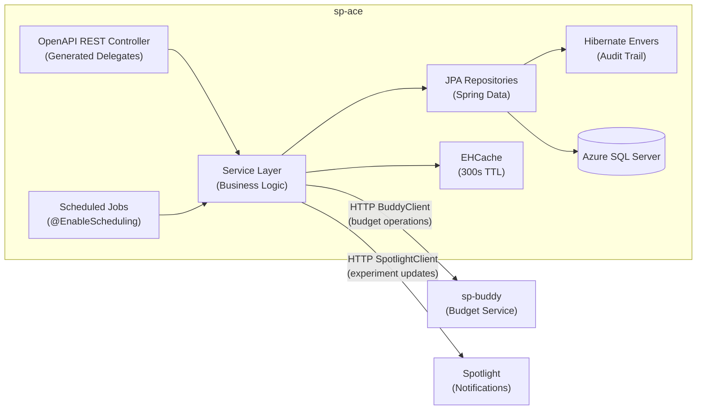
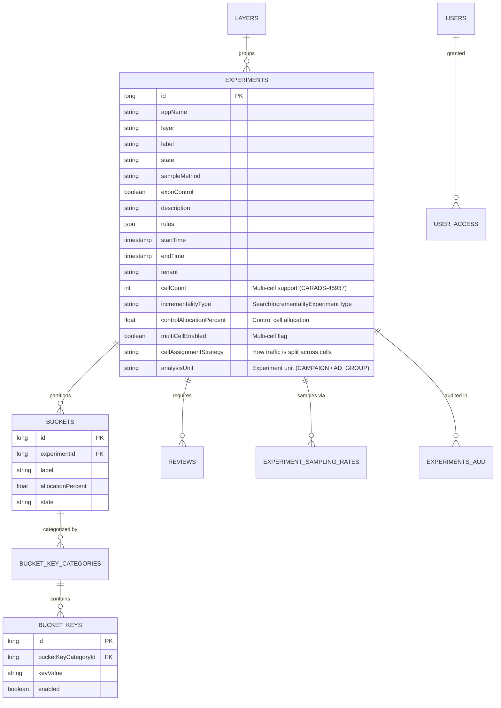
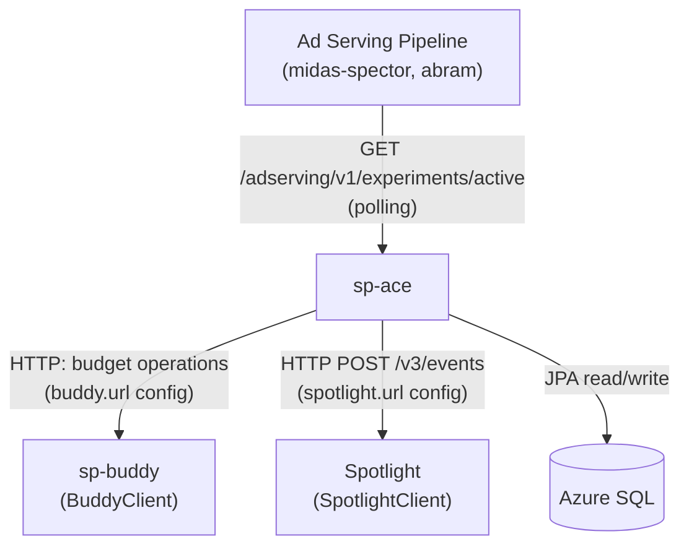
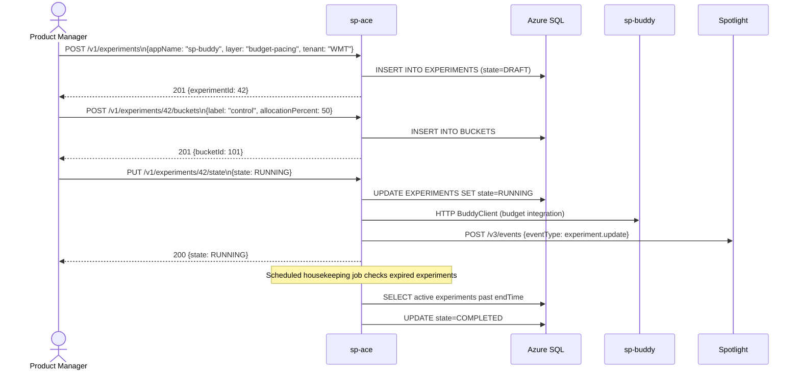
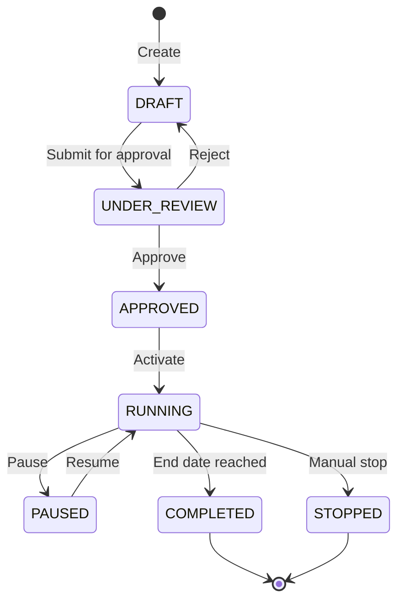

# Chapter 6 — sp-ace (Advertising Controlled Experimentation)

## 1. Overview

**sp-ace** is Walmart's A/B testing platform for the Sponsored Products advertising stack. It enables controlled experimentation across the entire ad serving pipeline — from budget pacing to auction logic — by partitioning campaigns and traffic into experiment groups (buckets).

- **Domain:** Experimentation & Feature Flagging
- **Tech:** Java 17, Spring Boot 3.5.7, OpenAPI-generated REST, Hibernate Envers (audit)
- **WCNP Namespace:** `sp-ace`
- **Port:** 8080
- **Swagger:** `http://localhost:8080/swagger-ui/index.html`

---

## 2. Architecture Diagram

---

## 3. API / Interface

| Method | Path | Description |
|--------|------|-------------|
| POST | `/v1/experiments` | Create experiment (supports multi-cell, CARADS-45937) |
| GET | `/v1/experiments` | List experiments (with pagination) |
| GET | `/v1/experiments/{id}` | Get experiment details |
| PUT | `/v1/experiments/{id}/state` | Transition experiment state |
| GET | `/v1/experiments/{id}/history` | Audit history (Hibernate Envers) |
| POST | `/v1/experiments/{id}/clone` | Clone experiment |
| POST | `/v1/experiments/{id}/buckets` | Create bucket |
| PUT | `/v1/experiments/{id}/buckets/{bucketId}/state` | Update bucket state |
| GET | `/adserving/v1/experiments/active` | **Ad Serving** — active experiments |
| GET | `/adserving/v1/bucket-keys/enabled` | **Ad Serving** — enabled bucket keys |
| GET | `/budget/v1/experiments/active` | **Budget** — active budget experiments |
| PUT | `/housekeeping/v1/experiments` | Housekeeping scheduler |
| GET | `/v1/layers` | Get layer-to-app mappings |
| GET | `/v3/user-access` | Get user permissions across tenants |

**Auth:** Internal service auth via CCM `AuthConfig`. Approval flow configurable via `approval.flow.enabled`.

---

## 4. Data Model

---

## 5. Inter-Service Dependencies

---

## 6. Configuration

| Config Key | Default | Description |
|-----------|---------|-------------|
| `buddy.url` | `https://sp-buddy-wmt.dev.walmart.com` | Budget service URL |
| `spotlight.url` | `http://api.spotlight.stg.walmart.com/api` | Notification service URL |
| `spotlight.enabled` | `false` | Enable experiment update notifications |
| `approval.flow.enabled` | `false` | Require review before activation |
| `cache.enabled` | `false` | Enable EHCache |
| `cache.timeout.ace` | `300` | Experiment cache TTL (seconds) |
| `readonly.instance` | `false` | Read-only mode |
| `sublayer.max.experiments` | `1` | Max concurrent experiments per sublayer |
| `multi.cell.experiments.enabled` | `false` | Enable multi-cell experiment support (CARADS-45937) |
| `default.page.size` | `50` | Default pagination size |
| `ace.encryption.enabled` | `true` | Encrypt sensitive fields |

---

## 7. Example Scenario — Creating and Activating a Budget Experiment

---

## 8. Experiment State Machine

