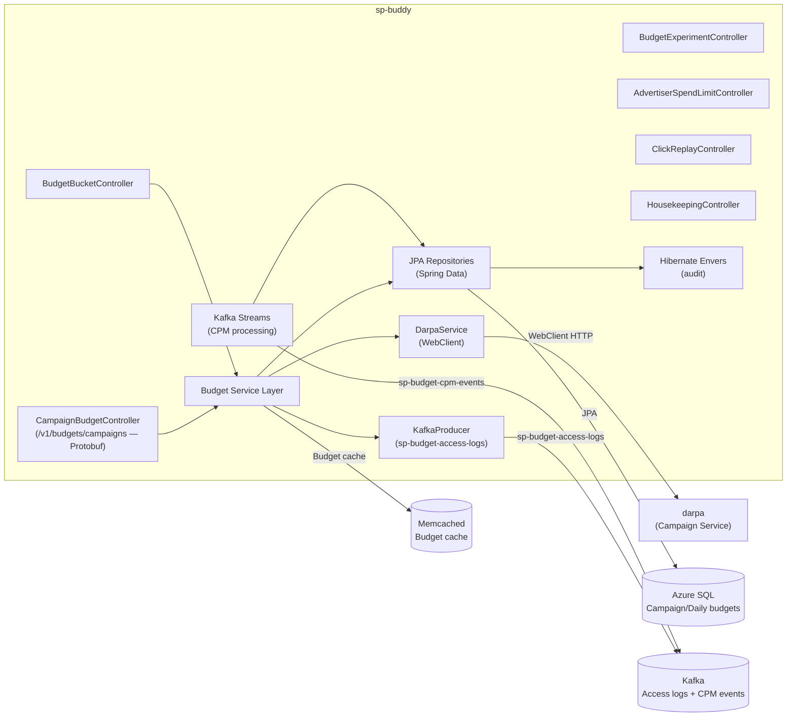
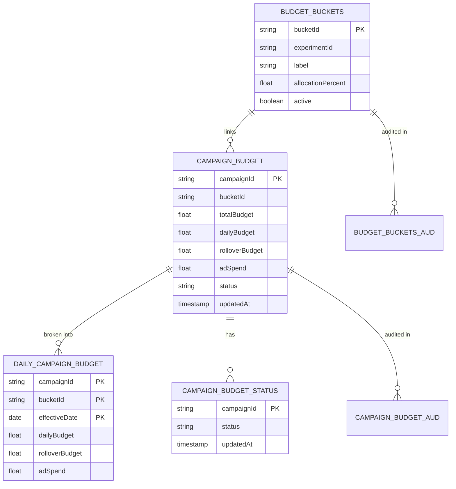
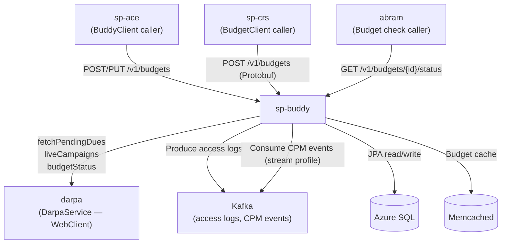
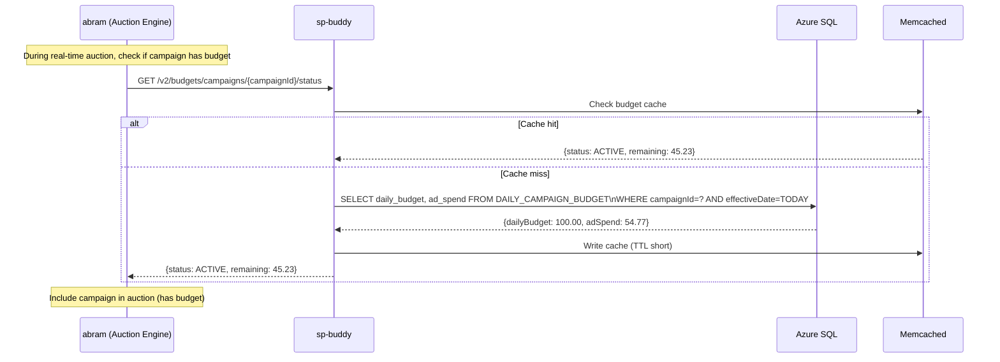
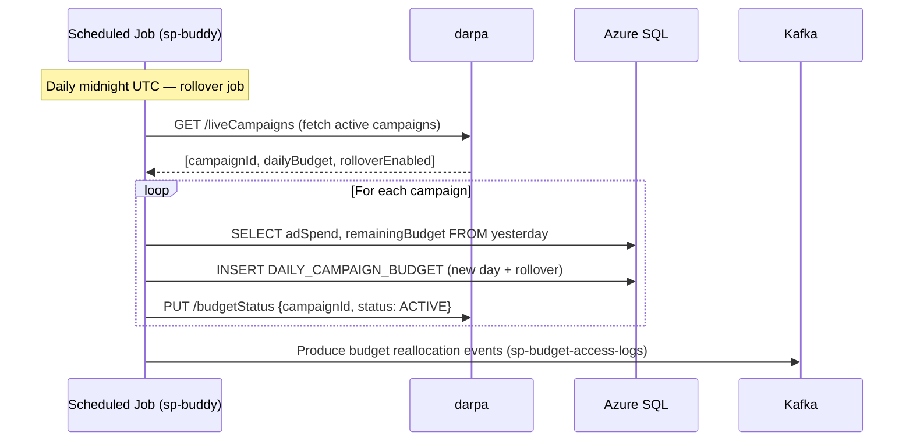

# Chapter 7 — sp-buddy (Budget Service)

## 1. Overview

**sp-buddy** is the budget management and pacing service for Walmart Sponsored Products. It ensures campaigns don't overspend their allocated daily and total budgets, handles budget splits across A/B experiment buckets, and exposes budget status APIs consumed by the ad serving pipeline during auction time.

- **Domain:** Budget Pacing & Financial Controls
- **Tech:** Java 17, Spring Boot 3.5.6, Protobuf APIs, Hibernate Envers, Spring WebClient
- **WCNP Namespaces:** `sp-buddy-wmt`, `sp-buddy-wap-mx`, `sp-buddy-wap-ca`
- **Port:** 8080

---

## 2. Architecture Diagram

---

## 3. API / Interface

| Method | Path | Protocol | Description |
|--------|------|----------|-------------|
| POST | `/v1/budgets/campaigns` | Protobuf | Create campaign budget |
| PUT | `/v1/budgets/campaigns` | Protobuf | Update campaign budget |
| PUT | `/v1/budgets/campaigns/rollback` | Protobuf | Rollback budget update |
| POST | `/v1/budgets/split` | JSON | Split budget across experiment buckets |
| GET | `/v1/budgets/campaigns/{campaignId}/status` | JSON | Get campaign budget status (v1 async) |
| GET | `/v2/budgets/campaigns/{campaignId}/status` | JSON | Get campaign budget status (v2) |
| PUT | `/v1/budgets/fix/campaigns/{campaignId}` | JSON | Fix budget discrepancies |
| POST | `/v1/budgets/reallocate` | Protobuf | Reallocate daily budget |
| **POST** | **`/v1/budgets/experiments/validate-splits`** | **JSON** | **Validate budget splits for an experiment (CARADS-41748)** |
| GET | `/health` | JSON | Kubernetes health check |

**Protobuf contract:** Uses `sp-api-proto:0.0.17` shared proto definitions (`CampaignBudgetCreateRequest`, `DailyCampaignBudgetCreateRequest`).

### Budget Splits Validation (CARADS-41748 — live in prod, Mar 2026)

`POST /v1/budgets/experiments/validate-splits` — validates whether the campaigns in a budget
experiment have been correctly split. Returns a `BudgetValidationResponse` with:

| Field | Type | Description |
|-------|------|-------------|
| `splitCount` | int | Number of campaigns that have been correctly budget-split |
| `unsplitCount` | int | Number of campaigns that remain unsplit |
| `campaignIds` | List\<String\> | Campaign IDs in the experiment |

**`BudgetValidatorService`** performs batch campaign budget lookup via the repository layer and
checks each campaign's split status. The multiple-budget experiment feature (parallel budget
validation across buckets) is now **fully enabled in prod and prod-RO**.

---

## 4. Data Model

---

## 5. Inter-Service Dependencies

---

## 6. Configuration

| Config Key | Description |
|-----------|-------------|
| `darpa.*` | DARPA service URLs and timeouts |
| `ace.*` | ACE service config for experiment integration |
| `kafka.*` | Kafka broker, topic, SSL config |
| `stream.*` | Kafka Streams settings (CPM processing) |
| `cache.*` | Memcached configuration |
| `spring.profiles.active` | `dev`, `prod`, `prod-readonly`, `stream` |

---

## 7. Example Scenario — Budget Status Check During Auction

---

## 8. Budget Reallocation Flow (Daily Rollover)

