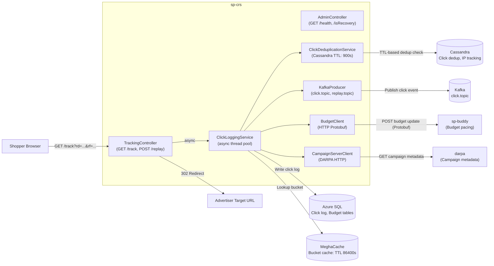
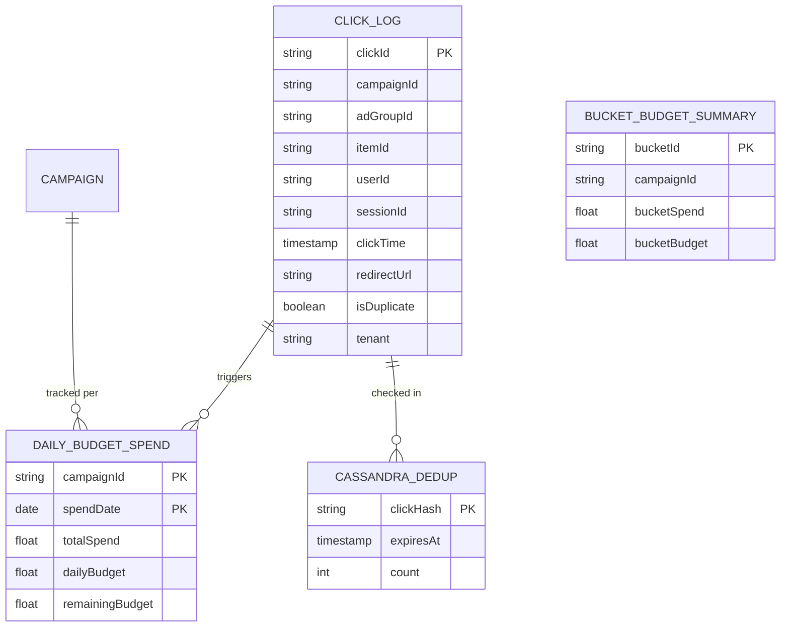
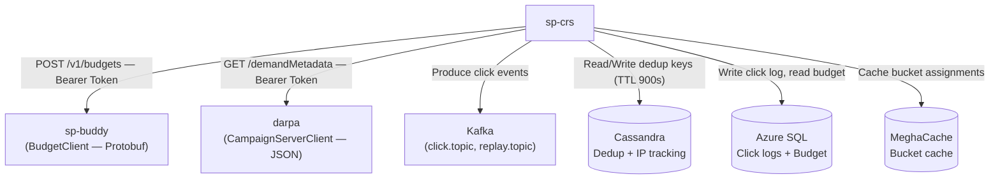
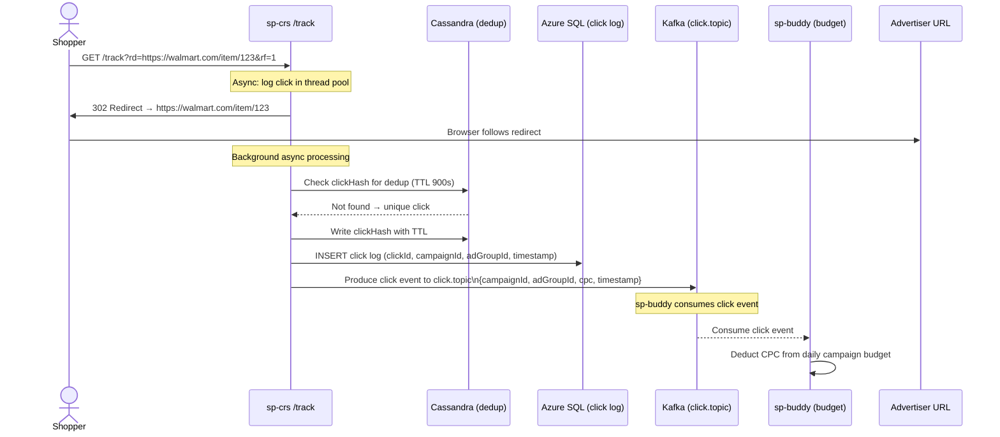
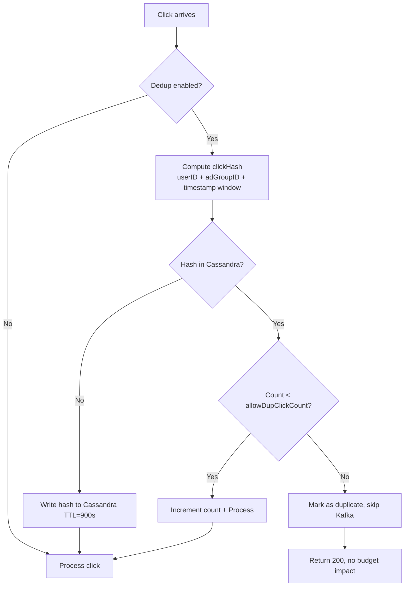

# Chapter 8 — sp-crs (Click Redirect Service)

## 1. Overview

**sp-crs** is the click tracking and redirect service for Walmart Sponsored Products. Every advertiser click flows through this service: it validates the click, deduplicates it (Cassandra), records it (Azure SQL), fires a Kafka event for budget and attribution downstream, and redirects the shopper to the advertiser's target URL.

- **Domain:** Click Tracking & Attribution
- **Tech:** Java 17, Spring Boot 3.5.6, Spring Kafka, Cassandra, MeghaCache
- **WCNP Namespaces:** `sp-crs-wmt`, `sp-crs-sams`
- **Port:** 8080

---

## 2. Architecture Diagram

---

## 3. API / Interface

| Method | Path | Parameters | Response | Description |
|--------|------|-----------|----------|-------------|
| GET | `/track` | `rd` (redirect URL), `rf` (flag) | 302 Redirect | Main click tracking endpoint |
| GET | `/sp/track` | Same as `/track` | 302 Redirect | Alternative click tracking path |
| POST | `/replay` | `skipReplay` flag, `TrackDetail` body | 200 OK / 400 | Replay a click event |
| GET | `/health` | — | JSON status | Kubernetes liveness |
| GET | `/isRecovery` | — | boolean | Recovery mode status |
| GET | `/budgetServerHealth` | — | health | sp-buddy connectivity |
| GET | `/campaignServerHealth` | — | health | DARPA connectivity |
| GET | `/cassandraHealth` | — | health | Cassandra connectivity |
| GET | `/dbReadHealth` | — | health | Azure SQL read health |

**Note:** All click tracking is processed **asynchronously** via a dedicated thread pool (logging executor) to minimize redirect latency.

---

## 4. Data Model

---

## 5. Inter-Service Dependencies

---

## 6. Configuration

| Config Key | Default | Description |
|-----------|---------|-------------|
| `clickDedup.dedup.enabled` | `false` | Enable click deduplication |
| `clickDedup.cassandra.ttl` | `900` | Dedup key TTL in seconds |
| `clickDedup.allowDupClickCount` | `2` | Allowed duplicate clicks per TTL |
| `staleClick.millisecond.threshold` | `600000` | Stale click threshold (10 min) |
| `allowed.domains` | `walmart.com, mobile.walmart.com` | Allowed redirect domains |
| `recoveryMode` | `false` | Recovery mode (skip processing) |
| `click.logging.enabled` | `true` | Enable click logging |
| `bucket.cache.ttl` | `86400` | Bucket cache TTL (seconds) |
| `multiple.experiments.enabled` | `false` | Multi-experiment per click |
| `budget.split.enabled` | `false` | Budget split across buckets |
| `kafka.click.topic` | (CCM) | Kafka topic for click events |
| `sox.enabled` | `true` | SOX compliance Hawkshaw enrichment |

---

## 7. Example Scenario — Shopper Clicks a Sponsored Product Ad

---

## 8. Click Deduplication Flow

