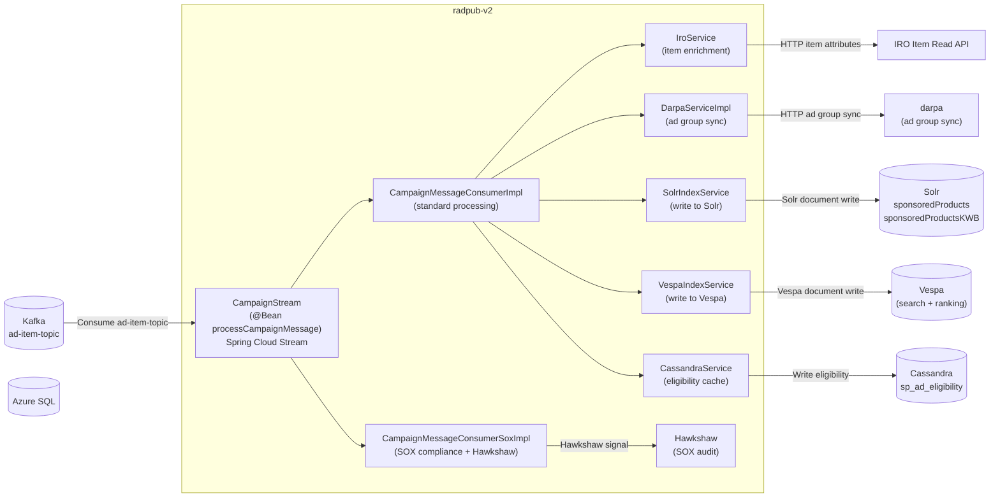
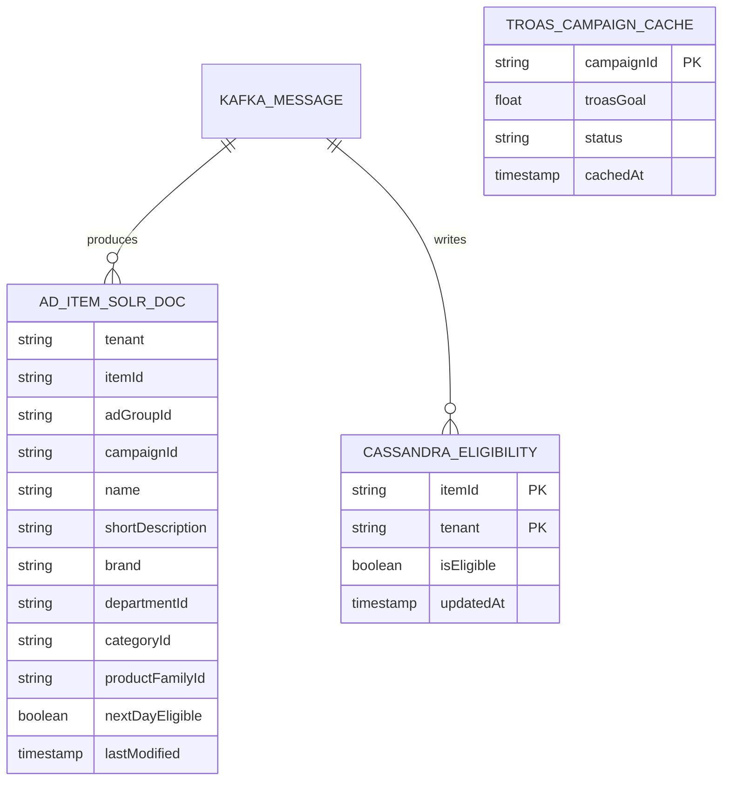
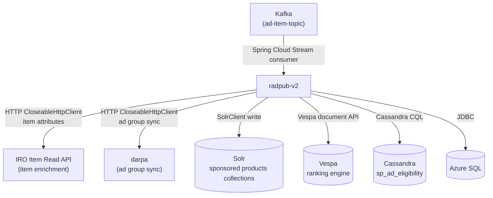
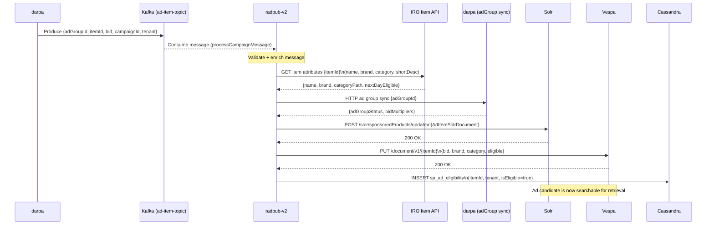

# Chapter 9 — radpub-v2 (Campaign Indexer / Publisher)

## 1. Overview

**radpub-v2** (Realtime Ad Publishing) is a Kafka-consumer service that bridges campaign management (DARPA) and ad retrieval (Solr/Vespa). When a campaign or ad item is created/updated in DARPA, an event is published to Kafka. radpub-v2 consumes these events, enriches them with item catalog data (IRO), and indexes the ad candidates into **Solr** and **Vespa** for millisecond-latency retrieval during ad serving.

- **Domain:** Ad Indexing & Publishing Pipeline
- **Tech:** Java 17, Spring Boot 3.5.6, Spring Cloud Stream (Kafka binder)
- **WCNP Namespaces:** `radpub-wmt`, `radpub-sams`, `radpub-intl`
- **Tenants:** WMT, SAMS, INTL
- **Port:** 8080 (HTTP health checks only — no REST API)

---

## 2. Architecture Diagram

---

## 3. API / Interface

**radpub-v2 has no REST API endpoints** — it is a pure event consumer. It only exposes:

| Endpoint | Description |
|----------|-------------|
| Spring Boot Actuator (`/actuator/health`) | Kubernetes liveness/readiness |
| Prometheus metrics (`/actuator/prometheus`) | Metrics scraping |

**Kafka Consumer Binding:**
- **Input binding:** `processCampaignMessage-in-0`
- **Topic:** Configured via `ccm.kafka.ad-item-topic`
- **Consumer group:** Configured via `kafka.consumer-group`
- **DLQ (Dead Letter Queue):** Configurable via `ccm.kafka.enableDlq`

---

## 4. Data Model

---

## 5. Inter-Service Dependencies

---

## 6. Configuration

| Profile | Config File | Description |
|---------|-------------|-------------|
| `localWmt` | `application-localWmt.yml` | Local WMT development |
| `localSams` | `application-localSams.yml` | Local SAMS development |
| `Wmt` | `application-Wmt.yml` | Production WMT |
| `Sams` | `application-Sams.yml` | Production SAMS |
| `Intl` | `application-Intl.yml` | International production |

| Config Key | Description |
|-----------|-------------|
| `ccm.kafka.brokers` | Kafka broker addresses |
| `ccm.kafka.ad-item-topic` | Input topic name |
| `kafka.consumer-group` | Consumer group ID |
| `ccm.kafka.enableDlq` | Enable dead-letter queue |
| `ccm.solr.zookeepers` | Solr ZooKeeper ensemble |
| `ccm.sox.enabled` | Enable SOX compliance (Hawkshaw) |
| `ccm.teflon` | Enable Teflon mode |
| `runtime.context.appName` | App name per tenant |

---

## 7. Example Scenario — Ad Item Published to Solr

