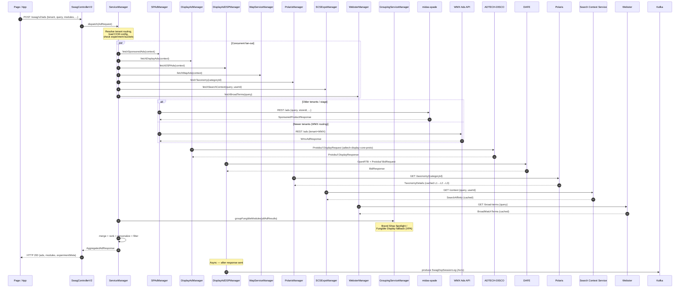
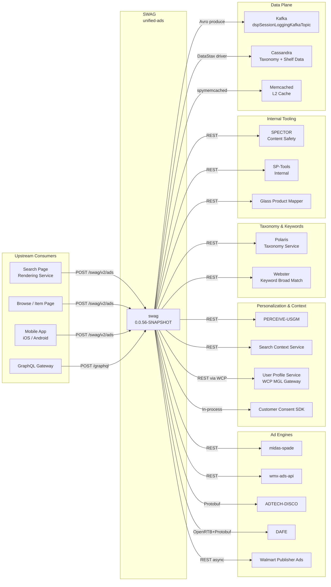

# Chapter 10 — swag (Systematic Walmart Ads Gatherer)

## 1. Overview

SWAG (Systematic Walmart Ads Gatherer) is the central multi-tenant ad aggregation gateway within the Walmart Sponsored Products platform. It occupies the critical middle tier between upstream page/app consumers and a heterogeneous collection of downstream ad-serving, decisioning, personalization, and taxonomy services. On every ad request, SWAG interprets the incoming page context — search query, page type, tenant identity, user session, and store context — then fans out concurrently to multiple backend services, aggregates and ranks the results, applies personalization signals, evaluates A/B experiment buckets, enforces content filtering rules, and returns a single unified ad payload over either REST or GraphQL.

> **Position in stack:** SWAG sits directly below the page/app rendering layer (web, mobile, native) and directly above the ad-serving engines (midas-spade, ADTECH-DISCO, DAFE) and supporting services (Polaris, SCS, Webster, PERCEIVE). It is the sole aggregation point that understands multi-tenant semantics, experiment state, and cache topology across all Walmart-family properties.

**Key characteristics:**
- Java 17, Spring Boot 3.5.0, Maven multi-module layout (`services` + `common`)
- Current version: `0.0.56-SNAPSHOT`
- Dual API surface: REST (primary entry via `POST /swag/v2/ads`) and GraphQL (Apollo Federation 5.0.0 + graphql-java 21.3)
- Concurrent fan-out via per-manager async execution; results merged before response serialization
- Three-level cache hierarchy: Caffeine (L1, in-process) → Memcached (L2, spymemcached) → Cassandra (L3, driver 4.17.0)
- Kafka producer (Confluent Avro 7.2.2) for asynchronous DSP session logging
- Protobuf integration with `adtech-display-core-proto 0.0.671` for DISCO and DAFE protocols
- Resilience4j circuit breakers on all external HTTP calls
- GZIP compression with approximately 7x payload reduction
- MSAL4j for Azure AD / WCNP service-to-service authentication
- Strati CCM configuration (`apiVersion 2.0`, key `SWAG-SERVICES-WMT`), GTP Observability BOM
- Deployed to WCNP namespace `unified-ads` across three production regions

---

## 2. Architecture Diagram

```mermaid
graph TB
    subgraph Consumers
        WEB[Web / Mobile App]
        GQL_CLIENT[GraphQL Client]
    end

    subgraph SWAG["SWAG — unified-ads namespace"]
        CTRL_V2[SwagControllerV2\nPOST /swag/v2/ads]
        CTRL_GQL[GraphqlController\nPOST /graphql]
        CTRL_FS[FederatedSearchController\nGET /fs]
        CTRL_WAP[WapController\n/wap/*]
        CTRL_P13N[P13NController\n/v1/p13n/*]
        CTRL_EXP[ExperimentController\n/abtest/*]
        CTRL_ADMIN[AdminController\n/admin/*]

        SVC_MGR[ServiceManager\nTop-level Orchestrator]

        SP_MGR[SPAdManager]
        DISP_MGR[DisplayAdManager]
        DSP_MGR[DisplayAdDSPManager]
        WAP_MGR[WapServiceManager]
        POL_MGR[PolarisManager]
        WEB_MGR[WebsterManager]
        GRP_MGR[GroupingServiceManager]
        SCS_MGR[SCSExpoManager]

        L1[L1 Caffeine Cache]
        L2[L2 Memcached]
        L3[L3 Cassandra]

        KAFKA_PROD[Kafka Producer\nSwagDspSessionLog]
    end

    subgraph Downstream["Downstream Ad Services"]
        SPADE[midas-spade\nREST]
        WMX[WMX Ads API\nREST]
        DISCO[ADTECH-DISCO\nProtobuf]
        DAFE[DAFE\nOpenRTB + Protobuf]
        WAP_SVC[Walmart Publisher Ads]
    end

    subgraph Supporting["Supporting / Personalization Services"]
        POLARIS[Polaris\nREST]
        SCS[Search Context Service\nREST]
        WEBSTER[Webster\nREST]
        PERCEIVE[PERCEIVE-USGM\nREST]
        SPECTOR[SPECTOR\nREST]
        SP_TOOLS[SP-Tools\nREST]
        GLASS_PM[Glass Product Mapper\nREST]
        UPS[User Profile Service\nWCP MGL Gateway]
        CCM_SDK[Customer Consent SDK\nv4.0.1 local]
    end

    subgraph Kafka_Cluster["Kafka — Confluent"]
        KAFKA_TOPIC[dspSessionLoggingKafkaTopic\nAvro]
    end

    WEB --> CTRL_V2
    GQL_CLIENT --> CTRL_GQL
    WEB --> CTRL_FS

    CTRL_V2 --> SVC_MGR
    CTRL_GQL --> SVC_MGR
    CTRL_FS --> SVC_MGR

    SVC_MGR --> SP_MGR
    SVC_MGR --> DISP_MGR
    SVC_MGR --> DSP_MGR
    SVC_MGR --> WAP_MGR
    SVC_MGR --> POL_MGR
    SVC_MGR --> WEB_MGR
    SVC_MGR --> GRP_MGR
    SVC_MGR --> SCS_MGR

    SP_MGR --> SPADE
    SP_MGR --> WMX
    DISP_MGR --> DISCO
    DSP_MGR --> DAFE
    WAP_MGR --> WAP_SVC
    POL_MGR --> POLARIS
    WEB_MGR --> WEBSTER
    SCS_MGR --> SCS

    SVC_MGR --> PERCEIVE
    SVC_MGR --> SPECTOR
    SVC_MGR --> SP_TOOLS
    SVC_MGR --> GLASS_PM
    SVC_MGR --> UPS
    SVC_MGR --> CCM_SDK

    SP_MGR --> L1
    DISP_MGR --> L1
    POL_MGR --> L1
    SCS_MGR --> L1
    L1 --> L2
    L2 --> L3

    DSP_MGR --> KAFKA_PROD
    KAFKA_PROD --> KAFKA_TOPIC
```



---

## 3. API Contracts

### 3.1 REST Endpoints

| Method | Path | Controller | Description |
|--------|------|------------|-------------|
| `POST` | `/swag/v2/ads` | `SwagControllerV2` | Primary ad aggregation entry point; accepts full page context, returns unified ad payload |
| `GET` | `/fs` | `FederatedSearchController` | Federated search ad surface; supports `rs` query parameter for store mode screen |
| `POST` | `/graphql` | `GraphqlController` | Default GraphQL endpoint (Apollo Federation) |
| `POST` | `/graphql/sb` | `GraphqlController` | GraphQL endpoint scoped to Sponsored Brands |
| `POST` | `/graphql/sp` | `GraphqlController` | GraphQL endpoint scoped to Sponsored Products |
| `POST` | `/graphql/sv` | `GraphqlController` | GraphQL endpoint scoped to Sponsored Video |
| `GET/POST` | `/wap/*` | `WapController` | Walmart Publisher Ads surface endpoints |
| `GET/POST` | `/v1/p13n/*` | `P13NController` | Personalization-specific ad requests |
| `GET/POST` | `/abtest/*` | `ExperimentController` | A/B experiment bucket assignment and override |
| `GET/POST` | `/admin/*` | `AdminController` | Internal admin and cache management operations |
| `GET` | `/v1/health` | `HealthCheckController` | Liveness and readiness health probe |
| `GET` | `/v1/start` | `HealthCheckController` | Startup probe used by WCNP init containers |

**Typical `POST /swag/v2/ads` request body (abbreviated):**

```json
{
  "tenant": "WMT",
  "pageType": "SEARCH",
  "query": "wireless headphones",
  "storeId": "3560",
  "userId": "abc123",
  "sessionId": "sess-xyz",
  "modules": ["SP", "DISPLAY", "WAP"],
  "pageContext": {
    "categoryId": "3944",
    "browsePath": "Electronics/Headphones"
  },
  "experimentBuckets": {}
}
```

### 3.2 GraphQL Schema

SWAG exposes a federated GraphQL schema via Apollo Federation 5.0.0, stitching together subgraph types from the `sp`, `sb`, and `sv` ad surfaces. The schema is served at `/graphql` (unified) and at per-surface paths. Key types include:

- `AdRequest` — input type carrying page context, tenant, query, and module selection
- `AdResponse` — union of `SponsoredProductAd`, `DisplayAd`, `SponsoredBrandAd`, `SponsoredVideoAd`
- `AdModule` — represents a renderable ad slot containing one or more `AdItem` entries
- `ExperimentContext` — carries A/B bucket assignments propagated from `ExperimentController`
- `PersonalizationSignal` — carries PERCEIVE user profile signals attached to the response

The federation gateway delegates sub-field resolution to the appropriate downstream subgraph resolver (SP, DISCO, DAFE) based on the `__resolveReference` mechanism. Each surface path (`/graphql/sp`, `/graphql/sb`, `/graphql/sv`) exposes an isolated subgraph schema suitable for direct consumption by surface-specific clients.

### 3.3 Kafka (Producer)

| Property | Value |
|----------|-------|
| Topic | `dspSessionLoggingKafkaTopic` (resolved from CCM) |
| Schema | `SwagDspSessionLog` (Confluent Avro, schema registry) |
| Serializer | `KafkaAvroSerializer` (Confluent 7.2.2) |
| Execution | Async — dedicated `KafkaExecutor` thread pool |
| Direction | Producer only (SWAG does not consume Kafka) |
| Key fields | Impressions list, ad content identifiers, user context, correlation IDs, session ID, tenant, timestamp |

The Kafka producer fires after the ad response is assembled and serialized to the caller. DSP session log records are emitted for every request that produces DAFE (DSP) ad results, enabling downstream attribution and billing pipelines to reconstruct the full impression context without blocking the ad-serving latency path.

---

## 4. Service Fan-out Architecture



The `ServiceManager` orchestrates all downstream calls using Spring's async executor framework. Each manager is independently circuit-broken via Resilience4j. If a non-critical manager (e.g., `WebsterManager`) trips its circuit breaker, the aggregated response degrades gracefully — omitting broad-match enrichment but still returning sponsored and display ads. Critical path managers (`SPAdManager`, `DisplayAdManager`) have tighter timeout budgets and fallback caches.

---

## 5. Data Model

### 5.1 Cassandra Entities

All entities are stored in the `unified-ads` Cassandra keyspace and form the L3 cache tier for taxonomy and shelf data.

| Entity | Primary Key | Purpose |
|--------|-------------|---------|
| `ShelfDetails` | `(tenantId, shelfId)` | Stores curated shelf configuration, associated item lists, and display metadata for manually promoted content |
| `AnchorItem` | `(tenantId, itemId)` | Anchor product information used to anchor ad modules to specific catalog items |
| `CategoryDetails` | `(tenantId, categoryId)` | Polaris-resolved category taxonomy details; denormalized for low-latency lookup |
| `BrowseCatMapping` | `(tenantId, browsePath)` | Maps URL browse path tokens to canonical Polaris category IDs |
| `ManualShelfDetails` | `(tenantId, shelfId, version)` | Versioned manual shelf overrides applied above algorithmic ad results |

Cassandra access uses the DataStax Java driver 4.17.0 with `DriverConfigLoader` sourced from CCM-managed configuration. Connection pools are sized per-region. The Cassandra tier is only consulted when both Caffeine (L1) and Memcached (L2) miss, making it a cold-read fallback rather than a hot-path dependency.

### 5.2 Cache Architecture

SWAG implements a unified three-level cache abstraction used by multiple managers. Each cache manager (`TaxonomyDetailsTriLevelCache`, `PerceiveCacheManager`, `SCSCacheManager`, `WebsterCacheManager`) follows the same read-through pattern:

```
L1 Caffeine (in-process, sub-ms)
    ↓ miss
L2 Memcached via spymemcached (shared, ~1ms)
    ↓ miss
L3 Cassandra (persistent, ~5-15ms)
    ↓ miss
Live downstream call (POLARIS, SCS, PERCEIVE, WEBSTER)
    → backfill L3 → backfill L2 → backfill L1
```

| Level | Technology | Library | Scope | TTL pattern |
|-------|-----------|---------|-------|-------------|
| L1 | Caffeine | `com.github.ben-manes.caffeine:caffeine:2.8.0` | Per JVM instance | Short (seconds to low minutes) |
| L2 | Memcached | `spymemcached` | Shared across pod instances | Medium (minutes) |
| L3 | Cassandra | `datastax java-driver 4.17.0` | Persistent, regional | Long (hours to days) |

Cache managers are individually configurable via CCM properties (TTL, max size, eviction policy). The `TaxonomyDetailsTriLevelCache` specifically manages the Polaris taxonomy tree, which is large but infrequently invalidated — making it the primary beneficiary of the L3 Cassandra tier.

---

## 6. External Dependencies

| Service | Protocol | Purpose | Config / Host Pattern |
|---------|----------|---------|----------------------|
| midas-spade | REST (HTTP/1.1) | Sponsored products ad serving for older tenants and stage environments | CCM key `spade.host.{env}` |
| ADTECH-DISCO | Protobuf over HTTP/2 | Display ad decisioning; request/response use `adtech-display-core-proto 0.0.671` | CCM key `disco.host.{env}` |
| DAFE | OpenRTB + Protobuf | DSP / programmatic ad decisioning; BidRequest/BidResponse via Protobuf | CCM key `dafe.host.{env}` |
| PERCEIVE-USGM | REST | User profiling and segmentation signals for personalization | CCM key `perceive.host.{env}` |
| Polaris | REST | Category taxonomy resolution; canonical category IDs and browse tree | `polaris-gm-wcnp.{env}.walmart.com` |
| Search Context Service (SCS) | REST | Search affinity and intent signals keyed on query + user | CCM key `scs.host.{env}` |
| Webster | REST | Keyword broad-match term expansion for sponsored products | CCM key `webster.host.{env}` |
| WMX Ads API | REST | Ad serving for newer MX-routing tenants (Walmart Mexico, Bodega Mexico) | `wmx-ads-api.{env}.walmart.com` |
| SPECTOR | REST | Ad content quality and safety review integration | `spector-wmt-v2.{env}.walmart.com` |
| SP-Tools | REST | Internal sponsored products tooling and override layer | `sp-tools-internal.{env}.walmart.com` |
| Glass Product Mapper | REST | Product ID mapping between Walmart and Sam's Club catalogs for SAMS tenant | CCM key `glass.product-mapper.host.{env}` |
| User Profile Service | REST via WCP MGL Gateway | Full user profile fetch for personalization and targeting | CCM key `ups.gateway.host.{env}` |
| Customer Consent SDK | Local library (v4.0.1) | In-process consent signal evaluation; no outbound call | Bundled dependency |
| Kafka (Confluent) | Confluent Avro 7.2.2 | Async DSP session log emission for billing and attribution | `kafka.bootstrap.servers` CCM key |
| Cassandra | DataStax driver 4.17.0 | L3 cache and persistent taxonomy / shelf storage | `cassandra.contact-points` CCM key |
| Memcached | spymemcached | L2 distributed cache | `memcached.hosts` CCM key |

All outbound HTTP calls are wrapped in Resilience4j circuit breakers. Timeouts, retry counts, and circuit breaker thresholds are configured per-service via CCM.

---

## 7. Multi-Tenant Configuration

SWAG is designed from the ground up as a multi-tenant gateway. The `tenant` field on every inbound request drives routing, feature flag evaluation, and external service selection.

**Supported tenants:**

| Tenant ID | Property | Routing Behavior |
|-----------|----------|-----------------|
| `WMT` | Walmart US | Routes sponsored products to midas-spade (or WMX API where enabled); full feature set including DISCO display ads and DAFE DSP |
| `SAMS` | Sam's Club | Routes through Glass Product Mapper for catalog ID translation before calling ad services; SAMS-specific CCM configuration block |
| `MX` / `WMX` | Walmart Mexico | Routes sponsored products to WMX Ads API (`wmx-ads-api.{env}.walmart.com`); uses MX-specific consent rules |
| `BMX` | Bodega Mexico | Same WMX Ads API routing as MX tenant; distinct CCM config key for brand/layout rules |
| `GLASS` | GLASS surface | Dedicated routing path through Glass Product Mapper; used for cross-property inventory surfaces |

**Tenant routing logic in `SPAdManager`:**

- If `tenant` is `WMT` or `SAMS` and routing flag `use.wmx.routing` is `false` → calls midas-spade
- If `tenant` is `MX`, `BMX`, or routing flag `use.wmx.routing` is `true` → calls WMX Ads API
- SAMS requests pass `itemId` values through `GlassProductMapper.mapToWalmartId()` before the spade/WMX call, then reverse-map response item IDs back to Sam's Club catalog IDs before returning

**CCM configuration isolation:** Each tenant has its own CCM configuration namespace under the root key `SWAG-SERVICES-WMT`. Tenant-specific overrides use the pattern `swag.tenant.{TENANT_ID}.*`, allowing rate limits, feature flags, timeout budgets, and experiment assignments to be controlled independently per property.

---

## 8. A/B Testing & Experimentation

SWAG has a first-class experimentation layer used to roll out new ad formats, ranking changes, and fan-out configurations without code deploys.

**`ExperimentController` (`/abtest/*`):**
- Accepts GET and POST requests to read or override experiment bucket assignments for a given session
- Primarily used by QA and internal tooling to force a session into a specific bucket
- Returns the full experiment context map for the given `sessionId` + `tenant` combination

**`ExpoCookieHandler`:**
- Inspects the inbound request for an experiment cookie (typically `WM_EXPO` or equivalent per tenant)
- Decodes the bucket assignment map from the cookie payload
- Merges cookie-sourced buckets with any server-side experiment assignments from SCS (`SCSExpoManager`)
- The merged `ExperimentContext` is attached to the `AdRequest` before it reaches `ServiceManager`

**Bucket key routing:**
- `ServiceManager` reads `ExperimentContext.bucketKey` to select between code paths at manager level
- Example: bucket key `FUNGIBLE_DISPLAY_XPA` activates the `GroupingServiceManager` path for Brand Shop Spotlight / Fungible Display fallback
- Bucket key `SKYLINE_EXCL_V2` activates the Skyline exclusion lookup via CCM configuration

**Recent experiment activations:**
- **Brand Shop Spotlight / Fungible Display fallback (XPA):** When a user is bucketed into the XPA experiment, `GroupingServiceManager` assembles fungible ad modules that can be filled by either a Sponsored Brand or a Display ad depending on inventory availability, maximizing fill rate
- **Skyline exclusion lookup:** Controls which ad unit positions are excluded from the Skyline layout; the exclusion set is loaded from CCM rather than hardcoded, allowing dynamic updates without deployment

---

## 9. Deployment & Configuration

**Platform:** WCNP (Walmart Cloud Native Platform — Kubernetes on Azure)
**Kubernetes namespace:** `unified-ads`
**CCM root key:** `SWAG-SERVICES-WMT`
**CCM API version:** `2.0`
**Observability:** GTP Observability BOM (metrics, tracing, structured logging)
**Authentication:** MSAL4j (Azure AD) for service-to-service token acquisition

**Production regions:**

| Region | Cluster ID (Grafana var) | Cloud Region | Istio App |
|--------|--------------------------|-------------|-----------|
| South Central US (SCUS) | `scus-prod-*` | Azure South Central US | `swag-services-wmt-prod` |
| East US 2 (EUS2) | `eus2-prod-a14` | Azure East US 2 | `swag-services-wmt-prod` |
| West US 2 (WUS2) | `wus2-prod-*` | Azure West US 2 | `swag-services-wmt-prod` |

**GSLB origin:** `swag-services-wmt-prod_unified-ads_k8s_glb_us_walmart_net`
**Namespace:** `unified-ads`
**App label:** `swag-services-wmt-prod` (primary) and `swag-services-wmt-prod-primary` (blue/green primary slot)

**Rate limits by environment:**

| Environment | Rate Limit |
|-------------|-----------|
| Development | 300 requests/second |
| Stage (lower) | 500 requests/second |
| Stage (upper) | 2000 requests/second |
| Production | 950 requests/second |

**GZIP compression:** Enabled on all REST responses. Benchmarked at approximately 7x compression ratio for typical ad payload JSON, which is critical given the large ad response bodies that include item metadata, image URLs, and experiment context.

**JVM / container configuration:**
- Java 17 runtime; GraalVM-compatible (no reflection-heavy patterns on hot path)
- Spring Boot 3.5.0 with Spring WebMVC (blocking servlet stack) for REST, Spring GraphQL for the federated schema
- Maven multi-module: `swag-services` (Spring Boot application), `swag-common` (shared models, cache abstractions, proto bindings)

---

## 9.5 Repository & Deployment Model

SWAG uses a **core + shell repo** pattern to support multi-team, multi-tenant deployment:

| Repo | Owner | Contents | Purpose |
|------|-------|----------|---------|
| `gecgithub01.walmart.com/labs-ads/swag` | Core Ad Tech | Core business logic, all managers, controllers | Primary codebase |
| `gecgithub01.walmart.com/labs-ads/swag-wmt` | Core Ad Tech | CCM, `kitt.yml`, `sr.yaml` for WMT | WMT production shell |
| `gecgithub01.walmart.com/labs-ads/swag-intl` | WAP Team | CCM, `sr.yaml` for international tenants | WAP/INTL CCM+SR shell |
| `gecgithub01.walmart.com/growth/infra-deploy` (path: `sponsored-products/kitt/unified-ads/kitt-wap-intl.yml`) | WAP Team | Kitt deployment spec | WAP/INTL kitt config |
| `gecgithub01.walmart.com/wctplatform/swag-wct` | WCT Platform | CCM, `kitt.yml`, `sr.yaml` for WCT | WCT shell (forked from core when core logic needed) |

**Deployment model:**
- Core logic changes go to `swag` repo only.
- Each team deploys through their own shell repo which contains the environment-specific `CCM`, `kitt.yml`, and `sr.yaml`.
- WCT team forks `swag` core only when core business logic changes are required for their tenant.

**Secrets template (Akeyless paths):**

```properties
# Core Ad Tech (WMT) secrets
cassandra.username=
cassandra.password=
mysql.username=
mysql.password=
azsql.user=
azsql.password=
perceive.azure.conn.string=
azure.cosmosdb.key=
polaris.access.key=
azureBlobConnectionString=
```

**Service Registry:** `SP-SWAG-WMT` (CCM admin: `https://admin.tunr.non-prod.walmart.com/services/SP-SWAG-WMT`)
**WCNP namespace:** `unified-ads`
**APM ID:** `APM0001016` (SWAG)

---

## 9.6 Observability

### Grafana Dashboards

| Dashboard | Purpose | URL |
|-----------|---------|-----|
| Swag Dashboard | App-level metrics (RPS, latency, errors by tenant) | `grafana.mms.walmart.net/d/eLSw2Xunk/swag-dashboard` |
| Swag Detailed Summary | 1-up / 1-down metrics across all 3 regions | `grafana.mms.walmart.net/d/hy5Mbu2WkRef/swag-detailed-summary` |
| Swag GSLB | GSLB routing metrics by DC | `grafana.mms.walmart.net/d/000000098/gslb-by-domain` (origin: `swag-services-wmt-prod_unified-ads_k8s_glb_us_walmart_net`) |
| Swag Istio | Service mesh p50/p95/p99 latency, error rates | `grafana.mms.walmart.net/d/V0WeEf0Wk/istio-service-dashboard-mms` (namespace: `unified-ads`, app: `swag-services-wmt-prod`) |
| SRE WCNP OneDash | Node/pod system metrics | `grafana360.sre.prod.walmart.com/d/E-OHGTOMk/sre-wcnp-onedash` |
| Prometheus Writes | Per-namespace Prometheus write metrics | `grafana.mms.walmart.net/d/hzTtvt8Wk/namespaced-prometheus` (namespace: `unified-ads`) |

### Logs (OpenObserve)

| Type | Stream / Config |
|------|----------------|
| Log stream | `wcnp_unified_ads` |
| Log dashboard | `openlogsearch.logs.prod.walmart.com` — dashboard `7318059437359369687` |
| Error log query | `SELECT event_cluster_id, event_log_body_traceparent, event_log_body_error FROM "wcnp_unified_ads" WHERE event_log_body_error IS NOT NULL` |

**Kubernetes dashboard:** `k8s-dashboard.kube-system.{cluster}.cluster.k8s.us.walmart.net/#/pod?namespace=unified-ads`

---

## 10. Inter-Service Dependencies



---

## 11. Key Configuration Properties

All properties are managed via Strati CCM under the root key `SWAG-SERVICES-WMT` with `apiVersion: 2.0`.

| CCM Property Key | Type | Description |
|-----------------|------|-------------|
| `swag.spade.host.{env}` | String | midas-spade base URL per environment |
| `swag.wmx-ads-api.host.{env}` | String | WMX Ads API base URL per environment |
| `swag.disco.host.{env}` | String | ADTECH-DISCO Protobuf endpoint per environment |
| `swag.dafe.host.{env}` | String | DAFE OpenRTB endpoint per environment |
| `swag.polaris.host` | String | Polaris taxonomy service host (`polaris-gm-wcnp.{env}.walmart.com`) |
| `swag.scs.host.{env}` | String | Search Context Service base URL |
| `swag.webster.host.{env}` | String | Webster keyword service base URL |
| `swag.perceive.host.{env}` | String | PERCEIVE-USGM user profiling base URL |
| `swag.spector.host.{env}` | String | SPECTOR content safety base URL (`spector-wmt-v2.{env}.walmart.com`) |
| `swag.sp-tools.host.{env}` | String | SP-Tools internal base URL (`sp-tools-internal.{env}.walmart.com`) |
| `swag.glass.product-mapper.host.{env}` | String | Glass Product Mapper base URL |
| `swag.kafka.topic.dsp-session-log` | String | Kafka topic name for DSP session logging |
| `swag.kafka.bootstrap.servers` | String | Confluent Kafka bootstrap server list |
| `swag.cassandra.contact-points` | String | Cassandra contact point addresses per region |
| `swag.memcached.hosts` | String | Memcached server list for L2 cache |
| `swag.cache.taxonomy.ttl-seconds` | Integer | L1/L2 TTL for taxonomy cache entries |
| `swag.cache.scs.ttl-seconds` | Integer | L1/L2 TTL for SCS context cache entries |
| `swag.cache.perceive.ttl-seconds` | Integer | L1/L2 TTL for PERCEIVE user profile cache entries |
| `swag.cache.webster.ttl-seconds` | Integer | L1/L2 TTL for Webster broad-term cache entries |
| `swag.rate-limit.dev` | Integer | Rate limit for development environment (300/s) |
| `swag.rate-limit.stage` | Integer | Rate limit for stage environment (500–2000/s) |
| `swag.rate-limit.prod` | Integer | Rate limit for production environment (950/s) |
| `swag.tenant.{TENANT_ID}.use-wmx-routing` | Boolean | Per-tenant flag to route sponsored products to WMX Ads API instead of midas-spade |
| `swag.experiment.skyline-exclusion-keys` | List | CCM-managed list of Skyline layout positions excluded from ad injection |
| `swag.circuit-breaker.{service}.failure-rate-threshold` | Float | Resilience4j failure rate threshold (0.0–1.0) triggering circuit open per downstream service |
| `swag.circuit-breaker.{service}.timeout-ms` | Integer | Per-service HTTP call timeout in milliseconds |
| `swag.gzip.enabled` | Boolean | Enables GZIP compression on REST responses (default: `true`) |
| `swag.auth.msal.client-id` | String | MSAL4j Azure AD client ID for service-to-service auth |
| `swag.auth.msal.tenant-id` | String | Azure AD tenant ID for MSAL4j token acquisition |

---

*Chapter 10 — Generated by Wibey CLI — March 2026 · Enriched April 2026 from Confluence SPAS/ADTECH pages (pageIds: 310560079, 2962951072)*
