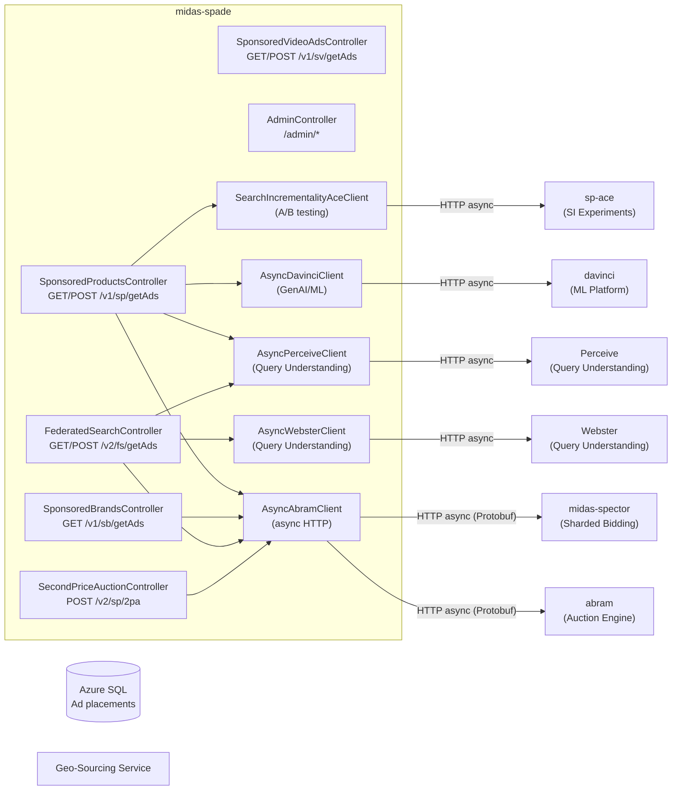
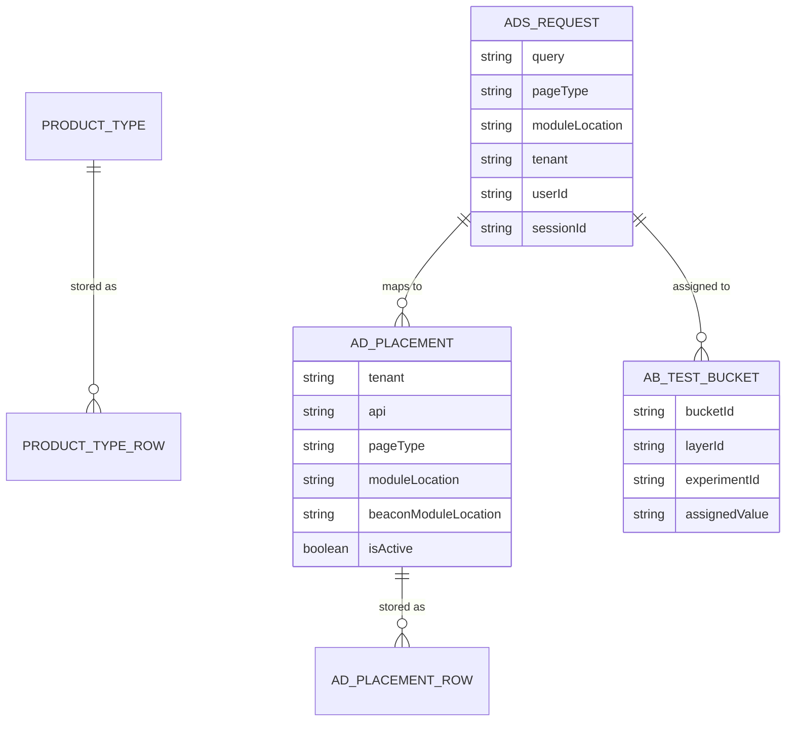
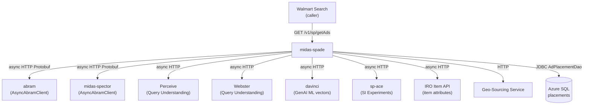
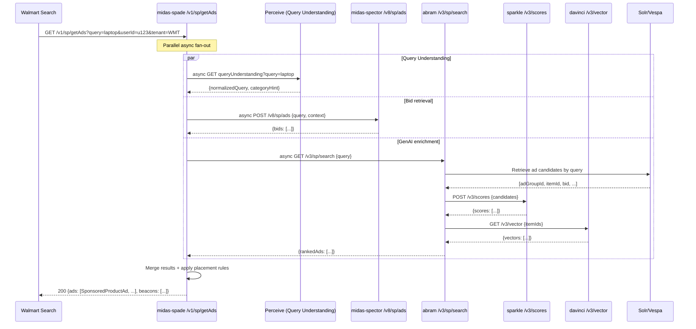

# Chapter 11 — midas-spade (Ad Server)

## 1. Overview

**midas-spade** is the primary **ad serving API** for Walmart Sponsored Products. It receives real-time ad requests from Walmart's search platform (query + context), fans out to the bidding and ranking pipeline, and returns a ranked list of sponsored ads to display. It acts as the orchestrator for the entire ad serving pipeline.

- **Domain:** Ad Serving / Real-Time Bidding Orchestration
- **Tech:** Java 17, Spring Boot 3.5.6, AsyncHttpClient, multi-module Maven (app, common, dao, abtest)
- **WCNP Namespace:** `midas-spade-app`
- **Port:** 8080
- **Swagger:** `https://midas-spade.dev.walmart.com/docs`

---

## 2. Architecture Diagram

---

## 3. API / Interface

| Method | Path | Description |
|--------|------|-------------|
| GET/POST | `/v1/sp/getAds` | Sponsored Products ad retrieval |
| GET | `/v1/sb/getAds` | Sponsored Brands ad retrieval |
| GET/POST | `/v1/sv/getAds` | Sponsored Video ad retrieval |
| GET/POST | `/v1/fs/getAds` | Federated Search ads (v1) |
| GET/POST | `/v2/fs/getAds` | Federated Search ads (v2) |
| POST | `/v2/sp/2pa` | True Second Price Auction |
| GET | `/v1/fg/getAds` | Fungibility ads |
| GET | `/v1/healthcheck` | Health check |
| GET | `/admin/app-config` | All CCM configs |
| GET | `/admin/app-config/{module}` | Module CCM config |
| GET | `/admin/caches/evict` | Evict cache entry |
| GET | `/admin/caches/bulkEvict` | Bulk evict cache entries |
| GET | `/admin/caches/cache` | Get cache value |

**Request parameters:** `query`, `pageContext`, `userId`, `placementContext`, `tenant`, `moduleLocation`

---

## 4. Data Model

---

## 5. Inter-Service Dependencies

---

## 6. Configuration

| Config Key | Description |
|-----------|-------------|
| `isTest.allow` | Allow test endpoints |
| `spring.mvc.async.request-timeout` | 100000ms async timeout |
| `server.max-http-request-header-size` | 64KB max header |
| `appConfig.getPerceiveConnectionsPerHost()` | Perceive connection pool size |
| `appConfig.getWebsterConnectionsPerHost()` | Webster connection pool size |
| `appConfig.getSIAceMaxConnections()` | SI ACE max connections |
| `ccm.enabled` | CCM feature toggle |
| `spring.profiles.active` | `local`, `stg`, `prod`, `wcnp_*` |

---

## 7. Example Scenario — Sponsored Product getAds Request

