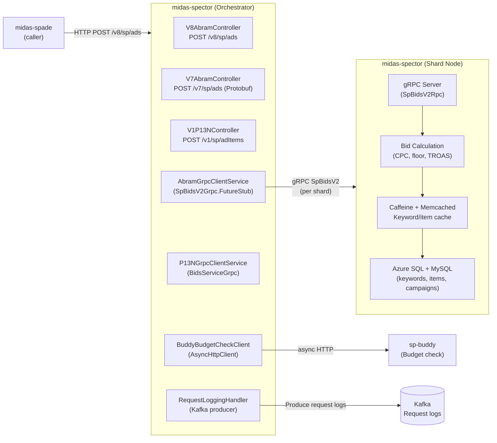
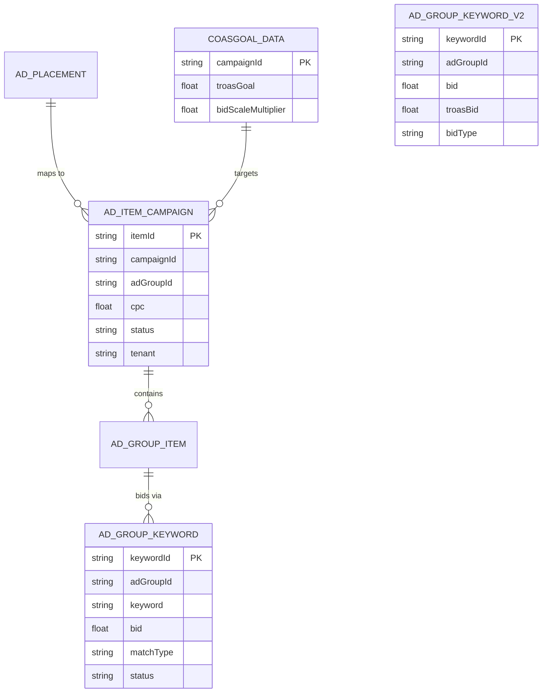
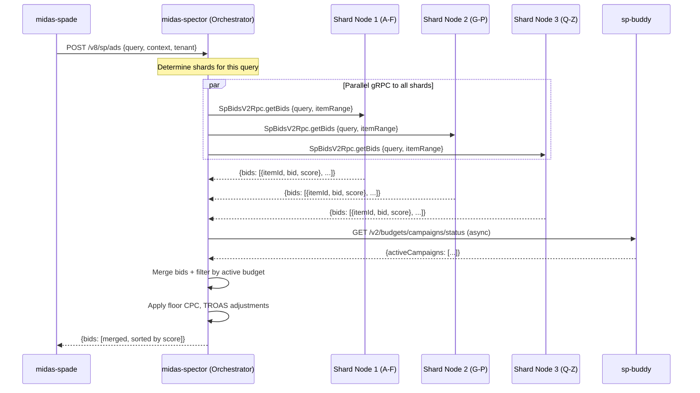
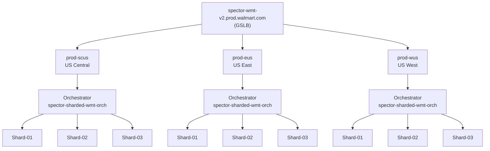

# Chapter 12 — midas-spector (Sharded Bidding Engine)

## 1. Overview

**midas-spector** is a **sharded, gRPC-based bidding engine** for Walmart Sponsored Products. It uses a coordinator-shard architecture where an orchestrator node receives ad requests, fans them out via gRPC to multiple shard nodes (each holding a slice of campaign/keyword data), merges results, and returns bid candidates. This horizontal sharding provides low-latency, high-throughput bid retrieval.

- **Domain:** Sharded Real-Time Bidding
- **Tech:** Java 17, Spring Boot 2.6.6, gRPC 1.52, Protobuf, AsyncHttpClient
- **WCNP Namespace:** `midas-spector` (dev/stage); `bids-service-sharded` (prod)
- **Port:** 8080
- **Architecture:** Orchestrator + N Shard nodes (WCNP pod-based sharding)

### Name Origin

**Spector** = **SP**onsored Products Sel**ector** — a bids service that picks the best bid out of all bids available in the Ads inventory for a specific item. The list of items received from upstream services (search or P13N) contains one or more ad items.

---

## 2. Architecture Diagram



---

## 3. API / Interface

| Method | Path | Protocol | Description |
|--------|------|----------|-------------|
| POST | `/v8/sp/ads` | Protobuf/JSON | Abram v8 bidding (latest) |
| POST | `/v7/sp/ads` | Protobuf | Abram v7 bidding |
| POST | `/v7/sp/ads/asJson` | JSON | Abram v7 bidding (JSON) |
| POST | `/v6/sp/ads` | JSON | Abram v6 bidding |
| POST | `/v4/sp/ads` | JSON | Abram v4 bidding |
| POST | `/v1/sp/adItems` | Protobuf/JSON | P13N (Personalization) bidding |
| POST | `/v4/internal/sp/ads` | JSON | Internal v4 API |
| POST | `/v4/internal/protobuf/sp/ads` | Protobuf | Internal v4 Protobuf |
| GET | `/app-config/{module}` | JSON | CCM config by module |
| GET | `/health` | JSON | Health check |

**Production REST endpoints (from Confluence):**

| Endpoint | Purpose |
|----------|---------|
| `GET /v1/sp/adItems` | Legacy SP ad items API |
| `GET /v5/sp/ads` | SP ads API v5 |
| `GET /v8/sp/ads/asJson` | SP ads API v8 (JSON format) |
| `GET /admin/app-config` | CCM configuration endpoint |

**gRPC services (shard nodes):**
- `SpBidsV2Rpc` — v2 sharded bids
- `SpBidsRpc` — standard bids
- `BidsServiceRpc` — P13N bids
- `HealthGrpcClientService` — gRPC health

---

## 4. Data Model



---

## 5. Inter-Service Dependencies

```mermaid
graph TD
  midas_spade["midas-spade\n(HTTP caller)"]
  spector["midas-spector (Orch)"]
  shard["midas-spector (Shard × N)"]
  buddy["sp-buddy\n(BuddyBudgetCheckClient)"]
  kafka["Kafka\n(request logs)"]
  azure_sql[("Azure SQL\nkeywords, items")]
  memcached[("Memcached\nbid cache)"]

  midas_spade -->|"HTTP POST /v8/sp/ads"| spector
  spector -->|"gRPC SpBidsV2Rpc\n(per shard)"| shard
  spector -->|"async HTTP budget check"| buddy
  spector -->|"Produce request logs"| kafka
  shard -->|"JDBC"| azure_sql
  shard -->|"Caffeine + Memcached"| memcached
```

---

## 6. Configuration

| Config Key | Default | Description |
|-----------|---------|-------------|
| `wmt.default.floor.cpc` | `0.2` | Floor CPC for WMT |
| `gr.default.floor.cpc` | `0.2` | Floor CPC for Grocery |
| `supported.tenants` | `"WMT"` | Tenant support list |
| `spector.server.v4.ads.api.timeout` | `100ms` | Server-side timeout |
| `spector.client.v4.ads.api.timeout` | `110ms` | Client-side timeout |
| `query.fetch.size` | `5000` | Max query results |
| `sharding.usegrpc` | (env-based) | Enable gRPC sharding |
| `sharding.useprotobuf` | (env-based) | Use Protobuf encoding |

**Spring profiles:** `local`, `wcnp_dev`, `wcnp_stage`, `wcnp_prod`, `wcnp_dev_orch`, `wcnp_prod_orch`, `wcnp_dev_shard`, `wcnp_prod_shard`

---

## 7. Example Scenario — Sharded Bid Retrieval



---

## 8. Production Deployment Architecture

### Overview

**Tenant:** WMT (Walmart)
**WCNP Namespace:** `bids-service-sharded`
**GSLB Endpoint (prod):** `spector-wmt-v2.prod.walmart.com`

**Data Centers:**

| DC | Cluster | Region | Status |
|----|---------|--------|--------|
| prod-scus | uscentral-prod-az-031 | US Central | Active |
| prod-eus | useast-prod-az-019 | US East | Active |
| prod-wus | uswest-prod-az-064 | US West | Active |

### Traffic Flow



ASCII reference:

```
                    ┌─────────────────────────────────┐
                    │  spector-wmt-v2.prod.walmart.com │
                    │             (GSLB)              │
                    └───────────────┬─────────────────┘
                                    │
           ┌────────────────────────┼────────────────────────┐
           │                        │                        │
           ▼                        ▼                        ▼
    ┌─────────────┐          ┌─────────────┐          ┌─────────────┐
    │  prod-scus  │          │  prod-eus   │          │  prod-wus   │
    │ US Central  │          │  US East    │          │  US West    │
    └──────┬──────┘          └──────┬──────┘          └──────┬──────┘
           │                        │                        │
           ▼                        ▼                        ▼
    ┌─────────────┐          ┌─────────────┐          ┌─────────────┐
    │ Orchestrator│          │ Orchestrator│          │ Orchestrator│
    └──────┬──────┘          └──────┬──────┘          └──────┬──────┘
           │                        │                        │
     ┌─────┼─────┐            ┌─────┼─────┐            ┌─────┼─────┐
     │     │     │            │     │     │            │     │     │
     ▼     ▼     ▼            ▼     ▼     ▼            ▼     ▼     ▼
   [S1]  [S2]  [S3]         [S1]  [S2]  [S3]         [S1]  [S2]  [S3]
```

**Total per region:** 1 orchestrator + 3 shards × 8–16 replicas = up to 48 shard pods per region

### Orchestrator Resource Profile (`spector-sharded-wmt-orch`)

| Property | Value |
|----------|-------|
| CPU | 3000m (request & limit) |
| Memory | 12288Mi (12Gi) |
| Replicas | 10–15 per region |
| Scaling Trigger | 50% CPU utilization |
| Istio Sidecar CPU | 3000m |
| Deployment | Flagger-based canary (rollback on error enabled) |

### Shard Resource Profiles (`spector-sharded-wmt-01/02/03`)

Three shards handle the actual ad serving logic, each managing a partition of the data.

| Property | Shard-01 | Shard-02 | Shard-03 |
|----------|----------|----------|----------|
| CPU | 5000m | 5000m | 5000m |
| Memory | 28Gi | 28Gi | 28Gi |
| Replicas | 8–16 | 8–16 | 8–16 |
| Shard ID | 1 | 2 | 3 |
| Istio Sidecar CPU | 2000m | 2000m | 2000m |

### Deployment Strategy

- **Strategy:** Flagger-based canary; rollback on error enabled, skip analysis disabled
- **KITT config:** `kitt/wmt/kitt.wmt.deploy.yml`
- **Orchestrator config:** `kitt/wmt/app/kitt.orchestrator.yml`
- **Shard config:** `kitt/wmt/app/kitt.sharded.yml`

---

## 9. External Dependencies

| Dependency | Details |
|------------|---------|
| **Kafka** | Event streaming; TLS secured (keystore + truststore from Akeyless) |
| **JDBC** | Database connections via `/secrets/jdbc.properties` |
| **CCM** | Runtime config management; label `ccm.serviceConfigVersion: PROD-1.0` |
| **Akeyless** | Secrets path: `/Prod/WCNP/homeoffice/GEC-LabsAccessWPA`; provides `jdbc.properties`, `kafka.properties`, `kafka-keystore.pem`, `kafka-truststore.pem`, `general.properties` |
| **Azul Profiling** | `gateway-azul.prod.walmart.com:443` — JVM performance profiling |
| **Istio** | mTLS + traffic management; sidecar on all pods |

---

## 10. Repository & Infrastructure References

| Resource | Location |
|----------|----------|
| Git repo | `gecgithub01.walmart.com/labs-ads/midas-spector` |
| WCNP namespace | `bids-service-sharded` |
| KITT directory | `kitt/wmt/` |
| GSLB endpoint | `spector-wmt-v2.prod.walmart.com` |
