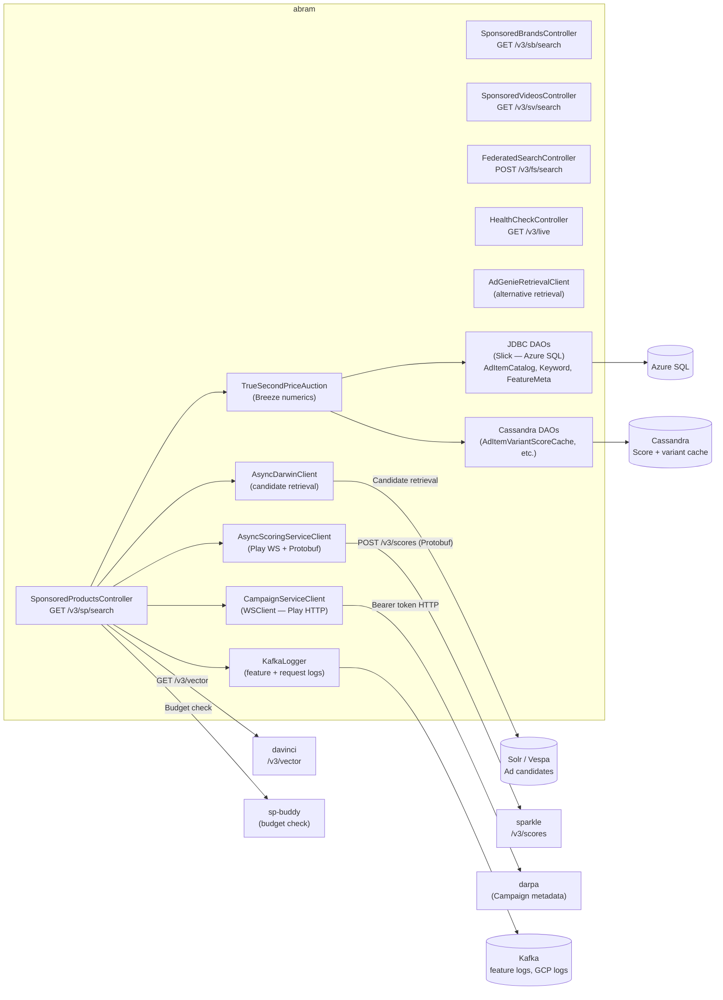
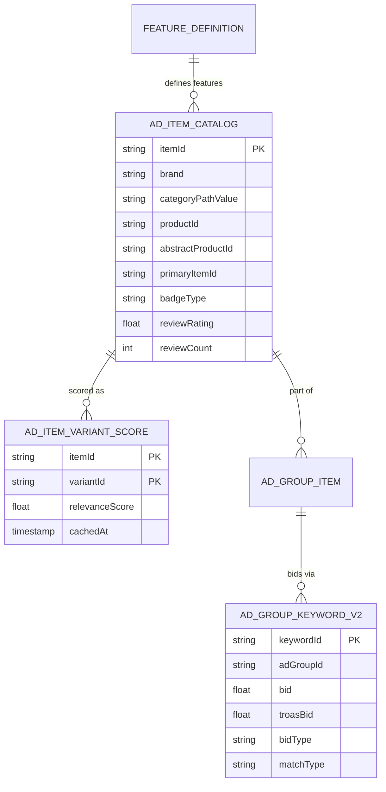
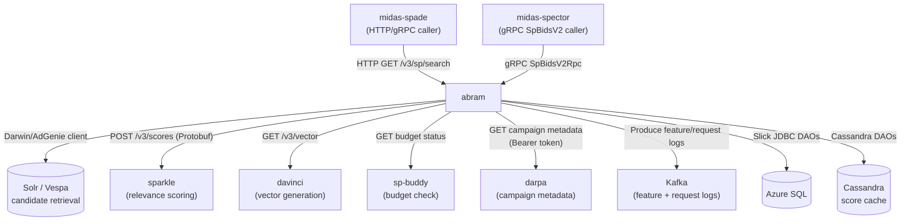
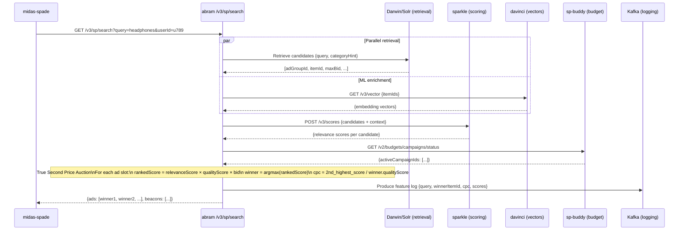
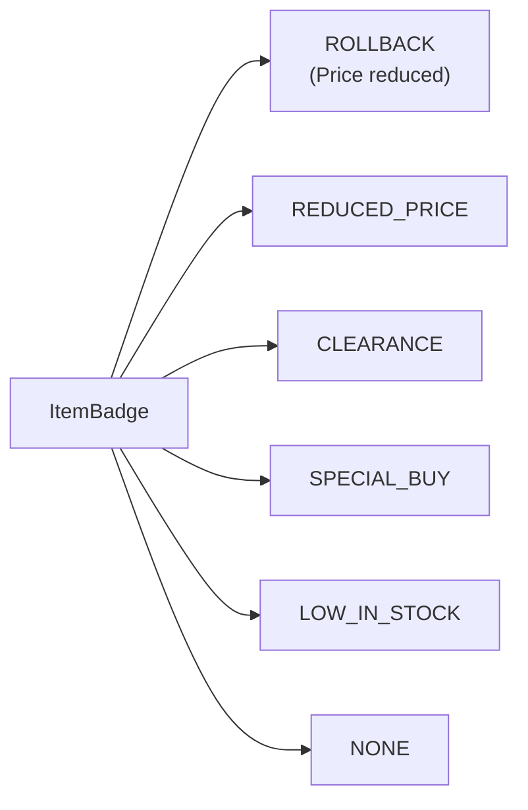
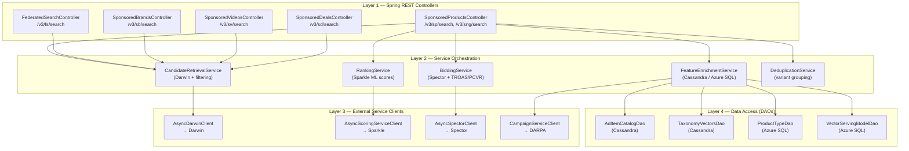
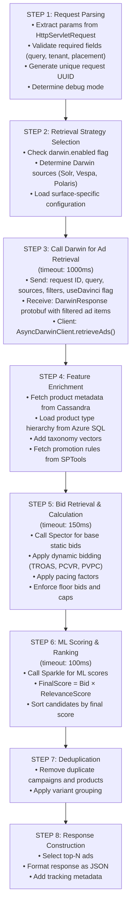

# Chapter 13 — abram (Auction-Based Realtime Ad Matching)

## 1. Overview

**abram** (Auction-Based Realtime Ad Matching) is the **core auction engine** for Walmart Sponsored Products. It retrieves ad candidates from Solr/Vespa, scores them with **sparkle**, fetches embedding vectors from **davinci**, runs a True Second Price (TSP) auction, and returns a ranked set of winning ads. It is the deepest and most computationally intensive service in the ad serving stack.

AbRAM = **Auction based Realtime Ad Matching** — Walmart's real-time ad serving platform.

**Core Responsibilities:**
- Request Handling: orchestrates multiple external services
- Service Integration: calls Darwin (retrieval), Sparkle (scoring), Spector (bidding)
- Feature Enrichment: fetches product metadata from Cassandra and Azure SQL
- Bidding & Pacing: applies TROAS, PCVR dynamic bidding and budget pacing
- Ranking & Auction: combines relevance scores with bids for true second-price auction
- Deduplication: removes duplicate ads, applies variant grouping
- Response Construction: formats top-N ads with tracking metadata

**Key Capabilities:**
- Multi-Surface Support: SP, SB (Sponsored Brands), SV (Sponsored Videos), SD (Sponsored Deals), FS (Federated Search), Scan & Go
- Sub-second latency: p99 < 1000ms (target p99 < 500ms)
- High configurability: surface-specific and placement-specific configuration
- Resilience: circuit breakers, timeouts, graceful degradation

- **Domain:** Real-Time Auction & Ad Ranking
- **Tech:** Scala 2.12 + Java 17, Play Framework 2.7, Akka, Slick (DB), Kafka
- **WCNP Namespace:** `abram-service` (also deployed as `sp-abram-wmt`)
- **Port:** 9001 (exposed as 8080 via ingress)
- **Repo:** `gecgithub01.walmart.com/labs-ads/abram`
- **Regions:** SCUS, EUS2, WUS2

---

## 2. Architecture Diagram



---

## 3. API / Interface

| Method | Path | Description |
|--------|------|-------------|
| GET | `/v3/sp/search` | Sponsored Products ad search |
| POST | `/v3/sng/search` | SP negative keyword search |
| GET | `/v3/sb/search` | Sponsored Brands search |
| GET | `/v3/sv/search` | Sponsored Video search |
| GET | `/v3/sd/search` | Sponsored Deals search |
| POST/GET | `/v3/fs/search` | Federated Search |
| GET | `/v3/live` | Liveness probe |
| GET | `/v3/healthcheck` | Readiness probe |

**Key request parameters:** `query`, `userId`, `tenant`, `pageContext`, `moduleLocation`, `targetingType`
**Response models:** `SponsoredProductsResponse`, `SponsoredBrandsResponse`, `SponsoredVideosResponse`

---

## 4. Data Model



---

## 5. Inter-Service Dependencies



---

## 6. Configuration

| Config Key | Description |
|-----------|-------------|
| `general.campaignServiceHost` | DARPA base URL |
| `general.campaign.service.authToken` | DARPA bearer token |
| `general.cassandra.*` | Cassandra credentials |
| `general.azsql.*` | Azure SQL credentials |
| `kafka.*` | Kafka brokers, SSL, topics |
| `kafkaGCPBrokers` | GCP Kafka for feature logging |
| `akka.http.parsing.max-uri-length` | `16k` — large query params |
| `server.tomcat.threads.max` | 200 (stage) / 300 (prod) |

---

## 7. Example Scenario — True Second Price Auction



---

## 8. ItemBadge Enum (Domain-specific)



---

## 9. Detailed Architecture

### 9.1 Four-Layer Component Model



### 9.2 Multi-Surface API Endpoints

| Surface | Endpoint | Controller | Key Features |
|---------|----------|-----------|--------------|
| Sponsored Products | `/v3/sp/search`, `/v3/sng/search` | `SponsoredProductsController` | Item-level targeting, Sparkle ranking, TROAS/PCVR bidding, position-specific optimization |
| Federated Search | `/v3/fs/search` | `FederatedSearchController` | Multi-source aggregation, cross-vertical ad serving, deduplication |
| Sponsored Brands | `/v3/sb/search` | `SponsoredBrandsController` | Brand-level targeting, Brand Amplification logic, SBA auction |
| Sponsored Videos | `/v3/sv/search` | `SponsoredVideosController` | Video-specific eligibility, product type filtering, content validation |
| Sponsored Deals | `/v3/sd/search` | `SponsoredDealsController` | Deal eligibility, promotion-based filtering, time-sensitive handling |

**Administrative Endpoints:**
- `GET /` — Service root ("w00t")
- `GET /v3/healthcheck` — Detailed health check (K8s readiness probe)
- `GET /v3/live` — Liveness probe
- `GET /admin/app-config` — Application configuration
- `GET /admin/ccm-config` — CCM configuration

### 9.3 8-Step Request Processing Pipeline



### 9.4 External Service Dependencies (Detailed)

| Service | Role | App Key / Base URL | Client Class | Timeout | Notes |
|---------|------|--------------------|--------------|---------|-------|
| **Darwin** | Ad retrieval & filtering | App Key: `SP-DARWIN-WMT` | `AsyncDarwinClient` | 1000ms | Sends sources (Solr, Vespa, Polaris), receives `DarwinResponse` protobuf. AbRAM does NOT call DaVinci directly — Darwin calls DaVinci when `useDavinci=true` |
| **Sparkle** | ML-based relevance scoring | `http://sparkle-wmt.prod.walmart.com` | `AsyncScoringServiceClient` | 1000ms | Endpoint `/v1/scores`; called after bid retrieval. Ranking: `FinalScore = Bid × SparkleScore`. Supports batch scoring |
| **Spector** | Bid retrieval & dynamic bidding | `spector-wmt-v2.prod.walmart.com` | `AsyncSpectorClient` | 150ms | Steps: (1) retrieve base bids, (2) apply TROAS, (3) apply PCVR/PVPC, (4) enforce floor bids, (5) apply pacing |
| **DARPA** (Campaign Service) | Campaign metadata & eligibility | configured via `general.campaignServiceHost` | `CampaignServiceClient` | — | Bearer token auth; provides campaign metadata |
| **SPTools** | Promotion rules & ad badges | — | — | — | Fetched during feature enrichment step |
| **DaVinci** | Relevance scoring (vectors) | `GET /v3/vector` | (called via Darwin) | — | AbRAM may call directly for vector enrichment; Darwin also calls DaVinci internally |
| **sp-buddy** | Budget check | — | — | — | `GET /v2/budgets/campaigns/status` |

### 9.5 Data Stores

**Cassandra Tables**

| Table | Purpose | TTL |
|-------|---------|-----|
| `ads_item_store` | Ad item catalog: product metadata, ratings, attributes | 3 days |
| `anchor_item_info_v3` | Anchor item relationships for complementary products | — |
| `table_sba_signals` | Sponsored Brand Amplifier signals | — |
| `taxonomy_vectors` | Category taxonomy embeddings | — |
| `AdItemVariantScoreCache` | Variant relevance score cache (from § 4 data model) | — |

**Azure SQL Database: `sp-ad-serving`**

| Category | Tables / Purpose |
|----------|-----------------|
| Product Type | Hierarchy and mappings (`ProductTypeDao`) |
| Taxonomy | Category relationships |
| Vector Serving Models | ML model metadata (`VectorServingModelDao`) |
| Ad Item Catalog | Item metadata, keywords, feature definitions (accessed via Slick JDBC) |

**Azure Blob Storage**

| Container | Contents |
|-----------|----------|
| `midas-trained-models` | ML models (MLeap format) |
| `sp-troas-config` | TROAS placement configuration |
| `sp-db-config` | Dynamic bidding configuration |

### 9.6 Performance Characteristics

| Component | Target Latency | Max Latency |
|-----------|---------------|-------------|
| End-to-end (p99) | < 500ms | < 1000ms |
| Darwin retrieval | < 250ms | 1000ms |
| Sparkle scoring | < 100ms | 1000ms |
| Spector bidding | < 150ms | 300ms |

Throughput: 1000s of requests/second per instance; 500+ concurrent connections per retriever.

### 9.7 Configuration Layers

Configuration is applied in the following precedence order (lowest to highest):

1. **Application Defaults** — `common.defaults.conf`
2. **Environment-Specific (CCM)** — `non-prod-1.0-ccm.yml`, `prod-1.0-ccm.yml`
3. **Surface-Specific** — `properties/` directory
4. **Runtime Overrides** — System Properties, request parameters

Key CCM properties:

```
darwin.enabled=true
darwin.timeout=1000
sparkle.base.url=http://sparkle-wmt.prod.walmart.com
sparkle.timeout=1000
spector.host=http://spector-wmt-v2.qa.walmart.com
spector.V4.enabled=true
variantBidding.enabled=true
troas.enabled=true
```

Full CCM path (prod): `ccm/wmt/prod-1.0-ccm.yml`

### 9.8 Deployment

| Attribute | Value |
|-----------|-------|
| WCNP Namespace | `sp-abram-wmt` |
| Regions | SCUS, EUS2, WUS2 |
| Repo | `gecgithub01.walmart.com/labs-ads/abram` |
| CCM (prod) | `ccm/wmt/prod-1.0-ccm.yml` |
| K8s readiness probe | `GET /v3/healthcheck` |
| K8s liveness probe | `GET /v3/live` |
