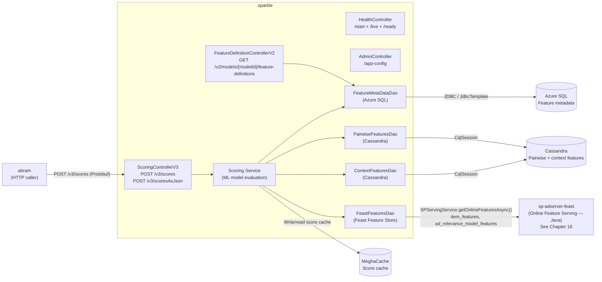
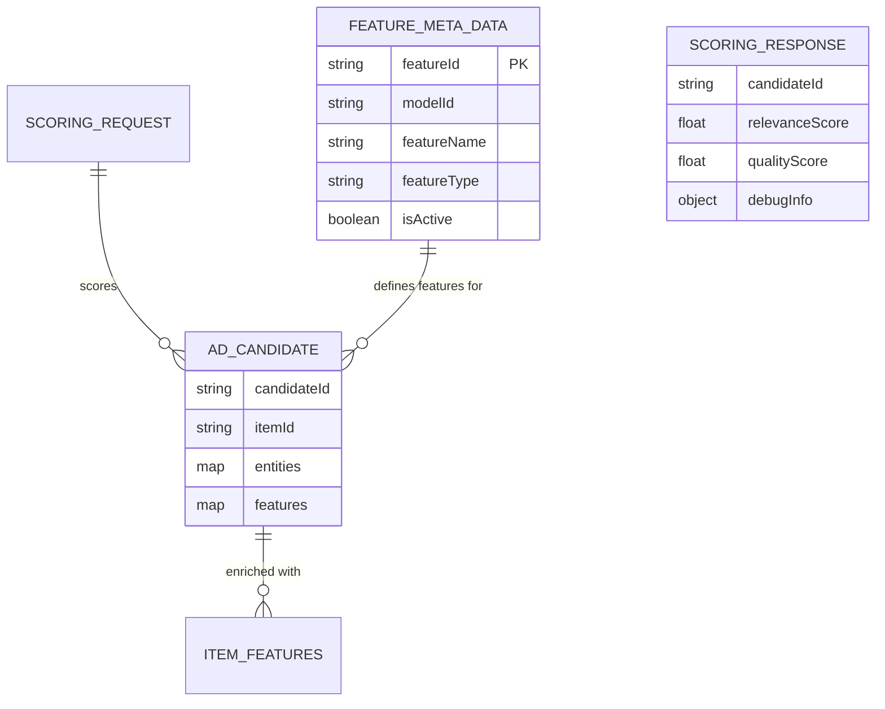
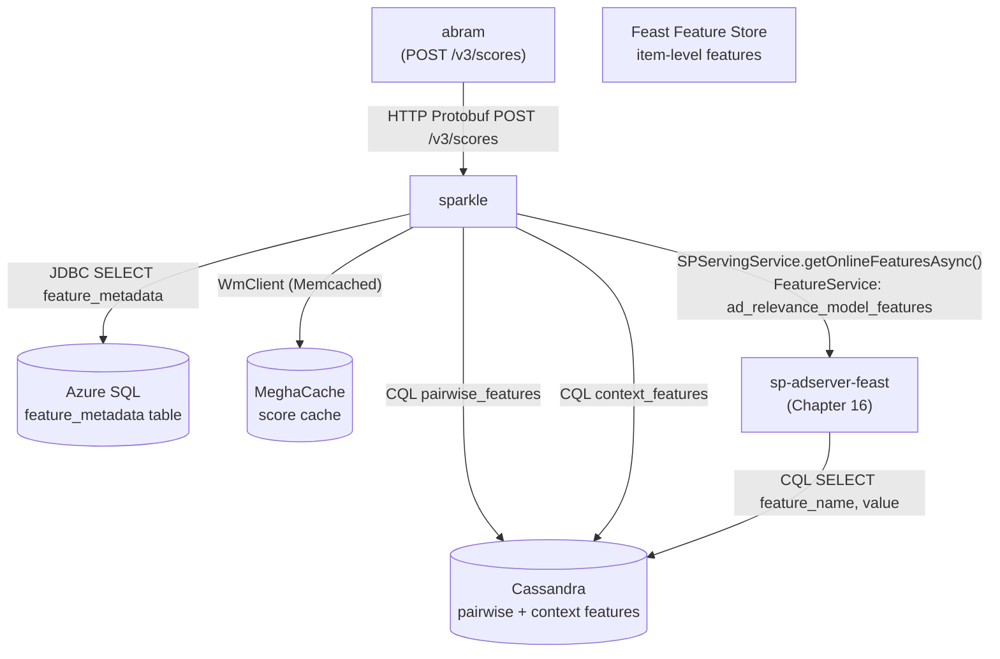
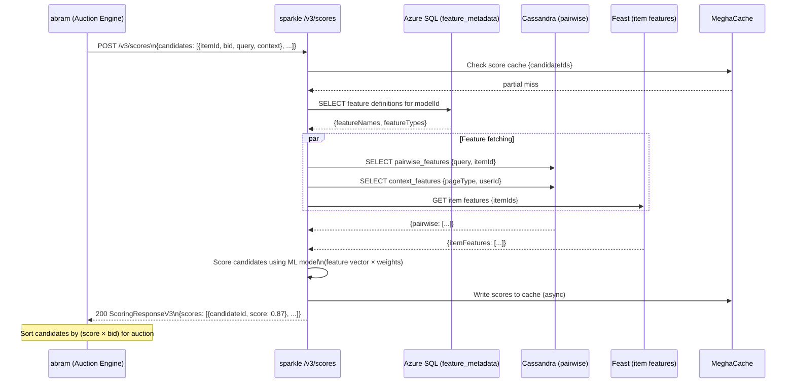

# Chapter 14 — sparkle (Relevance Scoring Service)

## 1. Overview

**sparkle** is the **ad relevance scoring engine** for Walmart Sponsored Products. Given a set of ad candidates, it computes relevance scores using ML feature data sourced from Cassandra, Azure SQL, and the **sp-adserver-feast** online feature store (Chapter 16). Scores are consumed by **abram** to rank ad candidates before auction. It also serves feature definitions used during scoring model evaluation.

> **Feature Store note:** The "Feast Feature Store" reference in this service maps to **`sp-adserver-feast`** (Chapter 16) — a Java Spring Boot service that wraps Apache Feast and serves pre-computed item features from Cassandra (`midas` keyspace). Features are batch-computed by **`element-adserver-feast`** (Chapter 17).

- **Domain:** ML-Driven Relevance Scoring
- **Tech:** Java 21, Spring Boot 3.5.0, Cassandra 4.19, sp-adserver-feast (Feast), Protobuf
- **WCNP Namespace:** `sparkle-wmt`
- **Port:** 8080
- **Swagger:** `https://sparkle-wmt.prod.walmart.com/docs`

---

## 2. Architecture Diagram



---

## 3. API / Interface

| Method | Path | Protocol | Description |
|--------|------|----------|-------------|
| POST | `/v3/scores` | Protobuf | Compute relevance scores (Protobuf response) |
| POST | `/v3/scoresAsJson` | JSON | Compute relevance scores (JSON response) |
| GET | `/v2/models/{modelId}/feature-definitions` | JSON | Get feature definitions for a model |
| GET | `/start` | JSON | K8s startup probe |
| GET | `/live` | JSON | K8s liveness probe |
| GET | `/ready` | JSON | K8s readiness probe |
| GET | `/app-config` | JSON | All CCM config modules |
| GET | `/app-config/{module}` | JSON | Config by module |

**Request:** `ScoringRequestV3` — contains ad candidates with `AdCandidate` objects (candidateId, itemId, features)
**Response:** `ScoringResponseV3` — per-candidate relevance scores (float)

---

## 4. Data Model



---

## 5. Inter-Service Dependencies



---

## 6. Configuration

| Config Key | Description |
|-----------|-------------|
| `azureSql.host` | Azure SQL hostname |
| `azureSql.dbName` | Database name |
| `cassandra.host/port` | Cassandra cluster |
| `runtime.context.appName` | `sparkle-service` |
| `ccm.configs.dir` | CCM config directory |
| `scm.server.access.enabled` | SCM integration toggle |
| `spring.profiles.active` | `local`, `stg`, `prod`, `wcnp_*` |
| `efs_sdk_env` | EFS (Element Feature Store) SDK environment; JVM system property added to all deploy stages (Apr 2026) |
| `localDcUPS` | Local DC UPS (User Preference Service) endpoint; JVM system property for Cassandra DC-aware routing |

### EFS SDK Integration (Apr 2026)

Sparkle now integrates with the **Element Feature Store (EFS) SDK** to fetch the model registry
at service startup. This enables the scoring service to discover active model configurations
(model IDs, feature sets, thresholds) without requiring a code deploy.

**JVM system properties added to all deploy stages (`sr.yaml`):**
```
-Defs_sdk_env=<env>
-DlocalDcUPS=<dc-endpoint>
```

The `EFS Integration to fetch registry on bootup` change means that on pod startup, Sparkle
contacts the EFS SDK to load the current model registry, which determines which ML models are
active for CTR/CVR scoring. Previously this was baked into the Spring application context.
Akeyless secrets integration is also live in non-prod environments (production pending).

---

## 7. Example Scenario — Scoring Ad Candidates


