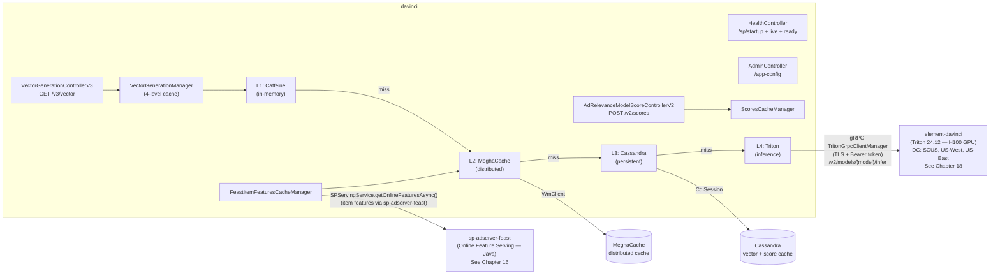
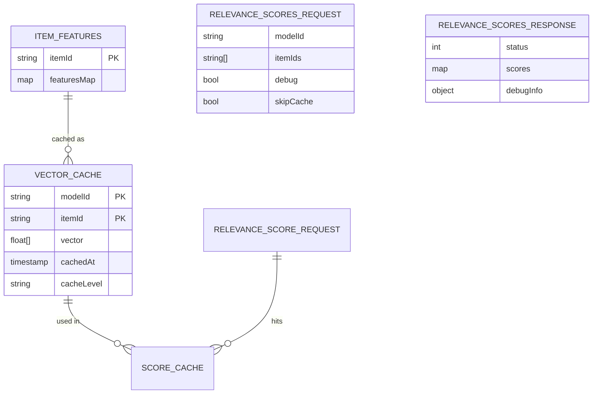
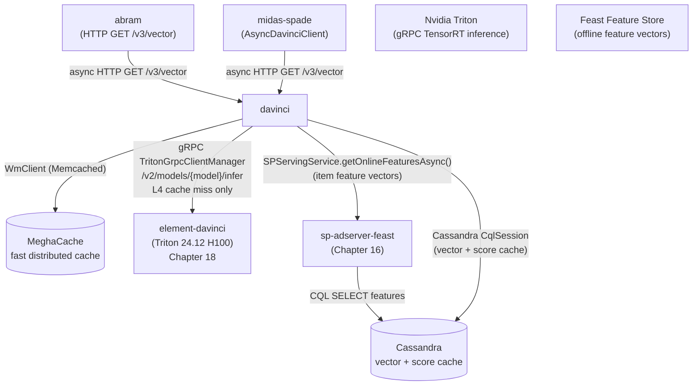
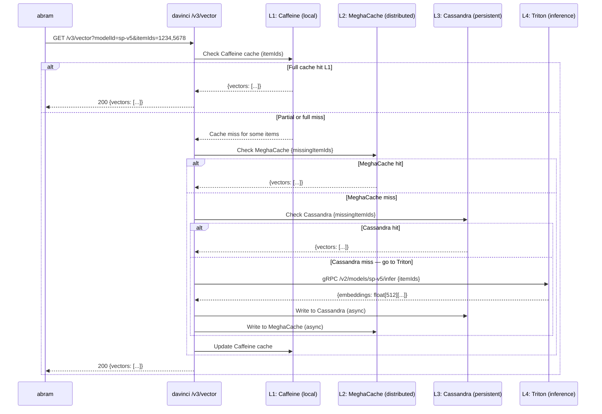

# Chapter 15 — davinci (ML Vector & Scoring Platform)

## 1. Overview

**davinci** is the **machine learning inference platform** for Walmart Sponsored Products. It generates dense embedding vectors for ad items and produces ad relevance scores using Nvidia Triton inference servers. It uses a 4-level caching architecture (Caffeine → MeghaCache → Cassandra → Triton) to maximize cache hit rate at ultra-low latency.

> **Architecture note:** `davinci` is a **Java caching and routing layer**. The actual ML inference happens in **`element-davinci`** (Chapter 18) — an NVIDIA Triton 24.12 server running ensemble models on H100 GPUs. davinci calls element-davinci via gRPC only on L3 cache miss.

- **Domain:** ML Inference — Vector Generation & Ad Relevance Scoring
- **Tech:** Java 21, Spring Boot 3.5.0 (WebFlux), gRPC (Triton), sp-adserver-feast (feature store)
- **WCNP Namespace:** `ss-davinci-wmt`
- **Port:** 8080
- **Swagger:** `https://davinci-wmt.prod.walmart.com/docs`
- **Triton Backend:** `element-davinci` (Chapter 18) — 16 H100 GPU replicas across 3 Azure DCs

---

## 2. Architecture Diagram

---

## 3. API / Interface

| Method | Path | Protocol | Parameters | Description |
|--------|------|----------|-----------|-------------|
| GET | `/v3/vector` | Protobuf | `modelId`, `itemIds`, `skipCache` | Generate item embedding vectors (v3, 4-level cache) |
| GET | `/v3/vector/asJson` | JSON | `modelId`, `itemIds`, `skipCache` | Same as above, JSON response |
| GET | `/v2/vector` | JSON | `modelId`, `itemIds` | Vector generation v2 |
| GET | `/vector` | JSON | `modelId`, `itemIds` | Vector generation v1 |
| POST | `/v2/scores` | JSON | `RelevanceScoresRequest` | Ad relevance scoring v2 |
| POST | `/scores` | JSON | `RelevanceScoresRequest` | Ad relevance scoring v1 |
| GET | `/sp/startup` | JSON | — | K8s startup probe |
| GET | `/sp/live` | JSON | — | K8s liveness probe |
| GET | `/sp/ready` | JSON | — | K8s readiness probe |
| GET | `/app-config` | JSON | — | All CCM configs |
| GET | `/app-config/{module}` | JSON | `module` | Config by module |

**`skipCache`:** Forces bypass of L1/L2/L3, going directly to Triton. Used for testing and cache warming.

---

## 4. Data Model

---

## 5. Inter-Service Dependencies

---

## 6. Configuration

| Config Key | Description |
|-----------|-------------|
| `triton.grpc.header.seldon` | Seldon model serving header |
| `triton.grpc.header.namespace` | K8s namespace for Triton routing |
| `secrets.tritonAuthToken` | Bearer token for Triton auth |
| `spring.profiles.active` | `local`, `stg`, `prod`, `wcnp_*` |
| `spring.mvc.async.request-timeout` | 10000ms (local) |

**Triton DC routing:**
| DC | Endpoint |
|----|----------|
| South Central US | `ss-davinci-triton-prod.ss-davinci-wmt.uscentral-prod-az-332.cluster.k8s.us.walmart.net` |
| US West | `ss-davinci-triton-prod.ss-davinci-wmt.uswest-prod-az-328.cluster.k8s.westus2.us.walmart.net` |
| US East | `ss-davinci-triton-prod.ss-davinci-wmt.eus2-prod-a10.cluster.k8s.us.walmart.net` |

### Active Model Registry (prod CCM — Apr 2026)

| Model ID | Output Tensors | Batch Size | Feature Inputs | Notes |
|----------|---------------|------------|---------------|-------|
| `universal_r1_ensemble_model_relevance_v1` | `["score"]` | 80 | `adName` | Stable DeBERTa baseline |
| `universal_r1_ensemble_model_relevance_deberta_base` | `["score"]` | 16 | `adName` | DeBERTa base variant |
| `universal_l1_r1_ensemble_model_relevance_v1` | `["score", "l1_rank_score"]` | 16 | 20 features (see below) | **L1 ranker A/B variant 1** |
| `universal_l1_r1_ensemble_model_relevance_v1_rel` | `["score", "l1_rank_score"]` | 16 | 20 features | **L1 ranker A/B variant 2** |
| `universal_l1_r1_ensemble_model_relevance_v1_25_75` | `["score", "l1_rank_score"]` | 16 | 20 features | **L1 ranker A/B variant 3 (25/75 split)** |

**L1 Ranker model features** (20 inputs via `feast.model.features` CCM key):

| Feature | Type | Default | Description |
|---------|------|---------|-------------|
| `adName` | `BYTES` | — | Ad title text |
| `adWmtConvRate30dV2` | `FP32` | 0.0 | 30-day WMT conversion rate |
| `adWpaCtr30d` | `FP32` | 0.0 | 30-day WPA CTR |
| `adWpaCtr30dPageSearch` | `FP32` | 0.0 | 30-day CTR on search page |
| `adWpaCtr30dPageSearchIngrid` | `FP32` | 0.0 | In-grid search CTR |
| `adWpaCtr30dPageSearchIngridBkt1/2/4` | `FP32` | 0.0 | In-grid CTR by bucket (1, 2, 4) |
| `adOrgCtr30d` | `FP32` | 0.0 | 30-day organic CTR |
| `adSiteQltyScoreNbr` | `FP32` | 0.0 | Site quality score |
| `adPriceAmt` | `FP32` | 0.0 | Ad item price |
| `adWpaAtcrMixSearch` / `adWpaCtrMixSearch` | `FP32` | 0.0 | Mixed search ATCR / CTR |
| `adWpaAtcrMixItem` | `FP32` | 0.0 | Mixed item ATCR |
| `adOrderToProdViewRatio4Wk` / `12Wk` | `FP32` | 0.0 | Order-to-view ratio (4w / 12w) |
| `adWpaSpend1d` / `7d` | `FP32` | 0.0 | 1-day / 7-day WPA spend |
| `adWpaViews1d` / `7d` | `FP32` | 0.0 | 1-day / 7-day WPA views |

The L1 ranker models return **dual output tensors**: `score` (DeBERTa relevance, 0.0–1.0) and
`l1_rank_score` (L1 ranking signal). The sp-adserver-feast service has a dedicated feature service
for these L1 variants (`l1-var` branch → merged to main).

---

## 7. Example Scenario — Vector Generation with 4-Level Cache

