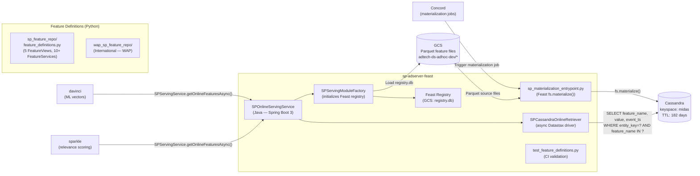
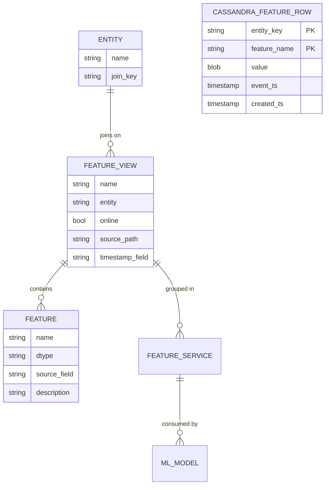
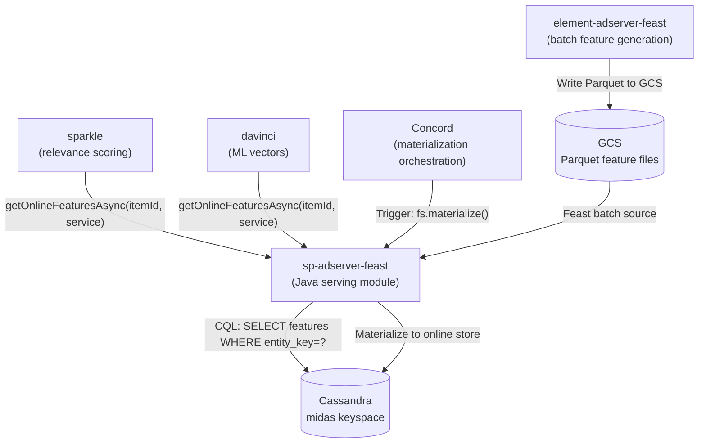
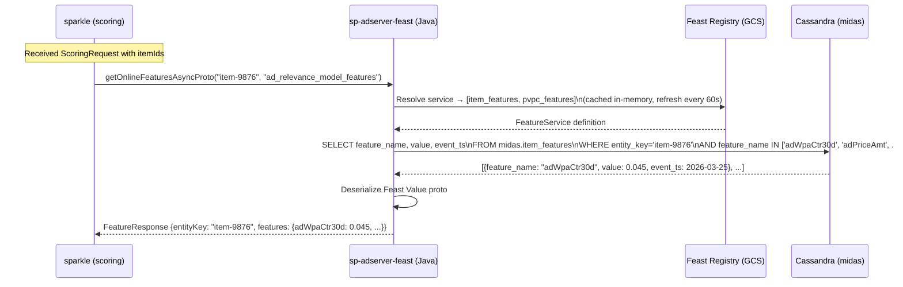
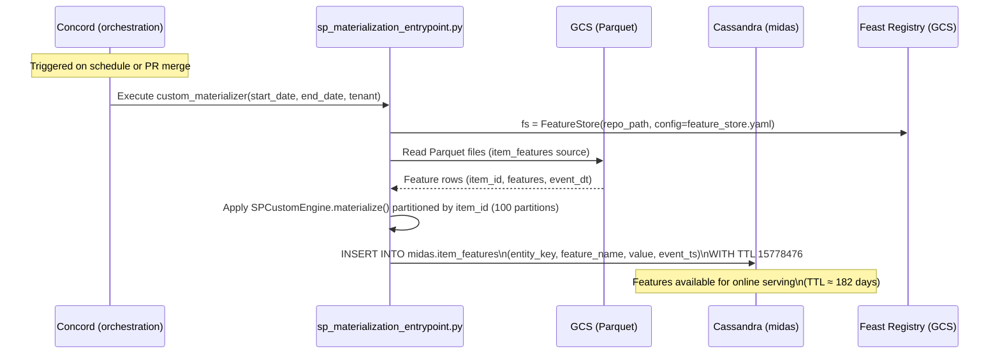

# Chapter 16 — sp-adserver-feast (Online Feature Serving)

## 1. Overview

**sp-adserver-feast** is the **online feature store serving layer** for Walmart Sponsored Products. It wraps Apache Feast, exposing a Java/gRPC API that retrieves pre-computed ML features from Cassandra at millisecond latency for ad relevance models. Features are defined once in Python (`feature_definitions.py`) and consumed by **sparkle** and **davinci** during real-time inference.

- **Domain:** Online Feature Store — ML Feature Serving
- **Tech:** Java 17 + Spring Boot 3 (serving module), Python 3 (Feast feature definitions + materialization)
- **Online Store:** Cassandra (`midas` keyspace)
- **Offline Store:** GCS Parquet files → materialized via Feast
- **WCNP:** Deployed as a library/sidecar — consumed by sparkle and davinci pods
- **Port:** gRPC (internal)

---

## 2. Architecture Diagram



---

## 3. API / Interface

**Java Service Methods (`SPServingService`):**

| Method | Signature | Description |
|--------|-----------|-------------|
| `getOnlineFeaturesAsync` | `(String id, String service) → CompletableFuture<CassandraFeatures>` | Retrieve features as Java Map |
| `getOnlineFeaturesAsyncProto` | `(String id, String service) → CompletableFuture<FeatureResponse>` | Retrieve as Protobuf |
| `getOnlineFeaturesForTenantAsyncProto` | `(String id, String service, String tenant) → CompletableFuture<FeatureResponse>` | Multi-tenant retrieval |
| `getServiceNamesForFeatures` | `(List<String> features, String consumer) → List<String>` | Resolve feature service names |
| `getEntityNames` | `() → Set<String>` | Get all registered entities |

**Protobuf Response:**
```protobuf
message FeatureResponse {
  string entityKey = 1;
  int64 eventTs = 2;
  map<string, feast.types.Value> features = 3;
}
```

**Cassandra Query (Low-level):**
```sql
SELECT feature_name, value, event_ts
FROM midas.{featureViewName}
WHERE entity_key = :itemId
AND feature_name IN :features
```

---

## 4. Data Model



**FeatureViews registered (sp_feature_repo):**

| FeatureView | Entity | # Fields | Source (GCS Parquet) | Description |
|-------------|--------|-----------|---------------------|-------------|
| `item_features` | item (item_id) | 50+ | `ds_wpa_ad_item_features_new_flattened` | Core item ad features (CTR, sales, price) |
| `cnsldv2_features` | item | ~20 | `cnsldv2_item_features` | Consolidated v2 item features |
| `items_rate_features` | item | ~15 | `ds_wpa_ad_items_rate_features_v2` | Rate-based features |
| `pvpc_features` | item | ~10 | `item_pvpc_features` | Price/value/position features |
| `item_quality_features` | item | ~10 | `item_quality_features` | Quality score features |

**FeatureServices (10+ registered):**

| FeatureService | Description | Consumer |
|---------------|-------------|----------|
| `ad_relevance_model_features` | Features for ad ranking model | sparkle |
| `universal_r1_ensemble_model_relevance_v1` | Universal R1 relevance | davinci/sparkle |
| `complementary_compatibility_ensemble_model_v5` | Complementary item scoring | sparkle |
| `universal_l1_r1_ensemble_model_relevance_v1` | L1+R1 ensemble | sparkle |
| `item_features` | All item features | general |
| `cnsldv2_service` | Consolidated v2 | general |
| `items_rate_feature_service` | Rate features | general |

---

## 5. Inter-Service Dependencies



---

## 6. Configuration

| Config Key | Example | Description |
|-----------|---------|-------------|
| `feast.registry` | `gs://adtech-spadserver-artifacts-prod/feast/dev/registry.db` | GCS path to Feast registry |
| `feast.project` | `sp_adserver_feast` | Feast project name |
| `feast.activeStore` | `cassandra` | Active online store |
| `feast.registryRefreshInterval` | `60` | Registry refresh interval (seconds) |
| `feast.entityKeySerializationVersion` | `2` | Entity key serialization version |
| `feast.tenantPrefixMap` | `{WMT: "", WAP: "wap_"}` | Multi-tenant table prefix map |
| `feast.stores[0].config.hosts` | Cassandra cluster hosts | Cassandra connection |
| `feast.stores[0].config.keyspace` | `midas` | Cassandra keyspace |
| `CASSANDRA_USERNAME` | (Akeyless) | Cassandra auth |
| `CASSANDRA_PASSWORD` | (Akeyless) | Cassandra auth |
| `GOOGLE_APPLICATION_CREDENTIALS` | (Akeyless) | GCP service account JSON |

**Environments:** `dev/feature_store.yaml`, `prod/feature_store.yaml`, `wap_sp_feature_repo/dev/feature_store.yaml`

---

## 7. Example Scenario — Feature Retrieval During Ad Ranking



---

## 8. Materialization Flow (Batch → Online)


