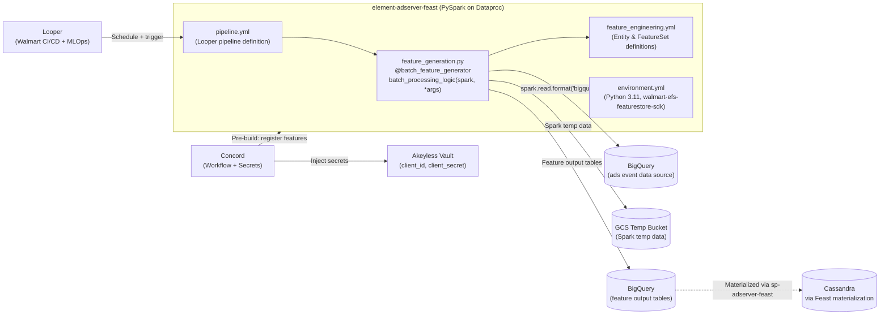
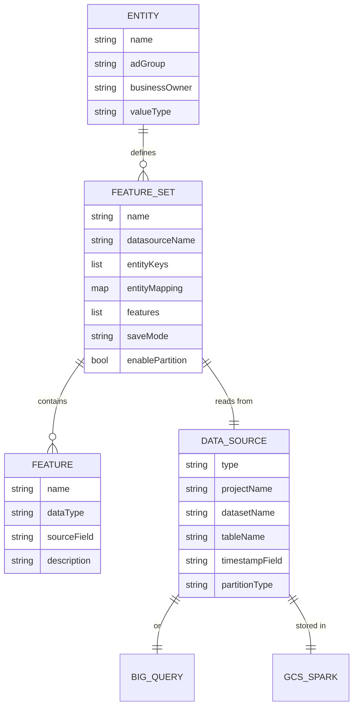
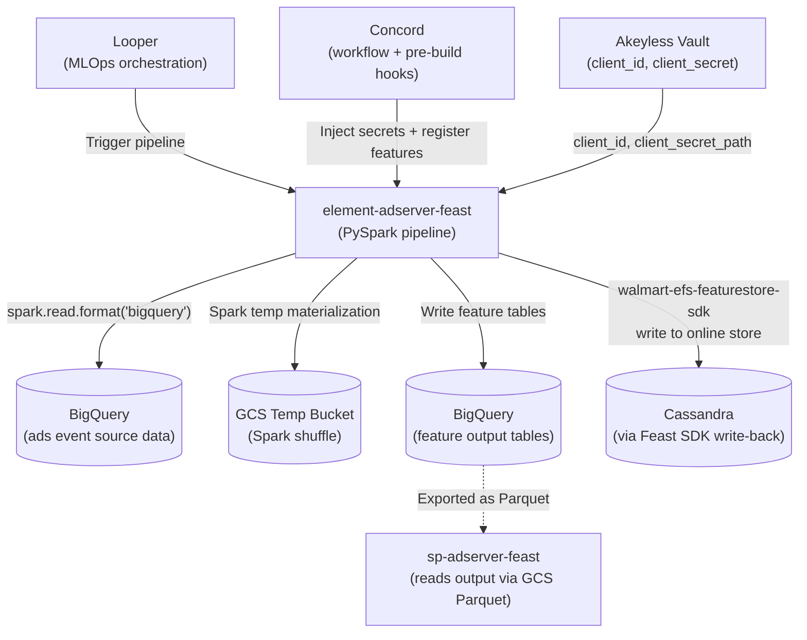
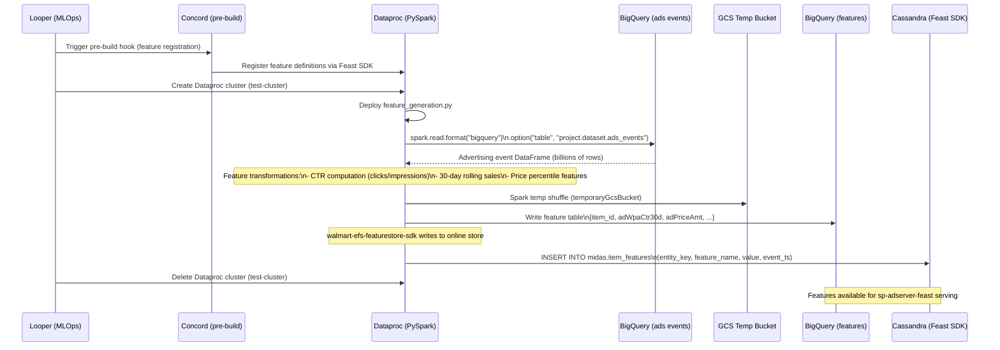

# Chapter 17 — element-adserver-feast (Batch Feature Engineering Pipeline)

## 1. Overview

**element-adserver-feast** is the **batch feature engineering pipeline** for the Element AdServer platform. It runs on **Google Dataproc (PySpark)**, reads advertising event data from **BigQuery**, applies feature transformations, and materializes computed features to BigQuery tables and Cassandra — feeding the offline store consumed by `sp-adserver-feast` (Chapter 16).

- **Domain:** Offline Feature Engineering — ML Feature Generation
- **Tech:** Python 3.11, PySpark 3.3, Apache Spark on Google Dataproc
- **Pipeline Orchestrator:** Looper (Walmart MLOps) + Concord (Workflow)
- **Storage:** BigQuery (output) → GCS Parquet → Cassandra (via Feast materialization)
- **SDK:** `walmart-efs-featurestore-sdk==0.6.0`

---

## 2. Architecture Diagram



---

## 3. API / Interface

**element-adserver-feast has no REST or gRPC API.** It is a pure **batch pipeline** triggered by Looper on a schedule.

**Pipeline Entry Point:**
```python
# /pipelines/data_prep/data_prep/src/feature_generation.py
@batch_feature_generator
def batch_processing_logic(spark: SparkSession, *args, **kwargs) -> DataFrame:
    # 1. Read from BigQuery
    # 2. Apply feature transformations
    # 3. Return DataFrame (Feast SDK handles write)
    pass
```

**Looper Pipeline Trigger:**
- Manual or scheduled via Looper platform
- Node type: `pyspark` (Dataproc cluster)
- Cluster lifecycle: creates and deletes `test-cluster` per run

---

## 4. Data Model



**Supported Entity Value Types:** `BYTES`, `STRING`, `INT32`, `INT64`, `DOUBLE`, `FLOAT`, `BOOL`, `UNIX_TIMESTAMP`, and `*_LIST` variants

**Supported Save Modes:** `append`, `overwrite`

**Supported Partition Types:** `HOUR`, `DAY`, `MONTH`, `YEAR`

---

## 5. Inter-Service Dependencies



---

## 6. Configuration

| Config Key | Required | Description |
|-----------|----------|-------------|
| `client_id` | Yes | Akeyless authentication client ID |
| `client_secret_path` | Yes | Akeyless vault secret path |
| `store.output_source.sourceMetadata.projectName` | Yes | BigQuery GCP project |
| `store.output_source.sourceMetadata.datasetName` | Yes | BigQuery dataset name |
| `store.output_source.sourceMetadata.tableName` | Yes | BigQuery target table |
| `store.entities[].name` | Yes | Entity identifier name |
| `store.entities[].valueType` | Yes | Entity type (INT64, STRING, etc.) |
| `store.feature_sets[].name` | Yes | Feature set name |
| `store.feature_sets[].entityKeys` | Yes | Join keys for entity mapping |
| `LOGICAL_TIME` | (Looper-set) | Pipeline execution timestamp |
| `BUILD_NUMBER` | (Jenkins-set) | CI build number |

**Spark Resource Allocation (pipeline.yml):**
| Resource | Value |
|----------|-------|
| Driver cores | 3 |
| Driver memory | 12 GB |
| Executor cores | 3 |
| Executor memory | 20 GB |
| Executor count | 28 |

**Spark BigQuery package:** `spark-bigquery-with-dependencies_2.12:0.42.0`

---

## 7. Example Scenario — Feature Generation Run


