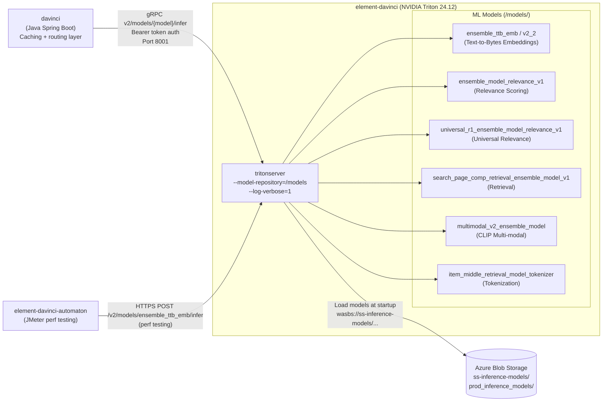
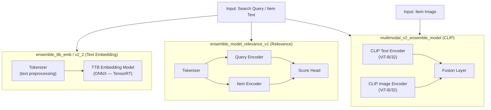
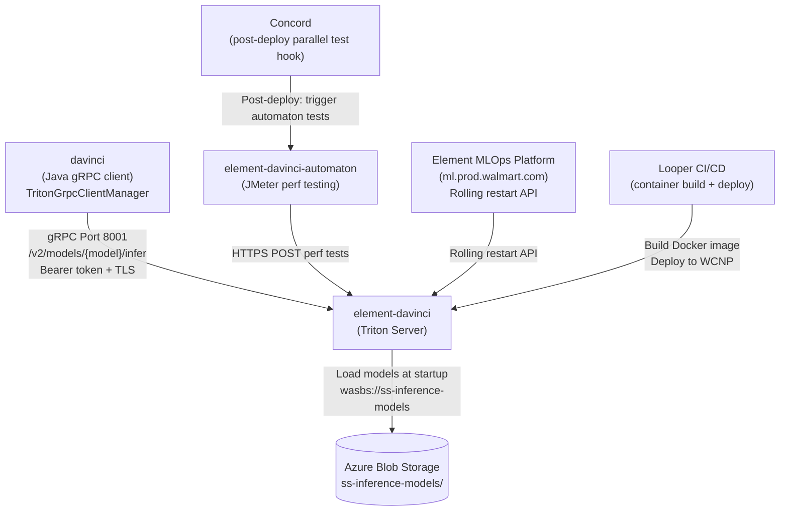
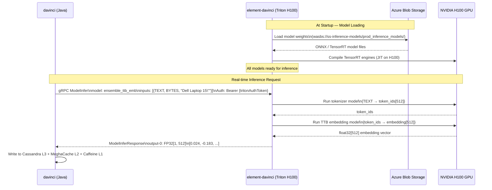

# Chapter 18 — element-davinci (Triton ML Inference Server)

## 1. Overview

**element-davinci** is the **NVIDIA Triton Inference Server** deployment that powers ML inference for the Sponsored Products ad serving pipeline. It hosts ensemble ML models on **NVIDIA H100 GPUs**, serving **embedding vectors** and **relevance scores** via gRPC to the `davinci` Java service (Chapter 15), which acts as a caching and routing layer on top of it.

- **Domain:** ML Model Serving Infrastructure
- **Tech:** NVIDIA Triton 24.12 (Python 3), PyTorch, ONNX, Transformers, CLIP
- **GPU:** NVIDIA H100 (80GB)
- **Replicas:** 16 (prod), 1 (dev/stage)
- **WCNP Namespace:** `ss-davinci-wmt`
- **Element Project ID:** 14820
- **APM ID:** APM0007658

---

## 2. Architecture Diagram



---

## 3. API / Interface

**Triton V2 Inference Protocol (HTTP + gRPC):**

| Protocol | Port | Path | Description |
|----------|------|------|-------------|
| gRPC | 8001 | `ModelInfer` | Primary inference (used by davinci Java) |
| HTTP | 8000 | `POST /v2/models/{model}/infer` | REST inference endpoint |
| Metrics | 8002 | `GET /metrics` | Prometheus metrics scraping |
| Health | 8000 | `GET /v2/health/live` | Liveness probe |
| Health | 8000 | `GET /v2/health/ready` | Readiness probe |

**Example HTTP Request (ensemble_ttb_emb):**
```json
POST /v2/models/ensemble_ttb_emb/infer
Authorization: Bearer {tritonAuthToken}

{
  "inputs": [{
    "name": "TEXT",
    "shape": [1],
    "datatype": "BYTES",
    "data": ["Dell Laptop 15 inch Intel Core i7"]
  }],
  "outputs": [{
    "name": "output-0",
    "parameters": { "binary_data": false }
  }]
}
```

**Response:**
```json
{
  "model_name": "ensemble_ttb_emb",
  "outputs": [{
    "name": "output-0",
    "shape": [1, 512],
    "datatype": "FP32",
    "data": [0.024, -0.183, 0.091, ...]
  }]
}
```

---

## 4. ML Models



**Model Registry (Azure Blob: `prod_inference_models/`):**

| Model | Type | Output | Use Case |
|-------|------|--------|----------|
| `ensemble_ttb_emb` | Text embedding | float[512] | Query/item embeddings |
| `ensemble_ttb_emb_v2_2` | Text embedding v2 | float[512] | Updated embedding model |
| `ensemble_model_relevance_v1` | Relevance score | float scalar | Ad relevance ranking |
| `universal_r1_ensemble_model_relevance_v1` | Relevance score | float scalar | Universal R1 ranking |
| `search_page_comp_retrieval_ensemble_model_v1` | Retrieval | float[] | Candidate retrieval |
| `item_middle_retrieval_model_tokenizer` | Tokenizer | int[] tokens | Item tokenization |
| `multimodal_v2_ensemble_model` | Multi-modal embedding | float[] | Text + image scoring |

---

## 5. Inter-Service Dependencies



---

## 6. Deployment Configuration

**WCNP Deployment (per environment):**

| Environment | GPUs | Replicas | Azure Region | Model Path |
|-------------|------|----------|-------------|------------|
| dev | 1× H100 | 1 | South Central US | `wasbs://ss-inference-models/dev_inference_models` |
| stage | 1× H100 | 1 | South Central US | `wasbs://ss-inference-models/stage_inference_models` |
| prod | 1× H100 | **16** | WestUS2 + SCUS + EastUS2 | `wasbs://ss-inference-models/prod_inference_models` |

**Docker Image:** `docker.prod.walmart.com/midas/sp_triton:1.7`
**Base Image:** `nvidia/tritonserver:24.12-py3`

| Config Key | Value | Description |
|-----------|-------|-------------|
| `TRITON_SERVER_VERSION` | 2.53.0 | Triton version |
| `TRITON_SERVER_GPU_ENABLED` | 1 | GPU enabled |
| `SHM_SIZE` | 5Gi | Shared memory for GPU |
| `TCMALLOC_RELEASE_RATE` | 200 | Memory allocator tuning |
| `TF_AUTOTUNE_THRESHOLD` | 2 | TF tuning |
| Azure secret path | `/Prod/element/.../azure_blobstore_account_key` | Model storage auth |

**Ingress URL pattern:**
`https://ss-davinci-triton-{env}.element.glb.us.walmart.net/seldon/{namespace}/ss-davinci-triton/v2/models/{model}/infer`

---

## 7. Example Scenario — Model Inference for Ad Embedding



---

## 8. Related Repos

| Repo | Role |
|------|------|
| `davinci` (Chapter 15) | Java caching/routing layer that calls this Triton server |
| `element-davinci-automaton` | JMeter-based perf testing suite for this server |
| `element-ss-inference` (Chapter 19) | Predecessor Triton deployment (V100 GPUs, Triton 22.12) |
| `sp-adserver-feast` (Chapter 16) | Online feature store that feeds ML features to models |
