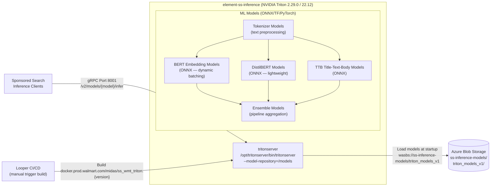
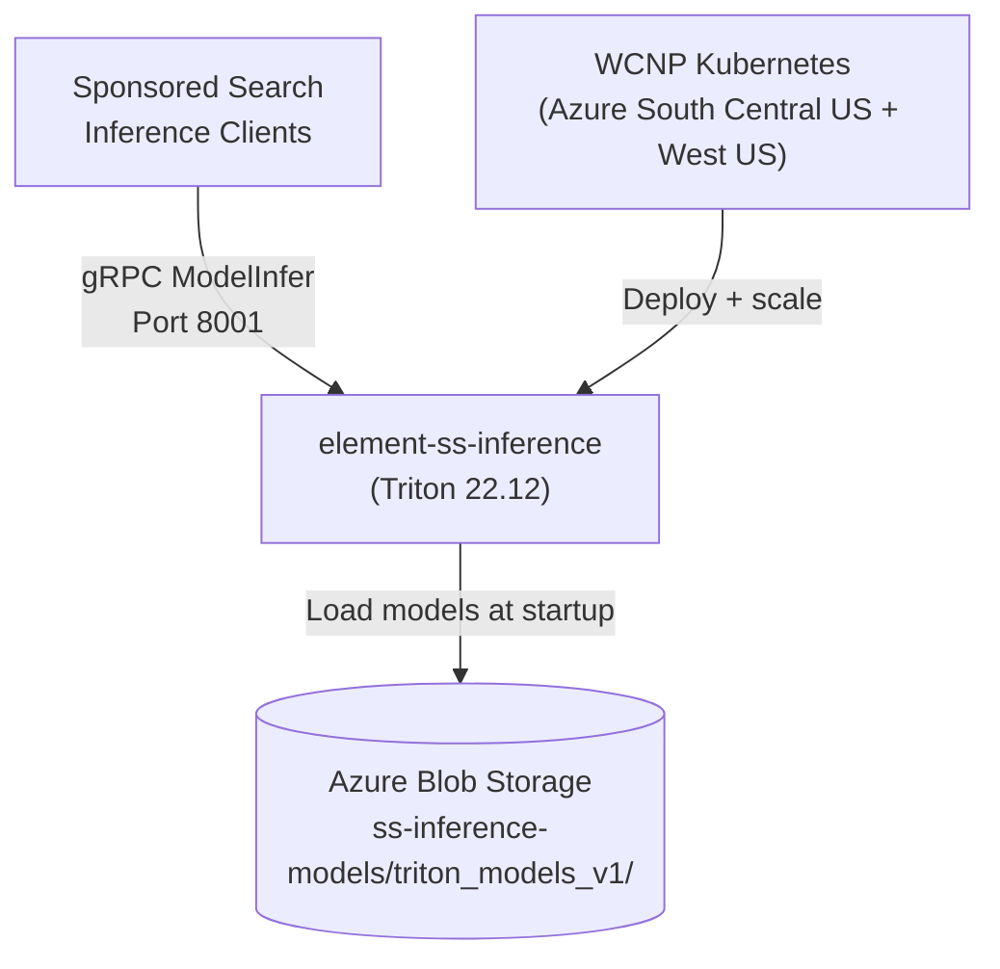
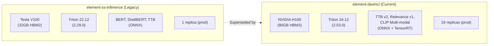

# Chapter 19 — element-ss-inference (Sponsored Search Triton Server — Legacy)

## 1. Overview

**element-ss-inference** is the **original NVIDIA Triton Inference Server** deployment for Walmart's Sponsored Search platform. It predates `element-davinci` (Chapter 18), using older **Tesla V100 GPUs** and **Triton 22.12**. As of December 2023 (last commit), it is no longer actively developed and has been superseded by `element-davinci` (Triton 24.12, H100 GPUs). It may still serve as an active inference backend for the Sponsored Search team (separate from the Sponsored Products team).

- **Domain:** ML Model Serving — Sponsored Search (Legacy / Separate Team)
- **Tech:** NVIDIA Triton 2.29.0 (container tag 22.12), ONNX Runtime, TensorFlow, PyTorch
- **GPU:** NVIDIA Tesla V100
- **Replicas:** 2 (dev), 1 (stage), 1 (prod per region)
- **WCNP Namespace:** `midas` (different namespace from ss-davinci-wmt)
- **Project ID:** 13978
- **Last Active:** December 2023

---

## 2. Architecture Diagram

---

## 3. API / Interface

Identical to Triton V2 standard (same protocol as element-davinci but older server version):

| Protocol | Port | Path | Description |
|----------|------|------|-------------|
| gRPC | 8001 | `inference.GRPCInferenceService/ModelInfer` | Model inference |
| HTTP | 8000 | `POST /v2/models/{model}/infer` | REST inference |
| Metrics | 8002 | `GET /metrics` | Prometheus metrics |
| Health | 8000 | `GET /v2/health/live` | Liveness |
| Health | 8000 | `GET /v2/health/ready` | Readiness |

---

## 4. ML Models

| Model | Framework | Input | Output Dimensions | Batching |
|-------|-----------|-------|------------------|---------|
| Tokenizer | ONNX | Raw text string | INT64 token IDs | Dynamic |
| BERT embedding | ONNX | Token IDs (INT64) | float[-1, 169] | Dynamic (10k) |
| DistilBERT | ONNX | Token IDs | float[] | Dynamic |
| TTB model | ONNX | Title+Text+Body tokens | float[] | Dynamic |
| Ensemble | Python backend | Combined inputs | float[] vectors | Dynamic |

**Azure model source:** `wasbs://ss-inference-models@402a755729stg.blob.core.windows.net/triton_models_v1/`

---

## 5. Inter-Service Dependencies

---

## 6. Deployment Configuration

| Environment | GPU | Replicas | Azure Region |
|-------------|-----|----------|-------------|
| dev | 1× Tesla V100 | 2 | South Central US |
| stage | 1× Tesla V100 | 1 | South Central US |
| prod | 1× Tesla V100 | 1 per region | WestUS + South Central US |

**Docker Image:** `docker.prod.walmart.com/midas/ss_wmt_triton:1.3`
**Base Image:** `nvidia/tritonserver:22.12-py3`

**Approval Members:** `r0p0a37` (Ranjit Pedapati), `v0t0033` (Vamsee Tangirala)

---

## 7. Comparison: element-ss-inference vs element-davinci

| Aspect | element-ss-inference | element-davinci |
|--------|---------------------|-----------------|
| **GPU** | Tesla V100 | NVIDIA H100 |
| **Triton version** | 22.12 | 24.12 |
| **Prod replicas** | 1 | **16** |
| **Models** | BERT, DistilBERT, TTB | TTB v2, Relevance, CLIP |
| **Teams** | Sponsored Search | Sponsored Products (Labs Ads) |
| **Last updated** | Dec 2023 | Mar 2026 |
| **Status** | Likely legacy/sunset | Active production |

---

## 8. Notes

- This repo has **46 commits** with the last activity in December 2023
- The team is the same (`GEC-LabsAccessWPA`) but the namespace differs (`midas` vs `ss-davinci-wmt`)
- It may still be serving Sponsored Search (separate from Sponsored Products) or may have been deprecated
- Dynamic batching is configured up to **10,000** requests per batch — optimized for high-throughput
- The embedding output dimension is `[-1, 169]` (not 512 like element-davinci), suggesting different model architectures
