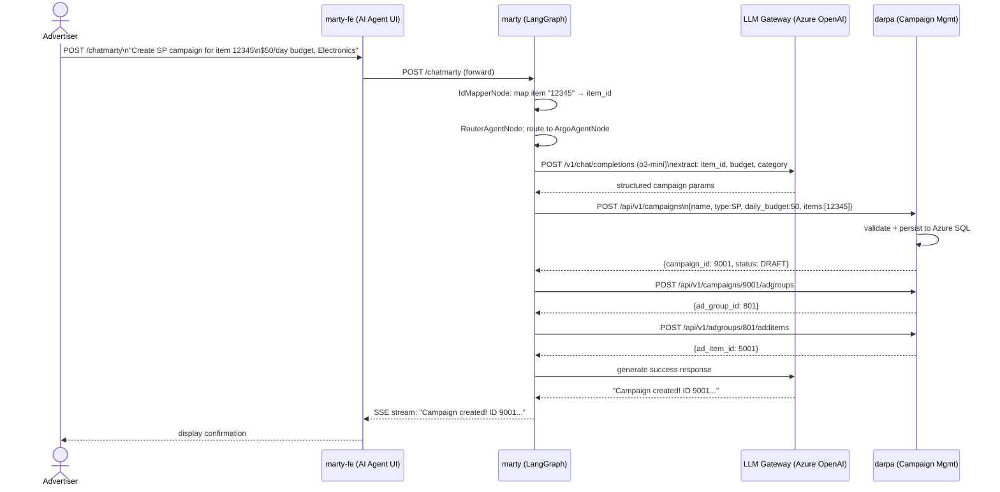
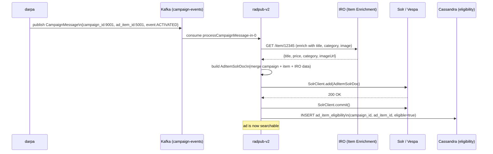
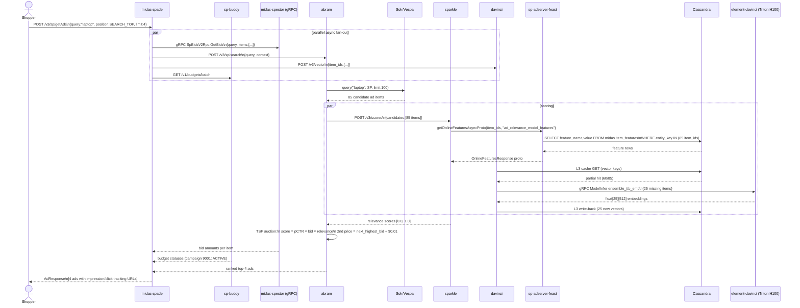
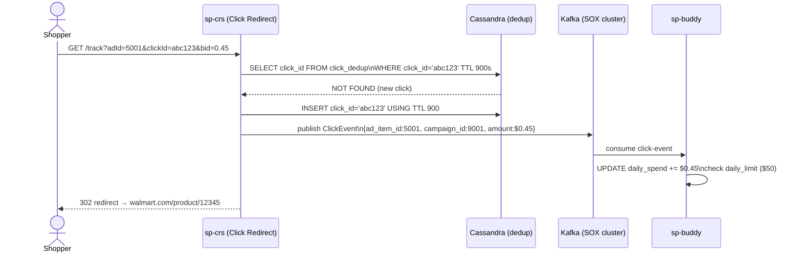
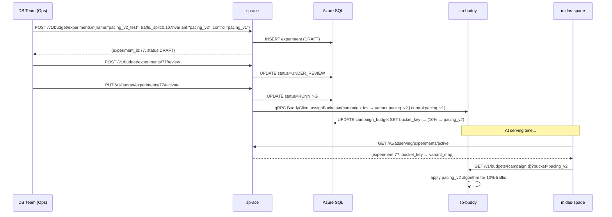
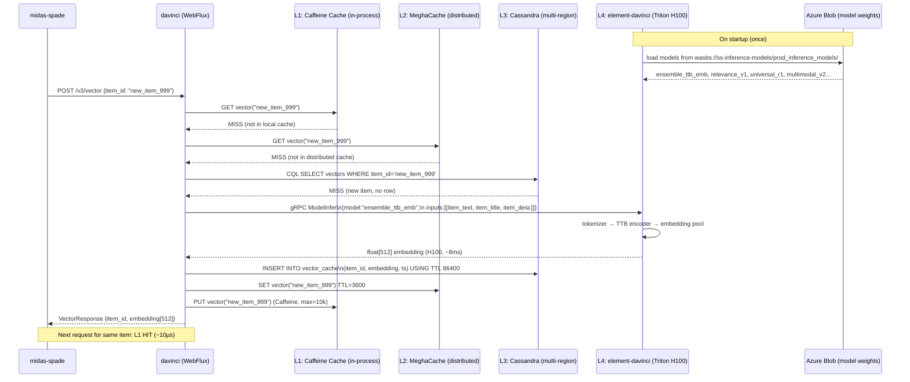
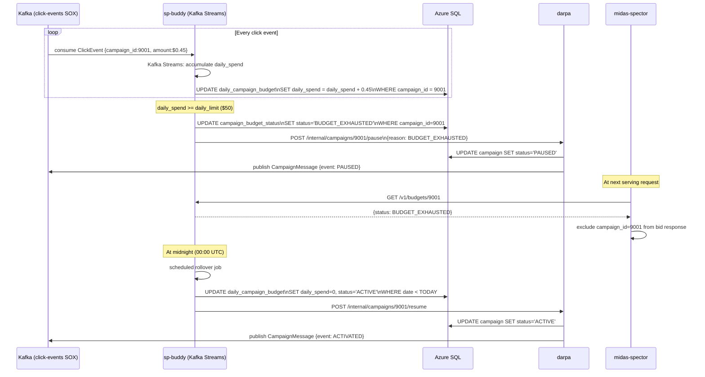
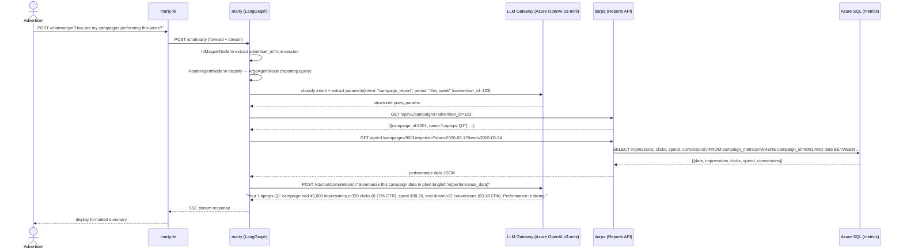
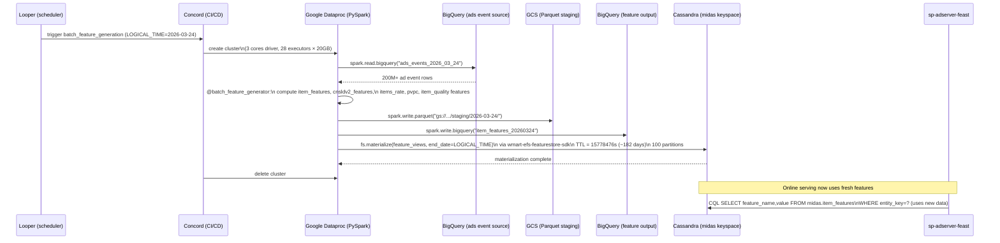
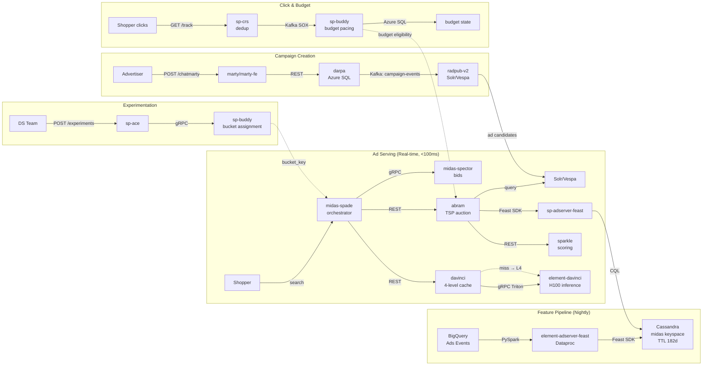

# End-to-End Scenarios — Sponsored Products Platform

## Overview

These scenarios trace complete business flows across all 16 services, from advertiser action through shopper interaction. Each scenario includes the full service call chain, data lineage, and failure handling. Updated to cover the full 19-repo picture including the Feast feature pipeline and Triton inference layer.

---

## Scenario 1: Advertiser Launches New Campaign → First Ad Served

**Business Flow:** An advertiser creates a new Sponsored Product campaign via the AI agent, the campaign gets indexed, and the first shopper sees the ad.

### Phase A — Campaign Creation

### Phase B — Campaign Indexing

### Phase C — Shopper Sees Ad

### Phase D — Shopper Clicks

---

## Scenario 2: A/B Experiment for New Budget Pacing Algorithm

**Business Flow:** DS team creates an experiment to test a new budget pacing strategy across 10% of campaigns.

---

## Scenario 3: ML Vector Cache Miss — Full 4-Level Chain

**Business Flow:** A newly listed item (no cached vectors) enters an auction, triggering full L1→L2→L3→L4 cache miss chain.

---

## Scenario 4: Budget Exhaustion Mid-Day

**Business Flow:** A campaign exhausts its $50 daily budget at 2pm, triggering automatic pause and midnight rollover.

---

## Scenario 5: Advertiser Queries Performance via AI Agent

**Business Flow:** Advertiser asks the AI agent "How are my campaigns performing this week?" in natural language.

---

## Scenario 6: Feature Materialization Pipeline (Batch)

**Business Flow:** Nightly batch job computes fresh ML features from BigQuery and materializes them to Cassandra for online serving.

---

## Cross-Cutting Data Lineage

---

## Failure Scenarios & Mitigation

| Failure | Impact | Detection | Mitigation |
|---------|--------|-----------|------------|
| element-davinci pod down | Davinci L4 cache misses → fallback to L3 (Cassandra) | Triton /v2/health/ready | davinci circuit-breaker; serve from L3 cache |
| Cassandra partition unavailable | Feature fetch failures → sparkle/davinci errors | CQL timeout | sp-adserver-feast fallback: empty features → default scores |
| Solr index lag (radpub-v2 delay) | New campaigns not served | Solr commit latency metric | radpub-v2 commit retry; DLQ for failed messages |
| sp-buddy unavailable | Serving continues without budget filter | Health endpoint | midas-spade: fail-open for budget (assume ACTIVE) |
| Kafka SOX cluster down | Click events not processed | Consumer lag metric | sp-crs: local buffer + replay endpoint |
| darpa Oracle → Azure SQL failover | Campaign CRUD degraded | JDBC connection pool | Hibernate retry + Circuit breaker |
| LLM Gateway timeout | marty chat hangs | OpenAI response timeout (60s) | LangGraph timeout node → graceful error response |
| Daily rollover job failure | Campaigns remain exhausted after midnight | Alerting via xMatters | Manual re-trigger via sp-buddy /v1/housekeeping endpoint |

---

*Generated by Wibey CLI — `claude-sonnet-4-6-thinking` — March 2026*
