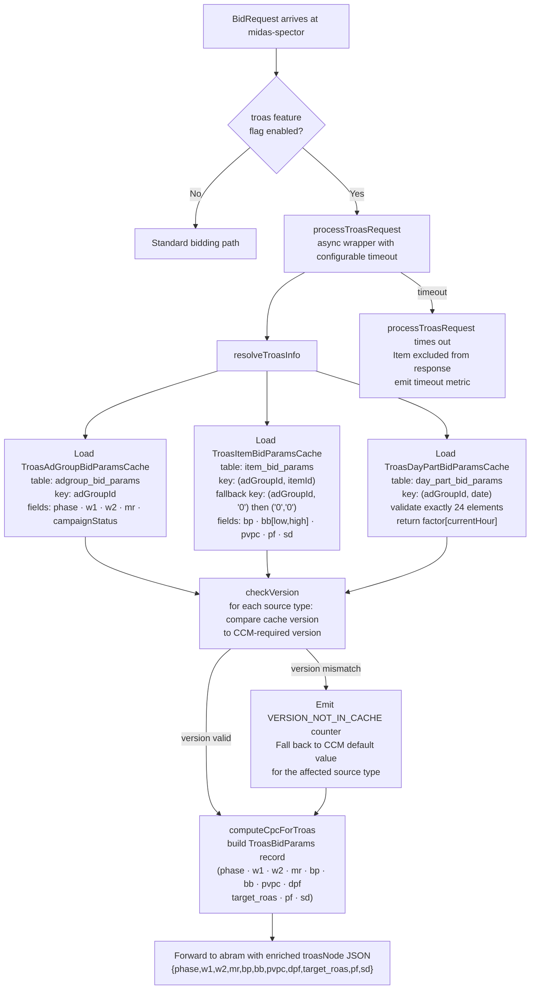
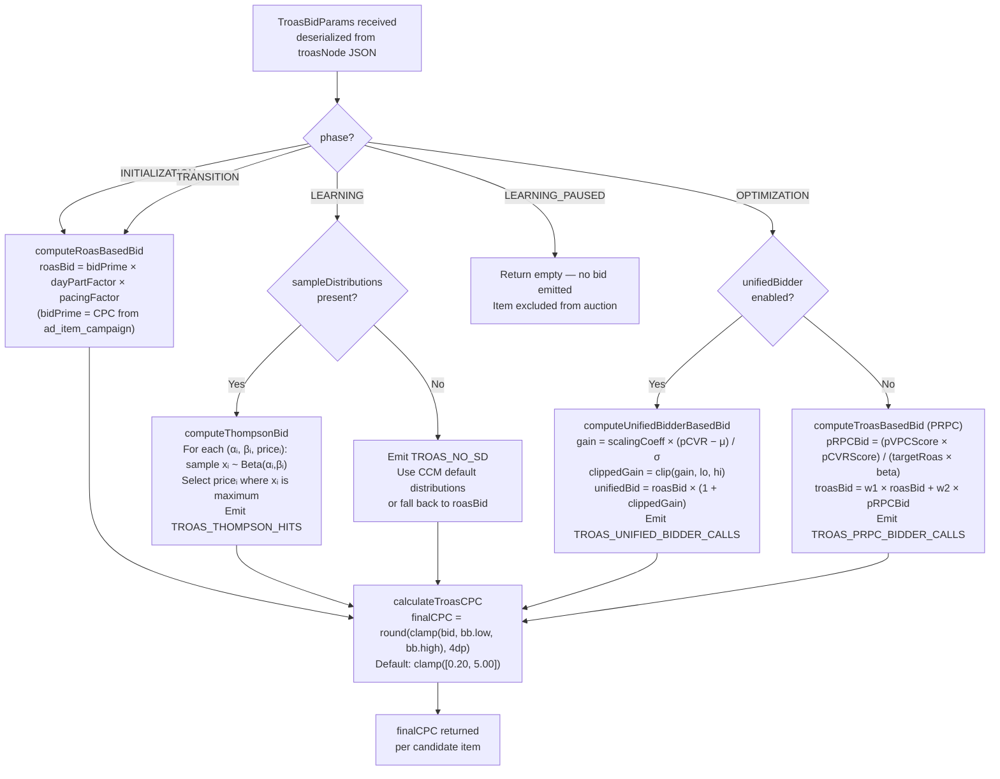
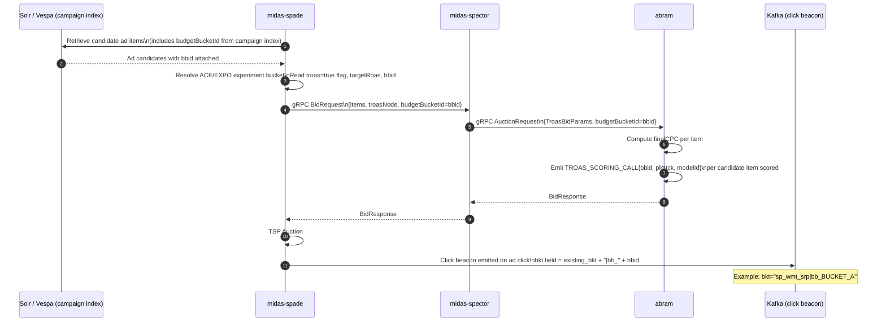
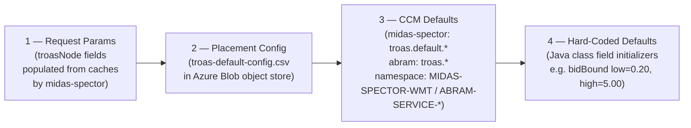
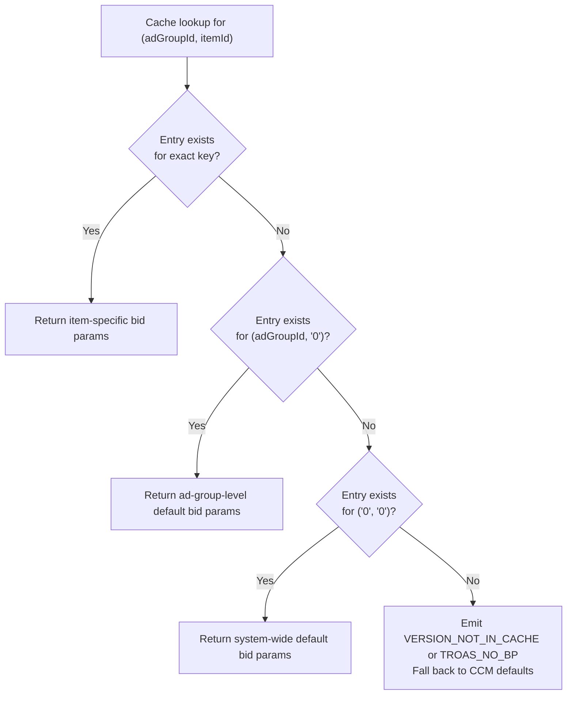
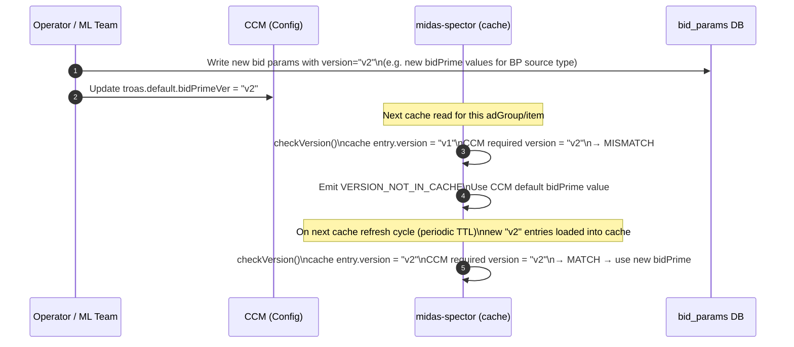
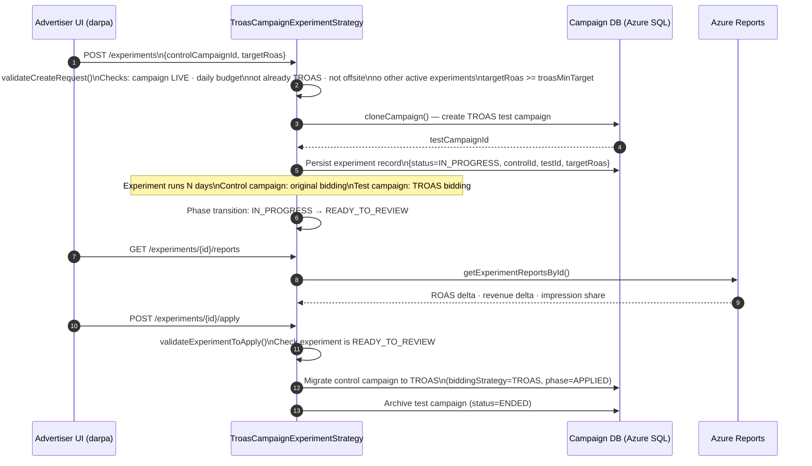
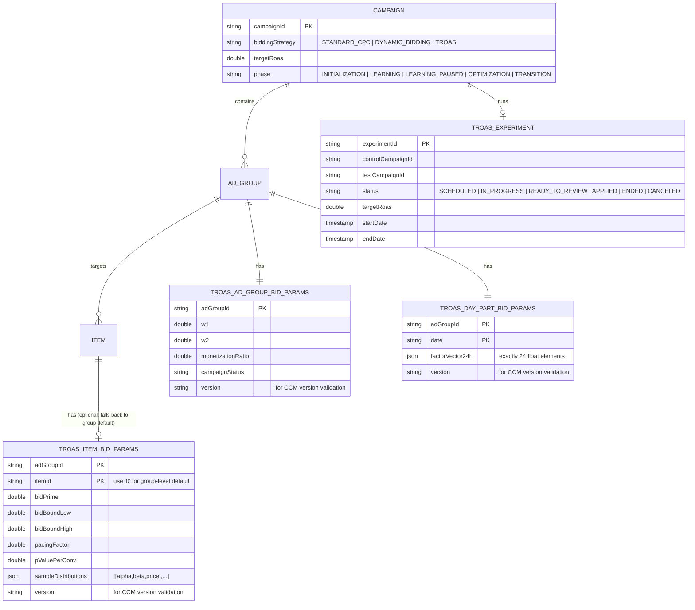

# Chapter 21 — TROAS E2E Flow

> **Target ROAS (TROAS)** is a smart bidding strategy where the system auto-adjusts bids to achieve
> a configured Return on Ad Spend ratio. This document traces the complete lifecycle of a TROAS-enabled
> ad request, from advertiser campaign setup through to the final CPC posted in the auction.
>
> **Services touched:** `darpa` → `radpub-v2` → `swag` → `midas-spade` → `midas-spector` → `abram`
>
> **Problem this solves:** Setting and adjusting bids for campaign goals is tedious and time-consuming.
> Advertisers need an automated way to control campaign ROAS for a given budget. Understanding the
> right bid per auction is impossible for an advertiser to compute manually. TROAS maximizes campaign
> ad spend subject to a hard constraint on the advertiser-selected target ROAS value.

---

## Table of Contents

1. [Overview](#1-overview)
2. [Campaign Phase State Machine](#2-campaign-phase-state-machine)
3. [Full E2E Request Lifecycle](#3-full-e2e-request-lifecycle)
   - [3.5 Ingestion Pipeline](#35-ingestion-pipeline)
4. [Midas-Spector: TroasHandler](#4-midas-spector-troashandler)
5. [Abram: TroasBidComputationManager](#5-abram-troasbidcomputationmanager)
6. [Bid Computation Algorithms](#6-bid-computation-algorithms)
   - [6.5 Budget Splitter Integration](#65-budget-splitter-integration)
7. [Thompson Sampling (LEARNING Phase)](#7-thompson-sampling-learning-phase)
8. [Edge Cases & Safety Guards](#8-edge-cases--safety-guards)
9. [Config Resolution Hierarchy](#9-config-resolution-hierarchy)
   - [9.5 Data Volume Design](#95-data-volume-design)
10. [TROAS Experiment Strategy (darpa)](#10-troas-experiment-strategy-darpa)
11. [Observability Reference](#11-observability-reference)
12. [Data Model](#12-data-model)

---

## 1. Overview

TROAS replaces fixed-CPC bidding with a feedback-controlled system. Instead of a static bid, the
advertiser sets a **target ROAS** (e.g. 4.0 = $4 revenue per $1 ad spend). The system:

1. Estimates predicted conversion value (`pVPC`) and conversion rate (`pCVR`) per item
2. Computes a model-derived bid that, over time, should yield the target ratio
3. Explores bid space during the **LEARNING** phase via Thompson Sampling
4. Shifts to fully model-driven bidding in **OPTIMIZATION** once sufficient data exists

TROAS is exclusively for **auto-bidded campaigns**. A campaign can carry only one bidding strategy
at a time: either TROAS or Dynamic Bidding (DB), never both. The `target_roas` value is propagated
to Ad Serving via Kafka from Darpa and embedded in the Solr/Vespa campaign index so every ad request
can access it without an additional database round-trip.

### Key Parameters

| Parameter | Description | Default |
|-----------|-------------|---------|
| `targetRoas` | Revenue / spend ratio to achieve | Advertiser-set |
| `bidPrime` (`bp`) | Base bid from previous optimization cycle | Per item, from cache |
| `beta` | Scaling divisor for PRPC formula | CCM: `troas.beta` |
| `w1` / `w2` | Weights for ROAS vs PRPC bid blend | CCM: `troas.bidWeights.*` (default 0.0 / 1.0) |
| `pacingFactor` (`pf`) | Budget pacing multiplier (0–1) | CCM: `troas.pacingFactor = 1.0` |
| `dayPartFactor` (`dpf`) | Time-of-day multiplier (24-hour vector) | CCM: `troas.default.dayPartFactor = 1.0` |
| `bidBound.low` (`bb[0]`) | Floor CPC in dollars | CCM: `troas.lowerBidBound = 0.20` |
| `bidBound.high` (`bb[1]`) | Ceiling CPC in dollars | CCM: `troas.upperBidBound = 5.00` |
| `monetizationRatio` (`mr`) | Monetization calibration per ad group | Per ad group, from cache |
| `sampleDistributions` (`sd`) | Alpha/beta/price triples for Thompson Sampling | CCM default: `[[4,8,0.2],[5,9,0.4],[6,7,0.6],[2,6,0.8]]` |
| `pValuePerConv` (`pvpc`) | Predicted value per conversion (from offline model) | Per item, from cache |
| `phase` | Current campaign learning/optimization state | From `adgroup_bid_params` table |
| `budgetBucketId` (`bbid`) | Budget bucket identifier for spend splitting | From Spade, passed to Abram |

---

## 2. Campaign Phase State Machine

```mermaid
stateDiagram-v2
    [*] --> INITIALIZATION : Advertiser enables TROAS\n(darpa validates + persists targetRoas)

    INITIALIZATION --> LEARNING : Campaign goes live;\nThompson Sampling active\n(suggested bid = CPC from ad_item_campaign)

    LEARNING --> LEARNING_PAUSED : Budget depleted\nor manual pause

    LEARNING_PAUSED --> LEARNING : Budget restored\nor manual resume

    LEARNING --> OPTIMIZATION : Sufficient conversion data;\npCVR + pVPC models trained;\nPRPC bidder activated

    OPTIMIZATION --> TRANSITION : Experiment applied\nor strategy switch initiated

    TRANSITION --> [*] : Final phase — bids drained\ngracefully (ROAS-only wind-down)
```



### Phase Descriptions

| Phase | Bidding Strategy | Bid Source | Data Requirement |
|-------|-----------------|------------|-----------------|
| `INITIALIZATION` | Suggested bid (ROAS-based) | `CPC` from `ad_item_campaign` table | None — uses CCM defaults |
| `LEARNING` | Thompson Sampling (Beta distribution) | Sample from `sampleDistributions` price points | Partial — still collecting conversions |
| `LEARNING_PAUSED` | Frozen — no bids emitted | — | Budget or manual pause condition |
| `OPTIMIZATION` | Unified Bidder or Weighted PRPC | `w1×roasBid + w2×pRPCBid` or Unified formula | Sufficient pCVR + pVPC model data |
| `TRANSITION` | ROAS-based only (wind-down) | `bidPrime × dayPartFactor × pacingFactor` | Experiment applied; draining period |

---

## 3. Full E2E Request Lifecycle

### High-Level Sequence

```mermaid
sequenceDiagram
    autonumber
    participant ADV as Advertiser (darpa)
    participant RP as radpub-v2
    participant SW as swag
    participant SP as midas-spade
    participant SC as midas-spector
    participant AB as abram
    participant ML as davinci / Triton
    participant FS as sp-adserver-feast
    participant KK as Kafka

    ADV->>RP: Campaign updated (TROAS enabled, targetRoas set)\nKafka event on topic: campaign-events
    RP->>RP: Consume campaign-events; read TROAS fields\nWrite to ad candidate index (Solr/Vespa)\nbiddingStrategy=TROAS, targetRoas, phase

    Note over SW: Shopper triggers ad request (search, PDP, home)

    SW->>SP: POST /v1/ads (REST, tenant-routed)
    SP->>SP: Fan-out: resolve eligible ad groups + items\nResolve ACE/EXPO experiment bucket\n(troas feature flag, targetRoas, bidding params)
    SP->>SC: gRPC BidRequest\n(items + context + troasNode JSON)
    SC->>SC: TroasHandler.resolveTroasInfo()\nLoad 3 Caffeine caches

    SC->>FS: Feast SDK getOnlineFeatures(pCVR features)
    FS-->>SC: pCVR feature vector

    SC->>AB: gRPC AuctionRequest\n(items + TroasBidParams deserialized from troasNode)
    AB->>ML: Score pCVR + pVPC per candidate\n(Triton inference — full-score items only)
    ML-->>AB: pCVRScore, pVPCScore per item

    AB->>AB: TroasBidComputationManager.compute()\nBranch on campaign phase
    AB->>AB: calculateTroasCPC()\nclamp([bb.low, bb.high]) + round 4dp
    AB-->>SC: BidResponse (finalCPC per item)
    SC-->>SP: BidResponse

    SP->>SP: TSP Auction — rank by eCPM
    SP-->>SW: Top-N ranked ads

    SW-->>ADV: Rendered ad response (REST/GraphQL)
    SP->>KK: Publish to sp_abram_request_logs\n(full auction request + TROAS params)
```

### Step-by-Step Narrative

**Steps 1–2 — Campaign Indexing (darpa → radpub-v2)**
- Advertiser enables TROAS in darpa UI; `TroasCampaignExperimentStrategy` validates the request
- darpa persists `targetRoas` + initial `sampleDistributions` to Azure SQL campaign DB and fires a
  Kafka event on the `campaign-events` topic
- radpub-v2 subscribes to `campaign-events`, reads TROAS fields, and writes the indexed campaign
  into the ad candidate index (Solr/Vespa) with `biddingStrategy=TROAS`, `targetRoas`, and `phase`

**Steps 3–4 — Ad Request Ingress (swag)**
- Shopper search/browse triggers a call to swag
- swag routes the request to midas-spade based on tenant config (WMT / SAMS / MX)
- Request carries placement context: page type, slot count, shopper signals

**Steps 5–8 — Bid Parameter Resolution (midas-spade → midas-spector)**
- midas-spade fans out to eligible ad groups + items from the Solr/Vespa index
- Resolves ACE/EXPO experiment bucket; if `troas=true`, enriches abram request with `targetRoas`
  from campaign bid params and attaches `budgetBucketId` (bbid)
- Calls midas-spector via gRPC, embedding raw `troasNode` JSON in the request
- `TroasHandler.resolveTroasInfo()` hydrates the node from 3 Caffeine caches pre-loaded at startup:
  - **TroasAdGroupBidParamsCache** — `phase`, `w1`, `w2`, `monetizationRatio`, `campaignStatus`
  - **TroasItemBidParamsCache** — `bidPrime`, `bidBound`, `pacingFactor`, `sampleDistributions`, `pValuePerConv`
  - **TroasDayPartBidParamsCache** — 24-element `dayPartFactor` vector; selects `factor[currentHour]`

**Steps 9–10 — Feature Retrieval**
- midas-spector fetches pCVR features from Feast (sp-adserver-feast → Cassandra `midas` keyspace)
- Cache version is checked against `troas.default.*Ver` CCM keys — stale versions are rejected and
  CCM defaults are substituted (see §4 for version validation detail)

**Steps 11–15 — Bid Computation (abram)**
- abram receives `TroasBidParams` deserialized from troasNode
- `TroasBidComputationManager.compute()` branches on campaign `phase`
- Full-score items: both pCVR and pVPC scored via Triton; non-full-score items go ROAS-only path
- Applies the appropriate bid formula (see §6)
- `calculateTroasCPC()` clamps to `[bidBound.low, bidBound.high]`, rounds to 4 decimal places

**Steps 16–18 — Auction & Response**
- midas-spade runs TSP (True Second Price) auction on the `finalCPC` values
- Top-N ads ranked by eCPM are returned to swag → rendered to the shopper
- Full request logged to Kafka topic `sp_abram_request_logs`

---

## 3.5 Ingestion Pipeline

The ingestion pipeline carries TROAS campaign configuration from Darpa (the campaign management
service) all the way into the Ad Serving layer. This path is **asynchronous and eventually
consistent** — there is a lag between an advertiser changing `targetRoas` and the new value
appearing in bid computation.

```mermaid
sequenceDiagram
    autonumber
    participant ADV as Advertiser UI
    participant DA as Darpa (campaign DB / Azure SQL)
    participant KK as Kafka (campaign-events)
    participant RP as radpub-v2
    participant SV as Solr / Vespa (ad candidate index)
    participant SC as midas-spector (Caffeine caches)
    participant DB as bid_params DB (Azure SQL)

    ADV->>DA: Enable TROAS; set targetRoas value
    DA->>DA: Validate campaign eligibility\n(LIVE status, daily budget, not already TROAS,\nnot offsite, no concurrent experiments,\ntargetRoas >= troasMinTarget)
    DA->>DA: Persist targetRoas + sampleDistributions\nto campaign table in Azure SQL
    DA->>KK: Produce event on topic: campaign-events\n{campaignId, targetRoas, biddingStrategy=TROAS, phase}

    KK-->>RP: Consume campaign-events
    RP->>RP: Read TROAS fields from event\n(targetRoas, biddingStrategy, phase)
    RP->>SV: Index/update campaign document\nbiddingStrategy=TROAS · targetRoas · phase · adGroupIds

    Note over SC: At service startup (and on periodic TTL refresh)
    SC->>DB: Pre-load TroasAdGroupBidParamsCache\nSELECT * FROM adgroup_bid_params\n(phase · w1 · w2 · monetizationRatio · campaignStatus · version)
    SC->>DB: Pre-load TroasItemBidParamsCache\nSELECT * FROM item_bid_params\n(bidPrime · bidBound · pacingFactor · pValuePerConv · sampleDistributions · version)
    SC->>DB: Pre-load TroasDayPartBidParamsCache\nSELECT * FROM day_part_bid_params\n(24-element dayPartFactor vector per adGroup per date · version)

    Note over SC: Cache is now ready; bid requests can be served
```

### Ingestion Data Sources

| Table | Primary Key | Source Types | Content |
|-------|-------------|-------------|---------|
| `adgroup_bid_params` | `(adGroupId)` | CS, MR, WEIGHTS | `phase`, `w1`, `w2`, `monetizationRatio`, `campaignStatus`, `version` |
| `item_bid_params` | `(adGroupId, itemId)` | BP, BB, PVPC, PF, SD | `bidPrime`, `bidBound[low,high]`, `pValuePerConv`, `pacingFactor`, `sampleDistributions`, `version` |
| `day_part_bid_params` | `(adGroupId, date)` | DPF | 24-element `dayPartFactor` vector, `version` |

**Source type abbreviations:**

| Abbreviation | Meaning |
|-------------|---------|
| CS | CampaignStatus |
| MR | MonetizationRatio |
| WEIGHTS | w1 / w2 bid weights |
| BP | BidPrime |
| BB | BidBound (low + high) |
| PVPC | PValuePerConversion |
| PF | PacingFactor |
| SD | SampleDistribution (Thompson Sampling price points) |
| DPF | DayPartFactor (24-hour time-of-day vector) |

### Protobuf Contract (Radpub → Solr/Vespa)

TROAS fields travel through the system as protobuf-encoded records in `AdItemCampaignBidParam`:

```
AdItemCampaignBidParam {
    double   target_roas
    enum     bidding_strategy   // STANDARD_CPC | DYNAMIC_BIDDING | TROAS
    enum     troas_phase        // INITIALIZATION | LEARNING | LEARNING_PAUSED | OPTIMIZATION | TRANSITION
}
```

This protobuf struct is serialized by radpub-v2 when writing to Solr/Vespa, deserialized by
midas-spade when reading candidate ads, and re-serialized as JSON into the `troasNode` field
passed downstream to midas-spector and abram.

---

## 4. Midas-Spector: TroasHandler

`TroasHandler` is the central coordinator for TROAS bid enrichment in midas-spector. It is
responsible for loading all bid parameters from the three Caffeine caches, validating cache
versions against CCM-required versions, building the `TroasBidParams` record, and forwarding
an enriched `troasNode` JSON payload to abram.



### Version Validation Logic

Each cache entry carries a `version` field. CCM controls which version is considered "active"
for each source type. On every cache read, `checkVersion()` compares the stored version to the
CCM-required version for that source type. A mismatch means the entry is stale and the system
falls back to the CCM default value for that parameter. This mechanism allows A/B testing of
new bid param versions and gradual rollout without requiring a code deploy.

**All 9 CCM version keys in midas-spector:**

| CCM Key | Accessor Method | Default Value | Controls |
|---------|----------------|--------------|---------|
| `troas.default.sampleDtrVer` | `getTroasDefaultSampleDtrVer()` | `"default"` | Active version of `sampleDistributions` (SD) |
| `troas.default.pacingFactorVer` | `getTroasDefaultPacingFactorVer()` | `"default"` | Active version of `pacingFactor` (PF) |
| `troas.default.bidPrimeVer` | `getTroasDefaultBidPrimeVer()` | `"default"` | Active version of `bidPrime` (BP) |
| `troas.default.bidBoundVer` | `getTroasDefaultBidBoundVer()` | `"default"` | Active version of `bidBound` (BB) |
| `troas.default.weightsVer` | `getTroasDefaultWeightsVer()` | `"default"` | Active version of `w1`/`w2` (WEIGHTS) |
| `troas.default.moneRatioVer` | `getTroasDefaultMoneRatioVer()` | `"default"` | Active version of `monetizationRatio` (MR) |
| `troas.default.dayPartFactorVer` | `getTroasDefaultDayPartFactorVer()` | `"default"` | Active version of `dayPartFactor` (DPF) |
| `troas.default.pValuePerConvVer` | `getTroasDefaultPValuePerConvVer()` | `"default"` | Active version of `pValuePerConv` (PVPC) |
| `p13n.troas.enabled` | `isP13nTroasEnabled()` | `false` | Whether P13N (personalization) TROAS path is active |

Additionally, a non-version CCM key controls the DPF default scalar:

| CCM Key | Accessor Method | Default Value | Usage |
|---------|----------------|--------------|-------|
| `troas.default.dayPartFactor` | `getTroasDefaultDayPartFactor()` | `1.0f` | Fallback scalar when DPF cache entry is missing or version-mismatched |

### Cache Field Mapping

| troasNode field | Source Cache | DB Table | CCM fallback key |
|-----------------|-------------|----------|-----------------|
| `phase` | TroasAdGroupBidParamsCache | `adgroup_bid_params` | — (required; no fallback) |
| `w1` | TroasAdGroupBidParamsCache | `adgroup_bid_params` | `troas.bidWeights.w1` = 0.0 |
| `w2` | TroasAdGroupBidParamsCache | `adgroup_bid_params` | `troas.bidWeights.w2` = 1.0 |
| `mr` | TroasAdGroupBidParamsCache | `adgroup_bid_params` | — |
| `bp` | TroasItemBidParamsCache | `item_bid_params` | — |
| `bb` | TroasItemBidParamsCache | `item_bid_params` | `troas.lowerBidBound` / `troas.upperBidBound` |
| `pvpc` | TroasItemBidParamsCache | `item_bid_params` | — |
| `pf` | TroasItemBidParamsCache | `item_bid_params` | `troas.pacingFactor` = 1.0 |
| `sd` | TroasItemBidParamsCache | `item_bid_params` | `troas.sampleDistribution` = `[[4,8,0.2],[5,9,0.4],[6,7,0.6],[2,6,0.8]]` |
| `dpf` | TroasDayPartBidParamsCache | `day_part_bid_params` | `troas.default.dayPartFactor` = 1.0 |
| `target_roas` | adItemCampaignBidParam (index) | campaign table | — (advertiser-set; required) |

### Fallback Behavior

`TroasItemBidParamsCache` supports a **zero-key fallback** hierarchy to handle the case where
no item-level entry exists:

1. Try `(adGroupId, itemId)` — item-specific override
2. Fall back to `(adGroupId, '0')` — ad-group-level default
3. Fall back to `('0', '0')` — system-wide default

This prevents hard failures for newly indexed items and is central to the data volume redesign
described in §9.5.

`TroasDayPartBidParamsCache` validates that the factor vector contains **exactly 24 elements**.
If validation fails or the entry is absent, it returns the CCM default scalar `1.0f`.

---

## 5. Abram: TroasBidComputationManager

`TroasBidComputationManager` is a Spring `@Component` in `abram-service`. It receives the fully
hydrated `TroasBidParams` record from midas-spector and produces a final CPC per candidate item.



### Processing Modes: Full-Score vs Non-Full-Score

`TroasBidComputationManager` splits candidates into two tracks before calling Triton. Both tracks
run in **parallel** and are merged before the auction.

| Track | Description | Triton Call | pCVR Source |
|-------|-------------|-------------|-------------|
| `getFullScoreItemBidsPerItem` | Items with complete feature coverage | pCVR + pVPC both scored via Triton | Live Triton inference |
| `getNonFullScoreItemBidsPerItem` | Cold-start items missing features | ROAS-only path; Triton not called | CCM default pCVR constant |

Non-full-score items fall through to the ROAS-based bid formula regardless of the campaign phase,
since the model-dependent formulas (PRPC, Unified Bidder) require a valid pCVR score.

---

## 6. Bid Computation Algorithms

### 6.1 ROAS-Based Bid (INITIALIZATION / TRANSITION)

Used when no pCVR/pVPC signal is available. Pure time-adjusted base bid derived from the previous
optimization cycle's `bidPrime`.

```
roasBid = bidPrime × dayPartFactor × pacingFactor
```

- `bidPrime` (`bp`) — per-item base bid from the previous optimization cycle; sourced from
  `item_bid_params` table via `TroasItemBidParamsCache`. For P13N (personalization) campaigns,
  `bidPrime` is sourced from `ad_item_campaign_p13n` instead of `ad_item_campaign`
- `dayPartFactor` (`dpf`) — hour-of-day multiplier; index into the 24-element vector at
  `currentHour`; falls back to `1.0` if the vector is missing or malformed
- `pacingFactor` (`pf`) — budget pacing (0.0–1.0); reduces bid aggressiveness as budget depletes

### 6.2 PRPC-Based Bid (OPTIMIZATION — PRPC path)

Predicted Revenue Per Click: the bid that makes expected revenue-per-click equal to the target.
This is the standard OPTIMIZATION path when `unifiedBidder=false`.

```
pRPCBid = (pVPCScore × pCVRScore) / (targetRoas × beta)
```

- `pVPCScore` — Predicted Value Per Conversion (Triton model output, sourced from davinci)
- `pCVRScore` — Predicted Conversion Rate (Triton model output, sourced from davinci)
- `targetRoas` — advertiser-configured ratio (must be > 0; guarded by `TROAS_ZERO_TR`)
- `beta` — calibration divisor; accounts for revenue-to-bid scaling (must be present; guarded
  by `TROAS_NO_BETA`)

### 6.3 Weighted Combination Bid (OPTIMIZATION — blended)

Blends ROAS stability with PRPC responsiveness via a convex combination. Applied after computing
both `roasBid` and `pRPCBid`.

```
troasBid = w1 × roasBid + w2 × pRPCBid
```

- Default weights: `w1 = 0.0`, `w2 = 1.0` — pure PRPC by default; configurable per campaign
  via CCM and stored in `adgroup_bid_params`
- Increasing `w1` adds conservatism (more ROAS-anchored); increasing `w2` increases ML
  responsiveness
- Guard: if both weights are absent, emits `TROAS_NO_WTS` and falls back to ROAS-only path

### 6.4 Unified Bidder (OPTIMIZATION — unified path)

Statistical normalization variant. Uses pCVR as a multiplicative gain around the ROAS bid.
The gain is normalized by the population distribution of pCVR scores to ensure consistent bid
scaling across different item pools.

```
gain        = scalingCoeff × (pCVR − μ) / σ
clippedGain = clip(gain, lo, hi)
unifiedBid  = roasBid × (1 + clippedGain)
```

- `μ` (`pCVRMu`) — population mean of pCVR scores for the current request context
- `σ` (`pCVRSigma`) — population standard deviation of pCVR scores
- `scalingCoeff` — sensitivity knob; higher value = larger bid swings per pCVR delta
- `[lo, hi]` — clip bounds prevent extreme bids on outlier pCVR items; guard against
  `σ = 0` (division by zero) by using ROAS bid only when sigma is zero

### 6.4.1 P13N (Personalization) TROAS Variant

When `p13n.troas.enabled = true` (CCM key in midas-spector, accessed via `isP13nTroasEnabled()`),
the initialization path sources `bidPrime` from `ad_item_campaign_p13n` instead of
`ad_item_campaign`. All other formulas are identical. This variant enables personalized base bids
to seed the ROAS computation before the PRPC model has sufficient data.

### 6.5 Final CPC Calculation

Applied universally after whichever bid formula runs:

```
finalCPC = round(clamp(bid, bidBound.low, bidBound.high), 4 decimal places)
```

- Default bounds: `[0.20, 5.00]` — both configurable via CCM
- The `clamp` operation bounds the bid to the configured floor and ceiling
- The `round` operation truncates/rounds to 4 decimal places for consistent auction pricing
- If the bid falls below the floor even before clamping, the metric `TROAS_BELOW_FLOOR` is emitted

---

## 6.5 Budget Splitter Integration

The budget splitter partitions campaign spend across configurable budget buckets. In the TROAS
context, this enables per-bucket budget enforcement and attribution separate from the global
campaign budget.



### Budget Splitter Key Fields

| Field | Direction | Description |
|-------|-----------|-------------|
| `budgetBucketId` (bbid) | Spade → Spector → Abram | String identifier for the budget bucket; resolved from campaign config via ACE/EXPO |
| `bkt` (click beacon) | Abram → Kafka | Existing bucket string with `"|bb_" + bbid` appended; used for spend attribution |
| `TROAS_SCORING_CALL{bbid, plmtck, modelId}` | Abram → Metrics | Dimensional metric enabling per-bucket, per-placement, per-model scoring visibility |

The budget bucket identifier flows as a string parameter (`"bbid"`) through the entire abram
request, enabling downstream budget accounting systems to attribute spend to the correct bucket
without requiring a separate lookup.

---

## 7. Thompson Sampling (LEARNING Phase)

During **LEARNING**, the system lacks sufficient pCVR data to use the model. Thompson Sampling
provides principled exploration: each bid price is treated as a **Beta-distributed random variable**,
and the system samples from these distributions to select bids. Over time, the distributions
concentrate around bid prices that have yielded good ROAS outcomes.

```mermaid
sequenceDiagram
    autonumber
    participant H as TroasHandler (midas-spector)
    participant A as TroasBidComputationManager (abram)
    participant R as Random (Beta sampler)

    H->>H: Load sampleDistributions from TroasItemBidParamsCache
    Note over H: sd = [[α₁,β₁,price₁], [α₂,β₂,price₂], [α₃,β₃,price₃], [α₄,β₄,price₄]]
    H->>H: Validate sd non-empty; fall back to CCM default if TROAS_NO_SD
    H->>A: TroasBidParams{phase=LEARNING, sd=[[α,β,price],...]}

    A->>A: computeThompsonBid(sampleDistributions)
    loop For each (αᵢ, βᵢ, priceᵢ) in distributions
        A->>R: sample xᵢ ~ Beta(αᵢ, βᵢ)
        R-->>A: xᵢ ∈ [0.0, 1.0]
    end

    A->>A: Select priceᵢ where xᵢ = max(x₁, x₂, ..., xₙ)
    Note over A: Tie-break: lowest index wins (prevents null bid when all xᵢ = 0)
    A->>A: Emit TROAS_THOMPSON_HITS counter
    A->>A: calculateTroasCPC(selectedPriceᵢ)
    Note over A: clamp([bb.low, bb.high]) → round 4dp → finalCPC
```

### Default Sample Distributions

When no item-level or group-level `sampleDistributions` exist, the CCM default kicks in:

```
troas.sampleDistribution = "[[4,8,0.2],[5,9,0.4],[6,7,0.6],[2,6,0.8]]"
```

Format per entry: `[alpha, beta, bidPrice]`

| Entry | Alpha (α) | Beta (β) | Bid Price | Interpretation |
|-------|-----------|----------|-----------|---------------|
| Index 0 | 4 | 8 | $0.20 | Low price — historically poor; explore occasionally |
| Index 1 | 5 | 9 | $0.40 | Low-mid price — modest history |
| Index 2 | 6 | 7 | $0.60 | Mid price — slightly positive history |
| Index 3 | 2 | 6 | $0.80 | High price — sparse history; high exploration potential |

As the campaign accumulates conversion data:
- **α** increases for prices that yielded good ROAS (reinforcing winning prices)
- **β** increases for prices that yielded poor ROAS (discouraging losing prices)
- High `α + β` → low variance → exploit; low `α + β` → high variance → explore

### Why Beta Distribution?

- **Conjugate prior** for Bernoulli outcomes (converted / not converted) — Bayesian updates
  are analytically tractable without MCMC
- Naturally represents uncertainty: low `α + β = 2` = maximum entropy (fully random); as
  `α + β` grows, the distribution concentrates and exploration decreases automatically
- Provides an automatic exploration-exploitation trade-off without tuning an ε parameter
  (unlike ε-greedy approaches)
- Scales to many price points without parameter explosion

---

## 8. Edge Cases & Safety Guards

### Operational Guards

| # | Condition | Handling | Metric |
|---|-----------|----------|--------|
| 1 | `phase = LEARNING_PAUSED` | No bid emitted; item excluded from auction | Phase counter |
| 2 | `bidPrime` missing | Fall back to CCM default; if still absent, skip item | `TROAS_NO_BP` |
| 3 | `targetRoas = 0` | Guard check before PRPC formula; skip pRPCBid computation | `TROAS_ZERO_TR` |
| 4 | `beta` missing | Cannot compute PRPC bid; fall back to ROAS-only path | `TROAS_NO_BETA` |
| 5 | `sampleDistributions` empty | Use CCM default `[[4,8,0.2],[5,9,0.4],[6,7,0.6],[2,6,0.8]]`; if CCM also empty, skip | `TROAS_NO_SD` |
| 6 | `pacingFactor` missing | Default to `1.0` (no pacing reduction applied) | `TROAS_NO_PF` |
| 7 | `bidBound` missing | Apply hard-coded floor $0.20 / ceiling $5.00 | `TROAS_NO_BP` |
| 8 | `w1 + w2 = 0` or weights absent | Weighted bid undefined; fall back to ROAS-only path | `TROAS_NO_WTS` |
| 9 | pCVR model unavailable | `getNonFullScoreItemBidsPerItem` path; ROAS bid only | `TROAS_NO_PCVR_MODEL` |
| 10 | pVPC model unavailable | Cannot compute PRPC; fall back to ROAS bid | `TROAS_NO_PVPC_MODEL` |
| 11 | `pCVR = 0` | Unified bidder gain collapses to `roasBid × (1 + lo_clip)` | Handled by clip bounds |
| 12 | `sigma = 0` in Unified Bidder | Division by zero guard; bypass Unified Bidder, use ROAS bid | Handled in formula |
| 13 | Bid after clamp below floor | Emit floor value; tracked as below-floor bid | `TROAS_BELOW_FLOOR` |
| 14 | All Thompson `xᵢ = 0` | Selects lowest index price (index 0); prevents null bid | Implicit (index 0) |
| 15 | `dynamo.troas.enabled = false` | Entire TROAS path bypassed; standard CPC bidding used | Feature flag metric |
| 16 | Async timeout in TroasHandler | `processTroasRequest` times out; item excluded from response | Timeout metric |
| 17 | DayPartFactor vector ≠ 24 elements | Validation in `TroasDayPartBidParamsCache`; use CCM default `1.0` | Logged |

### Protobuf Contract Failures

| # | Condition | Handling |
|---|-----------|----------|
| 18 | `AdItemCampaignBidParam` deserialization failure in radpub-v2 | Campaign skipped during index write; stale Solr/Vespa entry persists until next successful event |
| 19 | `troasNode` JSON parse failure in midas-spector | `TroasBidParams` record partially populated; missing fields trigger individual CCM fallbacks (see rows 2–12 above) |
| 20 | `troasNode` absent from abram request | Abram receives no TROAS params; falls back to standard CPC bidding for that candidate |
| 21 | `bidding_strategy` enum value unknown | Treated as `STANDARD_CPC`; TROAS logic not activated |
| 22 | `troas_phase` enum value unknown / unrecognized | Treated as `INITIALIZATION`; uses ROAS-based bid (safe conservative fallback) |

### Cache Version Mismatch Cases

| # | Condition | Handling |
|---|-----------|----------|
| 23 | Cache entry version != CCM `troas.default.*Ver` | `VERSION_NOT_IN_CACHE` logged; CCM default value used for that source type |
| 24 | CCM version key itself not set | `getTroas*Ver()` returns `"default"`; only cache entries with `version="default"` are accepted |
| 25 | All cache entries have stale versions (mass mismatch) | All source types fall back to CCM defaults; bid computation still proceeds with degraded params |
| 26 | New campaign: cache not yet populated | `TroasItemBidParamsCache` miss → fallback key `(adGroupId, '0')` tried → then `('0', '0')` → then CCM default |
| 27 | Cache pre-load still in progress at startup | `processTroasRequest` async timeout fires; items use standard CPC until cache is ready |

---

## 9. Config Resolution Hierarchy

Parameters are resolved in this priority order (first match wins):



### Config Resolution in Practice

| Scenario | Resolved From |
|----------|--------------|
| Normal campaign with full cache hit and matching version | Level 1 — Request params (cache-populated troasNode) |
| Cache miss for this (adGroupId, itemId) | Level 1 — Fallback key `(adGroupId, '0')` or `('0', '0')` |
| Cache version mismatch for a source type | Level 3 — CCM default value for that source type |
| Newly launched campaign, cache not yet seeded | Level 2 — Placement config CSV |
| CSV missing entry for this placement | Level 3 — CCM namespace `MIDAS-SPECTOR-WMT` or `ABRAM-SERVICE-*` |
| CCM key not set | Level 4 — Java field initializer / record default |

### CCM Namespace Reference

| Service | Namespace | Key Prefix | Example Key |
|---------|-----------|-----------|-------------|
| midas-spector | `unified-ads` / `MIDAS-SPECTOR-WMT` | `troas.default.*` | `troas.default.bidPrimeVer` |
| abram | `unified-ads` / `ABRAM-SERVICE-*` | `troas.*` | `troas.lowerBidBound` |
| swag | `unified-ads` / `SWAG-SERVICES-WMT` | `troas.*` | `troas.troasMinTarget` |

---

## 9.5 Data Volume Design

### The Scalability Problem

TROAS bid params are stored per `(adGroupId, itemId)` pair. For large campaigns with millions of
items, the `item_bid_params` table grows very large — potentially into the billions of rows.
This causes two operational problems:

1. **Slow cache pre-load at startup** — `TroasItemBidParamsCache` must load all entries at
   service start; with millions of items this can extend startup time significantly
2. **Write amplification** — every bid param update requires touching O(items per campaign)
   rows in the database

### Redesign: Group-Level Defaults with Item-Level Overrides

The redesign reduces table size from `O(campaigns × items)` to `O(campaigns + items_with_overrides)`
by establishing a fallback key hierarchy for `TroasItemBidParamsCache`:



In practice, most items in an ad group share identical bid parameters. The group-level default
entry at `(adGroupId, '0')` serves all of them. Item-level entries at `(adGroupId, itemId)` are
only written for items that require non-default params (e.g. high-value items needing a different
`bidPrime` or custom `sampleDistributions`).

### Version-Based Cache Invalidation

Each source type (BP, BB, SD, PF, WEIGHTS, MR, DPF, PVPC) has its own `version` field in the
database and a corresponding CCM key that controls the "active" version. The invalidation flow:



**Key properties of this design:**

- **Zero-downtime rollout** — new bid params can be staged in the DB with a new version string
  before CCM is updated; flipping the CCM key atomically activates the new params
- **Per-source-type granularity** — only the affected source type (e.g. BP) switches version;
  all other source types continue using their current cached values
- **Instant rollback** — reverting the CCM version key reverts to the previous behavior without
  any DB change or code deploy
- **A/B testing support** — different instances can be configured with different CCM version
  keys, enabling controlled comparison of bid param versions across traffic splits

---

## 10. TROAS Experiment Strategy (darpa)

`TroasCampaignExperimentStrategy` in darpa manages the A/B experiment lifecycle that precedes
full TROAS adoption. Advertisers run a controlled experiment to validate ROAS improvement before
committing the control campaign to TROAS bidding.



### Experiment Validation Rules

| Validation | Condition |
|------------|-----------|
| Campaign status | Must be LIVE |
| Budget type | Must have daily budget (not lifetime) |
| Already TROAS | Control campaign must NOT be TROAS-enabled |
| Offsite campaigns | Excluded from TROAS experiments |
| Concurrent experiments | No other active experiment on the same campaign |
| TROAS value | Must be >= `troas.troasMinTarget` (default: 0.001) |
| Duration | Constrained between CCM-configured min/max days |

### Experiment State Machine

```mermaid
stateDiagram-v2
    [*] --> SCHEDULED : createExperiment() called
    SCHEDULED --> IN_PROGRESS : Experiment start date reached
    IN_PROGRESS --> LEARNING_PAUSED : Budget depleted mid-experiment
    LEARNING_PAUSED --> IN_PROGRESS : Budget restored
    IN_PROGRESS --> READY_TO_REVIEW : N days elapsed; reports generated
    READY_TO_REVIEW --> APPLIED : Advertiser applies experiment\n(control migrated to TROAS)
    READY_TO_REVIEW --> ENDED : Advertiser ends without applying
    SCHEDULED --> CANCELED : Advertiser cancels before start
    IN_PROGRESS --> CANCELED : Advertiser cancels mid-run
    READY_TO_REVIEW --> CANCELED : Advertiser cancels before applying
    APPLIED --> [*]
    ENDED --> [*]
    CANCELED --> [*]
```



---

## 11. Observability Reference

### Phase Counters (abram)

| Counter | Fired When |
|---------|-----------|
| `TROAS_INITIALIZATION` | Campaign in INITIALIZATION phase |
| `TROAS_LEARNING` | Campaign in LEARNING phase |
| `TROAS_LEARNING_PAUSED` | Campaign in LEARNING_PAUSED phase |
| `TROAS_OPTIMIZATION_OR_TRANSITION` | Campaign in OPTIMIZATION or TRANSITION phase |
| `TROAS_THOMPSON_HITS` | Thompson Sampling selected a bid price |

### Algorithmic Counters (abram)

| Counter | Fired When |
|---------|-----------|
| `TROAS_PRPC_BIDDER_CALLS` | PRPC bid formula executed |
| `TROAS_UNIFIED_BIDDER_CALLS` | Unified Bidder formula executed |
| `TROAS_PCVR_HITS` | pCVR score successfully retrieved from Triton |
| `TROAS_BELOW_FLOOR` | Computed bid was below `bidBound.low` before clamping |
| `TROAS_ZERO_TR` | `targetRoas = 0` guard triggered |

### Missing-Parameter Guards (abram)

| Counter | Parameter Missing | Fallback Behavior |
|---------|-----------------|------------------|
| `TROAS_NO_BP` | `bidPrime` or `bidBound` absent | Skip item or use hard-coded bounds |
| `TROAS_NO_SD` | `sampleDistributions` empty | Use CCM default distributions |
| `TROAS_NO_PF` | `pacingFactor` absent | Default to `1.0` |
| `TROAS_NO_WTS` | Bid weights `w1`/`w2` absent | Fall back to ROAS-only path |
| `TROAS_NO_BETA` | `beta` absent | Fall back to ROAS-only path |
| `TROAS_NO_PCVR_MODEL` | pCVR model ID not configured | Non-full-score path (ROAS only) |
| `TROAS_NO_PVPC_MODEL` | pVPC model ID not configured | Fall back to ROAS bid |

### Dimensional Metric

```
MetricName: TROAS_SCORING_CALL
Dimensions: {
    bbid      -- budget bucket identifier
    plmtck    -- placement config key
    modelId   -- Triton model ID used for scoring
}
```

Emitted once per candidate item scored. Enables per-placement, per-model, per-budget-bucket
granular tracking of TROAS scoring throughput and latency.

### Cache Version Metric

```
MetricName: VERSION_NOT_IN_CACHE
Context: emitted by TroasHandler.checkVersion() in midas-spector
Meaning: cache entry version does not match CCM-required version for a source type
Action: CCM default value substituted; alert on sustained high rate
```

---

## 12. Data Model

### Core Entities



### Database Tables

| Table | Primary Key | Storage | Notes |
|-------|-------------|---------|-------|
| `adgroup_bid_params` | `(adGroupId)` | Azure SQL | Stores phase, weights, monetization ratio, campaignStatus, version |
| `item_bid_params` | `(adGroupId, itemId)` | Azure SQL | Fallback: `(adGroupId, '0')` then `('0', '0')` for group/system defaults |
| `day_part_bid_params` | `(adGroupId, date)` | Azure SQL | 24-element JSON vector per ad group per date |

### Kafka Topics

| Topic | Producer | Consumer | Content |
|-------|----------|----------|---------|
| `campaign-events` | darpa | radpub-v2 | Campaign config changes including TROAS enablement and targetRoas |
| `sp_abram_request_logs` | abram | Analytics / GCP | Full auction request + TROAS params (including troasNode) |
| `sb_abram_request_logs` | abram | Sponsored Brand analytics | SB variant of auction log |
| `sp_abram_retrieval_logs` | abram | Offline training | Retrieval candidates log for model training |

### troasNode JSON Schema

The `troasNode` is the serialized payload passed as a JSON string field between midas-spector
and abram. It is the central data contract for TROAS bid computation.

```json
{
  "phase":       "OPTIMIZATION",
  "w1":          0.0,
  "w2":          1.0,
  "mr":          1.05,
  "bp":          0.45,
  "bb":          [0.20, 5.00],
  "pvpc":        3.20,
  "dpf":         1.15,
  "target_roas": 4.0,
  "pf":          0.95,
  "sd":          [[4,8,0.2],[5,9,0.4],[6,7,0.6],[2,6,0.8]]
}
```

| Field | Type | Description |
|-------|------|-------------|
| `phase` | string enum | Campaign phase |
| `w1` | float | ROAS bid weight |
| `w2` | float | PRPC bid weight |
| `mr` | float | Monetization ratio |
| `bp` | float | Bid prime (base bid) |
| `bb` | float[2] | Bid bounds `[low, high]` |
| `pvpc` | float | Predicted value per conversion |
| `dpf` | float | Day-part factor for current hour |
| `target_roas` | float | Advertiser target ROAS |
| `pf` | float | Pacing factor |
| `sd` | float[N][3] | Sample distributions `[[alpha, beta, price], ...]` |

---

## Summary

```
Advertiser sets targetRoas in darpa
        │
        ▼
darpa → Kafka (campaign-events) → radpub-v2
        │
        ▼
radpub-v2 indexes TroasBidParams → Solr/Vespa
(biddingStrategy=TROAS · targetRoas · phase)
        │
        ▼ (shopper request)
swag routes to midas-spade
        │
        ▼
midas-spade
 ├─ resolves ACE/EXPO experiment bucket
 ├─ reads troas=true flag, targetRoas, budgetBucketId (bbid)
 └─ fans out to midas-spector via gRPC with troasNode + bbid
        │
        ▼
midas-spector TroasHandler
 ├─ loads 3 Caffeine caches (pre-loaded at startup, periodic TTL refresh)
 │   ├─ TroasAdGroupBidParamsCache  → phase · w1 · w2 · mr
 │   ├─ TroasItemBidParamsCache     → bp · bb · pvpc · pf · sd
 │   │   └─ fallback: (adGroupId,'0') → ('0','0') → CCM defaults
 │   └─ TroasDayPartBidParamsCache  → dpf[currentHour]
 ├─ checkVersion() per source type vs CCM *Ver keys
 │   └─ mismatch → VERSION_NOT_IN_CACHE → CCM default substituted
 └─ forwards enriched troasNode JSON to abram
        │
        ▼
abram TroasBidComputationManager
 ├─ Full-score items  → pCVR + pVPC scored via Triton (davinci)
 ├─ Non-full-score    → ROAS-only path (no Triton call)
 │
 ├─ INITIALIZATION / TRANSITION → roasBid = bidPrime × dpf × pf
 ├─ LEARNING              → Thompson Sampling (Beta distribution over sd price points)
 ├─ LEARNING_PAUSED       → no bid emitted
 ├─ OPTIMIZATION (PRPC)   → pRPCBid = (pVPC × pCVR)/(targetRoas × beta)
 │                           troasBid = w1×roasBid + w2×pRPCBid
 └─ OPTIMIZATION (Unified)→ gain = coeff×(pCVR−μ)/σ; unifiedBid = roasBid×(1+clip(gain))
        │
        ▼
finalCPC = round(clamp(bid, [bb.low, bb.high]), 4dp)
        │
        ▼
click beacon: bkt = existing_bkt + "|bb_" + bbid
        │
        ▼
TSP Auction → Top-N ads → swag → shopper
```

---

*See also:*
- *[Chapter 05 — darpa](./05-darpa.md) for campaign management and TROAS enablement UI*
- *[Chapter 12 — midas-spector](./12-midas-spector.md) for the full bidding engine architecture*
- *[Chapter 13 — abram](./13-abram.md) for auction mechanics and pCVR model integration*
- *[Chapter 20 — E2E Scenarios](./20-e2e-scenarios.md) for scenario-based testing flows*
