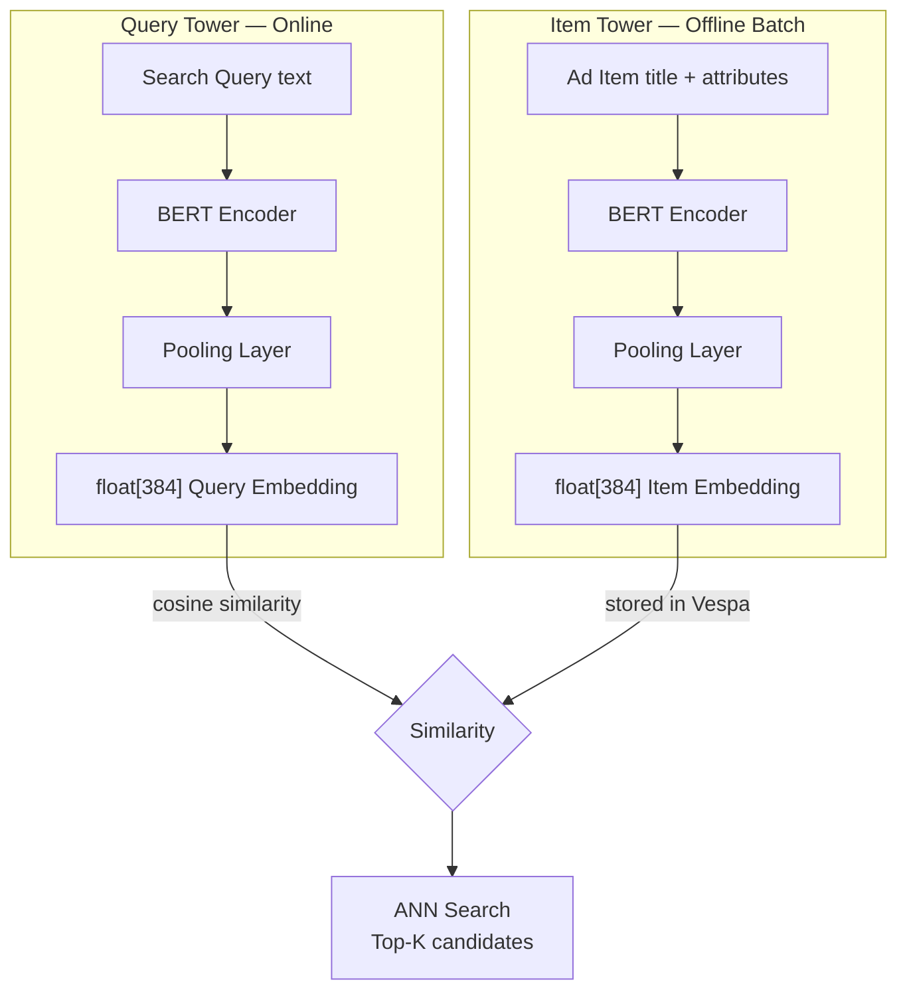
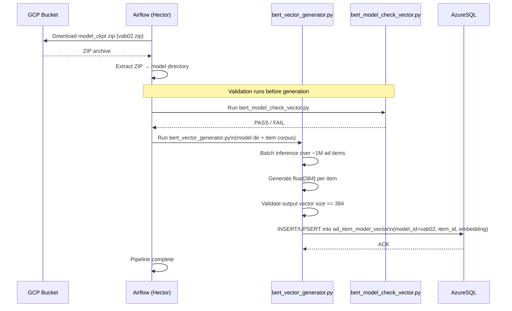
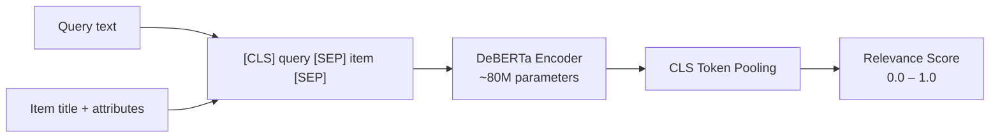
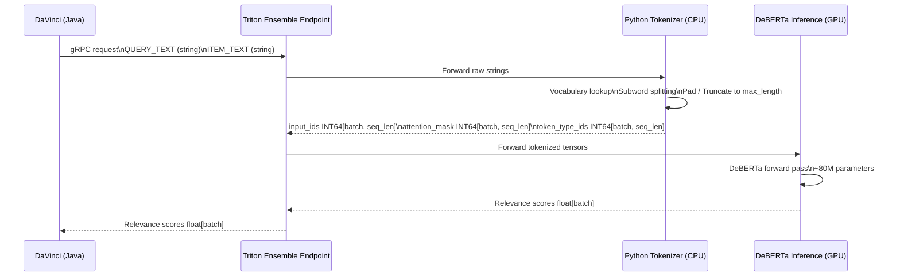
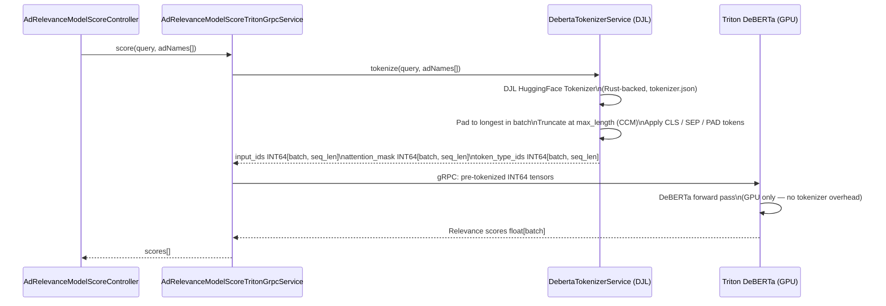
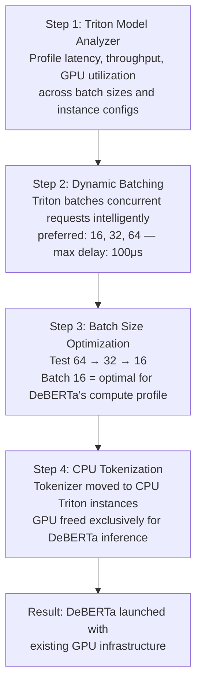
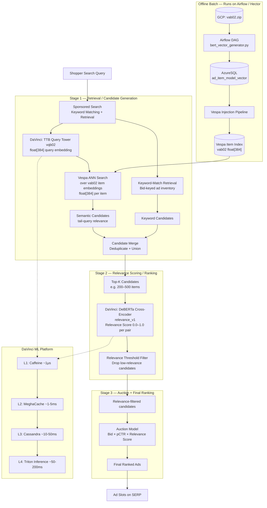

# Chapter 22 — Ad Relevance Flow: Two-Tower BERT & DeBERTa

## 1. Overview

Walmart Sponsored Products (SP) uses two complementary ML models to ensure that ads shown to shoppers are semantically relevant to the search query — not just bid-price winners. These models operate at different stages of the serving pipeline:

| Stage | Model | Role |
|---|---|---|
| Stage 1 — Retrieval | Two-Tower BERT (TTB) | Candidate generation: ANN search over item embeddings to surface a broad but relevant set of ad candidates |
| Stage 2 — Ranking | DeBERTa Cross-Encoder | Fine-grained relevance scoring: assigns a 0.0–1.0 relevance score to each (query, ad item) pair before auction |

Both models are served through **DaVinci**, Walmart's ML platform for sponsored product search. DaVinci exposes a REST API (`AdRelevanceModelScoreController`) and routes inference requests to **NVIDIA Triton** inference servers hosted on **Element** (Walmart's GPU-accelerated serving infrastructure).

The key motivation for both models is improving relevance for **tail queries** — long-tail, low-frequency searches where keyword matching alone is insufficient to find semantically appropriate ads.

```mermaid
flowchart LR
    Q[Search Query] --> TTB_Q[TTB Query Tower]
    TTB_Q -->|float[384]| VESPA[Vespa ANN Search]
    VESPA -->|Top-K ad candidates| DEBERTA[DeBERTa Cross-Encoder]
    DEBERTA -->|relevance score 0.0–1.0| AUCTION[Auction / Ranking]
    AUCTION --> SERP[Ad Slots on SERP]

    subgraph Offline
        ITEMS[(Ad Item Corpus)] --> TTB_I[TTB Item Tower]
        TTB_I -->|float[384] per item| VESPA_IDX[(Vespa Item Index)]
    end
```

---

## 2. Two-Tower BERT (TTB) — Retrieval Stage

### 2.1 Architecture

The Two-Tower BERT model uses two independent neural network towers that share the same embedding space. At query time, only the Query Tower runs in the hot path; Item Tower embeddings are pre-computed offline and indexed in Vespa.



**Key properties:**
- Both towers produce 384-dimensional float vectors.
- Similarity metric: cosine similarity between query and item embeddings.
- Retrieval: Vespa performs Approximate Nearest Neighbor (ANN) search over pre-indexed item embeddings at query time.
- The towers are trained jointly so embeddings live in a shared semantic space, but inference is asymmetric: item embeddings are computed once offline, query embeddings are computed at request time.
- Purpose: **Stage 1 candidate generation only** — not fine-grained scoring.

### 2.2 Model IDs

| Model ID | Description | Vector Type | Vector Size | Active |
|---|---|---|---|---|
| `vab01` | Legacy BERT item embeddings | item | varies | legacy |
| `vab02` | Two-Tower BERT item embeddings | item | 384 | Y |
| `vqb02` | Two-Tower BERT query embeddings | query | 384 | Y |

### 2.3 GCP Model Artifacts

| Artifact | GCP Path |
|---|---|
| Legacy BERT model checkpoint | `gs://adtech-prod-spadserver-artifacts/hector/model_checkpoints/vab01.zip` |
| Two-Tower BERT model checkpoint | `gs://adtech-prod-spadserver-artifacts/hector/model_checkpoints/vab02.zip` |
| Extractor script | `gs://adtech-prod-spadserver-artifacts/bert/bert_model_extractor.py` |

### 2.4 AzureSQL Schema

Three AzureSQL tables govern model configuration. All pipeline components read from these tables to determine which models are active.

#### `vector_model`
Defines each embedding model and its properties.

| Column | vab02 value | vqb02 value | Notes |
|---|---|---|---|
| `model_id` | `vab02` | `vqb02` | Unique model identifier |
| `tenant` | `WMT` | `WMT` | Tenant namespace |
| `vector_type` | `item` | `query` | Distinguishes item vs query towers |
| `vector_size` | `384` | `384` | Embedding dimensionality |
| `is_active` | `Y` | `Y` | Enables model in pipeline |
| `is_ctx` | `N` | `Y` | Context (query) vs ad embedding flag |
| `is_ad` | `Y` | `N` | Whether vectors represent ad items |
| `model_type` | `bert` | `bert` | Differentiates from TensorFlow models |
| `is_vespa` | `Y` | `Y` | Vectors are indexed in Vespa |

#### `vector_generation_model_v2`
Specifies generation configuration (checkpoint location, ngram config).

| Column | vab02 value | Notes |
|---|---|---|
| `model_id` | `vab02` | FK → `vector_model.model_id` |
| `ngram_config` | `{}` | Tokenization config (empty for BERT) |
| `model_ckpt` | `gs://...vab02.zip` | GCP path to model checkpoint zip |
| `is_active` | `Y` | Active flag |

#### `vector_serving_model`
Controls how the serving pipeline links input models to vector-generation models.

| Column | vab02 value | Notes |
|---|---|---|
| `model_id` | `vab02` | Serving model ID |
| `tenant` | `WMT` | Tenant namespace |
| `input_position` | `0` | Input slot position |
| `input_model_id` | `vab02` | Source model for input features |

The pipeline SQL query that selects active BERT models (explicitly excludes TensorFlow models):

```sql
SELECT a.model_id, ngram_config, model_ckpt
FROM vector_generation_model_v2 a
INNER JOIN vector_model b ON a.model_id = b.model_id
WHERE a.is_active = b.is_active
  AND a.is_active = 'Y'
  AND b.model_type = 'bert'
```

### 2.5 Offline Batch Vector Generation Pipeline

Two separate Airflow DAGs run under the **Hector** project — one for the legacy BERT model and one for the Two-Tower BERT model. Each DAG follows the same structure.



**Validation details:**
- `bert_model_check_vector.py` is a DS-team-provided script that verifies model integrity before generation begins, preventing silent corruption from reaching production Vespa.
- After generation, each vector's dimensionality is validated to match the `vector_size` declared in the `vector_model` table (384 for vab02).

### 2.6 Vespa Integration

The Vespa schema was extended with a new field to hold Two-Tower BERT item embeddings alongside new rank profiles that enable ANN retrieval:

- **New field**: stores `float[384]` HNSW-indexed tensor per ad item document.
- **New rank profiles**: define cosine similarity scoring against the query tower embedding.
- **Retrieval**: At query time, the query embedding (vqb02) is sent to Vespa, which performs ANN search to return the top-K most semantically similar ad items.

### 2.7 Pipeline Milestones (as of April 2023)

| Milestone | Status |
|---|---|
| Ads embedding generation pipeline (~1M items) | Done |
| Hot query embedding generation (~40M queries) | Done |
| Pipeline injecting ads embeddings to Vespa | Done (switch pending) |
| Auto-painting look-up table of query embeddings | WIP |
| Staging Vespa service performance testing | WIP |
| Production Vespa service | WIP (after staging validation) |

---

## 3. DeBERTa Cross-Encoder — Ranking Stage

### 3.1 Architecture

DeBERTa (Decoding-enhanced BERT with Disentangled Attention) is used as a **cross-encoder**: the query and item text are concatenated and fed jointly into the model, allowing full attention between all query and item tokens. This produces a single relevance score rather than independent embeddings.



### 3.2 Cross-Encoder vs Bi-Encoder Distinction

| Property | DeBERTa Cross-Encoder | Two-Tower BERT Bi-Encoder |
|---|---|---|
| Input | (query, item) concatenated | query OR item independently |
| Attention | Full cross-attention between query and item tokens | Self-attention within each tower only |
| Output | Scalar relevance score | Dense embedding vector |
| Latency | Higher (must run at query time per pair) | Lower (item embeddings pre-computed offline) |
| Accuracy | Higher — sees full interaction between query and item | Lower — similarity approximated via vector distance |
| Use case | Stage 2 ranking (top-K candidates from TTB) | Stage 1 retrieval (ANN over full item corpus) |
| Scalability | Applied to O(hundreds) of candidates | Index O(millions) of items offline |

### 3.3 DeBERTa Upgrade from Cross-Encoder

The previous relevance model was a generic Cross-Encoder with approximately 7M parameters. DeBERTa's disentangled attention mechanism — which separately encodes content and positional information — provides superior understanding of semantic relationships between query and item at the cost of ~80M parameters (~11x larger).

| Metric | Previous Cross-Encoder | DeBERTa |
|---|---|---|
| Parameter count | ~7M | ~80M |
| Attention mechanism | Standard BERT attention | Disentangled attention (content + position) |
| Relative size | 1x | ~11x |
| Infrastructure added | — | None (optimization mitigated cost) |

---

## 4. Triton Inference Pipeline — Current: Python Ensemble

### 4.1 Architecture

The current production setup uses a **Triton Ensemble** pipeline that chains two Triton model instances: a Python tokenizer running on CPU instances and the DeBERTa model running on GPU instances. DaVinci sends raw text strings to the Ensemble endpoint, which orchestrates both steps internally.



### 4.2 Bottlenecks of the Python Ensemble Approach

| Bottleneck | Root Cause | Impact |
|---|---|---|
| Python GIL | Global Interpreter Lock limits tokenizer parallelism under concurrent requests | Tokenizer becomes CPU-bound bottleneck under high QPS |
| Python→C++ memory copy | Each request requires copying string data across language boundaries into Triton's C++ runtime | Per-request overhead adds latency |
| Ensemble orchestration overhead | GPU sits idle while Step 1 (Python tokenizer) executes; Ensemble adds coordination round-trip | GPU utilization reduced; effective throughput lower than standalone GPU model |
| Inflexible scaling | CPU-bound tokenization work forces CPU Triton instance provisioning to scale with GPU demand | Infrastructure costs tied together; cannot scale CPU and GPU tiers independently |

---

## 5. Triton Inference Pipeline — New: Java Tokenizer

### 5.1 Design

Tokenization is moved from the Triton Python Ensemble into the **DaVinci Java service layer** using the **DJL (Deep Java Library) HuggingFace Tokenizer** — a Rust-backed implementation that reads the same `tokenizer.json` used by the Python HuggingFace library. This guarantees byte-for-byte identical tokenization output while eliminating Python GIL contention from the GPU serving path.

The Triton model changes from an Ensemble pipeline to a **standalone DeBERTa GPU model** that receives pre-tokenized INT64 tensors directly.

### 5.2 New Request Flow



### 5.3 DJL Tokenizer Parity

The DJL tokenizer reads the same `tokenizer.json` artifact used by the Python HuggingFace library. This ensures:
- Identical vocabulary mapping.
- Identical subword splitting (BPE/WordPiece, depending on config).
- Identical special token insertion (CLS, SEP, PAD).
- Byte-for-byte identical `input_ids` arrays between Java and Python implementations.

This parity is critical because the DeBERTa model was trained with a specific tokenizer configuration; any deviation would corrupt inference outputs.

### 5.4 CCM Rollout Gates

The Java tokenizer is introduced behind CCM (Config and Control Management) flags, enabling per-model rollout without code deployments:

| CCM Property | Type | Default | Purpose |
|---|---|---|---|
| `ad.relevance.model.tokenization.enabled.models` | `List<String>` | `[]` | Allowlist of model IDs using Java tokenization; models not in list continue using Triton Ensemble |
| `ad.relevance.model.tokenization.max.length` | `Integer` | `64` | Maximum sequence length; sequences are truncated at this token count |
| `ad.relevance.model.batch.size.mapping` | `Map<String, Integer>` | per-model | Per-model batch size configuration |

---

## 6. Production Optimization: DeBERTa Launch Without Extra GPUs

### 6.1 The Challenge

DeBERTa's ~80M parameters represent an ~11x parameter increase over the previous Cross-Encoder. Naive deployment on existing GPU infrastructure would exceed latency budgets (P99 < 500ms). The DS and platform teams solved this with a 4-step optimization process that allowed DeBERTa to launch without provisioning additional GPU infrastructure.

### 6.2 Optimization Steps



#### Step 1: Triton Model Analyzer

The Triton Model Analyzer profiling tool was used to systematically benchmark DeBERTa across all combinations of batch size and concurrent instance count on the existing GPU hardware. This identified where latency and throughput were bottlenecked before any optimization decisions were made.

#### Step 2: Dynamic Batching

Triton's dynamic batching groups incoming requests into batches at the server level, allowing efficient GPU utilization even when individual batch sizes per request are small. Configuration:

```
dynamic_batching {
  preferred_batch_size: [16, 32, 64]
  max_queue_delay_microseconds: 100
}
```

| Parameter | Value | Meaning |
|---|---|---|
| `preferred_batch_size` | `[16, 32, 64]` | Triton targets these sizes for optimal GPU utilization; fills batches to these sizes when possible |
| `max_queue_delay_microseconds` | `100` | Maximum time (100μs) Triton will hold requests waiting to fill a preferred batch before dispatching |

The 100μs delay is imperceptible to end-users but allows Triton to aggregate concurrent requests from high-QPS traffic into efficient GPU batches.

#### Step 3: Batch Size Optimization

Batch size was tuned empirically against DeBERTa's memory and compute profile on existing GPUs:

| Batch Size | Result | Reason |
|---|---|---|
| 64 | Too slow — exceeded latency budget | DeBERTa's larger parameter count makes large batches memory-bound; GPU memory bandwidth saturated |
| 32 | Improved — within acceptable range | Better memory-compute balance; latency reduced |
| 16 | Optimal — best latency/throughput trade-off | Allows faster per-batch completion; Triton dynamic batching compensates for throughput via batching of concurrent requests |

Batch size 16 is the production setting. Dynamic batching at the Triton level ensures that serving throughput is not sacrificed despite the smaller per-dispatch batch.

#### Step 4: CPU Tokenization

In the Ensemble pipeline, the Python tokenizer was moved to **CPU Triton instances** separate from the GPU instances running DeBERTa. Tokenization (vocabulary lookup, subword splitting, padding) is sequential string processing — it is inherently CPU-efficient and does not benefit from GPU parallelism. Separating tokenization from inference:
- Frees GPU cycles exclusively for DeBERTa matrix operations.
- Allows CPU and GPU Triton instance pools to be scaled independently.
- Achieves similar tokenization throughput to the previous configuration.

### 6.3 Combined Effect

The four optimizations together allowed DeBERTa (~80M parameters) to match the operational profile of the previous Cross-Encoder (~7M parameters) on the same GPU hardware:

| Component | Configuration |
|---|---|
| Inference batch size | 16 |
| Dynamic batching sizes | [16, 32, 64] |
| Max queue delay | 100μs |
| Tokenizer placement | CPU Triton instances |
| Additional GPU infrastructure | None required |

---

## 7. Future: Java Sidecar on Element

### 7.1 Architecture

The next evolution moves tokenization even closer to the GPU: a **Java sidecar** runs inside the same Kubernetes pod as the Triton inference server on Element. This eliminates the network hop between DaVinci's tokenization call and Triton.

```mermaid
flowchart TB
    subgraph Element K8s Pod
        SIDECAR[Java Sidecar\nFeast feature fetch + Tokenizer]
        TRITON_GPU[Triton Standalone DeBERTa\nGPU inference]
        SIDECAR -->|INT64 tensors\ninput_ids, attention_mask, token_type_ids| TRITON_GPU
    end

    DV[DaVinci] -->|gRPC: Triton Ensemble endpoint\n(interface unchanged)| SIDECAR
    FEAST[(Feast Feature Store)] -->|adName features| SIDECAR
    TRITON_GPU -->|Relevance scores float[batch]| DV
```

### 7.2 Sidecar Responsibilities

1. **Feature fetch**: The sidecar fetches `adName` features from Feast — the feature store — replacing the need for DaVinci to supply raw item text in the request payload.
2. **Tokenization**: The sidecar runs the DJL HuggingFace tokenizer (same Rust-backed implementation) to produce INT64 tensors.
3. **Tensor handoff**: Passes `input_ids`, `attention_mask`, and `token_type_ids` directly to the Triton DeBERTa model within the same pod (local inter-process communication, avoiding network serialization).

### 7.3 DaVinci Interface Unchanged

The sidecar is an internal implementation detail. DaVinci continues to call the same **Triton Ensemble endpoint** it uses today. The sidecar replaces the Python tokenizer as Step 1 of the Ensemble without any API contract changes upstream. This allows the migration to be transparent to DaVinci's service layer.

---

## 8. Data Contracts

### 8.1 Tokenizer Input

| Field | Type | Constraints |
|---|---|---|
| `query` | `String` | Single search query text |
| `adNames` | `List<String>` | Ad item titles/attributes; up to 80 items per request |

### 8.2 Tokenizer Output Tensors

| Tensor | Data Type | Shape | Description |
|---|---|---|---|
| `input_ids` | `INT64` | `[batch_size, seq_len]` | Token IDs from vocabulary; includes CLS, SEP, PAD special tokens |
| `attention_mask` | `INT64` | `[batch_size, seq_len]` | 1 for real tokens, 0 for PAD positions |
| `token_type_ids` | `INT64` | `[batch_size, seq_len]` | Segment IDs: 0 for query tokens, 1 for item tokens |

Where:
- `batch_size` = number of (query, item) pairs in the batch (up to the per-model batch size limit).
- `seq_len` = dynamic, determined by the longest sequence in the batch after padding.

### 8.3 Tokenization Behavior

| Behavior | Configuration | Details |
|---|---|---|
| Padding strategy | Dynamic (pad to longest in batch) | No fixed sequence length; `seq_len` varies per batch, reducing wasted computation on short inputs |
| Truncation | At `max_length` tokens | CCM property: `ad.relevance.model.tokenization.max.length` (default: 64). Sequences exceeding this are truncated |
| Padding side | Right | Defined by `tokenizer_config.json`; PAD tokens appended at the end of shorter sequences |
| Special tokens | CLS, SEP, PAD | CLS prepended to full sequence; SEP separates query and item segments; PAD used for alignment |
| Token format | `[CLS] query tokens [SEP] item tokens [SEP] [PAD]...` | Standard BERT-style cross-encoder input format |

---

## 9. CCM Configuration Reference

All runtime behavior for the Ad Relevance pipeline is controlled via CCM (Config and Control Management), enabling zero-downtime configuration changes.

| CCM Property | Type | Default | Scope | Purpose |
|---|---|---|---|---|
| `ad.relevance.model.tokenization.enabled.models` | `List<String>` | `[]` | Per-model | Models using Java tokenization path; unlisted models use Triton Ensemble Python tokenizer |
| `ad.relevance.model.tokenization.max.length` | `Integer` | `64` | Global | Maximum token sequence length before truncation |
| `ad.relevance.model.batch.size.mapping` | `Map<String, Integer>` | varies | Per-model | Batch size override per model ID (e.g., `{"relevance_v1": 16, "ttb_emb": 32}`) |

**Rollout pattern:** To enable Java tokenization for DeBERTa, add `relevance_v1` to `ad.relevance.model.tokenization.enabled.models`. DaVinci's `AdRelevanceModelScoreTritonGrpcService` checks this list on each request and routes accordingly — no restart required.

---

## 10. Pipeline Integration Map

The following diagram shows how TTB (retrieval) and DeBERTa (ranking) integrate into the full Sponsored Products serving pipeline, from query receipt to final ad slot assignment.



### 10.1 Stage Responsibilities Summary

| Stage | Components | Models | Latency Budget |
|---|---|---|---|
| Stage 0 — Query receipt | Sponsored Search gateway | — | — |
| Stage 1 — Retrieval | Vespa ANN + keyword match | TTB vab02/vqb02 | Part of overall P99 < 500ms |
| Stage 2 — Relevance scoring | DaVinci + Triton | DeBERTa `relevance_v1` | ~50–200ms (Triton) |
| Stage 3 — Auction | Auction engine | Bid × pCTR × relevance | — |
| Offline | Airflow/Hector, AzureSQL, Vespa injection | TTB item tower vab02 | Batch (not latency-critical) |

### 10.2 DaVinci Models Served via Triton

| Triton Model ID | Architecture | Output | Stage |
|---|---|---|---|
| `ttb_emb` | Two-Tower BERT item tower | `float[384]` (new) / `float[512]` (legacy) | Stage 1 offline batch |
| `relevance_v1` | DeBERTa cross-encoder | `float[1]` relevance score 0.0–1.0 | Stage 2 online |
| `universal_r1` | Universal ranking model | ranking signal | Stage 2/3 |
| `multimodal_v2` | Multimodal model | multimodal embedding | Stage 1/2 |

### 10.3 Multi-Datacenter Production Topology

DaVinci is deployed across three Azure regions for high availability. TTB query embeddings and DeBERTa relevance scores are cached at each region independently via the 4-level cache hierarchy (Caffeine → MeghaCache → Cassandra → Triton).

| Region | Code |
|---|---|
| South Central US | SCUS |
| West US 2 | WUSE2 |
| East US 2 | EUS2 |

Cache read-repair ensures consistency: an L3 (Cassandra) hit triggers backfill into L2 (MeghaCache) and L1 (Caffeine), so the next request for the same (query, item) pair in the same region is served at microsecond latency.
