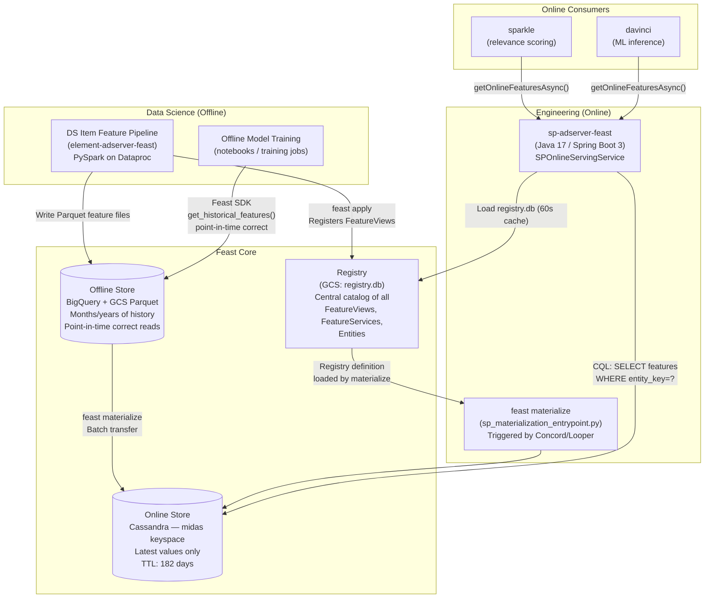
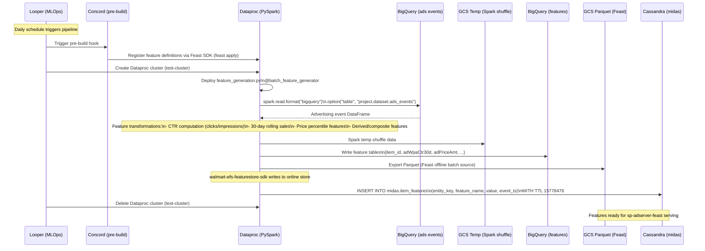
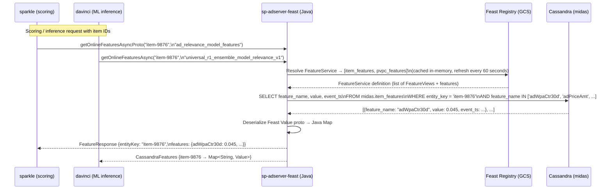
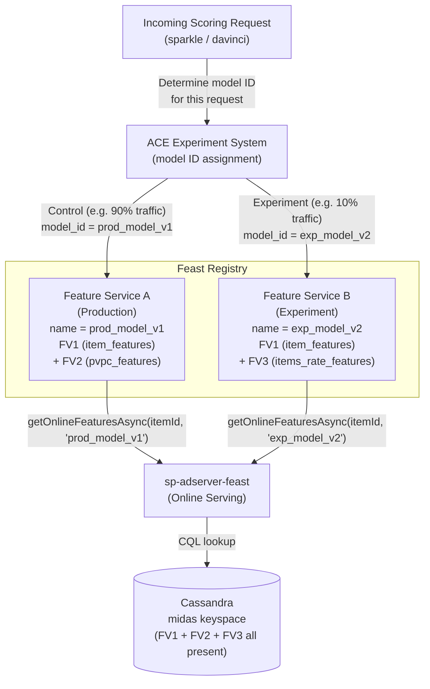
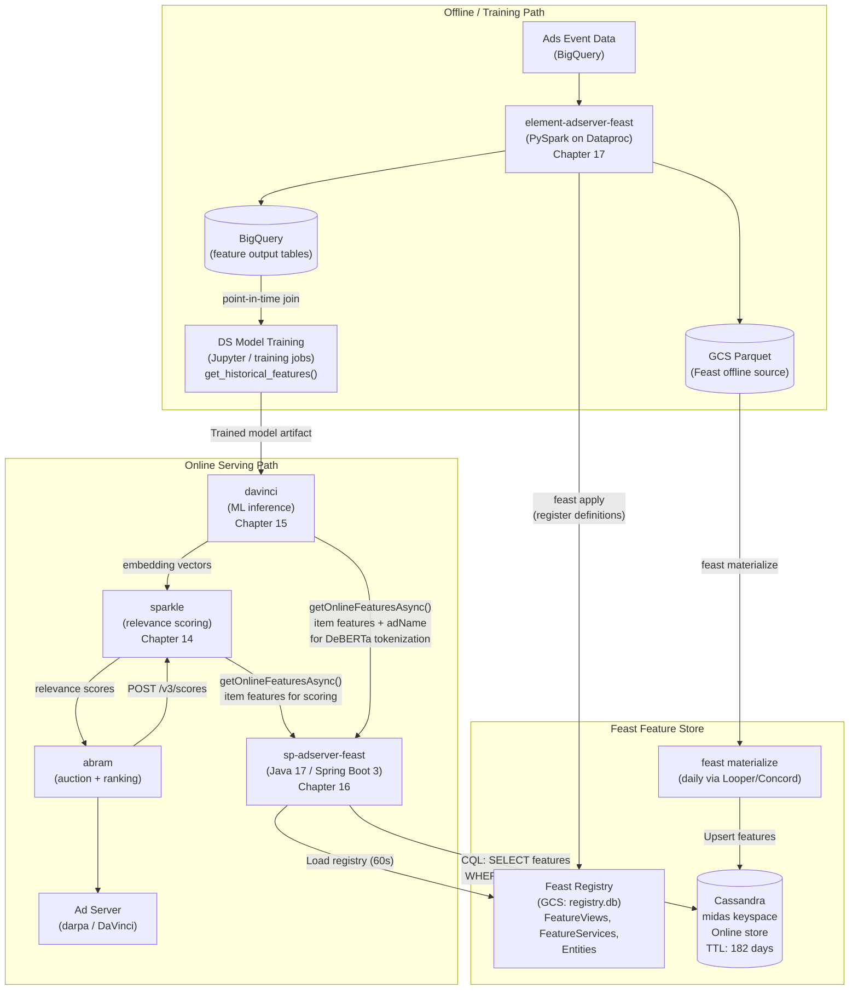

# Chapter 23 — Feast Feature Store Design

## 1. Overview

**Feast** (Feature Store) is the centralized feature management layer for Walmart Sponsored Products ML systems. It acts as the bridge between Data Science (model training, offline feature generation) and Engineering (real-time online serving for inference). Every ML feature that flows from batch computation through to ad ranking passes through Feast's registry, storage, and serving abstractions.

Feast was introduced to replace a fragmented set of hand-built Airflow pipelines that required manual coordination between Data Science and Engineering teams each time a new model or feature set was needed. In SP, Feast is deployed as two separate services:

- **element-adserver-feast** (Chapter 17) — batch feature engineering pipeline (PySpark on Dataproc), reads from BigQuery, writes to GCS Parquet and Cassandra
- **sp-adserver-feast** (Chapter 16) — online feature serving layer (Java 17 / Spring Boot 3), wraps the Feast SDK, serves features from Cassandra to sparkle and davinci at millisecond latency

The Feast repository itself (owned by Engineering) lives in `gecgithub01.walmart.com` and contains all Python feature definitions. `feast apply` registers definitions to the Registry; `feast materialize` transfers data from the offline store (BigQuery/GCS) to the online store (Cassandra, `midas` keyspace).

---

## 2. Before Feast: Limitations

The pre-Feast state involved custom, one-off Airflow pipelines with no shared infrastructure or metadata. Specific problems:

- **Manual sync required for every new model or feature.** Launching a new ML model required Engineering and Data Science to agree on feature format, pipeline schedule, and Cassandra schema through manual coordination — no self-service path.
- **No standard feature registry.** There was no central catalog tracking which features existed, what their data types were, or which models depended on them. Feature discovery was ad-hoc.
- **A/B test experiments forced production-wide changes.** To test a new feature set in an A/B experiment, features had to be written to production Cassandra tables, affecting all serving paths even for traffic not in the experiment.
- **No easy rollback for failed experiments.** Removing features after a failed A/B test required manual pipeline cleanup, schema changes, and coordination with downstream consumers.
- **Derived features required ingestion-side changes.** Features computed from other features (e.g. `feature3 = feature1 + feature2`) had no standard transformation layer — each required bespoke ingestion logic. Entirely different feature sets (e.g. pairwise features) required entirely new pipelines from scratch.

---

## 3. Feast Architecture

### 3.1 Component Diagram



### 3.2 Ownership Boundaries

| Layer | Component | Owner |
|---|---|---|
| Feature definitions (Python) | Feast repository, `feature_definitions.py` | Engineering |
| Offline feature generation | element-adserver-feast (PySpark pipeline) | Data Science |
| Registry sync (dev → prod) | `feast apply` (automated CI) | Engineering |
| Materialization (offline → online) | `feast materialize` via Concord/Looper | Engineering |
| Online serving | sp-adserver-feast (Java) | Engineering |
| Offline training data retrieval | Feast SDK `get_historical_features()` | Data Science |
| A/B test setup (FeatureService → ACE model ID) | ACE experiment configuration | Engineering |

---

## 4. Core Concepts Reference Table

| Concept | Description | SP Example |
|---|---|---|
| **Entity** | The join key for a Feature View. Identifies what the feature describes. | `item_id` — all SP feature views key on the ad item identifier |
| **Feature View** | A logical table keyed by an Entity. Non-key columns are features. Has an associated timestamp (version). Can be static (batch) or on-demand (streaming). | `item_features` (50+ columns: `adWpaCtr30d`, `adPriceAmt`, ...); `cnsldv2_features`; `items_rate_features`; `pvpc_features`; `item_quality_features` |
| **Feature Source** | The data source backing a Feature View (GCS Parquet, BigQuery table, local file). Defines where `feast materialize` reads from. | GCS Parquet files at `gs://adtech-ds-adhoc-dev/ds_wpa_ad_item_features_new_flattened` |
| **Feature Service** | A named grouping of features (from one or more Feature Views) intended for a specific ML model. The serving API resolves a Feature Service name to the set of Feature Views it spans. | `ad_relevance_model_features` (for sparkle); `universal_r1_ensemble_model_relevance_v1` (for davinci); `complementary_compatibility_ensemble_model_v5` |

**Registered Feature Views (sp_feature_repo):**

| Feature View | Entity | Approx. Fields | GCS Parquet Source | Purpose |
|---|---|---|---|---|
| `item_features` | item_id | 50+ | `ds_wpa_ad_item_features_new_flattened` | Core item ad features (CTR, sales, price) |
| `cnsldv2_features` | item_id | ~20 | `cnsldv2_item_features` | Consolidated v2 item features |
| `items_rate_features` | item_id | ~15 | `ds_wpa_ad_items_rate_features_v2` | Rate-based features |
| `pvpc_features` | item_id | ~10 | `item_pvpc_features` | Price/value/position features |
| `item_quality_features` | item_id | ~10 | `item_quality_features` | Quality score features |

### 4.1 Feast Concepts — Detailed

**Feature** is a typed property of an entity. Supported types include `int`, `double`, `float`, `string`, and others. Each feature represents one individual measurable property of the entity (e.g. a 30-day CTR value for an item).

**Feature View** is a logical table of features grouped by a key (entity). A single Feature View collects related features about the same entity type under one roof. Example: `item_fv` keys on `item_id` and provides columns `[item_30day_ctr, item_organic_30day_ctr, item_avg_price, item_ratings]`.

**Feature Service** groups features from potentially different Feature Views for consumption by a specific model. When a model needs both item-level and user-level features, the Feature Service references both `item_fv` (keyed by `item_id`) and `user_fv` (keyed by `user_id`), requiring two separate entity key lookups per inference request.

### 4.2 Feature Retrieval Mechanism (TTL-based Look-back)

Every Feature View has a **TTL** (time-to-live) that acts as a look-back window during retrieval from the offline store:

- If TTL = 7 days and a given item's features were updated 100,000 times in the past 7 days, Feast retrieves **all** rows from `(now − TTL)` to `now`, sorts them by timestamp, and picks the latest row.
- This look-back and sort-then-pick-latest logic is applied for **all** requested entity keys in the batch, making it computationally expensive at large scale (see Section 4.3 on offline performance).

---

## 5. Feast Limitations (Production Reality)

Understanding Feast's limitations explains why Sponsored Search has built several custom extensions on top of the open-source project.

### 5.1 Offline Performance

For large time intervals combined with high data volume, Feast generates very inefficient SQL queries to retrieve the latest value per entity key. The TTL-based look-back scans a wide time range and relies on a sort step that does not scale gracefully to billions of rows or millions of distinct entity keys.

### 5.2 Online Performance

- The **Java SDK** is more a proof of concept than a production-grade client — it does not work at scale for high-QPS serving.
- Out of the box, Feast online clients natively support only **Redis** and **BigTable**. Cassandra support is a custom extension (not part of the upstream project).

### 5.3 Materialization

Default upstream Feast materialization runs as **single-threaded Python** and does not scale. It cannot handle the data volumes required by Sponsored Search in any reasonable time window.

---

## 6. SP Feast Customizations

Sponsored Search has built the following customizations on top of open-source Feast to work around the limitations described above.

### 6.1 Scalable Materialization (Spark)

The default single-threaded Python materialization has been replaced with a **Spark-cluster-based** implementation. Materialization jobs are distributed across a Spark cluster (Google Dataproc), partitioning by `item_id` into 100 parallel partitions for Cassandra writes. This provides the throughput needed to process SP-scale feature volumes daily.

### 6.2 Custom Cassandra Online SDK

Because Feast has no native Cassandra support, Sponsored Search built a custom Cassandra online store SDK (`SPCassandraOnlineRetriever`). Cassandra is the standard online data store across Walmart Sponsored Search infrastructure, so a native integration was necessary rather than migrating to Redis or BigTable.

---

## 7. Offline Pipeline (element-adserver-feast)

element-adserver-feast is the PySpark batch pipeline that generates feature data and populates the offline store. It is owned by Data Science and runs on Google Dataproc.

### 7.1 Sequence Diagram



### 7.2 feast materialize

`feast materialize` is the command that transfers feature data from the offline store (GCS Parquet / BigQuery) to the online store (Cassandra). In SP it is invoked via `sp_materialization_entrypoint.py`, triggered by Concord.

```python
# sp_materialization_entrypoint.py (simplified)
fs = FeatureStore(repo_path=".", config=feature_store_yaml)
fs.materialize(
    start_date=start_date,
    end_date=end_date,
    feature_views=None  # materializes all registered FeatureViews
)
```

The SP custom engine partitions the workload by `item_id` into 100 partitions to parallelize the Cassandra write.

### 7.3 Schedule and TTL

| Parameter | Value |
|---|---|
| Trigger | Looper (Walmart MLOps) — daily schedule |
| Orchestration | Concord workflow (secrets injection via Akeyless) |
| Cassandra TTL | **182 days** (15,778,476 seconds) |
| Cassandra keyspace | `midas` |
| Spark cluster | Google Dataproc — ephemeral `test-cluster` (created and deleted per run) |
| Executor count | 28 executors × 3 cores × 20 GB memory |

---

## 8. Online Serving (sp-adserver-feast)

sp-adserver-feast is the Java 17 / Spring Boot 3 service that wraps the Feast SDK to serve pre-computed features from Cassandra at low latency. It is used by both sparkle (relevance scoring) and davinci (ML inference).

### 8.1 Sequence Diagram



### 8.2 CQL Query Pattern

The Cassandra retriever (`SPCassandraOnlineRetriever`) issues the following query for each entity key:

```sql
SELECT feature_name, value, event_ts
FROM midas.{feature_view_name}
WHERE entity_key = :itemId
AND feature_name IN :featureNames
```

- **Keyspace:** `midas`
- **Table name:** matches the Feast FeatureView name (e.g. `item_features`, `cnsldv2_features`)
- **Entity key:** `item_id` (string — the ad item identifier)
- **Feature refs format:** `"feature_view:feature_name"` (e.g. `"item_features:adWpaCtr30d"`)

### 8.3 Java API Surface

| Method | Signature | Description |
|---|---|---|
| `getOnlineFeaturesAsync` | `(String id, String service) → CompletableFuture<CassandraFeatures>` | Returns features as Java Map |
| `getOnlineFeaturesAsyncProto` | `(String id, String service) → CompletableFuture<FeatureResponse>` | Returns features as Protobuf |
| `getOnlineFeaturesForTenantAsyncProto` | `(String id, String service, String tenant) → CompletableFuture<FeatureResponse>` | Multi-tenant (WMT / WAP) retrieval |
| `getServiceNamesForFeatures` | `(List<String> features, String consumer) → List<String>` | Resolve feature service names from feature list |

**Protobuf response:**
```protobuf
message FeatureResponse {
  string entityKey = 1;
  int64 eventTs    = 2;
  map<string, feast.types.Value> features = 3;
}
```

---

## 9. A/B Testing with Feature Services

### 9.1 Design

Feature Services are the Feast primitive that enables safe A/B testing of new feature sets without impacting production serving. Each Feature Service maps directly to a **model ID in the ACE experiment** system.

- In production, consumers request features using the production Feature Service name.
- In an experiment, ACE routes a fraction of traffic to a new model ID. The new model ID corresponds to a new Feature Service, which may reference different Feature Views (a different feature set).
- Both production and experiment Feature Services coexist in the Registry simultaneously. No pipeline changes are needed to add or remove experiment feature sets — only the Feature Service definition changes.

### 9.2 Feature Service A/B Routing



### 9.3 Operational Flow for A/B Test Setup

1. Data Science defines a new Feature View (`FV3`) and registers it via `feast apply`.
2. Engineering creates a new Feature Service (`exp_model_v2`) in the Feast repository referencing `FV1 + FV3`.
3. Looper runs `feast materialize` to populate `FV3` data in Cassandra (`midas` keyspace).
4. Engineering configures an ACE experiment with `model_id = exp_model_v2`.
5. ACE routes experiment traffic to use `exp_model_v2` — sp-adserver-feast resolves the new Feature Service and fetches `FV1 + FV3`.
6. If the experiment fails: delete the Feature Service definition in the Feast repository, remove the ACE experiment. No changes to production serving paths or Cassandra schema required.

---

## 10. Data Versioning

Feast uses **timestamp-based versioning** for all feature data. Each row in a Feature View carries:

| Field | Description |
|---|---|
| `entity_key` | The entity identifier (e.g. `item_id`) |
| `event_ts` | Timestamp of the feature observation (when the feature value was computed) |
| `created_ts` | Timestamp of materialization (when the row was written to the store) |
| `feature_name` | Feature column identifier |
| `value` | Serialized Feast `Value` proto (typed: FLOAT, INT64, STRING, etc.) |

### 10.1 Online Store Versioning

In Cassandra (`midas` keyspace), only the **latest** feature values per entity key are retained. When `feast materialize` runs daily, it upserts new rows, overwriting older values. The TTL (182 days) ensures stale data is automatically expired.

If a feature updates at a different cadence than the rest of a Feature View, it should be either:
- Placed in a **separate Feature View** (different materialization schedule), or
- Implemented as an **on-demand feature** (streaming / real-time computation at serve time).

### 10.2 Offline Store — Time-Travel for Training

The offline store (GCS Parquet / BigQuery) retains months or years of historical data. Data Science retrieves training datasets using **point-in-time correct joins**:

```python
# Point-in-time correct historical feature retrieval (DS training)
training_df = fs.get_historical_features(
    entity_df=entity_df_with_timestamps,   # item_id + event_timestamp per row
    features=["item_features:adWpaCtr30d", "pvpc_features:adPriceAmt"]
).to_df()
```

This "time-travel" join ensures that for each training example, the feature value returned is the value that would have been served at the exact `event_timestamp` of that training example — preventing data leakage from using future feature values during training.

---

## 11. Feast in the Full SP Stack



---

## 12. Configuration & Operations

### 12.1 Feast Repository Structure

The Feast repository lives in `gecgithub01.walmart.com` and is managed as code by Engineering. It contains:

```
feast-repo/
  sp_feature_repo/
    feature_definitions.py      # FeatureViews, FeatureServices, Entities
    dev/
      feature_store.yaml         # dev environment config
    prod/
      feature_store.yaml         # prod environment config
  wap_sp_feature_repo/          # International (WAP) feature repo
    dev/feature_store.yaml
    prod/feature_store.yaml
  sp_materialization_entrypoint.py  # Custom materialize entry point
  test_feature_definitions.py       # CI validation tests
```

Automatic sync between `dev` and `prod` environments is handled by CI.

### 12.2 Key Commands

| Command | Description | Who Runs It |
|---|---|---|
| `feast apply` | Parses feature definitions, validates them, and registers them to the Registry (`registry.db` on GCS). Must be run any time feature definitions change. | Engineering CI / Concord pre-build hook |
| `feast materialize` | Reads feature data from offline source (GCS Parquet) and upserts into online store (Cassandra `midas`). Triggered daily. | Looper (Walmart MLOps) + Concord |
| `feast teardown` | Removes infrastructure associated with a feature store environment. | Engineering (decommission only) |

### 12.3 feature_store.yaml

```yaml
# prod/feature_store.yaml (representative structure)
project: sp_adserver_feast
registry: gs://adtech-spadserver-artifacts-prod/feast/dev/registry.db
provider: local
online_store:
  type: cassandra
  hosts: [<cassandra-cluster-hosts>]
  keyspace: midas
  username: ${CASSANDRA_USERNAME}
  password: ${CASSANDRA_PASSWORD}
offline_store:
  type: file     # GCS Parquet
entity_key_serialization_version: 2
```

### 12.4 Operational Parameters

| Parameter | Value | Notes |
|---|---|---|
| Cassandra keyspace | `midas` | All Feast online feature tables |
| Cassandra TTL | **182 days** (15,778,476 s) | Applied at INSERT time via `feast materialize` |
| Registry GCS path | `gs://adtech-spadserver-artifacts-prod/feast/dev/registry.db` | Loaded by sp-adserver-feast every 60 seconds |
| Registry refresh interval | 60 seconds | In-memory cache in sp-adserver-feast |
| Materialization schedule | Daily | Triggered by Looper |
| Feast project name | `sp_adserver_feast` | Used for namespace isolation |
| Entity key serialization version | `2` | Feast v2 entity key format |
| Tenant prefix map | `{WMT: "", WAP: "wap_"}` | For international (WAP) feature table routing |
| Cassandra auth | Akeyless Vault | `CASSANDRA_USERNAME`, `CASSANDRA_PASSWORD` |
| GCP credentials | Akeyless Vault | `GOOGLE_APPLICATION_CREDENTIALS` |

### 12.5 Multi-Tenant Support

sp-adserver-feast supports two tenants:

| Tenant | Table Prefix | Feature Repo |
|---|---|---|
| `WMT` (US domestic) | _(none)_ | `sp_feature_repo/` |
| `WAP` (international) | `wap_` | `wap_sp_feature_repo/` |

The tenant is passed via `getOnlineFeaturesForTenantAsyncProto(id, service, tenant)`. The `SPServingModuleFactory` initializes separate Feast registry instances per tenant.

### 12.6 Monitoring and Validation

- **CI validation:** `test_feature_definitions.py` runs on every PR to validate feature definition correctness before `feast apply`.
- **Materialization health:** Looper tracks daily materialization job success/failure.
- **Cassandra TTL monitoring:** Features older than 182 days are automatically expired; a gap in daily materialization longer than 182 days would result in complete data loss for the affected Feature View.
- **Registry staleness:** sp-adserver-feast logs registry load failures; a stale registry (>60s) can cause Feature Service resolution to use cached (possibly outdated) definitions.

---

## 13. FY25 Roadmap / Next Steps

The following initiatives are planned to further mature the SP Feast deployment:

1. **Feature Definitions Metadata in SQL Store** — Move the registry from a flat `registry.db` file on GCS to a SQL-backed metadata store. This enables validation of definitions before writing and provides better auditability and concurrent access patterns.

2. **Feature Store Offline: Spark Improvements** — The default Feast Spark plugin is inefficient for the SP data volumes. This initiative replaces or significantly optimizes the Spark materialization path to reduce job duration and resource cost.

3. **Cassandra Online SDK — Generic + Pluggable Caching** — The custom Cassandra SDK will be generalized so other Walmart teams can leverage it (not just Sponsored Search). Additionally, the caching layer will be made pluggable to support both single-tier and three-tier cache architectures.

4. **Pairwise / Conjunction Feature Support** — The current Feast version does not support Feature Views with multiple entity keys (e.g. a `(item_id, query_id)` pair). This work adds conjunction/pairwise feature support, enabling cross-entity features critical for advanced ranking models.

5. **Feast Access from Element Triton Servers** — Future-state goal: Triton inference servers in Element will look up Feature View data directly from Feast, rather than having Davinci or Sparkle fetch features and include them in the ML payload passed to Triton. This simplifies the serving pipeline and decouples feature retrieval from model payload construction.

---

## 14. Walmart-Wide Feature Store Landscape

Different Walmart engineering organizations have taken different approaches to feature store infrastructure:

| Organization | Approach |
|---|---|
| **SAMs Engineering** | Uses Feast (same open-source project) |
| **Display Ads Engineering** | Built Feature Management System (FMS) from scratch — no Feast dependency |
| **Element Platform** | Combines Feast + Vertex AI (Google managed feature store) |
| **Sponsored Search** | Feast with custom Cassandra online SDK + Spark-based materialization |

The SP implementation is the most customized, adding Cassandra support and scalable Spark materialization that are absent from upstream Feast. The Cassandra SDK generalization work in FY25 (see Section 13) is partly motivated by making SP's extensions available to other Walmart teams also on Feast, such as SAMs Engineering.
