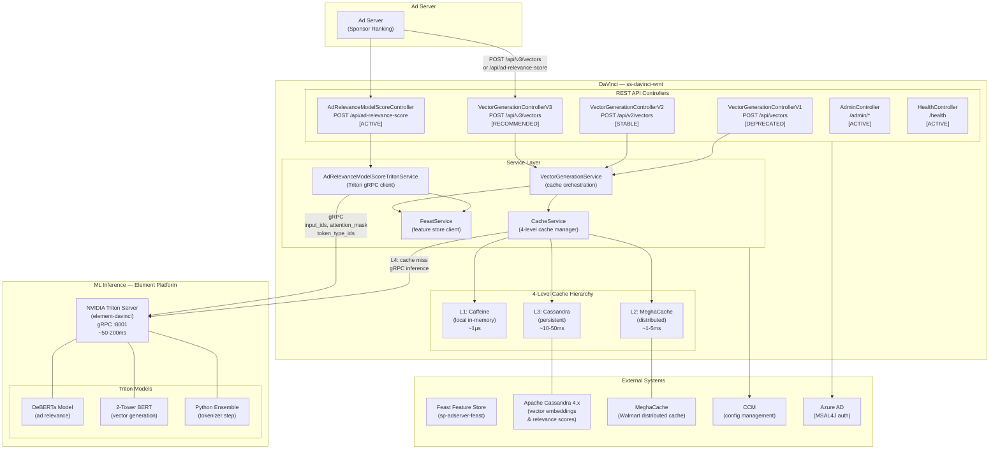
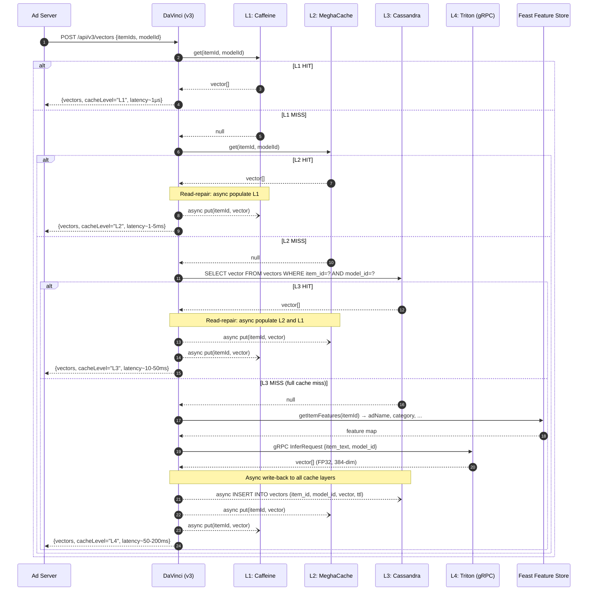
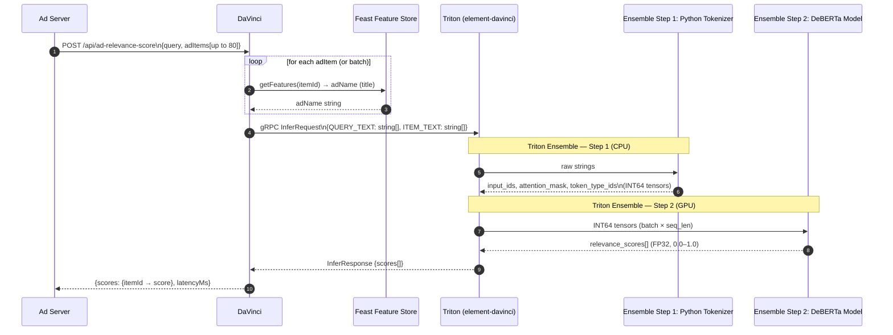
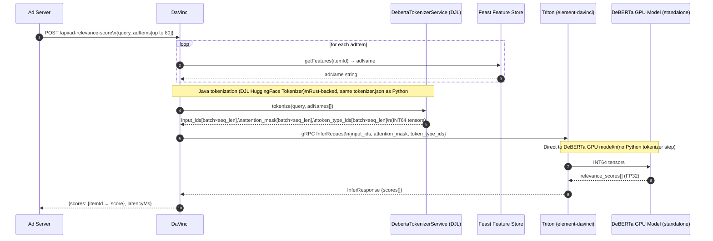
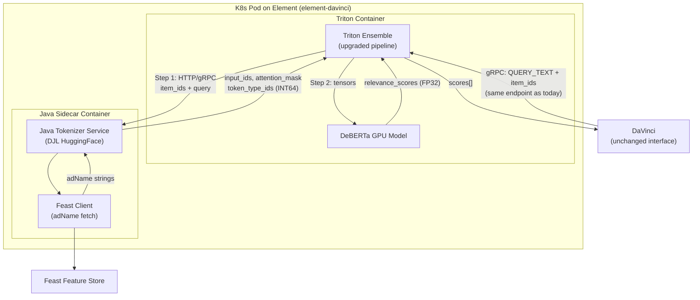
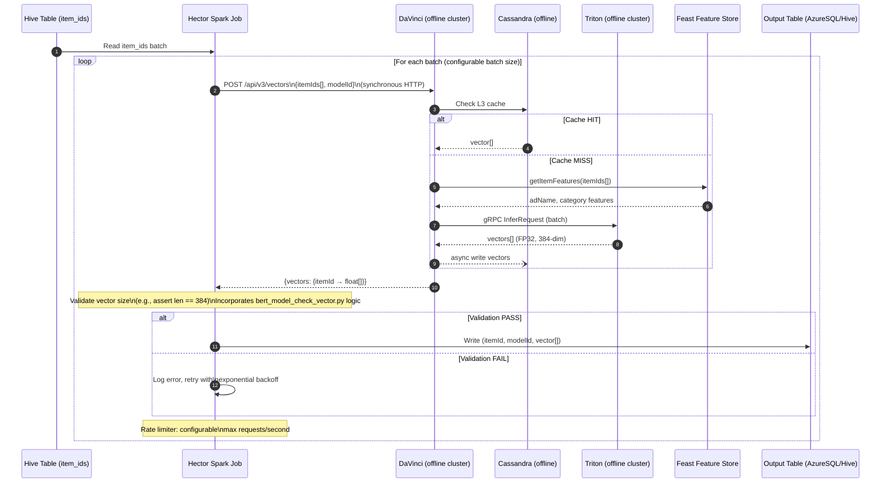
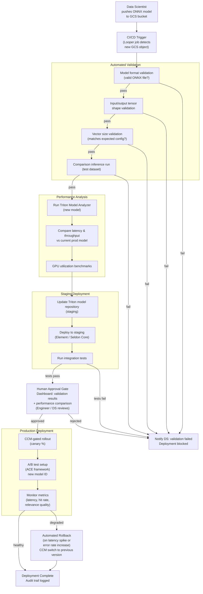
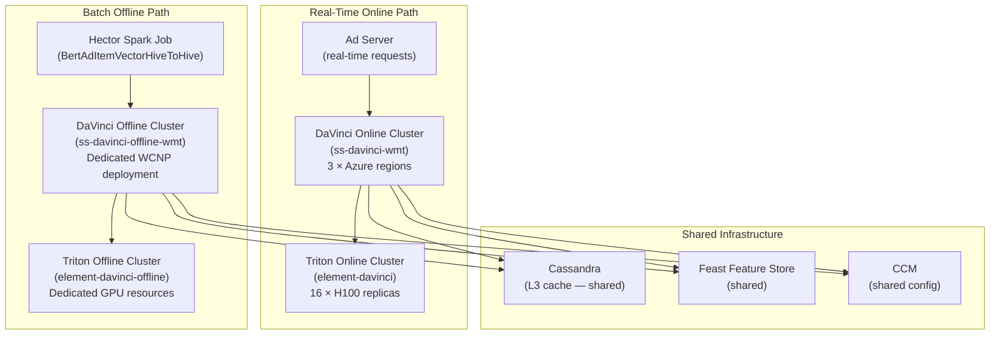

# Chapter 24 — DaVinci ML Platform Deep Dive

## 1. Overview

**DaVinci** is Walmart Sponsored Products' machine learning platform for ad retrieval, scoring, and relevance optimization. It sits between the Ad Server and the ML inference layer (NVIDIA Triton on Element), performing three core roles:

| Role | Description |
|------|-------------|
| **Translator** | Converts business-level item IDs into numeric tensors consumable by Triton; maps request context (query + item) into model-ready inputs |
| **Coordinator** | Fetches item features from the Feast feature store, routes requests to the correct Triton model and version, manages batching and retries |
| **Optimizer** | Operates a 4-level progressive cache hierarchy (Caffeine → MeghaCache → Cassandra → Triton) to serve the majority of requests from cache, minimizing latency and GPU spend |

DaVinci does not perform ML inference itself. It orchestrates the retrieval of pre-computed vectors and scores, and falls back to live Triton inference only when no cached result exists. This design achieves a P99 end-to-end response time of under 500ms while allowing the underlying ML models to be swapped without changing the Ad Server contract.

**Key identifiers:**

- **WCNP Namespace:** `ss-davinci-wmt`
- **Port:** 8080
- **Swagger UI:** `https://davinci-wmt.prod.walmart.com/docs`
- **Framework:** Spring Boot 3.5.0 / Java 21
- **Triton Backend:** `element-davinci` (Chapter 18) — H100 GPU replicas across 3 Azure regions

---

## 2. System Architecture

### 2.1 Component Diagram



### 2.2 Module Structure

```
davinci/
├── service/                    # Main Spring Boot application
│   ├── src/main/java/
│   │   ├── config/            # Configuration classes (CCM, Triton, cache)
│   │   ├── controller/        # REST API endpoints (v1, v2, v3, ad-relevance)
│   │   ├── service/           # Business logic (VectorGenerationService, etc.)
│   │   ├── manager/           # Integration managers (Feast, cache)
│   │   └── DavinciApplication.java
│   └── src/main/resources/    # application.yml, logback config
├── datalayer/                  # Data persistence layer
│   ├── entities/              # Cassandra entities (vector, score)
│   └── repositories/          # Spring Data Cassandra repositories
├── common/                     # Shared DTOs, utilities, constants
├── ccm/                        # CCM property bindings
└── pom.xml                     # Maven root POM
```

---

## 3. API Reference

| Controller | Endpoint | Method | Purpose | Status |
|------------|----------|--------|---------|--------|
| VectorGenerationControllerV1 | `/api/vectors` | POST | Generate item embedding vectors (original) | **DEPRECATED** |
| VectorGenerationControllerV2 | `/api/v2/vectors` | POST | Generate item embedding vectors (improved batching) | **STABLE** |
| VectorGenerationControllerV3 | `/api/v3/vectors` | POST | Generate item embedding vectors — full 4-level cache | **RECOMMENDED** |
| AdRelevanceModelScoreController | `/api/ad-relevance-score` | POST | Run DeBERTa ad relevance scoring (query + items) | **ACTIVE** |
| AdminController | `/admin/*` | GET/POST | Configuration management, cache eviction, model switching | **ACTIVE** |
| HealthController | `/health` | GET | Liveness, readiness, startup probes | **ACTIVE** |

### Request/Response Contracts

**POST `/api/v3/vectors`**

```json
// Request
{
  "itemIds": ["12345678", "87654321"],
  "modelId": "bert-2tower-v3",
  "modelVersion": "1"
}

// Response
{
  "vectors": {
    "12345678": [0.123, -0.456, ...],   // 384-dim float array
    "87654321": [0.789, 0.012, ...]
  },
  "cacheLevel": "L2",
  "latencyMs": 3
}
```

**POST `/api/ad-relevance-score`**

```json
// Request
{
  "query": "wireless bluetooth headphones",
  "adItems": [
    { "itemId": "12345678", "adName": "Sony WH-1000XM5 Wireless Headphones" },
    { "itemId": "87654321", "adName": "Bose QuietComfort 45" }
  ],
  "modelId": "deberta-relevance-v2"
}

// Response
{
  "scores": {
    "12345678": 0.923,
    "87654321": 0.871
  },
  "latencyMs": 87
}
```

---

## 4. 4-Level Cache Hierarchy

### 4.1 Cache Levels — Latency Reference

| Level | Technology | Latency | Scope | Persistence | Eviction |
|-------|-----------|---------|-------|-------------|----------|
| **L1** | Caffeine (in-memory) | ~1μs | Per-pod (local) | None — lost on restart | Time-based (TTL) + size-based (max entries) |
| **L2** | MeghaCache (distributed) | ~1–5ms | Cluster-wide (all pods) | Survives pod restarts | TTL-based, cluster-managed |
| **L3** | Apache Cassandra 4.x | ~10–50ms | Persistent, multi-DC | Survives full cluster restart | TTL columns + compaction |
| **L4** | NVIDIA Triton (inference) | ~50–200ms | On-demand compute | N/A — real-time inference | Not a cache; always available |

**P99 end-to-end SLA:** <500ms (full cache miss including Triton inference)

### 4.2 V3 Cache Sequence Diagram

The v3 endpoint implements a progressive fallback: check each cache level in order, return immediately on hit, and trigger async write-back to shallower layers.



### 4.3 Read-Repair Behavior

Read-repair ensures that a cache hit at a deeper level automatically re-populates shallower levels, preventing future unnecessary cache misses:

- **L3 hit** → async populate both L2 and L1
- **L2 hit** → async populate L1 only
- **L4 (Triton) hit** → async write to L3, L2, and L1

All write-back operations are **asynchronous** (non-blocking). The response is returned to the caller as soon as the vector is retrieved, regardless of write-back completion.

### 4.4 Cache Eviction and TTL

| Layer | TTL Strategy | Size Limit | Notes |
|-------|-------------|------------|-------|
| L1 Caffeine | Configurable TTL per model (CCM) | Max entries per pod (CCM) | JVM heap bounded; evicts on TTL expiry or capacity |
| L2 MeghaCache | TTL propagated from Cassandra on read-repair | Cluster-managed | Walmart-internal distributed cache |
| L3 Cassandra | TTL columns (e.g., 24h for item vectors) | Unbounded (compaction) | `LOCAL_ONE` consistency; multi-DC replication |

---

## 5. Request Flow: Ad Relevance Scoring (DeBERTa Path)

### 5.1 Current Architecture (Python Ensemble in Triton)



### 5.2 New Architecture (Java Tokenizer in DaVinci)



---

## 6. Tokenizer Migration: Python Ensemble → Java DJL

### 6.1 Before/After Comparison

| Dimension | Python Ensemble (Current) | Java DJL Tokenizer (New) |
|-----------|--------------------------|--------------------------|
| **Tokenization location** | Triton Ensemble Step 1 (inside Triton pod, Python) | DaVinci JVM (Spring bean: `DebertaTokenizerService`) |
| **Tokenizer runtime** | Python (CPython), huggingface tokenizers library | DJL HuggingFace Tokenizer, Rust-backed (`tokenizers` crate) |
| **Token parity** | Authoritative | Identical — same Rust binary, same `tokenizer.json` |
| **Input to Triton** | Raw strings (QUERY_TEXT, ITEM_TEXT) | Pre-tokenized INT64 tensors |
| **Triton model type** | Ensemble (Python step → GPU step) | Standalone DeBERTa model (GPU only) |
| **GIL contention** | Yes — Python GIL limits parallel tokenization | No — Rust FFI, JVM threads, no GIL |
| **Memory copy overhead** | Python → C++ tensor copy per batch | Native INT64 arrays, direct gRPC serialization |
| **GPU idle time** | GPU waits while Python tokenizer runs | GPU receives tensors immediately |
| **Scaling pressure** | CPU-bound tokenization drives GPU replica count | CPU work decoupled from GPU scaling |
| **CCM gate** | N/A | `ad.relevance.model.tokenization.enabled.models` |

### 6.2 Bottleneck Analysis

The Python Ensemble architecture introduces four distinct performance bottlenecks:

**1. Python Global Interpreter Lock (GIL)**
The Python tokenizer in Triton runs under CPython's GIL. Concurrent inference requests serialize at the tokenization step, creating a CPU-bound bottleneck that limits throughput even when GPU capacity is available.

**2. Python-to-C++ Memory Copy**
After tokenization, the Python tokenizer must copy the resulting tensor data from Python memory space into C++ Triton tensor buffers. For batches of up to 80 items × 64 tokens, this is a non-trivial memory operation executed on every inference call.

**3. Ensemble Two-Hop Orchestration**
The Triton Ensemble pipeline is a two-step pipeline where Step 2 (GPU inference) cannot begin until Step 1 (Python tokenization) completes. The GPU sits idle during tokenization. This idle time represents wasted GPU capacity billed to the team.

**4. Coupled CPU/GPU Scaling**
Because tokenization is bundled inside the Triton Ensemble, horizontal scaling to add GPU capacity also scales the Python tokenizer CPU load. Conversely, CPU-bound tokenization during traffic spikes appears as Triton latency, requiring GPU replica additions to compensate for a CPU problem.

### 6.3 DJL Tokenizer: Token Parity Proof

The Deep Java Library (DJL) HuggingFace Tokenizer wraps the same Rust `tokenizers` crate used by the Python `tokenizers` library. Both call identical Rust code paths against the same `tokenizer.json` vocabulary and merge rules. Byte-for-byte identical outputs are guaranteed by construction, not by approximation.

```
Python:  from tokenizers import Tokenizer
            t = Tokenizer.from_file("tokenizer.json")
            encoding = t.encode(text)
            # Uses Rust tokenizers crate via PyO3 bindings

Java/DJL: HuggingFaceTokenizer tokenizer =
            HuggingFaceTokenizer.newInstance(Paths.get("tokenizer.json"))
            Encoding encoding = tokenizer.encode(text)
            // Uses SAME Rust tokenizers crate via JNI/JNA bindings
```

The `tokenizer.json` file is the single source of truth. Both runtimes load the same file and produce the same subword segmentation, vocabulary IDs, and special token placements.

### 6.4 CCM Gating Strategy

Migration is controlled via CCM (Walmart's central configuration management) to enable per-model rollout, instant rollback, and safe A/B comparison.

| CCM Property | Type | Default | Description |
|-------------|------|---------|-------------|
| `ad.relevance.model.tokenization.enabled.models` | `List<String>` | `[]` | Models for which Java tokenization is active |
| `ad.relevance.model.tokenization.max.length` | `Integer` | `64` | Maximum token sequence length (truncation) |
| `ad.relevance.model.batch.size.mapping` | `Map<String,Integer>` | per-model config | Max batch size per model ID |

**Rollout sequence:**
1. Deploy DaVinci with `DebertaTokenizerService` bean (inactive by default)
2. Enable for a single model (e.g., `deberta-base-v2`) via CCM
3. Monitor token parity metrics, latency, and relevance quality in staging
4. Gradually expand to all models via CCM list updates
5. Decommission Python Ensemble from Triton model repository

### 6.5 Data Contracts

**Input (DaVinci → DebertaTokenizerService):**

| Field | Type | Constraint |
|-------|------|------------|
| `query` | `String` | Single query string |
| `adNames` | `List<String>` | Up to 80 items per batch |
| `maxLength` | `int` | From CCM, default 64 |

**Output tensors (DebertaTokenizerService → Triton gRPC):**

| Tensor Name | Shape | Data Type | Semantics |
|-------------|-------|-----------|-----------|
| `input_ids` | `[batch, seq_len]` | `INT64` | Vocabulary token IDs |
| `attention_mask` | `[batch, seq_len]` | `INT64` | 1 = real token, 0 = padding |
| `token_type_ids` | `[batch, seq_len]` | `INT64` | 0 = query segment, 1 = item segment |

**Special token layout per sequence:**

```
[CLS] query_token_1 ... query_token_n [SEP] item_token_1 ... item_token_m [SEP] [PAD] [PAD] ...
  0       0               0             0       1               1            1     1     1
  ↑ token_type_ids: 0 for query, 1 for item
```

**Padding/truncation rules:**
- Padding: dynamic — padded to the length of the longest sequence in the batch
- Truncation: at `maxLength` (CCM property, default 64 tokens)
- Padding token: `[PAD]` (vocabulary ID 0)

**Score output (Triton → DaVinci):**

| Field | Shape | Data Type | Range | Semantics |
|-------|-------|-----------|-------|-----------|
| `relevance_scores` | `[batch]` | `FP32` | 0.0 – 1.0 | Per-item relevance to query |

---

## 7. Future: Java Sidecar on Element

### 7.1 Architecture

The Java sidecar design moves tokenization physically into the Triton pod on Element, keeping the DaVinci interface unchanged while eliminating the Python tokenizer from the Ensemble.



### 7.2 Request Flow Comparison

| Aspect | Tokenizer in DaVinci | Java Sidecar in Element |
|--------|---------------------|------------------------|
| **Where tokenization runs** | DaVinci JVM (AdServer data plane) | Java sidecar container inside Triton pod |
| **DaVinci interface change** | New tensor inputs to Triton | No change — DaVinci still sends raw strings |
| **Triton model change** | Standalone DeBERTa (no Ensemble) | Upgraded Ensemble (Step 1 = Java sidecar) |
| **Feast call location** | DaVinci (already calls Feast for adName) | Sidecar also calls Feast independently |
| **Network hops (tokenizer)** | Within DaVinci JVM (zero hops) | HTTP/gRPC call from Triton to sidecar (localhost) |
| **Deployment unit** | DaVinci service deployment | Element pod template (sidecar container added) |
| **GIL elimination** | Yes | Yes |
| **Who owns the change** | DaVinci team | DaVinci team + Element/Infrastructure team |

The sidecar approach is architecturally cleaner for long-term maintenance because the Ensemble pipeline owns its own tokenization step; DaVinci remains a pure orchestration layer that routes strings without knowing the model's tokenization requirements.

---

## 8. Offline Vector Generation (Hector Integration)

### 8.1 Problem

Offline vector generation (for pre-computing ad item embeddings in batch) currently uses Python scripts (`bert_vector_generator.py`) that maintain separate, independent copies of the ML models. This creates:

- **Model drift:** offline and online models can diverge when online models are updated
- **Maintenance burden:** Python script changes must be kept in sync with Triton model updates
- **Quality risk:** vectors used for offline ranking may not match vectors computed at serving time

### 8.2 Solution

Route the Hector Spark job (`BertAdItemVectorHiveToHive`) through DaVinci's REST API, backed by a **dedicated offline Triton cluster**. The same Triton models used for real-time scoring are used for offline batch vector generation — guaranteeing consistency.

**Three-phase delivery:**

| Phase | Scope | Description |
|-------|-------|-------------|
| Phase 1 | Ad item vector generation | Hector job calls DaVinci instead of Python scripts |
| Phase 1.5 | Expanded query vectors | Expanded query job also routes through DaVinci |
| Phase 2 | New placements + TTB model | Onboard placements not yet using Triton; explore TTB model |

### 8.3 Design Decisions

**Synchronous REST calls (not async):**
The offline job uses synchronous HTTP calls to DaVinci. Rationale:
- Simpler error handling — exceptions are caught immediately and retried
- Predictable, linear execution — easier to debug and monitor in Spark logs
- Execution time is not latency-sensitive for offline batch jobs
- Rate limiting is trivially enforced in the calling thread

**Dedicated offline DaVinci and Triton clusters:**
A separate WCNP deployment of DaVinci and a separate Triton cluster are provisioned exclusively for offline workloads. This ensures:
- No interference with real-time ad serving traffic
- Offline jobs can be throttled or paused without affecting P99 latency SLAs
- GPU resources for offline can be scaled independently (spot/preemptible)

### 8.4 Offline Batch Sequence Diagram



### 8.5 Key Changes in BertAdItemVectorHiveToHive

| Component | Before | After |
|-----------|--------|-------|
| Vector source | `bert_vector_generator.py` (local Python script) | HTTP call to DaVinci REST API |
| Model management | Separate Python model copy | DaVinci-managed Triton models |
| Error handling | Python exception handling | Java try/catch + exponential backoff retry |
| Rate limiting | None / manual throttle | Configurable max requests/second |
| Vector validation | `bert_model_check_vector.py` (separate script) | Inline Java validation (assert vector size) |
| Batch size | Fixed in Python | Configurable per CCM |

---

## 9. Model Automation Pipeline

### 9.1 Problem and Goal

The current end-to-end ONNX model deployment process (from Data Science to production) is entirely manual:

1. DS team trains and exports ONNX model
2. Engineer validates model file
3. Engineer analyzes performance against current prod
4. Engineer manually deploys to staging, then production

This process is tedious, time-consuming, and error-prone, and it slows model iteration from days to weeks.

**Goal:** Automate the complete ONNX model deployment pipeline, from DS upload to production rollout, with appropriate human approval gates.

### 9.2 Automation Pipeline Flowchart



### 9.3 Pipeline Stage Details

| Stage | Owner | Automated? | Inputs | Outputs |
|-------|-------|-----------|--------|---------|
| GCS upload | DS Team | Manual | ONNX file | GCS object event |
| CI/CD trigger | Looper | Automated | GCS event | Pipeline start |
| Model format validation | Pipeline | Automated | ONNX file | Pass/fail + report |
| Tensor shape validation | Pipeline | Automated | ONNX + config | Pass/fail |
| Vector size validation | Pipeline | Automated | ONNX + expected config | Pass/fail |
| Comparison inference run | Pipeline | Automated | Test dataset | Delta metrics |
| Triton Model Analyzer | Pipeline | Automated | New model | Latency/throughput report |
| Staging deployment | Pipeline | Automated | Validated model | Staging Triton deployment |
| Integration tests | Pipeline | Automated | Staging endpoint | Test report |
| Human approval | Engineer / DS | Manual | Dashboard with all results | Approval token |
| Prod rollout (canary) | Pipeline | Automated | Approval token + CCM | Partial traffic shift |
| A/B test setup | Pipeline | Automated | ACE config | A/B experiment running |
| Monitoring | Automated | Automated | Prometheus + OTEL | Health signal |
| Rollback | Pipeline | Automated | Latency/error alert | CCM flip to previous model |

### 9.4 Benefits: Manual vs Automated

| Metric | Manual Process | Automated Pipeline |
|--------|---------------|-------------------|
| Model swap cycle time | Days to weeks | Hours |
| Validation consistency | Ad-hoc, engineer-dependent | Standardized, reproducible |
| Audit trail | Informal (Slack, JIRA) | Full pipeline log per model version |
| Risk of manual deployment error | High (multi-step manual process) | Low (automated gating + rollback) |
| DS → Prod iteration velocity | 1–2 deployments per sprint | Multiple per day possible |
| Rollback time | Manual CCM change (minutes to hours) | Automated on signal (<1 min) |
| A/B test setup | Manual ACE config | Automated per-deployment |

---

## 10. Deployment Topology

### 10.1 Production Regions

DaVinci is deployed across three Azure regions for high availability and latency proximity to Ad Server instances:

| Region | Cluster | Notes |
|--------|---------|-------|
| South Central US (SCUS) | `uscentral-prod-az-332.cluster.k8s.us.walmart.net` | Primary US Central |
| West US 2 (WUSE2) | `uswest-prod-az-328.cluster.k8s.westus2.us.walmart.net` | US West |
| East US 2 (EUS2) | `eus2-prod-a10.cluster.k8s.us.walmart.net` | US East |

### 10.2 Online vs Offline Cluster Separation



Key isolation property: the online and offline DaVinci deployments share Cassandra (so offline-computed vectors are available to the online cache on next request) but have completely separate Triton GPU pools. This means offline batch jobs cannot degrade real-time serving latency regardless of batch size or rate.

### 10.3 Element Platform Integration (Seldon Core)

DaVinci's Triton backend runs on Walmart's **Element** platform, which wraps NVIDIA Triton Inference Server behind Seldon Core (a Kubernetes-native ML serving framework). The integration chain is:

```
DS trains model → exports ONNX
       ↓
Looper CI/CD → builds Docker image → pushes to Artifact Registry
       ↓
Seldon deployment.yml → specifies GPU flavor (H100), model repository path, region
       ↓
Seldon Core → deploys Triton pod with NRP (<NRP> pipeline) on Element K8s cluster
       ↓
DaVinci → gRPC :8001 → Triton (InferRequest / InferResponse)
```

---

## 11. Technology Stack Reference

| Component | Technology | Version | Notes |
|-----------|-----------|---------|-------|
| Application framework | Spring Boot | 3.5.0 | WebFlux (reactive) |
| Language | Java | 21 | LTS, virtual threads available |
| ML serving | NVIDIA Triton Inference Server | 24.12 | Deployed via Element/Seldon Core |
| GPU hardware | NVIDIA H100 | — | 16 replicas across 3 regions |
| Feature store | Feast | — | `sp-adserver-feast` deployment |
| Persistent cache / DB | Apache Cassandra | 4.x | `LOCAL_ONE` consistency; multi-DC |
| Local cache | Caffeine | 2.9.3 | In-JVM, time + size eviction |
| Distributed cache | MeghaCache | — | Walmart-internal distributed cache |
| Tokenizer library | DJL HuggingFace Tokenizer | — | Rust-backed (`tokenizers` crate) |
| gRPC | Protocol Buffers / gRPC | — | Triton gRPC proto |
| API documentation | SpringDoc / Swagger | 1.8.0 | Auto-generated from annotations |
| Metrics | Prometheus + Micrometer | 0.12.0 | Exposed at `/actuator/prometheus` |
| Distributed tracing | OpenTelemetry (OTEL) | — | gRPC exporter |
| Authentication | Azure AD (MSAL4J) | 1.15.1 | OAuth2 / JWT token validation |
| Configuration management | CCM | — | Walmart central config management |
| CI/CD | Looper | — | Walmart CI/CD platform |
| Container orchestration | WCNP (Kubernetes) | — | Walmart Cloud Native Platform |
| ML deployment | Element (Seldon Core) | — | Triton pod lifecycle management |
| Build tool | Maven | — | Multi-module POM |

---

## 12. Observability

### 12.1 Metrics (Prometheus + Micrometer)

DaVinci exposes metrics via Micrometer 0.12.0, scraped by Prometheus at `/actuator/prometheus`.

Key metric categories:

| Metric Pattern | Description |
|---------------|-------------|
| `davinci_cache_hit_total{level="L1|L2|L3|L4"}` | Cache hits per level — primary indicator of cache efficiency |
| `davinci_cache_miss_total{level="L1|L2|L3|L4"}` | Cache misses per level |
| `davinci_request_latency_seconds{endpoint,p50,p99}` | Request latency by endpoint (target: P99 < 500ms) |
| `davinci_triton_inference_latency_seconds` | Latency for gRPC calls to Triton (L4 fallback path) |
| `davinci_feast_latency_seconds` | Feature fetch latency from Feast |
| `davinci_cassandra_latency_seconds` | L3 cache read/write latency |
| `davinci_tokenizer_latency_seconds{type="java|python"}` | Tokenizer latency comparison (migration monitoring) |
| `davinci_vector_batch_size` | Histogram of batch sizes per request |
| `davinci_model_score{model_id}` | Relevance score distribution per model |

### 12.2 Distributed Tracing (OTEL)

DaVinci uses OpenTelemetry gRPC exporter for distributed traces. Every request generates a trace spanning:

```
[DaVinci] POST /api/ad-relevance-score
  ├── [FeastService] getItemFeatures()
  ├── [DebertaTokenizerService] tokenize() (new — Java path)
  └── [Triton gRPC] InferRequest
        └── [Triton Ensemble or standalone model]
```

Trace context is propagated via W3C TraceContext headers, allowing correlation across Ad Server → DaVinci → Element (Triton) → Feast.

### 12.3 Health Endpoints

| Endpoint | Purpose | Used By |
|----------|---------|---------|
| `/health/live` | Liveness probe — JVM is running | K8s kubelet |
| `/health/ready` | Readiness probe — all dependencies reachable (Cassandra, Triton, Feast) | K8s kubelet, load balancer |
| `/health/startup` | Startup probe — initial model loading complete | K8s kubelet (startup gate) |
| `/actuator/prometheus` | Prometheus metrics scrape endpoint | Prometheus |
| `/actuator/info` | Build info, version, git SHA | Monitoring dashboards |

### 12.4 Alerting Targets

| Alert | Condition | Severity |
|-------|-----------|----------|
| High L4 fallback rate | L4 hit rate > 20% over 5 min (cache stale or warming) | Warning |
| Triton latency spike | P99 Triton inference > 300ms | Critical |
| Cassandra write failures | Write error rate > 1% | Critical |
| Tokenizer parity failure | Java vs Python output mismatch detected | Critical |
| Cache miss avalanche | L1 + L2 + L3 miss rate spike simultaneously | Warning |
| Pod restart loop | CrashLoopBackOff in ss-davinci-wmt namespace | Critical |

---

*This document covers DaVinci as of Spring Boot 3.5.0 / Java 21. For Element/Triton infrastructure details see Chapter 18. For Feast feature definitions see Chapter 16. For Ad Server integration see Chapter 17.*
