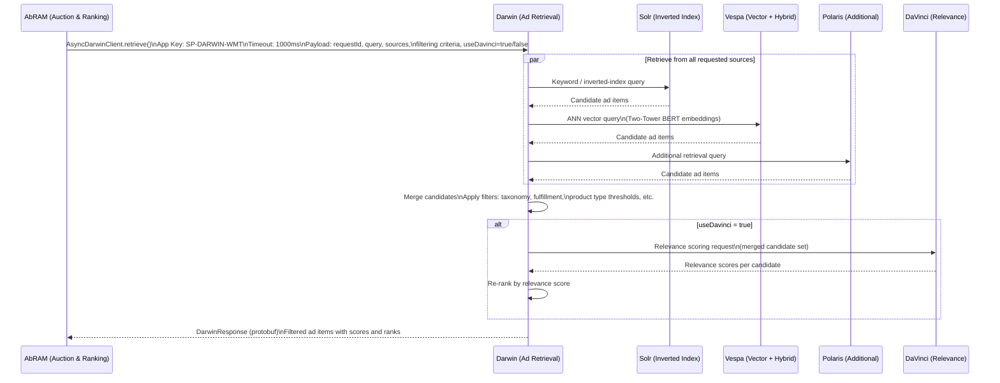
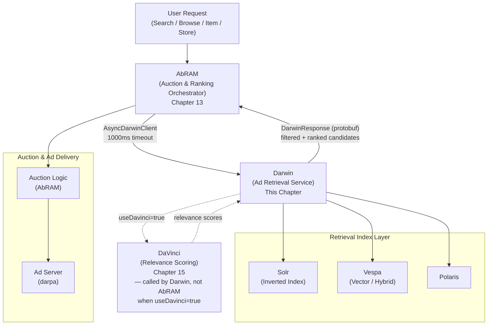

# Chapter 25 — Darwin: Ad Retrieval Service

## 1. Overview

**Darwin** is the Ad Retrieval Service for Walmart Sponsored Search. Its role in the serving pipeline is to:

1. Retrieve relevant ad candidates for display across Walmart surfaces (Search, Browse, Item, Store, etc.)
2. Filter and score candidates based on taxonomy, fulfillment, product type thresholds, and other eligibility criteria
3. Return ranked ad items that are contextually relevant to the user's current shopping experience

Darwin sits between AbRAM (the auction and ranking orchestrator) and the underlying retrieval indexes (Solr, Vespa, Polaris). It encapsulates all candidate retrieval complexity, exposing a single protobuf-based response to AbRAM. When relevance scoring via DaVinci is required, Darwin handles that call internally — AbRAM does not call DaVinci directly.

| Attribute | Value |
|---|---|
| APM ID | APM0007658 |
| WCNP Namespace | `ss-darwin-wmt` |
| Git | `gecgithub01.walmart.com/labs-ads/darwin` |
| CCM | `gecgithub01.walmart.com/labs-ads/darwin/tree/main/ccm` |
| Swagger | `darwin-wmt.dev.walmart.com/swagger-ui/index.html` |

---

## 2. Darwin in the AbRAM Request Flow

AbRAM calls Darwin via an `AsyncDarwinClient` with a 1000 ms timeout. Darwin is responsible for fan-out to retrieval sources, optional DaVinci scoring, and returning filtered, ranked candidates.



### 2.1 Request Parameters

| Parameter | Description |
|---|---|
| `requestId` | Unique identifier for the upstream request |
| `query` | Search query or browse context |
| `sources` | Which retrieval backends to fan out to: Solr, Vespa, Polaris |
| Filtering criteria | Taxonomy match, fulfillment eligibility, product type thresholds, etc. |
| `useDavinci` | When `true`, Darwin calls DaVinci for relevance scoring before returning candidates |

### 2.2 Response

Darwin returns a `DarwinResponse` protobuf containing filtered ad items with scores and ranks. AbRAM uses this ranked candidate list as input to its auction and final ranking logic.

---

## 3. Retrieval Sources

Darwin fans out to one or more retrieval backends depending on the request configuration. Each source uses a different retrieval paradigm.

| Source | Retrieval Paradigm | Technology | Notes |
|---|---|---|---|
| **Solr** | Inverted index, keyword search | Apache Solr | Legacy retrieval; strong for exact keyword match |
| **Vespa** | Vector search + hybrid retrieval | Vespa.ai | Uses Two-Tower BERT embeddings and Approximate Nearest Neighbor (ANN) search; supports semantic similarity |
| **Polaris** | Additional retrieval source | Internal | Supplementary candidates beyond Solr and Vespa |

Candidates from all requested sources are merged and then filtered before being returned to AbRAM.

---

## 4. Darwin's Role in the Full SP Serving Pipeline

Darwin occupies the retrieval layer of the SP serving stack — after AbRAM receives a user request and before auction/ranking logic is applied.



Key design decisions reflected in this flow:
- AbRAM does **not** call DaVinci directly. When DaVinci relevance scoring is needed, Darwin calls it internally and incorporates scores before returning to AbRAM. This keeps AbRAM's interface simple and allows Darwin to control the scoring/filtering order.
- Darwin is the single point responsible for multi-source fan-out and candidate merging. AbRAM does not need to know which indexes were consulted.

---

## 5. Multi-Region Deployment

Darwin is deployed across three US regions for high availability and low latency.

| Region | Cluster |
|---|---|
| EUS2 (East US 2) | `eus2-prod-a1` |
| SCUS (South Central US) | `uscentral-prod-az-341` |
| WUS2 (West US 2) | `uswest-prod-az-321` |

All deployments run under the WCNP namespace `ss-darwin-wmt`.

---

## 6. Configuration and Deployment

### 6.1 CCM Configuration

Darwin's runtime configuration is managed via CCM (Centralized Configuration Management):

```
gecgithub01.walmart.com/labs-ads/darwin/tree/main/ccm
```

CCM controls environment-specific parameters including retrieval source weights, timeout values, filter thresholds, and DaVinci integration toggles.

### 6.2 Key Integration Points

| Integration | Detail |
|---|---|
| AbRAM app key | `SP-DARWIN-WMT` |
| AbRAM client | `AsyncDarwinClient` |
| AbRAM timeout | 1000 ms |
| Response format | `DarwinResponse` protobuf |
| DaVinci invocation | Conditional — only when `useDavinci=true` in request |

### 6.3 Swagger / API Reference

Darwin's REST API is documented at:

```
darwin-wmt.dev.walmart.com/swagger-ui/index.html
```

---

## 7. Testing

### 7.1 Parallel Testing

Darwin is parallel-tested alongside services SP, FS, and SD to validate candidate retrieval and filtering behavior without affecting production traffic.

### 7.2 Performance Testing Flows

| Flow Name | Surface |
|---|---|
| `ss_darwin_search_query_vector` | Search with vector retrieval |
| `ss_darwin_search_query` | Search with keyword retrieval |
| `ss_darwin_browse_query` | Browse pages |
| `ss_darwin_item_query` | Item page ads |

Performance test flows exercise Darwin end-to-end across the different page types and retrieval modes to catch latency regressions and throughput limits before production rollout.

---

## 8. Observability

### 8.1 Dashboards

| Tool | URL |
|---|---|
| Grafana | `grafana.mms.walmart.net/d/7083c8ab606d/darwin-dashboard-v1` |

### 8.2 Alert Channels

| Channel | Purpose |
|---|---|
| `#midasdev` | General Midas / ad serving alerts |
| `#sp-adserver-alerts` | Sponsored Search ad server alerts |
| `#rmt-911` | High-severity / on-call escalation |

### 8.3 CI/CD Notification Channels

| Channel | Scope |
|---|---|
| `#sp-darwin-kitt-alerts` | US deployments — CI/CD pipeline notifications |
| `#wap-sp-darwin-deployments` | International (INTL) deployment notifications |
