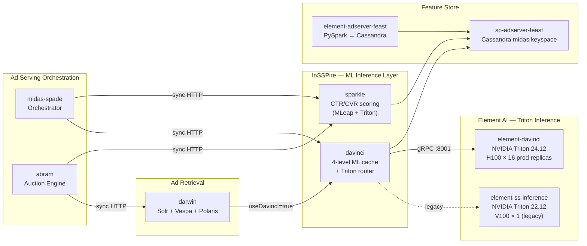
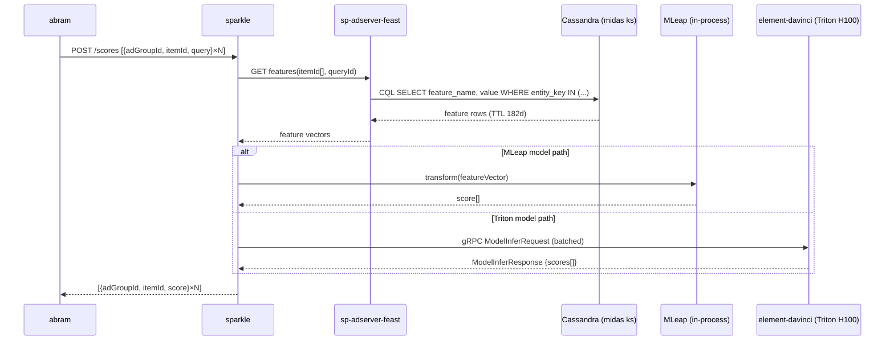
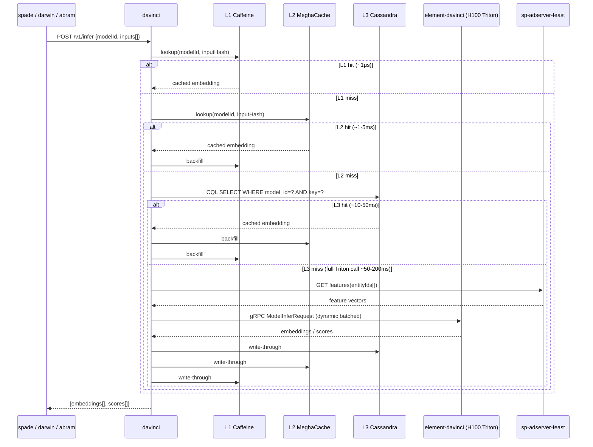
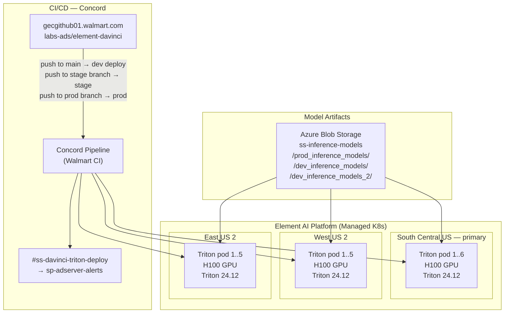
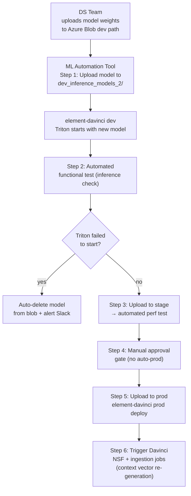
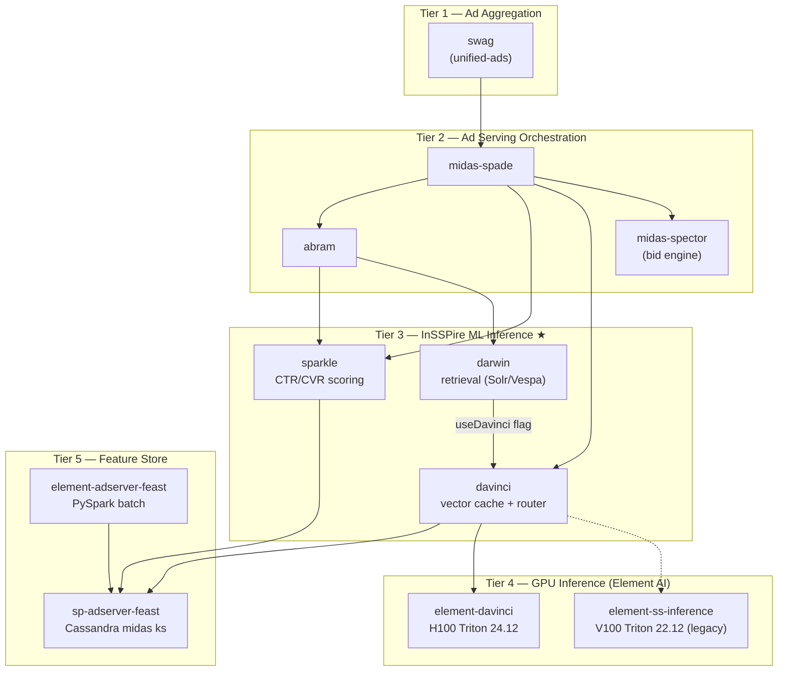

# Chapter 26 — InSSPire: ML Inference Platform for Sponsored Search

> **InSSPire** = **In**ference **S**pon**S**ored **S**earch **P**latform  
> **Confluence:** [InSSPire Team](https://confluence.walmart.com/display/SPAS/InSSPire+Team) (pageId 1718962343)  
> **Services owned:** `sparkle`, `davinci`, `element-davinci`, `element-ss-inference`, `element-adserver-feast`

---

## 1. Role in the Global Architecture

InSSPire owns the complete ML inference layer for Sponsored Products ad serving. Every ad request that flows through `midas-spade` or `abram` hits at least one InSSPire-owned service before an ad is returned.



**Critical path position:** Sparkle and Davinci are synchronous blocking calls on the ad serving hot path. Their combined p99 budget is ~150ms (Sparkle) + ~200ms (Davinci cache hit). A Triton miss on Davinci (L4 fallback) can reach 200ms+ for a full DeBERTa inference pass.

---

## 2. Sparkle — ML Relevance Scoring Service

### 2.1 Responsibilities

Sparkle is the **CTR and CVR prediction** service. For every ad candidate returned by Abram/Darwin, Sparkle:
1. Fetches item/query/user features from `sp-adserver-feast` (Cassandra)
2. Runs one or more ML models (CTR, CVR, pairwise) against those features
3. Returns a relevance score per `(adGroupId, itemId)` pair

### 2.2 Model Runtime: MLeap → Triton Evolution

| Era | Runtime | Models | Limitation |
|-----|---------|--------|-----------|
| Legacy | **Java MLeap** | XGBoost CTR, XGBoost CVR, LR | No GPU, no DNN, no dynamic batching |
| Current | **MLeap** (default) + **Triton** (new) | MLeap: XGBoost CTR/CVR; Triton: L1 Ranker, Pairwise, CVR v2 | Two code paths coexist |
| Target | **Triton only** | All models on element-davinci H100 | Unified pipeline |

### 2.3 Current Production Models (Sparkle default bucket)

```
search-bottom-23q3-0056-2.0
sb-xgb-cvr-*-clara-v6          ← Sponsored Brands CVR
sp-hr-carousel-20240606-newranker2
deal-xgb-wzd-*
sm-xgb-cnsldv2-08172024-v4-bin
browse-bottom-*.1-476d
mleap-gbdt-search-top-*, mab-sba--ts04-0816
```

**Experimental bucket models (active A/B tests):**
```
search-middle-252-pw-all-*          ← Pairwise ranking model
search-middle-252-r1-{all,nosv,nopol,noall}  ← L1 Ranker variants
sp-ctr-{surface}-v2-20250206        ← CTR v2 per surface
sv-xgb-2025-final-v1                ← Sponsored Video
sba-xgb-2025-final-v1               ← Sponsored Brands
ur20-headtorso-005-mardata-120
```

### 2.4 Production Capacity (SCUS, FY26 Holiday peak)

| Metric | Value |
|--------|-------|
| Rate limit (sr.yaml) | 900 rps/pod |
| HPA target | 450 rps/pod (50% of limit) |
| Peak pods (SCUS) | 35 (scaled from 14 baseline) |
| Peak TPS/pod | ~644 rps |
| Peak CPU/pod | ~64% |
| Sustained TPS/pod (avg) | ~385–510 rps |

### 2.5 Internal Data Flow



---

## 3. Davinci — 4-Level ML Cache + Triton Router

### 3.1 Responsibilities

Davinci is the **vector embedding cache and ML inference router**. It serves two distinct roles:

1. **Embedding cache** — caches pre-computed query/item vector embeddings to avoid re-running Triton on repeated queries
2. **Triton router** — fans out inference requests to `element-davinci` (H100) via gRPC Triton V2 protocol

### 3.2 4-Level Cache Architecture

```
Request
  │
  ▼
L1: Caffeine (in-process JVM)
  ~1μs hit latency │ capacity: configurable per model namespace
  │ MISS
  ▼
L2: MeghaCache (Walmart distributed cache)
  ~1-5ms hit latency │ shared across pod instances
  │ MISS
  ▼
L3: Cassandra (midas keyspace)
  ~10-50ms hit latency │ TTL-based, persistent across restarts
  │ MISS
  ▼
L4: NVIDIA Triton (element-davinci)
  ~50-200ms │ gRPC ModelInfer → H100 GPU inference
  │ response
  ▼
Backfill L3 → L2 → L1
```

**Cache key:** `(modelId, inputHash)` — deterministic hash of the tokenized input. Same query string → same cache key regardless of caller.

### 3.3 Models Served via Davinci → element-davinci

| Model | Type | Triton Ensemble | Use |
|-------|------|----------------|-----|
| TTB query tower (`vqb02`) | Two-Tower BERT | `ttb_query_embedding` | Query embedding for ANN retrieval |
| TTB item tower (`vab02`) | Two-Tower BERT | `ttb_item_embedding` | Item embedding for ANN retrieval |
| TTBv3 query + item | Two-Tower BERT v3 | `ttb_v3_*` | Improved relevance (in A/B) |
| DeBERTa relevance | Cross-encoder | `universal_r1_ensemble_model_relevance_deberta_base_batch` | Ad relevance scoring (launched Mar 31 2026) |
| L1 Ranker | Neural ranker | `*_l1_ranker_*` | Fine-grained re-ranking (A/B with 1% traffic) |
| SB/SV Complementary | Vector similarity | `*_complementary_*` | Sponsored Brands/Video candidate expansion |

### 3.4 Production Capacity (SCUS, FY26 Holiday peak)

| Metric | Value |
|--------|-------|
| Rate limit (sr.yaml) | 3500 rps/pod |
| HPA trigger | CPU 80% |
| Baseline pods (SCUS) | 11 |
| Peak pods (SCUS, stress test) | 30 |
| Peak TPS/pod (stress) | ~751 rps |
| Peak CPU/pod (stress) | ~55% |
| Sustained TPS/pod (avg) | ~110-370 rps |

### 3.5 Davinci Request Flow (Full Path)



---

## 4. element-davinci — NVIDIA Triton Inference Server (H100)

### 4.1 Platform: Element AI

`element-davinci` runs on **Element** (Walmart's ML infrastructure), which provides:
- Managed Kubernetes cluster on Azure
- Concord CI/CD pipeline (git push → deploy)
- Organization: `AdTech_Sponsored_Products` — GPU quota allocation
- Project scopes model repository location (Azure Blob) + runtime config

### 4.2 Deployment Architecture



### 4.3 Triton Model Configuration

**Dynamic batching config (DeBERTa ensemble):**
```
preferred_batch_size: [16, 32, 64]
max_queue_delay_microseconds: 100
```

**Triton ensemble model pipeline (DeBERTa relevance):**
```
Input (query + ad text strings)
  → universal_r1_tokenizer_relevance_deberta_base_batch
      (Java/Rust tokenizer → input_ids, attention_mask, token_type_ids INT64[batch, seq_len])
  → universal_r1_model_relevance_deberta_base_batch
      (DeBERTa weights, ~80M params, FP16 on H100)
  → universal_r1_ensemble_model_relevance_deberta_base_batch
      (output: relevance_score FLOAT[batch, 1])
```

**Triton version migration (22.12 → 24.05 → 24.12):**

| Version | Issue | Resolution |
|---------|-------|-----------|
| 22.12 | Supports `[-1, -1]` implicit shapes | Working baseline |
| 24.05 | Rejects `[-1, -1]`; requires explicit `[-1, 1]` | Dual Azure blob dirs: `dev_inference_models` (22.12), `dev_inference_models_2` (24.05+) |
| 24.12 | Current production | All model shapes updated to `[-1, 1]` |

**Azure Blob model paths:**
```
ss-inference-models/
  prod_inference_models/         ← live production models
  dev_inference_models/          ← dev (Triton 22.12 compatible)
  dev_inference_models_2/        ← dev (Triton 24.05+ compatible)
```

### 4.4 Triton Observability

| Dashboard | URL |
|-----------|-----|
| Triton Deployment Metrics | `grafana.mms.walmart.net/d/A3xeV3Y0q/triton-deployment-metrics` |
| Stage cluster | `scus-prod-aks-mlp-cx-stg-1` / namespace `stage-adtech-sponsored-products-eng` |

---

## 5. element-ss-inference — Legacy V100 Triton (Triton 22.12)

**Status:** Active but in maintenance mode. Migration to `element-davinci` (H100/24.12) in progress.

| Property | Value |
|----------|-------|
| Triton version | 22.12 |
| GPU | V100 × 1 (prod) |
| Models | Legacy BERT, DistilBERT, TTB v1 (`vab01`) |
| Output dimension | 169-dim (vs 512-dim on H100) |
| Retirement | No fixed date — blocked on full TTBv3 migration |

---

## 6. sp-adserver-feast — Online Feature Store

### 6.1 Role

Serves pre-computed ML features to both Sparkle and Davinci on the hot path. Built on the Feast framework with a custom Cassandra backend SDK (`wmart-efs-featurestore-sdk`).

### 6.2 Feature Retrieval Pattern

```
entity_key = itemId | queryId | userId | (adGroupId, itemId)
  ↓
CQL: SELECT feature_name, value
     FROM midas.{feature_view}
     WHERE entity_key = ?
  ↓
TTL: 182 days (features expire and are refreshed by batch pipeline)
  ↓
Fallback: entity not found → zero vector or default feature values
```

### 6.3 Feature Categories

| Feature Group | Entity Key | Source Pipeline | Consumer |
|--------------|-----------|----------------|---------|
| Item CTR/CVR features | `itemId` | element-adserver-feast (PySpark) | Sparkle |
| Query features | `queryId` (hashed) | element-adserver-feast | Sparkle, Davinci |
| User-facing features (UPS) | `customerId` | IDC + US DS pipelines → EFS SDK | Sparkle (Q1 2026 target) |
| Price features | `(itemId, queryId)` | element-adserver-feast | Sparkle (pairwise + CTR v2) |

### 6.4 Batch Pipeline (element-adserver-feast)

```
BigQuery (ads event source)
  → Dataproc PySpark 3.3 (28 executors × 20GB)
  → GCS Parquet staging
  → BigQuery feature output tables
  → Cassandra midas keyspace (TTL 182 days)
  [Triggered daily by Looper]
```

---

## 7. Active Model Initiatives — Architecture Impact

| Initiative | Models Affected | Services Impacted | Architecture Change |
|-----------|----------------|-------------------|-------------------|
| **TTBv3** (A/B) | `ttb_v3_query`, `ttb_v3_item` | element-davinci, Davinci, Vespa | New Triton ensemble; new Vespa index built from v3 embeddings |
| **DeBERTa Big Relevance** (launched Mar 2026) | `universal_r1_*_deberta_base_batch` | element-davinci, Davinci | DeBERTa tokenizer as separate Triton ensemble step; Davinci cache critical for throughput |
| **L1 Neural Ranker — 3 A/B variants** (live Apr 2026) | `universal_l1_r1_ensemble_model_relevance_v1`, `*_rel`, `*_25_75` | element-davinci, Davinci, sp-adserver-feast | Dual output `[score, l1_rank_score]`; 20 behavioral features vs text-only; batch size 16; dedicated feature service added to sp-adserver-feast |
| **Pairwise Ranking** (A/B) | `search-middle-252-pw-*` | Sparkle | New MLeap model; pairwise loss training; no Triton dependency |
| **CVR model + CTR in AdScore** | CTR + CVR Triton models | Sparkle, Abram | 50% Sparkle scale-up needed; multi-task model under evaluation to merge CTR+CVR into one Triton call |
| **User Features via UPS** | CTR models + new user tower | sp-adserver-feast, Sparkle | New feature view: `customerId` entity; EFS SDK Java integration; feature ingestion via IDC DS pipeline |
| **Complementary Vector Model (SB/SV)** | `*_complementary_*` | element-davinci, Davinci, Darwin | New embedding space for SB/SV candidate expansion via Vespa ANN |

---

## 8. ML Automation Tool — Target Architecture

JIRA Epic: `CARADS-41445`

Goal: eliminate manual steps for model promotion from development to production.



---

## 9. Deployment & Monitoring Summary

| Service | Namespace | Rate Limit | HPA | Grafana |
|---------|-----------|-----------|-----|---------|
| sparkle | `ss-sparkle-wmt` | 900 rps/pod | 450 rps target | — |
| davinci | `ss-davinci-wmt` | 3500 rps/pod | CPU 80% | `grafana.mms.walmart.net/d/8fafdsdge4jrn/davinci-dashboard-v2` |
| element-davinci | `adtech-sponsored-products-eng` | — | GPU-based | `grafana.mms.walmart.net/d/A3xeV3Y0q/triton-deployment-metrics` |
| element-ss-inference | `adtech-sponsored-products-eng` | — | — | Same Triton dashboard |
| sp-adserver-feast | `ss-feast-wmt` | — | — | — |

---

## 10. How InSSPire Fits the Global Stack



**Key architectural constraint:** Sparkle and Davinci must respond within their SLA window for the overall ad serving response to meet its latency target. Triton L4 cache misses in Davinci are the primary source of tail latency (p99). DeBERTa tokenization is the current bottleneck — addressed by Davinci's L1–L3 caching layers (cache-hit rate is the primary performance lever).

---

*Chapter 26 — Generated by Wibey CLI — April 2026 · Source: Confluence SPAS/InSSPire (pageIds: 1718962343, 3276144161, 3168981650, 3270302004, 2039476899, 2678180345, 3177897672, 2400671143)*
