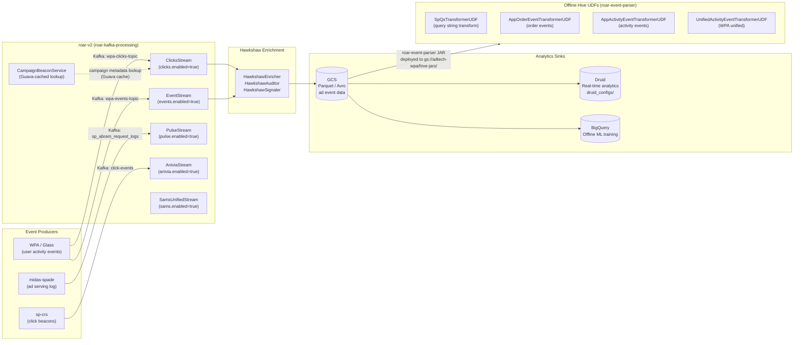
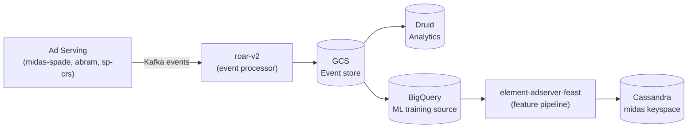

# Chapter 27 — roar-v2 (Real-Time Ad Event Stream Processor)

> **ROAR** = **R**eal-time **O**ffline **A**d **R**eporting pipeline  
> **Repo:** `gecgithub01.walmart.com/labs-ads/roar-v2`  
> **Purpose:** Consumes raw ad interaction events (clicks, activity, budget) from Kafka, enriches
> them via Hawkshaw, and writes to GCS/Druid for analytics and offline ML training.

---

## 1. Overview

roar-v2 is a **Kafka Streams-based event ingestion pipeline** that sits between ad serving
event producers and the offline analytics/ML layer. It processes two categories of events:

1. **Click and activity events** — WPA (Walmart Platform Analytics) events representing ad clicks,
   product views, add-to-cart, and order events triggered by sponsored product impressions
2. **Budget events** — campaign-level budget consumption signals from the ad serving pipeline

The service has two modules:
- **`roar-kafka-processing`** — Spring Boot Kafka Streams application; the runtime service deployed on WCNP
- **`roar-event-parser`** — Java/Hive UDF library; deployed to GCS as a fat JAR for offline Hive/Dataproc jobs

---

## 2. Architecture Diagram



---

## 3. Stream Topology

Each stream is a Spring `@Configuration` class gated by a `@ConditionalOnProperty`:

| Stream Class | Property Gate | Input Kafka Topic | Enrichment | Output Sink |
|-------------|--------------|-------------------|------------|-------------|
| `ClicksStream` | `clicks.enabled=true` | WPA clicks topic | Hawkshaw (audit + signal) | GCS / Druid |
| `EventStream` | `events.enabled=true` | WPA events topic | WpaEventsTransformer | GCS / BQ |
| `PulseStream` | `pulse.enabled=true` | SP abram request logs | — | GCS |
| `AniviaStream` | `anivia.enabled=true` | Click-events (sp-crs) | — | GCS |
| `SamsUnifiedStream` | `sams.enabled=true` | SAMS-specific events | Unified transformer | GCS |

All streams extend `BaseStream` and use **Spring Cloud Stream** (`StreamBridge`) for output routing.

---

## 4. Hawkshaw Integration (Click Enrichment)

`ClicksStream` enriches click events via **Hawkshaw** — Walmart's click attribution and integrity platform:

```
Raw WPA click event (Kafka)
        │
        ▼
HawkshawEnricher.enrich()      ← adds campaign attribution signals
        │
        ▼
HawkshawAuditor.audit()        ← integrity checks (dedup, fraud signals)
        │
        ▼
HawkshawSignaler.signal()      ← emits HawkshawSignal (Avro) to Kafka
        │
HawkshawHeaders (Avro)  ←───── ConsumptionStatus attached
        │
        ▼
KafkaProducer<String, HawkshawSignal>  → downstream analytics
```

`CampaignBeaconService` provides Guava-cached campaign metadata lookups to avoid per-event
DB calls during click enrichment. The `CampaignBeaconGuavaClientImpl` fetches from campaign
service and caches results.

**Serialization:** Uses `KafkaAvroSerializer` / Confluent Schema Registry for Hawkshaw signal
output. Click events use `StringSerializer` for key, Avro for value.

---

## 5. Hive UDFs (roar-event-parser)

The `roar-event-parser` module produces a fat JAR deployed to GCS:
```
gs://adtech-wpa/hive-jars/roar_event_parser.jar
```

UDFs are registered in Hive for offline Dataproc jobs that replay/transform raw event logs:

| UDF Class | Purpose |
|-----------|---------|
| `SpQsTransformerUDF` | Transforms sponsored products query string parameters |
| `AppOrderEventTransformerUDF` | Parses GlassRWeb / App order events |
| `AppActivityEventTransformerUDF` | Parses app-origin activity events |
| `UnifiedActivityEventTransformerUDF` | WPA unified activity event transform |
| `BackfillExtraGhosts` | Backfill ghost impression events for attribution |

The UDFs share the same event model (`WpaEvent`, `WpaActivity`, `CampaignBeaconInfo`) as the
real-time streaming path, ensuring offline and real-time processing are consistent.

---

## 6. Druid Integration

roar-v2 includes a `druid_configs/` directory with datasource specifications for
**Apache Druid** real-time analytics. Click and impression data landed in GCS is ingested
into Druid for:
- Sub-minute reporting latency on click/impression metrics
- Real-time ROAS monitoring per campaign
- Budget pacing signals fed back into the ad serving loop

---

## 7. Deployment

| Property | Value |
|----------|-------|
| **Language** | Java 17 |
| **Framework** | Spring Boot + Spring Cloud Stream |
| **Build** | Maven multi-module (`roar-kafka-processing`, `roar-event-parser`) |
| **WCNP** | Deployed via `kitt.yml` |
| **Kafka** | Two clusters (local ports 9092 / 9093); TLS for prod |
| **Profiles** | `devClicksWmt`, `devEventsWmt`, `devSamsWmt`, etc. |
| **GCS sink** | `gs://adtech-wpa/` |

Stream profiles are environment-specific and enable/disable individual stream classes
via `clicks.enabled`, `events.enabled`, etc. in `application-{profile}.yml`.

---

## 8. Position in Global Architecture

roar-v2 sits in the **observability / offline feedback** layer — it does not participate in
the real-time ad serving hot path. Its outputs feed:
- **Offline ML training** — event logs → BigQuery → element-adserver-feast → Cassandra feature store
- **Real-time analytics** — click events → Druid → dashboards
- **Budget attribution** — campaign beacon signals → campaign reporting



---

*See also: [Chapter 08 — sp-crs](./08-sp-crs.md) for click production · [Chapter 17 — element-adserver-feast](./17-element-adserver-feast.md) for feature pipeline · [Chapter 11 — midas-spade](./11-midas-spade.md) for event log production*
