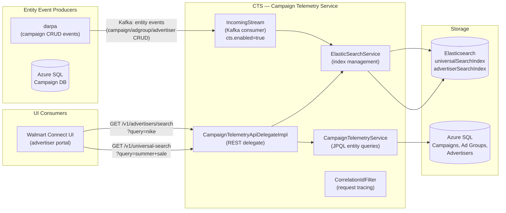
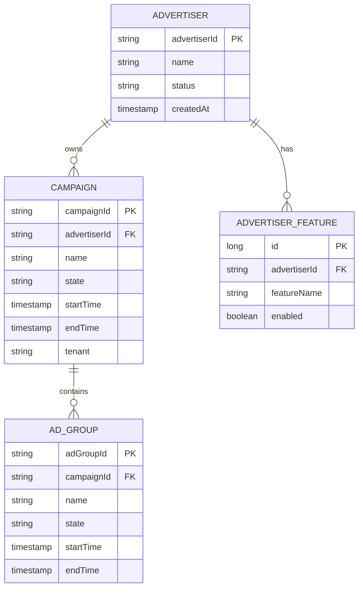
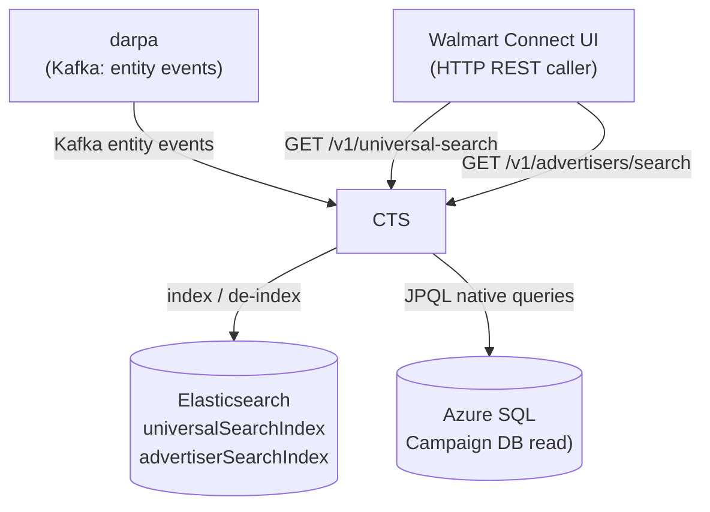
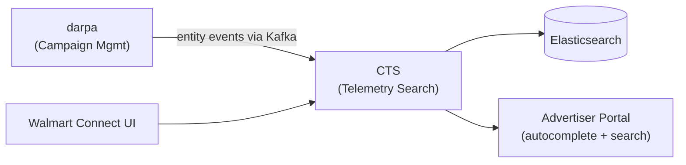

# Chapter 28 — CTS (Campaign Telemetry Service)

> **CTS** = **C**ampaign **T**elemetry **S**ervice  
> **Repo:** `gecgithub01.walmart.com/labs-ads/cts`  
> **Purpose:** Powers the Walmart Connect advertiser UI with fast campaign/advertiser/ad-group
> search via Elasticsearch. Indexes entity data from Kafka into Elasticsearch and serves
> typeahead autocomplete and universal search queries.

---

## 1. Overview

CTS is a **read-optimized search service** for the Walmart Connect UI. It solves the problem of
efficiently searching across millions of campaign and advertiser entities. Instead of querying
Azure SQL on every UI keystroke, CTS maintains an Elasticsearch index that is kept in sync with
the campaign DB via a Kafka consumer.

- **Domain:** UI Search & Telemetry
- **Tech:** Java 17, Spring Boot, Elasticsearch (REST client), Apache Kafka
- **WCNP Namespace:** `cts`
- **Port:** 8080
- **API spec:** Auto-generated OpenAPI (`mvn generate-sources -P openapi-codegen`)

**Key capabilities:**
- [Advertiser Dropdown Autocomplete](https://confluence.walmart.com/x/XqJGZQ) — typeahead search for advertisers in the UI
- [Universal Search](https://confluence.walmart.com/x/n_36R) — cross-entity search (campaigns, ad groups, advertisers, items)

---

## 2. Architecture Diagram



---

## 3. API / Interface

| Method | Path | Description |
|--------|------|-------------|
| GET | `/v1/advertisers/search` | Advertiser typeahead autocomplete (Elasticsearch) |
| GET | `/v1/universal-search` | Universal search across campaigns, ad groups, advertisers |
| GET | `/v1/campaigns` | Campaign list with date range filter |
| GET | `/v1/ad-groups` | Ad group list with date range filter |
| GET | `/v1/advertisers` | Advertiser list |
| GET | `/v1/features` | Feature flag list for advertiser |
| GET | `/health` | Kubernetes health check |

**Query parameters (universal search):**
- `query` — search string (partial match, case-insensitive)
- `entityType` — `CAMPAIGN` | `AD_GROUP` | `ADVERTISER` | `ALL`
- `advertiserId` — scope to a specific advertiser
- `startTime` / `endTime` — date range filter

**Auth:** Correlation ID filter (`CorrelationIdFilter`) injects a `X-Correlation-Id` header on
all requests for distributed tracing. `UserProviderService` resolves user identity for
access control.

---

## 4. Data Model



**Elasticsearch Indices:**

| Index | Content | Purpose |
|-------|---------|---------|
| `universalSearchIndex` | Campaigns + Ad Groups + Advertisers (denormalized) | Universal search across all entity types |
| `advertiserSearchIndex` | Advertisers only (lightweight) | Typeahead autocomplete in advertiser dropdown |

---

## 5. Kafka Consumer (IncomingStream)

`IncomingStream` is a Spring `@Component` gated by `cts.enabled=true`. It consumes entity
lifecycle events (creates, updates, deletes) and indexes them into Elasticsearch:

```
Kafka event (entity CRUD)
        │
        ├── Entity type = ADVERTISER  → index to advertiserSearchIndex
        ├── Entity type = CAMPAIGN    → index to universalSearchIndex
        └── Entity type = AD_GROUP   → index to universalSearchIndex

Special handling:
  - DISABLED_STATUS entities → remove from index (de-index)
  - ENTITY_DELETED_STATUS   → remove from index (de-index)
```

The consumer uses `RestClient` (Elasticsearch low-level REST client) to send index
requests. On `ElasticsearchException`, errors are logged and skipped (non-blocking).

---

## 6. CampaignTelemetryService (SQL Queries)

`CampaignTelemetryService` serves date-range queries directly from Azure SQL for the REST
API endpoints. It uses `EntityManager` with native JPQL queries:

| Method | SQL Operation | Used By |
|--------|--------------|---------|
| `getAdGroupsBetweenDates(start, end)` | `GET_AD_GROUP_IN_DATE_RANGE_QUERY` | `/v1/ad-groups` |
| `getAdvertisersBetweenDates(start, end)` | `GET_FEATURE_LIST_QUERY` | `/v1/advertisers` |

---

## 7. Inter-Service Dependencies



---

## 8. Configuration

| Config Key | Description |
|-----------|-------------|
| `cts.enabled` | Enable Kafka consumer (IncomingStream) |
| `elasticsearch.host/port` | Elasticsearch cluster endpoint |
| `elasticsearch.index.universal` | Universal search index name |
| `elasticsearch.index.advertiser` | Advertiser search index name |
| `spring.profiles.active` | `h2` (test), `sqlserver` (SQL Server), `prod` |
| `kafka.*` | Kafka broker, topics, SSL config (from Akeyless) |

**Akeyless secrets path:** `config.akeyless.path` in `deploy.kitt.yml`. Secrets include:
- `cts-{env}.yml` — application config
- `kafka-sp-wmt-cts-{env}.wal-mart.com-keystore.pem`
- `kafka-sp-wmt-cts-{env}.wal-mart.com-truststore.pem`

---

## 9. Position in Global Architecture

CTS is a **UI-facing read service** — it does not participate in the real-time ad serving path.
It provides search capabilities exclusively for the **Walmart Connect advertiser portal**.



**Service mesh rate limiting:** CTS has a service mesh rate limiter configured in `sr.yaml`
(deployed via CRQ `CHG3553791`).

---

*See also: [Chapter 05 — darpa](./05-darpa.md) for campaign entity source · [Chapter 06 — sp-ace](./06-sp-ace.md) for A/B experiment context in the UI*
